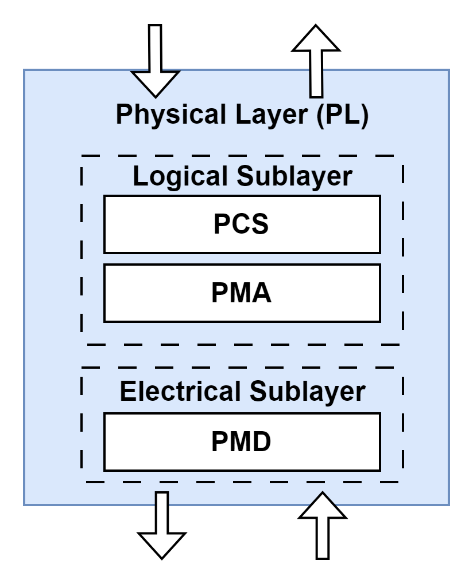
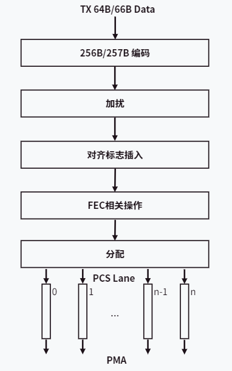
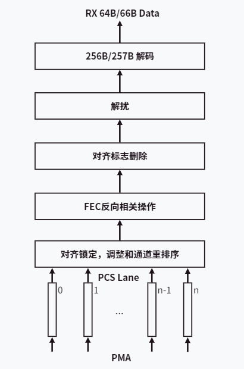
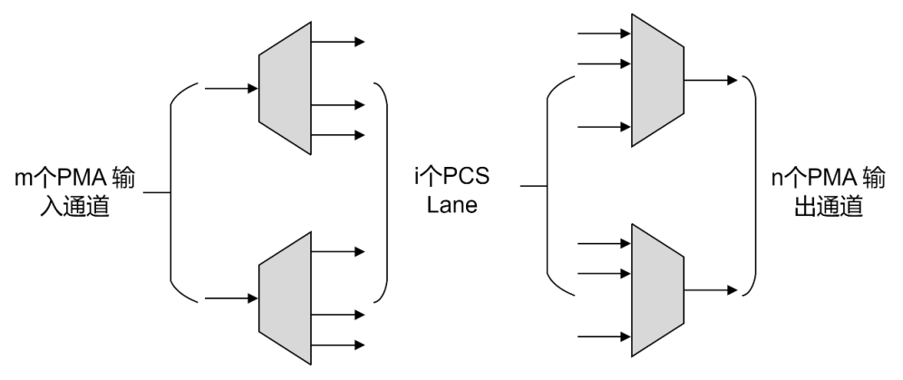
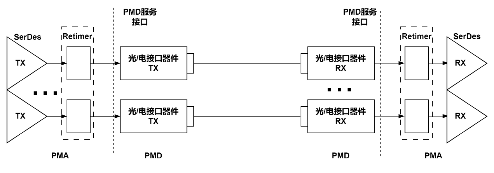
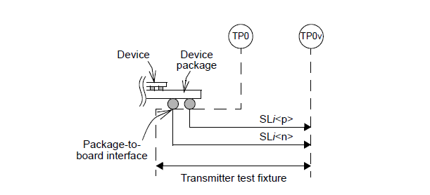
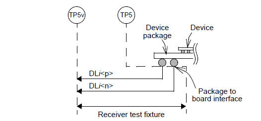
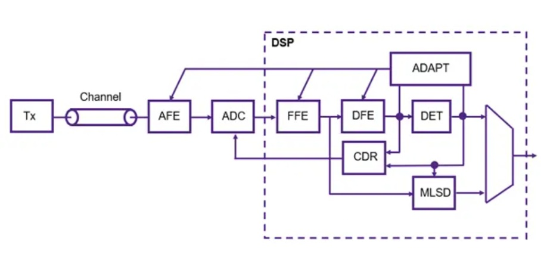

# 电气接口与物理层

本章介绍 `Scale-Up` 域的物理层基础。为了降低阅读门槛，前半部分先建立 `Lane`、`SerDes`、`OIF-CEI` 等基本概念，再进入 `PCS`、`PMA`、`PMD` 的物理层分层结构，以及信号速率、接口类型、系统损耗、误码率、一致性和驱动能力等关键要求；后半部分再补充这些物理层能力与 `CEI`、交换芯片和 `Scale-Up` 演进之间的关系。

---

## 物理层介绍

物理层主要负责接收来自数据链路层的数据帧，对数据帧进行编码，并根据传输速率、调制方式及介质类型等参数，将数据转换为电信号或光信号在相应介质上传输；反之，接收来自介质的电信号或光信号，依据相同参数将其解码，并还原为数据帧上交至数据链路层。

物理层单端口速率可支持 `50Gb/s`、`100Gb/s`、`200Gb/s`、`400Gb/s`、`800Gb/s` 和 `1.6Tb/s`。物理子层通常根据需要支持 `25Gb/s`、`56Gb/s`、`112Gb/s` 或 `224Gb/s` 等高速率 `SerDes`，并适配铜缆、背板、光纤等多种介质类型。【事实】

## 基础单元：Lane 与 SerDes

当前高速数字信号通信普遍采用串行通信技术。其基础物理单元是 `Lane`，一个 `Lane` 通常由两对差分信号线组成：一对用于发送（`Tx`），一对用于接收（`Rx`），从而实现全双工通信。无论是 `PCIe`、`NVLink` 还是高速以太网，都是通过将多个 `Lane` 聚合（bonding）来获得更高总带宽。【事实】

芯片内部的数据通常是并行的，例如 `64` 位或 `128` 位总线；为了在 `Lane` 上进行高速串行传输，需要一种专门电路负责并行数据与串行信号之间的转换，这就是 `SerDes`（Serializer/Deserializer，串行器/解串器）。`SerDes` 将芯片内部的并行数据转换为高速串行信号发送出去，并在接收端将串行信号转换回并行数据。单条 `Lane` 的传输速率直接受 `SerDes` 能力和传输介质物理特性的限制。

从读者理解角度，可以先把这里记成一句话：`Lane` 是最小传输通道，`SerDes` 是把芯片内部并行世界接到高速串行世界的关键接口电路。

## 标准接口：`OIF-CEI` 规范

为了确保不同厂商设备间的互联互通，光互联论坛（`OIF`）制定了通用电气接口（`CEI`）规范，对电气接口的物理形态、电压、频率以及信号调制方式等进行了标准化。`CEI-56G`、`CEI-112G`、`CEI-224G` 等规范定义了单通道（per-lane）在 `56Gbps`、`112Gbps`、`224Gbps` 速率下的接口标准，其中广泛使用 `PAM4`（4-Level Pulse Amplitude Modulation）等调制方式来提升数据速率。这些规范被 `PCIe`、`CXL`、`NVLink` 和以太网等主流互联协议广泛采纳或参考，作为其物理层设计基础。【事实】

| 规范系列 | 发布年份（约） | 单通道速率（Gbps） | 调制方式 | 典型应用 / 参考协议 |
|---------:|:--------------:|:------------------:|:--------:|---------------------:|
| **`CEI-28G`** | `~2011` | `28` | `NRZ` | `100G` 以太网（`4x25G`）、`PCIe 4.0/5.0`、`IB EDR` |
| **`CEI-56G`** | `~2017` | `56` | `PAM4` | `200G/400G` 以太网、`PCIe 6.0`、`NVLink 4.0` |
| **`CEI-112G`** | `~2022` | `112` | `PAM4` | `800G` 以太网、`CXL 3.0`、下一代 `NVLink` |
| **`CEI-224G`** | `-` | `224` | `PAM4` | `1.6T/3.2T` 以太网、未来高速互联 |

<small>
注：`NRZ` 每符号传输 `1 bit` 数据，`PAM4` 每符号传输 `2 bit` 数据，在相同波特率下可实现双倍数据速率。
</small>

`OIF-CEI` 规范通常 `5-6` 年更新一代，每次发布新版本时速率大致翻倍。但需要注意，规范正式定稿往往晚于产业讨论与预研实现，因此不能机械地以规范发布时间推断相关产品的实际面世节奏。

常见端口速率及其对应的 `Lane` 数、`FEC` 模式、调制方式和单 `Lane` 速率关系如下：

| Port Speed | Physical Lanes | FEC Mode | Signaling Mode | SerDes Lane Bit Rate |
|:-----------|:---------------|:---------|:---------------|:---------------------|
| `1.6Tb/s` | `8` | `RS(544,514)` / `RS(272,257)` | `106.25GBd PAM4` / `112GBd PAM4` | `212.5Gb/s` / `224Gb/s` |
| `800Gb/s` | `4` | `RS(544,514)` / `RS(272,257)` | `106.25GBd PAM4` / `112GBd PAM4` | `212.5Gb/s` / `224Gb/s` |
| `800Gb/s` | `8` | `RS(544,514)` / `RS(272,257)` | `53.125GBd PAM4` / `56GBd PAM4` | `106.25Gb/s` / `112Gb/s` |
| `400Gb/s` | `2` | `RS(544,514)` / `RS(272,257)` | `106.25GBd PAM4` / `112GBd PAM4` | `212.5Gb/s` / `224Gb/s` |
| `400Gb/s` | `4` | `RS(544,514)` / `RS(272,257)` | `53.125GBd PAM4` / `56GBd PAM4` | `106.25Gb/s` / `112Gb/s` |
| `200Gb/s` | `1` | `RS(544,514)` / `RS(272,257)` | `106.25GBd PAM4` / `112GBd PAM4` | `212.5Gb/s` / `224Gb/s` |
| `200Gb/s` | `2` | `RS(544,514)` / `RS(272,257)` | `53.125GBd PAM4` / `56GBd PAM4` | `106.25Gb/s` / `112Gb/s` |
| `200Gb/s` | `4` | `RS(544,514)` / `RS(272,257)` | `26.5625GBd PAM4` / `28GBd PAM4` | `53.125Gb/s` / `56Gb/s` |
| `100Gb/s` | `1` | `RS(544,514)` / `RS(272,257)` | `53.125GBd PAM4` / `56GBd PAM4` | `106.25Gb/s` / `112Gb/s` |
| `100Gb/s` | `2` | `RS(544,514)` / `RS(272,257)` | `26.5625GBd PAM4` / `28GBd PAM4` | `53.125Gb/s` / `56Gb/s` |
| `100Gb/s` | `4` | `RS(528,514)` / `RS(272,257)` | `13.28125GBd PAM4` / `14GBd PAM4` | `26.5625Gb/s` / `28Gb/s` |
| `50Gb/s` | `1` | `RS(544,514)` / `RS(272,257)` | `26.5625GBd PAM4` / `28GBd PAM4` | `53.125Gb/s` / `56Gb/s` |
| `50Gb/s` | `2` | `RS(528,514)` / `RS(272,257)` | `13.28125GBd PAM4` / `14GBd PAM4` | `26.5625Gb/s` / `28Gb/s` |

## 物理层架构

物理层包含逻辑子层和电气子层，其中逻辑子层包含 `PCS`（Physical Coding Sublayer）和 `PMA`（Physical Medium Attachment），电气子层主要包括 `PMD`（Physical Medium Dependent）。

/// caption
图 1-1 物理层结构。
///

`PCS` 主要完成数据的编码与解码，并进行错误检测与纠正，确保物理层数据传输的完整性与可靠性；`PMA` 负责数据的串行化与并行化转换，集成 `SerDes`、发送/接收缓冲、时钟发生与时钟恢复电路等功能；`PMD` 则将 `PMA` 处理后的数据流转换为适配特定物理介质的传输信号，实现物理层与介质之间的正确连接与可靠通信。

### 物理编码子层 `PCS`

`PCS` 层可使用多种编码方式。以 `64B/66B` 输入且 `256B/257B` 编码为例，发送方向与接收方向的主要流程如下：

{: style="display:inline-block; width:48%; vertical-align:top" } {: style="display:inline-block; width:48%; vertical-align:top" }
/// caption
图 1-2、图 1-3 分别给出 `PCS` 在发送方向和接收方向的处理流程。
///

发送方向主要包括：

- 输入 `64B/66B` 数据进行 `256B/257B` 编码。
- 使用自同步扰码器对有效载荷添加扰码。
- 周期性生成并插入对齐标志，支持 `PCS` 通道上的偏移去除和重新排序。
- 进行 `FEC` 分发和 `FEC` 编码。
- 对 `FEC` 编码后的数据按照轮循交错方式依次分发到各 `PCS lane`。

接收方向主要包括：

- 锁定对齐标志并调整不同通道上的顺序。
- 执行 `FEC` 解码和 `FEC` 合并。
- 删除对齐标志并完成解扰。
- 进行 `256B/257B` 解码。

### 物理媒介适配层 `PMA`

`PMA` 负责数据的串行化和解串行化，以及发送时钟生成和接收时钟恢复；通过 `PMA` 服务接口在 `PCS` 与 `PMA` 之间映射发送和接收数据流，并在 `PMA` 与 `PMD` 之间通过 `PMD` 服务接口发送和接收数据流。

在发送方向上，`PMA` 将来自 `FEC` 的信号调整为 `PAM4` 或 `NRZ` 编码信号，并将 `PCS` 层传递的并行数据通过 `SerDes` 转换为串行数据流；在接收方向上，`PMA` 将来自 `PMD` 的编码信号恢复为 `FEC` 处理所需的数据流，并完成时钟恢复与数据同步。

/// caption
图 1-4 在 `Tx` 和 `Rx` 方向上使用的 `PMA` 比特复用操作。
///

`PMA` 中还包含比特复用功能，可将 `PCS lane` 从 `m` 个 `PMA` 输入通道解复用，并重新复用到 `n` 个 `PMA` 输出通道上；具有 `m` 个输入通道和 `n` 个输出通道的 `PMA` 应以输入通道速率的 `m/n` 倍对输出通道进行时钟控制，并通过 `PLL` 倍频/分频电路生成输出时钟。

### 物理介质关联层 `PMD`

`PMD` 负责将数据转换为满足不同介质（铜缆或光纤）传输要求的电或光信号及所需信号强度。在铜缆通信中，`PMD` 包含数模转换器与模数转换器；在光纤通信中，`PMD` 包含光电转换器与电光转换器。

/// caption
图 1-5 单纤单向发送和接收路示意图。
///

## 高速接口能力

物理高速接口能力主要包括信号速率、接口类型、系统损耗要求、误码率、标准一致性和驱动能力等。

### 信号速率

标准速率在单通道下通常需要支持如下参考信号速率：

| 参考信号速率 | 编码方式 |
|:-------------|:---------|
| `28Gb/s`、`26.5625Gb/s` | `NRZ` |
| `56Gb/s`、`53.125Gb/s` | `PAM4` |
| `112Gb/s`、`106.25Gb/s` | `PAM4` |
| `224Gb/s`、`212.5Gb/s` | `PAM4` |

### 接口类型

常见的接口速率和类型如下，其中 `224Gb/s` / `212.5Gb/s` 对应接口类型和 `1.6T` 相关类型仍在持续完善中：

| 接口速率 | 类型 |
|:---------|:-----|
| `50GBASE-R Family` | `50GBASE-CR`、`50GBASE-KR`、`50GBASE-SR` |
| `100GBASE-R Family` | `100GBASE-CR2`、`100GBASE-CR4`、`100GBASE-DR`、`100GBASE-KP4`、`100GBASE-KR2`、`100GBASE-KR4`、`100GBASE-SR2`、`100GBASE-SR4` |
| `200GBASE-R Family` | `200GBASE-KR1/CR1/DR1`、`200GBASE-KR2/CR2/SR2`、`200GBASE-KR4/CR4/SR4/DR4`、`200GBASE-KR8/CR8/SR8/DR8` |
| `400GBASE-R Family` | `400GBASE-KR2/CR2/DR2`、`400GBASE-KR4/CR4/SR4/DR4`、`400GBASE-KR8/CR8/SR8` |
| `800GBASE-R Family` | `800GBASE-KR4/CR4/SR4/DR4`、`800GBASE-KR8/CR8/SR8/DR8` |
| `1.6TBASE-R Family` | `1.6TBASE-KR8`、`1.6TBASE-CR8`、`1.6TBASE-DR8` |

### 系统损耗要求

参考 `IEEE` 规范，`TP0` 到 `TP5` 的通道损耗要求如下：

| 信号速率 | `TP0` 到 `TP5` 损耗 |
|:---------|:--------------------|
| `28Gb/s`、`26.5625Gb/s` | `35dB @ 14GHz / 13.28125GHz` |
| `56Gb/s`、`53.125Gb/s` | `30dB @ 14GHz / 13.28125GHz` |
| `112Gb/s`、`106.25Gb/s` | `28.5dB @ 28GHz / 26.5625GHz` |
| `224Gb/s`、`212.5Gb/s` | `TBD` |

### 误码率

考虑到 `FEC` 在链路中的纠错功能，信号进入 `FEC` 之前的误码率通常需要保持在最大 `1E-6`，码型为 `PRBS31(Q)`；在 `Tj = 75` 度条件下测试时，其他链路需保持正常开启。

### 标准一致性

原文在这一节分别给出了发送端与接收端的一致性要求引用关系：

- `50GBASE-CR`、`100GBASE-CR2`、`200GBASE-CR4` 的发送端规范参考相应 `TP2` 表项。
- `50GBASE-KR`、`100GBASE-KR2`、`200GBASE-KR4` 的发送端规范参考相应 `TP0a` 表项。
- `200GBASE-xR2`、`400GBASE-xR4`、`800GBASE-xR8` 的发送端在 `TP0v` 点一致性要求参考 `IEEE 802.3ck`。
- `200GBASE-xR1`、`400GBASE-xR2`、`800GBASE-xR4` 和 `1.6TBASE-xR8` 的接收端在 `TP5v` 点一致性要求参考 `IEEE 802.3dj`。

{: style="display:inline-block; width:48%; vertical-align:top" } {: style="display:inline-block; width:48%; vertical-align:top" }
/// caption
图 1-6、图 1-7 给出发送端 `TP0v` 与接收端 `TP5v` 的测试点示意图。原文中这一部分重点是说明一致性验证依赖标准测试位置和对应表项，而不是仅凭接口名义速率判断链路能力。
///

### 驱动能力

根据不同信号速率，`SerDes` 需要具备不同的驱动能力以及对串扰、反射干扰的不敏锐性。这里支持的损耗是从 `Bump` 到 `Bump` 之间的通道计算，并在参考 `IEEE TP0` 到 `TP5` 通道损耗要求基础上叠加封装损耗和额外余量后，仍需满足 `BER <= 1e-6`。

| 信号速率 | 基频频点 | `TP0-TP5 / 双边 PKG` 损耗 | `BER < 1e-6` 时需支持的 `Bump-to-Bump` 损耗 |
|:---------|:---------|:--------------------------|:---------------------------------------------|
| `28Gb/s`、`26.5625Gb/s` | `14GHz`、`13.28125GHz` | `35dB / 5dB` | `42dB` |
| `56Gb/s`、`53.125Gb/s` | `14GHz`、`13.28125GHz` | `30dB / 5dB` | `37dB` |
| `112Gb/s`、`106.25Gb/s` | `28GHz`、`26.5625GHz` | `28.5dB / 10dB` | `40.5dB` |
| `224Gb/s`、`212.5Gb/s` | `56GHz`、`53.125GHz` | `TBD` | `TBD` |

## 关键技术

### `ADC + DSP` 架构

在高速 `SerDes` 架构中，`ADC`（模数转换器）+ `DSP`（数字信号处理器）架构与传统模拟混合信号（`AMS`）架构之间的选择，是当前高速互连设计中的核心权衡。原文给出的重点判断是：`ADC + DSP` 架构因其链路预算和工艺可扩展性优势，已成为速率超过 `112Gbps` 应用的主流选择。

其主要优势包括：

- 链路预算高、纠错能力强，适合高损耗和严重串扰信道。
- 工艺扩展性好，更容易随先进工艺节点演进获得能效和面积收益。
- 均衡能力强、灵活性高，便于支持更多抽头和多种调制方式。
- 对 `PVT` 变化不敏感，设计可重复性和可移植性更好。

/// caption
图 1-8 `ADC + DSP` 示意图。
///

### `224G` 技术

`224Gbps` 速率是 `SerDes` 技术发展中的重要里程碑。它不是将 `112Gbps` 架构简单翻倍，而是需要从芯片工艺到系统互连各环节协同升级。原文重点提到以下几个方面：

- 调制方式仍以 `PAM4` 为主，通过降低符号率来减轻信道损耗。
- 需要更长的 `FFE/DFE` 和更强的数字均衡能力。
- 在极端高损耗信道中，`MLSD` 等更复杂检测技术会成为稳定链路的重要补充。
- 接收端需要更高性能的 `ADC`，同时依赖更先进的工艺节点来控制功耗和面积。

## 主流协议中的 `CEI` 实现

`PCIe` 和 `NVLink` 作为两种主流的片间互联协议，其核心创新在于链路层与事务层，而在物理层则高度依赖成熟的电气标准。它们的物理层设计通常会选择某个版本的 `CEI` 规范作为 `SerDes` 设计的电气基础，从而在确保信号可靠性的前提下，把优化重点放在上层协议上。例如：

- **`PCIe`**：`PCIe 5.0` 的 `32 GT/s` 速率在电气特性上接近 `OIF CEI-28G` 时代能力边界；到了 `PCIe 6.0`，其 `64 GT/s` 速率引入 `PAM4` 调制，设计原则已更接近 `CEI-56G` 系列。
- **`NVLink`**：`NVIDIA H100` 所使用的第四代 `NVLink`，单 `Lane` 单向速率约为 `100 Gbps`（`PAM4` 调制，`50 Gbaud`），其电气能力与 `CEI-56G-PAM4` 所代表的这一代高速接口能力高度相关。未来版本也预计会继续跟进更高速率的 `CEI-112G/224G` 路线。

通过这种方式，`PCIe`、`NVLink` 等协议可以复用业界成熟的电气基础，并把主要创新投入在链路层、事务层和系统组织能力上。因此，`OIF-CEI` 的演进路线图也成为预判整个互联技术发展的重要风向标。

## 数据中心网络交换芯片

以 `Broadcom Tomahawk` 系列为代表的数据中心交换芯片，其演进与 `CEI` 代际密切相关：

| 交换容量 | SerDes 速率（每 Lane） | CEI 代际对应 | 代表芯片（发布年） | 可支持的典型端口 |
|---------:|:----------------------:|:------------:|-------------------:|------------------:|
| `3.2T` | `25G NRZ` | `CEI-28G` | `Tomahawk (2014)` | `32 x 100G` |
| `6.4T` | `25G NRZ` | `CEI-28G` | `Tomahawk 2 (2016)` | `64 x 100G` |
| `12.8T` | `50G PAM4` | `CEI-56G` | `Tomahawk 3 (2018)` | `64 x 200G` |
| `25.6T` | `100G PAM4` | `CEI-112G` | `Tomahawk 4 (2020)` | `64 x 400G` |
| `51.2T` | `100G PAM4` | `CEI-112G` | `Tomahawk 5 (2022)` | `128 x 400G` |
| `102.4T`（预测） | `200G PAM4` | `CEI-224G` | 下一代 | `128 x 800G` / `64 x 1.6T` |

Broadcom 的高端交换芯片通常两年一代，交换容量翻倍。从芯片产品面世到被交换机大规模采用，大约还需要 `1-2` 年时间。从这条路线也能看出，行业领先厂商对 `CEI` 标准的实现和落地通常会先于规范的正式定稿。

## GPU 专用交换芯片：`NVSwitch`

`NVSwitch` 负责在单机或机柜域内构建 GPU 全互连（all-to-all / non-blocking）通信结构，其能力随 `NVLink` 代际一起提升。提升路径主要有两种：增加每 GPU 可用的 `NVLink` 数量（link fan-out）与提高单条 `NVLink` 的速率。下表采用 `GB/s`（双向）口径[^gh200] [^gb200]：

| 代际 | GPU 架构 | 发布（约） | NVLink 版本 | 每 Link Lane 数 | 每 Lane 速率（Gbps） | 每 Link 双向带宽（GB/s） | 每 GPU Link 数 | 每 GPU 聚合双向带宽（GB/s） | 典型单机 GPU 数 | 最大 NVLink 域 |
|:-----|:---------|:-----------|:------------|:---------------:|:--------------------:|:------------------------:|:--------------:|:---------------------------:|:---------------:|:--------------:|
| 第1代 | Volta | 2018 | `2.0` | `8*` | `25†` | `50†` | `6†` | `300†` | `16†` | `16†` |
| 第2代 | Ampere | 2020 | `3.0` | `4*` | `50†` | `50†` | `12†` | `600†` | `8†` | `16†` |
| 第3代 | Hopper | 2022 | `4.0` | `4*` | `100†` | `100†` | `18†` | `1800†` | `8†` | `256†` |
| 第4代 | Blackwell | 2025 | `5.0` | `4*` | `200†` | `200†` | `18†` | `3600†` | `72†` | `576*` |

## 国产 GPU 的 `Scale-Up` 物理层实现

国产 GPU 的 `Scale-Up` 互联物理层实现大致可以分为三个技术阶段：`PCIe` 直连 / `Switch`、`SerDes` 点对点直连，以及通过专用交换芯片构建的大规模互联。【归纳】

### `PCIe` 互联

`PCIe` 是最早也是最基础的 GPU 互联方式。多数国产 GPU 在基础配置中采用 `PCIe 5.0 x16`（单向 `63 GB/s`）作为底线互联，同时叠加自研桥接技术提升卡间带宽：

| 厂商 | 产品 | PCIe 版本 | 自研互联 | 卡间带宽 | 最大单节点卡数 |
|:-----|:-----|:----------|:---------|:---------|:---------------|
| 摩尔线程 | `MTT S4000` | `PCIe 5.0 x16` | `MTLink` 桥接 | `PCIe: 63 GB/s; MTLink: 240 GB/s` | `8` 卡 |
| 壁仞科技 | `BR100` 系列 | `PCIe 5.0 x16`（支持 `CXL`） | `BLink +` 桥片 | `PCIe: 63 GB/s; BLink: 448 GB/s` | `8` 卡 |
| 海光 | `DCU K100` | `PCIe 5.0 x16` | `xGMI` 协议 | `PCIe: 63 GB/s; xGMI: 184 GB/s` | `8` 卡 |
| 寒武纪 | `MLU370-X8` | `PCIe 4.0 x16` | `MLU-Link` 桥接卡 | `PCIe: 31.5 GB/s; MLU-Link: 200 GB/s` | `8` 卡 |
| 沐曦科技 | `曦思 C600` | `PCIe 5.0 x16` | `MetaXLink` | `PCIe: 63 GB/s; MetaXLink: >1 TB/s` | `8` 卡 |
| 华为昇腾 | `Atlas 300T A2` | `PCIe 4.0 x16` | `HCCS` | `PCIe: 31.5 GB/s; HCCS: 2 TB/s` | `8` 卡 |

### `SerDes` 点对点互联

`SerDes` 直连是第二代 GPU 互联方式，一般采用 `PAM4 56G` 或 `112G`，无需交换芯片，性能主要由 `SerDes` 带宽和数量决定。其局限在于一经设计完成便难以继续扩展，通常主要实现单机 `8` 卡环境：

| 厂商 / 产品 | SerDes 规格 | 互联规模 | 核心带宽 / 延迟 | 拓扑 | 封装 | 功耗 |
|:------------|:------------|:---------|:----------------|:-----|:-----|:-----|
| 寒武纪 `思元 290`（`MLU-Link V1`） | `56G PAM4` | `8` 卡全互联 | 总带宽 `600 GB/s`; `<100 ns` | `Mesh` 全互联 | `2.5D + CoWoS` | `300W` |
| 寒武纪 `思元 370`（`MLU-Link V2`） | `112G PAM4` | `4-8` 卡全互联 | 双向 `200 GB/s`; `<80 ns` | `Mesh +` 星型 | `Chiplet` 四芯粒 | `280W` |
| 壁仞 `BR100`（`BLink`） | `112G PAM4` | `8` 卡 `OAM` 全互联 | `D2D: 896 GB/s (<1 ns); 8卡: 512 GB/s` | `Mesh + 3D Mesh` | `2.5D +` 硅中介层 | `350W` |
| 华为昇腾 `910B`（`CloudMatrix`） | `112G -> 224G PAM4` | `16` 卡到千卡级 | 卡间 `400 GB/s+`; 百 `ns` 级 | `Mesh + Torus + 3D Mesh` | `CoWoS` | `310W` |
| 燧原 `L600`（`GC-Link`） | `112G PAM4` | `8` 卡环形 `Mesh` | `384 GB/s; <150 ns` | `8` 卡环形 `Mesh` | `2.5D` | `280W` |
| 沐曦 `MX1`（`MX-Link`） | `112G PAM4` | `8` 卡混合拓扑 | `448 GB/s; <120 ns` | `Mesh +` 星型 | `2.5D + CoWoS` | `320W` |

### 交换芯片互联

当 `Scale-Up` 域需要超过 `8` 卡时，交换芯片会成为必要组件。目前 `NVIDIA NVSwitch` 在此领域处于领先位置。国产阵营中，华为的 `UB Switch` 以及基于以太网交换 `ASIC` 的方案也在持续推进。

## 封装形态与插损匹配

- `CoWoS / InFO / Foveros` 等先进封装可以缩短信道、降低插损，便于更高速率的 `D2D/C2C` 互联。
- 插损预算需要端到端分摊到封装、走线、连接器和线缆，且要预留均衡余量。
- 在更长距离或更高带宽场景中，引入光接口可以减轻信号完整性与功耗压力。

从 `28G` 到 `224G`，每一代速率翻倍都会显著抬升信号完整性设计难度。封装、走线、连接器与冷却需要协同设计，关键测试指标包括眼图、抖动、`BER` 和链路训练收敛时间。【归纳】

## 参考文献

[^gb200]: [NVIDIA DGX GB200 Datasheet](https://resources.nvidia.com/en-us-dgx-systems/dgx-superpod-gb200-datasheet)
[^gh200]: [NVIDIA GH200 Grace Hopper Superchip Datasheet](https://resources.nvidia.com/en-us-data-center-overview-mc/en-us-data-center-overview/grace-hopper-superchip-datasheet-partner)
