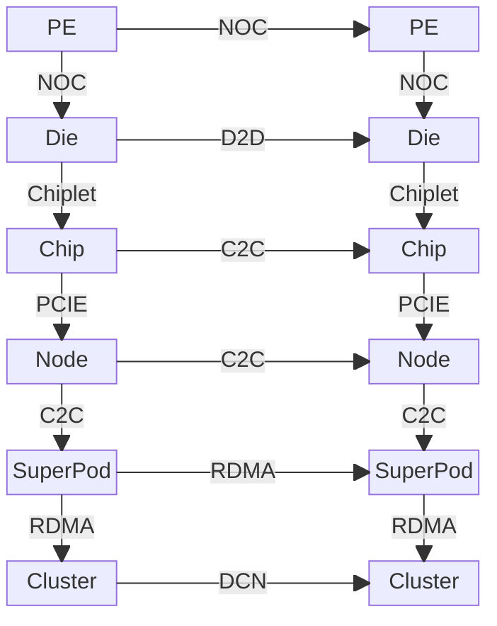

# 什么是超节点

“超节点（SuperPod）”作为术语最早由 NVIDIA 在其 DGX SuperPOD 体系中系统化提出，用于描述以 Pod 为粒度、围绕 GPU 高带宽互联构建的训练基础设施单元。在此之前，业界已经存在一系列“相似方向”的探索：例如超算领域的“胖节点/超级节点”思路、Google TPU Pod 等专用加速器 Pod 形态，以及以 NVLink/NVSwitch 为代表的机内 GPU 互联域扩展。这些尝试共同指向同一类问题：当工作负载从“单机可解”演进到“强耦合并行不可避免”时，系统形态必须随之改变。

从 2020 年的 Meena 到 2025 年的 Grok 4，顶级生成式 AI 模型训练的算力开销出现数量级跃迁（以公开材料与行业估算口径计，需求规模约提升 **3000 倍**）。趋势本身比单点数值更重要：训练开销的指数抬升正在把“系统瓶颈”从单卡算力，推向互联、显存容量与通信效率。

```vegalite
{
  "$schema": "https://vega.github.io/schema/vega-lite/v5.json",
  "description": "Training compute of frontier AI models over time.",
  "width": 700,
  "height": 500,
  "data": {
    "values": [
      {"model": "Meena", "organization": "Google", "date": "2020-01-28", "compute": 1.12e+23, "parameters": 2600000000},
      {"model": "GPT-3 175B", "organization": "OpenAI", "date": "2020-05-28", "compute": 3.14e+23, "parameters": 175000000000},
      {"model": "GShard", "organization": "Google", "date": "2020-06-30", "compute": 4.77e+22, "parameters": 2300000000},
      {"model": "Switch", "organization": "Google", "date": "2021-01-11", "compute": 8.22e+22, "parameters": 1571000000000},
      {"model": "FLAN 137B", "organization": "Google", "date": "2021-09-03", "compute": 2.05e+24, "parameters": 137000000000},
      {"model": "Gopher", "organization": "Google", "date": "2021-12-08", "compute": 6.31e+23, "parameters": 280000000000},
      {"model": "PaLM", "organization": "Google", "date": "2022-04-04", "compute": 2.53e+24, "parameters": 540000000000},
      {"model": "GPT-4", "organization": "OpenAI", "date": "2023-03-15", "compute": 2.1e+25, "parameters": 1800000000000},
      {"model": "PaLM 2", "organization": "Google", "date": "2023-05-10", "compute": 7.34e+24, "parameters": 340000000000},
      {"model": "Claude 2", "organization": "Anthropic", "date": "2023-07-11", "compute": 3.87e+24, "parameters": null},
      {"model": "Qwen-Max", "organization": "Alibaba", "date": "2023-09-12", "compute": 6e+24, "parameters": null},
      {"model": "Gemini 1.0 Ultra", "organization": "Google", "date": "2023-12-06", "compute": 5e+25, "parameters": null},
      {"model": "GLM-4", "organization": "Zhipu AI", "date": "2024-01-16", "compute": 1.2e+25, "parameters": null},
      {"model": "DeepSeek-V2", "organization": "DeepSeek", "date": "2024-05-06", "compute": 5e+24, "parameters": 236000000000},
      {"model": "Nemotron-4 340B", "organization": "NVIDIA", "date": "2024-06-14", "compute": 1.8e+25, "parameters": 340000000000},
      {"model": "Claude 3.5 Sonnet", "organization": "Anthropic", "date": "2024-06-20", "compute": 2.7e+25, "parameters": null},
      {"model": "Llama 3.1 405B", "organization": "Meta", "date": "2024-07-23", "compute": 3.8e+25, "parameters": 405000000000},
      {"model": "Grok-3", "organization": "xAI", "date": "2025-02-17", "compute": 3.5e+26, "parameters": 3e12},
      {"model": "Grok-4", "organization": "xAI", "date": "2025-07-09", "compute": 5.00e+26, "parameters": 3e12},
      {"model": "Qwen3-Max", "organization": "Alibaba", "date": "2025-09-05", "compute": 1.5e+25, "parameters": 1.0e12},
      {"model": "GPT-4.5", "organization": "OpenAI", "date": "2025-02-27", "compute": 3.8e+26, "parameters": 1.0e10}
    ]
  },
  "layer": [
    {
      "mark": {"type": "circle", "opacity": 0.7},
      "encoding": {
        "x": {
          "field": "date",
          "type": "temporal",
          "title": "发布时间",
          "axis": {"format": "%Y", "grid": true}
        },
        "y": {
          "field": "compute",
          "type": "quantitative",
          "scale": {"type": "log"},
          "title": "训练计算量 (FLOPs, Log Scale)",
          "axis": {"format": ".0e", "grid": true}
        },
        "color": {
          "field": "organization",
          "type": "nominal",
          "title": "机构"
        },
        "size": {
          "field": "parameters",
          "type": "quantitative",
          "title": "参数量",
          "scale": {"range": [50, 500], "domain": [1e9, 3e12]},
          "legend": {"format": ".1s"}
        },
        "tooltip": [
          {"field": "model", "title": "模型"},
          {"field": "organization", "title": "机构"},
          {"field": "date", "type": "temporal", "title": "发布时间", "format": "%Y-%m-%d"},
          {"field": "compute", "title": "计算量", "format": ".2e"},
          {"field": "parameters", "title": "参数量", "format": ",.0f"}
        ]
      }
    },
    {
      "mark": {"type": "text", "align": "left", "dx": 8, "dy": 2, "fontSize": 10},
      "encoding": {
        "x": {"field": "date", "type": "temporal"},
        "y": {"field": "compute", "type": "quantitative"},
        "text": {"field": "model"},
        "color": {"value": "#444"}
      }
    }
  ]
}
```

**图 1.1：顶级生成式 AI 模型训练算力需求演进趋势 (2020-2025)**

相比之下，单芯片（单 GPU）算力仍在持续增长，但其增幅通常处于“数十倍量级”，难以与训练需求的三位数到四位数倍增同速演进。下图基于公开规格与行业资料整理，取 NVIDIA 代表性数据中心训练 GPU 的 FP16（张量）峰值算力，并给出指数回归趋势线；以 V100 到 GB200 的代际跨度为例，单卡峰值算力约提升 **30–40 倍量级**。

```vegalite
{
  "$schema": "https://vega.github.io/schema/vega-lite/v5.json",
  "description": "NVIDIA AI Chip FP16 Performance over time.",
  "width": 700,
  "height": 400,
  "data": {
    "values": [
      {"name": "Tesla P100", "date": "2016-04-05", "flops": 2.12e13},
      {"name": "Tesla V100", "date": "2017-06-21", "flops": 1.25e14},
      {"name": "A100", "date": "2020-05-14", "flops": 3.12e14},
      {"name": "H100 SXM", "date": "2022-09-20", "flops": 9.89e14},
      {"name": "H200", "date": "2023-11-13", "flops": 1.98e15},
      {"name": "B200", "date": "2024-03-18", "flops": 4.5e15},
      {"name": "GB200", "date": "2025-02-15", "flops": 5.0e15}
    ]
  },
  "layer": [
    {
      "mark": {"type": "circle", "size": 60, "tooltip": true},
      "encoding": {
        "x": {"field": "date", "type": "temporal", "title": "发布时间"},
        "y": {
          "field": "flops",
          "type": "quantitative",
          "scale": {"type": "log"},
          "title": "FP16 算力 (FLOPs, Log Scale)",
           "axis": {"format": ".0e"}
        },
        "tooltip": [{"field": "name"}, {"field": "flops", "format": ".2e"}, {"field": "date", "type": "temporal", "format": "%Y-%m-%d"}]
      }
    },
    {
      "mark": {"type": "text", "align": "left", "dx": 5, "dy": -5},
      "encoding": {
        "x": {"field": "date", "type": "temporal"},
        "y": {"field": "flops", "type": "quantitative"},
        "text": {"field": "name"}
      }
    },
    {
      "transform": [
        {
          "regression": "flops",
          "on": "date",
          "method": "exp"
        }
      ],
      "mark": {"type": "line", "color": "firebrick", "strokeDash": [4, 4]},
      "encoding": {
        "x": {"field": "date", "type": "temporal"},
        "y": {"field": "flops", "type": "quantitative"}
      }
    }
  ]
}
```

需求侧（~3000×）与供给侧（~30×量级）之间的增长鸿沟，必须通过系统级手段弥补：把关键通信尽量留在高带宽域内、把有效显存容量“做大”、把集合通信效率做高。正是在这一背景下，“超节点”从产品名词逐步演化为一种基础设施形态。下面给出本文语境下的工作性定义与边界说明。

## 1.1 核心概念定义

为了避免将“超节点”泛化为“多机集群”的同义词，本文采用如下工作性定义：

- **高带宽域（High Bandwidth Domain, HBD）**：在受控物理范围内（通常机柜/Pod），以加速器互联 Fabric 为中心，提供更接近“机内互联”特征的带宽、时延与拥塞行为。
- **对上层的抽象**：对训练栈而言，HBD 更像一台“放大版单机”（更大的显存池、更高的集合通信效率、更一致的性能）。
- **与 Scale-Out 的分工**：HBD 内解决“强耦合通信 + 显存池化”的瓶颈；HBD 间（跨 Pod）依赖 RDMA/DCN 承担“弱耦合扩展 + 数据/任务分发”。

需要强调的是：超节点并不意味着所有资源共享“物理一致的统一地址空间”，而是通过 **统一虚拟地址空间、P2P/单边通信能力、集合通信库与系统软件协同**，在性能与可编程性之间取得工程上的最优解。

## 1.2 架构设计驱动力

为什么单纯依赖 Scale-Out（水平扩展）已不足以应对挑战？超节点架构的诞生源于以下三个核心矛盾：

- **互联带宽的“剪刀差”**  
  训练工作负载以加速器为中心，但传统节点形态仍长期受制于 PCIe 与通用网络的带宽/拥塞特征。以典型数据中心 GPU 为例，NVLink（GPU↔GPU）带宽与 PCIe（GPU↔CPU/外设）带宽存在数量级差异；当关键通信路径被“挤回”PCIe/以太网时，系统可扩展性会快速恶化。超节点通过把 Scale-Up 域扩大到机柜/Pod 尺度，尽量让关键通信留在高带宽互联内完成。

- **“显存墙”与模型并行**  
  规模化训练不仅“需要更多算力”，更需要 **更大的有效显存容量** 以及更低的并行通信代价。随着模型规模、序列长度与并行策略演进，单卡/单机显存的物理上限会更频繁地成为系统瓶颈。超节点通过高带宽互联支撑更高效的张量并行（TP）、流水线并行（PP）与专家并行（EP），使得显存池化与跨节点协同成为可行选项。

- **通信时延与尾延迟敏感**  
  大规模训练中 All-Reduce/All-Gather/Reduce-Scatter 等集合通信高频发生，且对尾延迟与抖动敏感。跨机网络往往处于微秒级时延且更容易受拥塞影响；而机内/机柜级互联可将关键通信压缩到 **亚微秒甚至百纳秒量级**，并提供更可控的拥塞行为，从而提升通信可隐藏性与整体算力利用率。

## 1.3 系统分层蓝图

现代 AI 超算系统的硬件架构通常遵循自底向上的层次化设计原则：每一层都通过特定互联技术，将计算单元组织成更大规模的计算资源，并逐步引入路由、拥塞控制与可靠性机制。



1. **层级1 - 芯粒内部 (Die)**: 系统的最基本计算单元是**处理单元 (PE)**，例如GPU中的流式多处理器(SM)。在单个硅片(**Die**)上，众多的PE通过**片上网络 (NoC)**高效互联。
2. **层级2 - 芯片 (Chip)**: 借助先进封装技术(Chiplet)，多个独立的**芯粒 (Die)**被封装在一起，构成一个完整的**芯片 (Chip)**。它们之间通过高速的**Die-to-Die (D2D)**接口（如NV-HBI, UCIe）通信，使其在逻辑上表现得像一个单片大芯片。
3. **层级3 - 节点 (Node)**: 一个服务器**节点 (Node)**通常包含多个**芯片 (Chip)**（如多块GPU）和CPU。节点内的GPU之间通过**芯片间互联 (C2C)**技术（如NVLink + NVSwitch）构建高速通信域，而GPU与CPU之间则主要通过**PCIe总线**连接。
4. **层级4 - SuperPod/HBD**: 节点间以 NVSwitch Fabric/自研协议组成机柜级 Scale-Up 域。
5. **层级5 - 集群 (Cluster)**: 多个**SuperPod**组合成一个**集群 (Cluster)**。SuperPod之间的通信（Scale-Out）依赖于**数据中心网络**，通常使用基于**RDMA**的InfiniBand或RoCE高速网络。

真正的竞争点往往集中在第 3–4 层：如何在机柜级保持低直径与高二分带宽，同时兼顾工程可运维性（线缆/散热/电源/故障域）与软件可用性（编程模型/调度/容错）。

