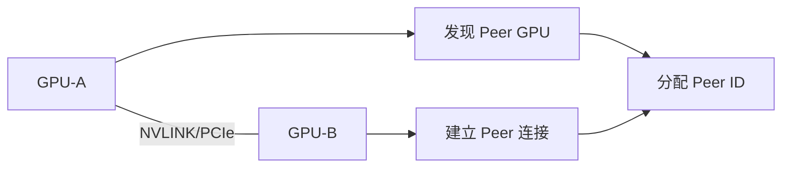
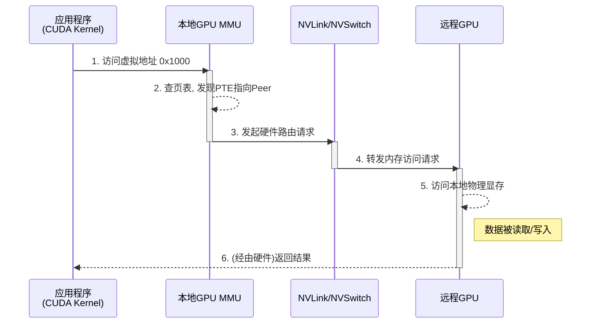

# GPU 访存体系演进

软件系统架构的根本决定因素是内存模型。传统操作系统内核围绕CPU访存权限进行设计，通过虚拟内存管理、页表机制和TLB等组件构建了现代计算的基础。同样，PCIe引入的MMIO（Memory Mapped I/O）机制决定了内核驱动的编程范式，设备寄存器被映射到统一的地址空间，通过内存访问指令进行控制。

超节点的出现从根本上改变了这一范式。通过NVLink/NVSwitch等高速互联技术构建的HBD（High Bandwidth Domain）通信域，使得远程GPU显存能够以接近本地访问的性能被直接访问。为了实现高效通信，HBD域上正在构建一个能**绕过（Bypass）CPU和操作系统内核**的、由GPU主导的通信架构。在这个新架构下，访存的控制权发生了转移：

1. **从CPU中心到GPU中心**：跨GPU的内存访问不再需要CPU作为中介，而是由GPU的MMU（内存管理单元）直接发起，由硬件（如NVSwitch）进行路由。
2. **从内核态仲裁到用户态直通**：上层应用（如CUDA Kernel）通过统一虚拟地址（UVA）操作远程数据，其地址翻译和路由完全在硬件层面透明完成，内核仅在初始设置和资源管理时介入。

为了更好地理解超节点带来的这一变革，接下来从GPU访存体系入手来分析软件系统的演进路径。

## 现代GPU访存体系

NVIDIA超节点在软件系统架构上与其**单个节点内部**的GPU访存体系一脉相承，均围绕**UVA（Unified Virtual Addressing）**技术构建。与传统CPU类似，现代GPU也配备了完整的内存管理单元（MMU），负责虚拟地址到物理地址的转换。UVA技术的引入，将GPU显存、CPU内存等不同物理内存统一映射到单一的虚拟地址空间中。上一章我们讨论了NVLink和NVSwitch等物理互联技术，它们构建了数据传输的高速公路。软件层面利用这条高速公路的核心便是统一虚拟寻址（UVA）与对等内存访问（Peer Memory Access）：

### 发现与连接建立

系统中的GPU通过物理总线（如NVLink或PCIe）互相发现，建立对等连接并分配唯一的Peer ID。

### Aperture选择与地址映射

驱动程序分配UVA地址，并根据连接类型选择不同的Aperture通道：

- **本地显存 (VID Memory)**：同一GPU内的内存访问
- **对等内存 (Peer Memory)**：通过NVLink直接访问远程GPU显存
- **系统内存 (SYS Memory)**：通过PCIe访问CPU主存
- **Fabric内存**：在NVSwitch环境下的专用地址空间

### 硬件透明的远程访存

当CUDA Kernel访问虚拟地址时，GPU MMU自动完成地址翻译和路由。硬件MMU通常提供4-5级页表，支持4K-128K页大小。考虑到MMU页表中的地址可能并非全部是内存地址，也包含部分IO地址。因此GPU MMU的表项也会标识是否支持缓存一致性。

### GPU访问UVA地址流程

以下是GPU上访问UVA地址的流程：

UVA在节点内实现的编程透明性与硬件高效性，为构建更大规模、跨节点的统一地址空间奠定了范式基础。随着硬件演进，软件侧的地址模型与编程范式也在逐步向CPU成熟的体系靠拢。总体趋势是：CPU与OS内核正从"关键数据路径"中解放出来，转而扮演"控制平面"的角色，通过配置虚拟地址与MMU来管理访存与通信，而非直接参与每一次操作。

## 超节点访存体系

传统的UVA和PCIe P2P机制的边界仅限于单个PCIe根联合体（Root Complex），无法原生支持跨物理服务器节点的直接访存。以下是PCIe总线上节点内部的访存体系：

### PCIe 节点内访存体系

1. 主存、设备的控制寄存器和设备内置存储（比如显存）都会通过PCIe RC映射到一个统一的MMIO地址空间（Memory Mapped I/O）；
2. 在内核态，设备驱动通过MMIO地址操作设备寄存器，从而实现对设备的初始化、控制与中断处理；
3. 在用户态，可以直接将设备的存储映射到用户态地址空间，从而实现用户态对设备的直接读写，让数据路径bypass内核。GPU Direct RDMA技术即将部分显存映射到用户态，再交给RDMA网卡去访问。RDMA网卡的doorbell寄存器（用于通知网卡有工作需要处理）也可以通过这种映射交给GPU去访问，从而实现IBGDA（GPU异步RDMA数据发送）；

在传统的基于PC的AI算力服务器上，上述软件技术架构已成为事实标准。然而，在超节点中，上述访存体系面临本质缺陷：PCIe通信域无法纳管其他节点的设备，因此也无法提供跨节点的统一访存地址空间。

### NVSwitch Fabric 全局地址空间

超节点通过NVSwitch Fabric等技术，将"节点内"的P2P模型扩展至整个机柜乃至多个机柜。其关键在于引入了一个由**Fabric Manager**管理的**47-bit的全局物理地址空间**[^fabricmanager]：

1. **全局地址分配**：Fabric Manager为HBD域内的每个GPU分配一个唯一的、在全局范围内无冲突的物理地址（PA）范围。
2. **VA到全局PA的映射**：当一个GPU需要访问远程GPU时，其驱动程序不再映射到对端的PCIe BAR地址，而是将用户态的虚拟地址（VA）通过页表（PTE）映射到这个全局物理地址（PA）。
3. **硬件路由**：当GPU的MMU翻译VA并得到这个全局PA时，它会生成一个带有目标GPU ID的硬件请求。该请求被发送到NVSwitch网络，由交换芯片根据地址和ID，像路由器转发IP包一样，精准地将读写操作路由到目标GPU的物理显存上。

## PCIe/CXL 架构演进

如前文所述，PCIe 总线访存体系的核心挑战在于如何突破单一 PCIe Root Complex（RC）的物理边界，实现跨节点的统一地址空间。在闭源生态中，NVSwitch 提供了一种专有解法，而在开放标准阵营，PCIe 及其承载的 CXL（Compute Express Link）协议，正在通过物理层与链路层的重构，从传统的通用外设通道演进为支撑超节点 Scale-up 的高速算力网络（Compute Fabric）。

### PCIe 核心代际演进与 CXL 内存池化

首先回顾 PCIe 的技术演进，其架构逻辑始终围绕“物理层效率提升”与“支持资源解耦”展开：
*   **PCIe 1.0 至 4.0（带宽与编码效率提升）**：从早期的 8b/10b 编码到 PCIe 3.0 的 128b/130b 编码，物理层传输开销从 25% 降至 1.5%。PCIe 4.0 确立了 16 GT/s 的速率，为早期 AI 服务器内部的多 GPU 树状互联提供了物理支撑。
*   **PCIe 5.0 与 6.0（PAM4 调制与协议栈重构）**：PCIe 5.0 实现了 32 GT/s 速率，并开放了备选协议（Alternative Protocols），为 CXL 奠定基础。PCIe 6.0 则是架构的重大转折，首次引入 PAM4（四电平脉冲幅度调制）以实现 64 GT/s 速率。为解决 PAM4 带来的信噪比下降问题，6.0 强制引入固定大小的 FLIT（流量控制单元）机制与低延迟 FEC，在保障信号完整性的同时维持了低延迟特性。
*   **CXL 协议与池化（Resource Disaggregation）**：基于 PCIe 物理层，CXL 引入了 `CXL.mem` 和 `CXL.cache` 协议。它使得系统不仅能传输数据，还能维持硬件级缓存一致性。发展至 CXL 3.0，系统已支持基于交换机的动态路由与内存池化，允许超节点内的计算资源与内存资源完全物理分离与动态重组。
	
### 解决Rack Level Scale-up 问题的关键机制

传统 PCIe 架构遵循严格的单根（Single-Root）树状拓扑，由单一 CPU 掌控所有下游设备的枚举与资源分配。但在 AI 超节点中为了打破这一限制，通过高基数（High-Radix） PCIe Switch 构建的非阻塞交换矩阵，实现了多主机（Multi-host）与多设备对等协同：

* **Multi-host（多主机协同）**：允许物理上独立的多个 CPU 节点同时连接到同一个 PCIe 交换网络中。通过硬件层面的虚拟化与资源分区，交换矩阵内的 GPU、智能网卡等资源可以被动态分配给不同的宿主 CPU，或者在多个主机间实现共享，从而提升超节点集群的资源利用率与调度弹性。
* **NTB（Non-Transparent Bridge，非透明桥）**：由于传统 PCIe 规范不允许两个 RC 直接互连（会导致地址空间枚举冲突），NTB 技术应运而生。NTB 在物理链路上扮演网关角色，将超节点划分为多个独立的 PCIe 域。它能够隔离不同域的地址广播，同时通过硬件地址转换窗口（Translation Window），允许一端的设备（如 GPU）利用直接内存访问（DMA）跨域读写另一端设备的显存。这种机制既隔离了故障域，又实现了底层的物理直连访存。
### 面对新兴协议的挑战，PCIe 持续深化改革

尽管 PCIe 已经具备通用底座能力，但面向大模型scale-up场景，新兴互联协议在设备接入数量与峰值带宽上展现出明显优势：

*   **NVLink** 提供极高的单节点双向带宽（1.8 TB/s 级），且专用 Mesh 拓扑在梯度同步时有效带宽利用率极高。
*   **UALink** 专为 AI 优化，精简了通用外设的冗余配置空间，单 Pod 内可支持 1024 个节点的互联，突破了传统 PCIe 的物理端口局限。
*   **轻量化以太协议** 通过定制极短的 AI 报头并结合底层重传，将以太网的组网规模优势引入 Scale-up 域。

应对新时代需求，PCIe Switch 芯片正加速向高基数（High-Radix）迭代。支持 160 lane、320-lane 及更高基数的交换芯片使超节点网络拓扑能够从多跳树状（Tree）向单跳全连接（All-to-All）演进，有效控制了网络长尾延迟。速率方面，2025 年正式发布的 PCIe 7.0 规范，将单通道速率推升至 128 GT/s，其 x16 双向总带宽达到了 512 GB/s 。这一带宽水平相当于 PCIe 4.0 x16 的8倍，为超节点内组件的小型化和高密度集成提供了巨大空间。
面对新兴协议的挑战，PCI-SIG 采取了并行推进的应对策略。除了在 CXL 层面持续深化内存语义外，PCIe 标准带宽正在加速翻倍周期。继 PCIe 7.0（128 GT/s，单向 x16 带宽 256 GB/s）之后，PCIe 8.0 规范已进入技术规范定义阶段，目标 256 GT/s（单向 x16 带宽达 512 GB/s，双向 1 TB/s）。此外，为打破铜缆的物理传输距离极限，PCIe 同时也在推进光学互联（PCIe over Optical）标准，试图通过标准化光电转换，在维持向后兼容的同时，支撑更大规模的跨机架无损互联，巩固其通用物理底座的地位。
### 对比 PCIe协议vs.以太协议

PCIe 总线与以太网协议各自具有鲜明的技术特征。系统架构选型的本质上是对协议语义、流控机制以及物理扩展边界的工程权衡：

1. **协议语义与数据路径：**
	PCIe 原生基于“加载/存储（Load/Store）”语义。GPU 间的数据交换无需封装网络包，直接在硬件事务层完成地址映射，能够实现零拷贝（Zero-copy）和百纳秒级的超低延迟，非常契合节点内显存共享的需求。
	以太网（含 RoCE v2） 基于“消息传递（Message Passing）”语义。数据需经历打包、路由查表、解包等网络层逻辑。尽管 RDMA 技术绕过了内核，但协议栈开销仍会引入微秒级延迟；其优势在于标准化的报文结构天然适合跨域解耦与长距离传输。
2. **流控机制与可靠性（RAS）：**
	PCIe 依赖硬件级的链路状态机与高级错误报告（AER）。在引入 FLIT 模式与轻量级前向纠错（FEC）后，PCIe 能够通过底层重训练（Link Retraining）快速纠正瞬时误码，提供严格的确定性延迟。但其劣势在于，面对大规模集群的网络级拥塞，PCIe 缺乏灵活的全网端到端拥塞控制手段。
	以太网 具备成熟的基于优先级流控（PFC）和显式拥塞通知（ECN）的无损网络机制，结合软件定义的路由策略，能够支撑数万节点的鲁棒运行。但在极高负载的超节点内部，PFC 调优复杂度较高，且存在引发拥塞扩散（PFC 风暴）及延迟抖动的风险。
3. **拓扑扩展性与物理边界：**
	PCIe 的优势区间集中在单机柜或短距离铜缆范围内。依托成熟的 Switch 和 Retimer 供应链，其在机柜内的 TCO（总体拥有成本）较低。但受限于物理层信号衰减与树状拓扑的地址空间枚举限制，PCIe 在跨机架扩展时面临极大的工程挑战。
	以太网 是跨机架 Scale-out 扩展的事实标准，拥有极强的端口基数和成熟的光学互联生态。目前，行业正试图通过精简以太网包头（如 UEC 规范），将其技术下放至 Scale-up 域，以弥补 PCIe 在扩展规模上的短板。

### 展望单机柜超节点的最佳实践与解耦思路

综合考量带宽需求、技术成熟度、供应链稳定性与 TTM（上市时间），在 2026 至 2027 年的时间窗口内，基于 PCIe 6.0/7.0 以及 CXL 构建总线型算力网络，仍是当前工程落地上的一种可靠选择。 它在保证极低互联延迟的同时，规避了非标协议带来的系统集成风险。面向百卡规模的 Scale-up 集群具备显著的工程优势。
展望 2028 年及更远未来，超节点系统互联架构可能会出现总线逻辑语义与物理层（PHY）的全面解耦。随着底层高速 SerDes 技术（如 224G/448G）的演进，总线型与以太型协议的物理界限将逐渐抹平。具备先进 Load/Store 内存语义的协议（如 UALink 或下一代 CXL），将可以直接运行在标准化的 Ethernet PHY（基于 IEEE 802.3 标准的电/光介质）之上。
这种物理与逻辑解耦思路，既能复用网络物理层在长距离、高信号完整性上的红利，又能保留总线协议的零拷贝、极低延迟访存特性，可能成为支撑下一代万亿参数模型训练的超大规模系统架构形态。

## 整机资源编排

- **NUMA 与 GPU/加速卡绑定**：合理亲和性设置减少跨 socket/跨 switch 延迟
- **DMA 映射、IOMMU、安全与虚拟化**：统一的地址映射与隔离策略是共享内存语义的基石
- **异构协同**：GPU/NPU/DPU/可编程交换芯片在同一机箱内的链路规划与带宽分配

## 参考文献

[^fabricmanager]: [NVIDIA Fabric Manager（open-gpu-kernel-modules 源码）](https://github.com/NVIDIA/open-gpu-kernel-modules/blob/2b436058a616676ec888ef3814d1db6b2220f2eb/kernel-open/nvidia-uvm/uvm_gpu.h#L1292)
