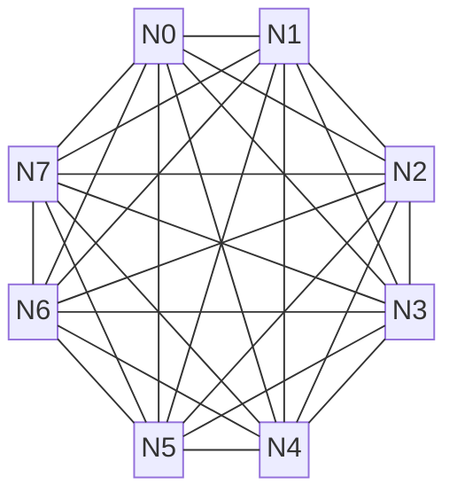

# Scale-Up 域互联拓扑（网络层）

本章介绍 Scale-Up 域的互联拓扑设计，包括关键指标定义、常见拓扑分析与性能对比。

---

互联拓扑定义了计算节点（或GPU）间的物理连接方式与逻辑结构，它直接决定了整个系统的通信性能，包括带宽、延迟、扩展性和成本。在超节点架构中，选择合适的拓扑是构建高效、无阻塞通信域的基石。当前主流技术路径为电子分组交换（Electronic Packet Switching，EPS），而光学电路交换（Optical Circuit Switching，OCS）作为前沿方向也备受关注。我们首先以最为常见的 **Full Mesh 拓扑** 为例来分析 GPU 的互联拓扑，以及互联拓扑有哪些关键性质。

## 拓扑关键指标

为了能够定量比较不同的互联拓扑，需要引入一些关键指标：

*   **网络直径（Network Diameter）**：指网络中任意两个节点间的最短路径长度，刻画了最坏情况下的通信延迟。Full Mesh 拓扑中任意两个节点直接连接，因此 **网络直径为1**。在 Spine-leaf 拓扑中，任意两个节点间的通信最多只需经过"上行-下行"三跳（Leaf-Spine-Leaf），因此 **网络直径为3**。
*   **二分带宽（Bisection Bandwidth）**：指当网络被切成两半时，连接这两半部分的总通信能力。它反映了网络在最坏通信场景下的最大数据传输能力。在 Full Mesh 拓扑中，一半网络有 $N/2$ 个节点，每个节点有 $N/2$ 条链路连接到另一半网络，因此 Full Mesh 拓扑的二分带宽为 $\dfrac{N}{2} \times \dfrac{N}{2} \times B = \dfrac{N^2}{4} B$。在 Fat-Tree 拓扑下，一半网络有 $N/2$ 个节点，每个节点都能与另一半网络全速率通信，因此 Fat-Tree 拓扑的二分带宽为 $\dfrac{N}{2} B$。
*   **径向扩展度（Radix Scalability）**：指在给定交换芯片 radix 条件下的最大无阻塞集群规模 $N_{max}$。它衡量了在给定交换芯片端口数（$R_{switch}$）和终端设备接口数（$R_{dev}$）的条件下，一个拓扑理论上能构建的最大无阻塞集群规模。Full Mesh 拓扑下，互联规模 $N_{max} = R_{dev} + 1$，Fat-Tree 拓扑下 $N_{max} = R_{switch}^3 / 4 R_{dev}$。

## 常见拓扑分析

### Full Mesh（全互联）

**Full Mesh（全互联）**，或称全连接（All-to-All），是理论上最理想的通信拓扑结构。网络中的每一个节点都与其他所有节点建立直接的点对点连接。

Full Mesh 拓扑具备如下特点：

*   理论最优延迟（直径 1）与最高二分带宽 $\dfrac{N^2}{4}B$
*   端口数平方增长，适合 8/16 以内的小规模 HBD 或板级互联

### Clos Network Structure（多级交换网络架构）

**Clos 网络架构**是一种多级交换网络结构，由 Charles Clos 在 1953 年提出。其核心思想是通过将大规模交换任务分解为多个小交换机模块，并按输入层（Input）、中间层（Middle）和输出层（Output）分级互联。Clos网络架构主要优势在于：

- **经济可行**：通过大量相同规格的低成本交换机构建网络，避免依赖少数昂贵设备，显著降低建设和运营成本。
- **高容错性**：具有多条等价路径，当任意一条链路或交换机故障时，流量可以被重新路由到其他路径，不会导致单点失效。
- **可扩展性**：可以通过增加 Spine 交换机或增加网络层级来平滑地扩展集群规模。

当前，主流的 Clos 网络架构主要有Spine-leaf架构和Fat-tree架构。

**Spine-leaf（叶脊）**是一种全互联、扁平化的Clos网络架构。典型的Spine-leaf网络架构一般只有两层，由"脊交换机"（Spine Switches）和"叶交换机"（Leaf Switches）组成。Leaf 交换机汇聚服务器流量，并上联至所有 Spine 交换机；Spine 交换机与所有 Leaf 形成全网格互联，但 Spine 层内部通常不直接互连。这种结构保证了任意两个不同叶交换机下的节点通信最多只需经过"上行-下行"三跳（Leaf-Spine-Leaf）。在Spine-leaf的扁平化架构中，节点间通信路径短，跨叶节点的通信通常仅三跳，因此实现了低延迟和高带宽。

**Fat-Tree（胖树）** 是一种对称的三层Clos网络架构，其核心设计思想是：从网络边缘（终端节点）向核心（根方向）上行时，链路带宽逐级增加，确保任意两个节点间的通信都拥有充足的带宽资源。在典型的 $k$-ary Fat-Tree 中，所有交换机均为 $k$ 端口设备，整个网络由三层组成：核心层（Core layer）、汇聚层（Aggregation layer）和边缘层（edge layer）。网络包含 $k$ 个 分区（pod），每个分区内部由 $k/2$ 个边缘交换机和 $k/2$ 个汇聚交换机构成；整个网络的核心层共有 $(k/2)^2$ 个核心交换机。每个边缘交换机使用 $k/2$ 个端口连接服务器，另 $k/2$ 个端口上联至汇聚层；汇聚交换机再通过 $k/2$ 条上行链路连接核心层。Fat-Tree 通过精心设计上行与下行链路的带宽比例（收敛比），可以为 All-to-All 等复杂通信模式提供接近线速的聚合带宽，实现理论上的无阻塞通信。

NVIDIA 的 DGX SuperPOD 架构本质上就是一个精心设计的Spine-leaf网络：

*   **第一级**：在单个节点内部，多颗 NVSwitch 芯片构建了一个单级的、逻辑上完全无阻塞的全互联网络（Full Mesh），将域内所有 GPU 全互联起来。
*   **第二级**：第一级的 NVSwitch 再通过第二级的 NVSwitch 进行互联，形成一个 32 卡的 Scale-Up 通信域。

## 新型拓扑分析

### Dragonfly 拓扑

**Dragonfly 拓扑** 是一种为超大规模计算设计的、旨在降低网络直径和成本的拓扑结构[^dragonfly]。它将路由器（交换机）和与之相连的计算节点组织成"组"（Group）。组内，路由器之间实现全互联（All-to-All）。组间，通过长距离的"全局链路"进行稀疏连接。Dragonfly 拓扑具备如下特点：

*   **低网络直径**：任意两个节点间的通信路径非常短，通常最多只需一跳组内路由和一跳全局路由。
*   **成本效益**：相比于同等规模的全连接胖树，Dragonfly 所需的全局链路和交换机端口更少，成本更低。

Dragonfly 的挑战在于，全局链路相对稀疏，就像一个城市的主干道有限。如果路由策略不佳，所有流量都涌向少数几条主干道，就会造成严重的拥堵。因此，它必须依赖智能的、能感知全局负载的路由算法，动态地为数据包规划"行车路线"，才能发挥其低延迟和成本优势。

### 3D Torus 拓扑

**Torus 拓扑** 是一种规则的格状拓扑，在多维（如2D、3D、6D）网格的每个维度上都带有"环绕式"连接[^torus]。每个节点都与其在各个维度上的"邻居"直接相连。Torus 拓扑具备如下特点：

*   **优异的局部性**：非常适合具有邻近通信模式的科学计算应用（如气象模拟、流体力学），因为相邻节点间通信延迟极低。
*   **二分带宽较低**：将其切成两半时，横跨切面的链路数量相对较少，这意味着其全局 All-to-All 通信性能不如胖树。
*   **扩展性受限**：高维 Torus 布线复杂，扩展成本高。

### SlimFly 拓扑

**SlimFly 拓扑**：作为 Dragonfly 的演进，SlimFly 是一种在给定交换机端口数下，能够以更少的网络直径和接近最优的二分带宽连接更多节点的拓扑结构[^slimfly]。它在理论上被证明是构建超大规模网络最高效的拓扑之一，但其不规则的连接方式对物理布线和路由算法设计提出了极高挑战，目前更多处于学术研究和前沿探索阶段。

## 拓扑性能对比

对于以 All-to-All 和 All-Reduce 为主导通信模式的 AI 大模型训练而言，胖树拓扑因其优越的全局带宽特性与确定的网络直径而成为事实上的标准选择。但另一方面，Fat-Tree 所能达到的互联规模也受限于交换机容量。在超节点继续演进的过程中，对互联拓扑的探索也尤为重要：

| 拓扑      |                                             径向扩展度 |               网络直径 |                二分带宽 |
|-----------|-------------------------------------------------------:|-----------------------:|------------------------:|
| Full Mesh |                                          $R_{dev} + 1$ |                      1 |      $\dfrac{N^2}{4} B$ |
| Spine-leaf |                      $\dfrac{R_{switch}^2}{2 R_{dev}}$ |                      3 |        $\dfrac{N}{2} B$ |
| Fat-Tree   |                      $\dfrac{R_{switch}^3}{4 R_{dev}}$ |                      5 |        $\dfrac{N}{2} B$ |
| Dragonfly  |                     $\dfrac{R_{switch}^4}{81 R_{dev}}$ |                $\le 3$ | $\approx \dfrac{N}{2}B$ |
| Torus      |                                                 无上界 | $D \cdot \dfrac{k}{2}$ |                         |
| Slim Fly | $\dfrac{32}{243} \times \dfrac{R_{switch}^3}{R_{dev}}$ | 2–3 | 设计为接近满二分带宽 |

## 交换技术分析

*   **NVSwitch**：域内全互联，直径 1，适合 32/72/144 节点 Scale-Up
*   **以太/IB ASIC**：大径向扩展、需要合理收敛比
*   **专用 Fabric**：可结合 OCS 获得弹性
*   **路由与拥塞控制**：自适应/最短 + 局部拥塞感知，分级流控，故障绕行
*   **OCS**：作为全局链路重构手段，提升 Dragonfly/3D Torus 的弹性与稀疏化效果

## 从"堆链路"到"弹性稀疏"

*   Full-mesh 在小规模时代表"极致延迟"，但端口平方增长不可持续
*   Clos 是之前工业界默认解，但在万卡级面临成本与收敛比挑战
*   新一代探索（Dragonfly/SlimFly/OCS+Torus）希望用"更少的全局链路 + 可重构交换"换取接近满二分带宽和低直径，让拓扑从"静态堆叠"转向"弹性稀疏化"

## 参考文献

[^dragonfly]: [Technology-Driven, Highly-Scalable Dragonfly Topology (IEEE)](https://ieeexplore.ieee.org/abstract/document/4556717)
[^torus]: [Understanding Torus Network Performance through Simulations](http://datasys.cs.iit.edu/reports/2014_GCASR14_paper-torus.pdf)
[^slimfly]: [Slim Fly: A Cost Effective Low-Diameter Network Topology](https://arxiv.org/pdf/1912.08968)
