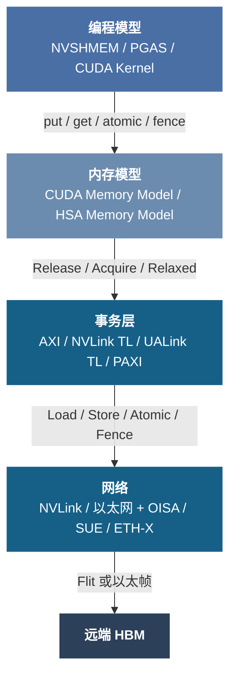
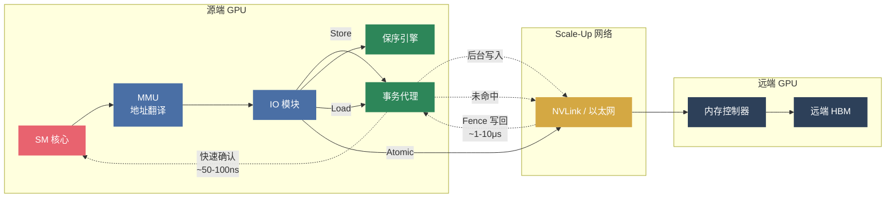

# 通用语义框架：Scale-Up 域的内存语义、保序与地址翻译

!!! abstract "本节定位 · 统一内存子系统 ①"
    本章"统一内存子系统"分三节递进：**通用语义框架 → NVIDIA 实现剖面 → 内存池化**。三节共同回答一个总问题：**统一内存子系统要解决的不是"能不能访问远端显存"，而是"能否以可接受的一致性代价、地址复杂度和调度开销，把跨设备内存稳定兑现为 Goodput"。** 本节是第一层，回答这个总问题中的第一个子问题：**哪些能力是必要条件？** 因此它从硬件视角建立 Scale-Up 域内**内存事务语义、保序机制与地址翻译**的通用分析框架。无论底层采用 NVLink、UALink、OISA、SUE（Scale-Up Ethernet）、ETH-X 还是其他互联方案，这些问题都必须回答。它不是某一厂商的实现分析；下一节将以 NVIDIA NVLink/NVSwitch Fabric 为例，展示本节提出的通用框架如何在具体系统中落地。

当多个 GPU 的显存被纳入同一个高带宽域时，远端内存访问为什么还能看起来像"本地可编程资源"？答案不在单一协议，而在一条从软件到硬件的完整语义链路：

每一层都对上层做出语义承诺：编程模型承诺"远端访存像本地一样可编程"，内存模型定义可见性和顺序保证，事务层和网络负责在硬件上兑现这些保证。Scale-Up 互联正从早期的消息语义（显式 Send/Receive、RDMA，适用于 Scale-Out 松耦合场景）全面转向内存语义（隐式 Load/Store/Atomic，统一地址空间），NVLink、UALink、OISA、SUE 等主要新兴协议均采用后者。**本节聚焦事务层和网络层**——分析硬件侧必须提供哪些机制，才能让上层的内存模型承诺不落空。换句话说，这条语义链路的完整程度，决定了硬件打开的可能性空间有多大；支持的语义越完整、保序机制越高效，软件可兑现的 Goodput 上限就越高。

## 为什么 AI 负载需要硬件级内存语义

在单 GPU 内部，SM 核心发出的 Load/Store 指令经过片上网络直接到达 HBM 控制器，保序、原子性和一致性由芯片内部硬件保障，对软件完全透明。Scale-Up 互联将这些问题从"芯片内"扩展到了"芯片间"甚至"机柜间"——访存事务经过 IO 模块、交换网络、到达远端 GPU 再返回，每一跳都可能引入乱序、丢包和延迟不确定性。这不是理论问题：当 8 卡节点扩展到 64 卡甚至 256 卡的 Scale-Up 域时，远端访存路径的复杂度呈组合式增长，任何一跳的语义缺失都会成为整个系统的瓶颈。

当前 AI 负载对 Scale-Up 互联的需求可以归结为两种编程范式，它们代表了截然不同的数据流模式：

| 维度 | Direct Copy（Kernel 分离） | Direct Access（Kernel 融合） |
|:-----|:--------------------------|:----------------------------|
| **典型应用** | DeepEP、Transformer Engine | FLUX 等算子融合框架 |
| **访存模式** | HBM-to-HBM，专用拷贝引擎 | SM-to-HBM，Load/Store 指令 |
| **数据粒度** | KB-MB 级，连续 | 1B-数十 KB，可能非连续 |
| **对互联要求** | DMA/RDMA 语义，批量传输 | 内存语义级端到端传输 |

**Direct Copy** 是今天最常见的跨 GPU 通信模式。以 MoE 场景中的 DeepEP 为例：Expert 并行需要在 GPU 间做 All-to-All 数据重分布，每次搬运的数据量在 KB 到 MB 量级，由专用拷贝引擎在后台批量完成，计算和通信可以流水线重叠。这类场景对互联的要求是"大带宽、可批量"，传统的 DMA/RDMA 语义足以胜任。

**Direct Access** 则是正在快速增长的新范式。FLUX 等算子融合框架将通信操作内嵌到计算 Kernel 中——SM 核心在计算过程中直接通过 Load/Store 指令读写远端 GPU 的 HBM，不再有独立的拷贝阶段。这消除了 Kernel 间的同步屏障和中间缓冲区拷贝，对小规模推理和延迟敏感场景尤其重要。但这意味着互联必须支持 SM 发出的每一笔 Load/Store/Atomic 操作都能正确到达远端并保序返回——这就是"内存语义"的本质要求。

Scale-Up 互联硬件**必须同时支持两种语义**。只支持 Direct Copy 的方案能处理批量集合通信，但无法支持融合 Kernel 的细粒度远端访存；只支持 Direct Access 而缺少高效拷贝引擎，则大规模 All-to-All 的吞吐无法达标。两种范式的共存，而非替代，决定了 Scale-Up 硬件必须提供从 DMA 批量传输到单笔 Load/Store 的全谱系语义支持。

## Scale-Up 域需要哪些语义保证

明确了 AI 负载的两种访存范式后，下一个问题是：互联硬件需要提供哪些语义原语？

### 四类基本操作与顺序可见性

把显存扩展成跨 GPU 的可访问资源，不是"能传数据"就够了。Scale-Up 域至少需要四类基本操作成立：**Load**（远端读）、**Store**（远端写）、**Atomic**（目标侧原子读-改-写）、**Fence**（建立顺序与可见性边界）。这四类操作在编程模型层有直接对应：PTX 指令集提供 `ld.global.acquire`、`st.global.release`、`atom.global.add`、`fence.sc.sys`；NVSHMEM 提供 `nvshmem_get`/`nvshmem_put`/`nvshmem_atomic_add`/`nvshmem_fence`+`nvshmem_quiet`。如果只有 Copy 语义（DMA 搬运）而没有这组操作，Scale-Up 域仍然只是"高带宽搬运网络"，无法支撑 SM 核心发起的细粒度远端访存。

这些操作在多线程、多 GPU 条件下遵循**释放一致性（Release Consistency）**模型——这是 CUDA Memory Model 和 HSA Memory Model 共同采用的弱序内存模型。其核心语义可以通过一个典型场景来理解：

> **场景**：GPU-A 的 SM 线程写入一组参数到远端 GPU-B 的 HBM，GPU-B 的 SM 线程读取这些参数。如果 GPU-A 只用 Relaxed Store 写入，GPU-B 可能看到部分新值、部分旧值——因为弱序内存模型不保证跨 GPU 写操作的到达顺序。正确的做法是：GPU-A 在写完所有参数后执行 `st.release`（Release），GPU-B 在读取前执行 `ld.acquire`（Acquire）。Release 保证"这条写操作到达远端时，之前的所有写操作也已到达"；Acquire 保证"这条读操作返回时，之后的所有读操作都能看到 Release 之前的写入"。二者配对，形成**跨 GPU 的 happens-before 关系**。

CUDA 进一步引入 **scope** 概念（Block / Device / System），让程序员按通信范围选择保序粒度——Block scope 仅在线程块内有效，Device scope 在同一 GPU 内有效，而跨 GPU 通信必须使用 System scope，硬件代价也相应递增。满足一对 GPU 间的 Release 语义（**P2P 一致性**）可支持大部分点对点通信；但当通信模式涉及三个或更多 GPU——例如 AllReduce 中 GPU-A 写入 GPU-B、GPU-B 再转发给 GPU-C——就需要更昂贵的 System-scope **全局一致性**：GPU-A 的 Release 必须等待其对所有目标 GPU 的写操作都已完成，而不仅仅是对 GPU-B 的那一笔。这是 System Fence 代价高昂的根本原因。

## 语义兑现为什么困难：三类乱序

语义定义本身不复杂，难的是它要穿过多个天然允许乱序和并行的硬件层次。这里的"难"不是理论上的难，而是工程上每个环节都有乱序的合理动机（为了性能），而保序必须在不显著牺牲性能的前提下恢复正确性。

**传输路径乱序**：Scale-Up 网络的多平面或 ECMP 负载均衡会把同地址的先后事务分到不同路径，后发的事务可能先到达。例如，GPU-A 先写 `addr_x = 1` 再写 `addr_x = 2`，两笔事务被分配到不同物理平面，如果第二笔更快到达远端，远端 HBM 中 `addr_x` 最终为 1——这是一个静默数据错误，没有任何异常信号。解决方式是对同地址事务施加一致的路径选择约束（如相同的 Flow Entropy），但这会在热点地址上造成路径不均衡，带来新的工程取舍。

**端点内部乱序**：GPU 与 IO 模块间的高性能总线（典型如 AXI）采用独立读写通道，其保序规则为"same AXI ID → ordered, different ID → out-of-order allowed"（AMBA AXI4 Specification），天然允许跨 ID、跨通道的乱序完成。具体而言：一笔 Read（AR 通道）和一笔 Write（AW/W 通道）指向同一地址但使用不同 AXI ID 时，协议不保证谁先到达内存控制器——即 RAW（先写后读）语义可能被打破。此外接收端不同 HBM 控制器的执行延迟也可能不同，两个通道分别打向不同 HBM bank 时完成时间可能相差数十纳秒。两者叠加，使保序成为需要在整条数据通路上逐跳解决的系统性问题。

**多 IOD 负载均衡破坏全局语义**：当 GPU 通过多个 IOD（IO Die）连接 Scale-Up 网络时，相当于有多个并行的出口平面。两笔分别经过不同 IOD 的事务，即使各自在单 IOD 平面内保序正确，全局顺序也可能不一致——因为不同 IOD 平面的排队深度、网络拥塞、路径长度都不同，且平面间没有细粒度的时序协调。这意味着"一对 GPU 间语义正确"不能自动推出"整个 Scale-Up 域语义正确"，System Fence 必须跨所有 IOD 平面做全局排空。

## 硬件如何兑现语义：六个关键机制

上面的分析确立了两个事实：AI 负载需要完整的内存语义支持，而传输路径上的多层乱序让语义兑现变得困难。这些乱序最终需要硬件机制来化解。关键不在于单个机制是否存在，而在于这些机制能否组成闭环：既保证语义正确，又不把延迟和吞吐代价推到不可接受的程度。下表给出六个机制的全局视图：

| 机制 | 一句话功能 | 解决的乱序/语义问题 | 延迟量级 |
|:-----|:----------|:-------------------|:---------|
| 同地址保序引擎 | 检测同地址 RAW/WAR/WAW 依赖，选择性串行化 | 端点内部乱序（AXI 跨 ID） | 接近零（仅增加比对延迟） |
| 事务代理 | 本地快速确认 Store，后台异步写入远端 | 写延迟过高导致队列阻塞 | ~50-100ns（本地确认） |
| System Fence | 等待所有 buffered writes 写回远端并确认 | P2P → 全局一致性 | ~1-10μs（全局排空） |
| 专用 SU Engine | 绕过 GPU 核心总线的 P2P 拷贝引擎 | Copy/Access 保序域冲突 | 与网络延迟一致 |
| 远端原子执行 | 在目标内存控制器侧执行 Atomic 操作 | 分布式原子性（Lost Update） | ~0.5-2μs（不可代理） |
| MMU 与地址翻译 | 虚拟地址 → 物理地址 + 路由（本地/远端/系统） | 统一虚拟地址空间 | ~数十 ns（TLB hit） |

以下逐一展开。

**同地址保序引擎**：在 IOD 内部或 GPU 侧接口实现的硬件逻辑，实时检测同地址事务之间的读写依赖（RAW/WAR/WAW），只对存在依赖的事务收紧顺序，允许不同地址的事务继续乱序执行。其实现通常需要维护一个正在进行中（in-flight）事务的地址表，每笔新事务与表内已有事务做地址比对——匹配到则串行化，否则放行。这是"选择性保序"的关键：全局串行保序简单但吞吐崩塌，完全不保序则语义错误，保序引擎在二者之间找到精确的折中点。

**事务代理（Transaction Proxy）**：Push 事务（Store/Write）在本地代理处获得快速确认（~50-100ns），释放 GPU 核心队列槽位，后台由代理完成跨域传输。这个设计的意义在于：GPU SM 发出一笔远端 Store 后，如果必须等待数据真正到达远端 HBM 才能继续（以太网方案需 0.5-2μs，NVLink 约 100ns），SM 内可同时执行的事务数量受限于 Outstanding queue 深度——在大多数 GPU 中只有十几到几十个槽位。代理通过在本地立即回复确认，把这个等待时间从微秒级压缩到数十纳秒级，同等队列深度下并发写吞吐提升约一个数量级。但代理引入了两个正确性问题：后续 Load 命中 buffered writes 时必须返回最新值（类似 CPU store buffer forwarding），System Fence 到达时必须把所有脏数据写回远端并等待真实确认后才能放行。

**System Fence**：从 P2P 一致性走向全局一致性的关键机制。当程序执行 `fence.sc.sys` 或 `nvshmem_quiet` 时，硬件必须确保该 GPU 之前的所有写操作对所有远端 GPU 可见——这意味着等待事务代理中所有 buffered writes 被真正写入远端 HBM 并收到确认。如果该 GPU 同时对 8 个远端 GPU 有未完成写操作，Fence 阻塞时长取决于最慢的那条路径，可达数微秒甚至十余微秒。在延迟敏感的 FLUX 类 Kernel 中，每个 Fence 都是一次吞吐悬崖。因此更现实的设计是引入**基于区域的一致性域**——由软件标注"这组写操作只需要对 GPU-B 可见"，硬件只排空到 GPU-B 的 buffer，而非全局排空。这把 Fence 的平均代价从最坏情况拉回到实际通信模式所需的最小范围。

**专用 Scale-Up 拷贝引擎（SU Engine）**：直觉上，GPU 已经有 Copy Engine（用于主机-设备间拷贝），为什么不能复用？问题在于原生 Copy Engine 的数据路径：它从 HBM 读出数据，经片上总线送到 IO 模块，IO 模块封装后发到网络——但对于 P2P 拷贝，数据需要先从源端 HBM 读到 GPU 核心侧，再从 GPU 核心侧送到 IO 模块，造成总线流量翻倍。此外原生引擎不理解 Scale-Up 事务的地址映射和保序域，会引入不必要的全局 Fence。在 IOD 内实现专用 SU Engine 可以直接从网络侧接收数据写入本地 HBM（或反方向），绕过 GPU 核心总线路径，同时让 Copy 语义与 Access 语义在顺序模型和屏障域上适度解耦——Copy 使用自己的 Fence 域，不干扰 SM 发出的 Load/Store 事务。

**远端原子执行**：Atomic 操作（如 FetchAdd、CAS）必须在目标地址所在 GPU 的内存控制器侧执行，不可在源端模拟。原因直接：如果 GPU-A 和 GPU-B 同时对 GPU-C 的同一地址做 FetchAdd，只有在 GPU-C 的内存控制器处串行化这两笔操作，才能保证返回值的正确性。如果在源端各自读-改-写再写回，就退化成了经典的 Lost Update 问题。这要求网络能够携带原子操作类型信息到达远端，远端 IOD 或内存控制器在接收后执行原子操作并返回旧值。其延迟特征与 Load 相当（~0.5-2μs），但不可被事务代理加速——因为必须等到远端真正执行完毕才能返回结果。

**MMU 与地址翻译**：GPU 上的 Load/Store 指令使用虚拟地址，MMU 通过页表项（PTE）完成地址翻译。关键在于 PTE 不仅包含物理地址，还包含路由信息：典型实现中，Aperture 字段区分本地访问、Peer 访问和系统内存访问，Peer Index 字段指示目标 GPU 编号。MMU 查表后，本地访问直接送往 HBM 控制器，远端访问则路由到 IO 模块，IO 模块再通过地址映射寄存器将 GPU ID 翻译为网络地址（如端口号或以太网 MAC）。这套翻译链路的效率直接影响远端访存延迟——TLB miss 导致的页表 walk 可能增加数百纳秒。NVIDIA 的 GMMU 是这一通用机制的典型代表，其 Aperture/Peer/Fabric 地址路由将在下一节详细展开。

不同互联方案在地址空间的定义层级上存在根本性分歧。UALink 在 Fabric 规范层面定义了 57-bit 统一物理地址空间（128 PB），任何加速器可用同一组 Fabric 地址直接寻址其他加速器的内存，无需厂商间额外的地址翻译协调——这使得异构多厂商部署中，GPU-A（来自厂商 X）可以用与 GPU-B（来自厂商 Y）相同的地址格式完成远端访存。相比之下，以太网增强方案（SUE 等）将 Fabric 定位为传输层，地址翻译由各 XPU 厂商自行实现（SUE 规范明确指出"Address translation, when required, is handled by the XPU outside of the SUE instance"），跨厂商的内存操作需要额外的软件翻译层。NVLink 则在私有生态内通过 NVSwitch 实现全对称编址，效果类似 UALink 但限于 NVIDIA 设备。

在更大的 Scale-Up 域中，统一虚拟地址还面临三种模式的取舍：硬件全对称编址（所有 GPU 共享统一页表，最透明但扩展受限）、Page-fault 驱动的按需映射（灵活但延迟不可预测）、以及 PGAS 模型（由程序显式管理，开销最低但对应用侵入最大）。UALink 的 Fabric 级统一寻址降低了第一种模式的跨厂商复杂度，但 128 PB 地址空间的实际利用效率仍取决于各加速器的 MMU 实现质量。

### 端到端数据通路

**三条路径的延迟特征**：

- **Store**：常态下代理本地确认 ~50-100ns，SM 不阻塞；Fence 触发时回收全部代价 ~1-10μs
- **Load**：代理命中 buffered writes 则直接返回；未命中走网络，端到端 ~0.5-2μs
- **Atomic**：必须在远端内存控制器原子执行后返回，延迟与 Load 相当，不可代理

核心取舍：**常态路径上代理把 Store 延迟压到本地级别，Fence 把积累的全部代价一次性回收**。Fence 越少、缓冲区越深，常态吞吐越高，但单次 Fence 代价越大。上述延迟参数（Store 代理 ~50-100ns、Load 端到端 ~0.5-2μs、Fence 全局排空 ~1-10μs）将在第三章建模仿真中用于量化不同参考设计的 Goodput 影响。

## 协议如何承载内存语义

前面从上到下回答了"需要什么语义"（四类操作 + 一致性模型）和"靠什么机制实现"（六个硬件机制形成闭环）。最后一个问题是协议层面的：这些语义事务如何被封装、带出芯片、穿过网络到达远端？不同的协议选择在传输效率、延迟和生态兼容性上有显著差异。

**设备侧接口**：开放 Scale-Up 方案普遍采用 AMBA AXI4 作为 GPU 到 IOD 的数据通路接口（ETH-X 的 PAXI、UALink 的事务层均以 AXI 事务为封装对象）。AXI 的五通道架构（AW/W/B/AR/R）提供读写通道分离、基于 Transaction ID 的乱序完成和 Outstanding 事务并行，是高吞吐的基础，但 ID-based ordering 规则也正是前文"端点内部乱序"的硬件根源——同 ID 严格有序、跨 ID 允许乱序意味着保序引擎必须在此之上补齐跨 ID 的地址依赖检查。除 AXI 外，CHI（AMBA 一致性协议，原生支持 Snoop/Directory）、TileLink（RISC-V 生态开源总线，支持一致性扩展）、以及厂商私有协议（如 NVLink 内部接口）也是可能的选择，核心取舍在于开放生态兼容性、协议复杂度与原生一致性能力之间的平衡。

**CXL 的角色**：CXL（Compute Express Link）3.0 定义了 CXL.mem 和 CXL.cache 两个子协议，在 PCIe PHY 之上提供硬件级内存语义，支持主机与设备间的缓存一致性访问和内存池化。CXL 3.0 进一步引入 fabric-attached memory，允许多个主机通过 CXL 交换机共享远端内存池——这与 Scale-Up 域的统一寻址目标高度重合。UALink 白皮书也明确将"CXL memory expansion"列为未来方向之一。但 CXL 的 PCIe PHY 基础限制了其带宽上限和延迟下限，当前更适合 CPU-GPU 间的内存扩展和异构内存池化场景，而非 GPU-GPU 间的高带宽 Scale-Up 互联。未来 CXL 与 UALink/NVLink 的关系更可能是互补而非替代：CXL 负责内存池化和异构访问，UALink/NVLink 负责 GPU 间高带宽通信。

**链路/网络侧承载**可分为两大路线：Flit 原生总线方案（NVLink、UALink）和以太网增强方案（OISA、SUE、ETH-X PAXI）。

| 特性 | NVLink / UALink | 以太网增强（OISA / SUE / ETH-X PAXI） |
|:-----|:----------------|:--------------------------------------|
| **封装方式** | 固定 Flit，原生内存语义 | AXI 事务 → 以太帧（帧头设计各异） |
| **帧头开销** | 极小（UALink 控制半 Flit 32B 含多事务） | OISA TLP ~20B；SUE AFH 压缩仅 6B；ETH-X PRI 压缩帧 |
| **事务粒度** | 64-256B 固定事务（UALink），确定性缓冲分配 | 可变长以太帧封装，效率依赖聚合策略 |
| **链路利用率** | ~93-95%（UALink 目标 93%，TL 数据效率 95.2%） | ~56%（标准帧）→ ~74-77%（压缩 + 聚合） |
| **端到端延迟** | <100ns（NVLink 单跳）；亚微秒（UALink 规范目标） | 0.5-2μs（交换芯片转发 ~250ns） |
| **流控机制** | UALink：三层独立信用域（UPLI / TL / Switch），单跳 6 组信用环路；NVLink 内建 | LLR + CBFC（链路层单层信用，各方案均已支持） |
| **地址空间** | UALink：Fabric 级 57-bit 统一寻址（128 PB）；NVLink：私有统一寻址 | 地址翻译由 XPU 厂商实现，Fabric 仅负责传输 |
| **交换芯片** | 专用（NVSwitch 已量产；UALink Switch 2026 评估硬件） | 复用/增强标准以太网交换芯片 |
| **网内计算** | SHArP（NVSwitch） | CCA（OISA）；UALink/SUE 暂未支持 |
| **生态** | 私有（NVLink）/ 115+ 成员开放联盟（UALink） | 成熟以太网生态 |

尽管帧格式和具体机制不同，各方案在协议设计上正呈现明显的收敛趋势：均采用交换芯片构建全互联拓扑、追求紧凑包头和事务聚合以提高有效载荷率、在流控上从 PFC 向 CBFC 演进、在重传上以数据链路层重传（DLR/LLR）为主而非事务层重传。但一个根本性分歧正在浮现：**内存语义在协议栈的哪一层定义？** UALink 选择在 Fabric 规范层面定义统一地址空间和内存语义（read/write/atomic + 57-bit 统一物理地址），使 Fabric 本身成为一个"内存域"；以太网增强方案则将 Fabric 定位为传输层，内存语义由各 XPU 厂商在端点实现。前者的好处是跨厂商互操作天然统一，代价是需要专用交换芯片和完整的协议栈重新设计；后者的好处是复用成熟以太网基础设施，代价是跨厂商的远端内存操作需要额外的软件翻译层。以太网方案用约 20% 的传输效率损失换取了与标准以太网 PHY、交换芯片和管理工具链的兼容性。总线方案效率更高但需要专用生态。

## 对参考设计的含义

!!! info "对参考设计的含义"

    硬件侧内存语义的支持程度，直接决定了各参考设计在帕累托七维度中"单跳/访存延迟"与"软件复杂度"两个维度上的位置。

    - **以太网增强方案（OISA / SUE / ETH-X PAXI）**：通过协议层补齐远端内存语义，可复用以太网 PHY 和交换生态，代价是协议栈复杂、效率低于总线原生方案；地址翻译由各 XPU 厂商实现，跨厂商互操作需额外软件层；各方案在帧头设计（6-20B）和网内计算等能力上已出现差异化竞争
    - **Flit 原生总线方案（UALink）**：在 Fabric 规范层面定义 57-bit 统一物理地址空间和内存语义（read/write/atomic），配合多层信用流控（单跳 6 组独立信用环路）和固定事务粒度（64-256B），目标是 NVLink 级别的语义完整度与开放生态的结合；115+ 成员联盟治理，但交换芯片仍处于 2026 评估阶段
    - **NVLink/NVSwitch（帕累托基准）**：完整硬件级内存语义、极低延迟、成熟 Fabric 管理，但为单一厂商私有；NVLink Fusion 许可模式已开放部分接口给合作伙伴，但规范演进仍由 NVIDIA 控制

    第四章中的不同参考设计不是简单的"谁更快"，而是在三组约束之间取舍：语义定义在 Fabric 层还是端点层、是否接受更复杂的协议补齐、是否押注尚未完全成熟但更开放的生态路线。UALink 的出现使这一取舍更加清晰——它试图用开放联盟的方式复制 NVLink 的"Fabric 即内存域"模型，而以太网方案坚持"Fabric 是传输管道、语义在端点"。这两种架构哲学的竞争，将是未来 2-3 年 Scale-Up 互联演进的核心张力。

## 本节收束：必要条件、代价与工程位置

本节回答的是统一内存子系统的第一个子问题：**哪些能力是必要条件？** 结论是，跨设备内存要想被上层软件稳定使用，不能只停留在"能搬数据"，而必须同时具备四类操作、保序机制、地址翻译和协议承载能力。缺少其中任一环节，统一内存都只能停留在概念层，无法真正兑现为 Goodput。

但这些能力不是免费的。语义越完整，硬件与协议栈就越复杂：需要保序引擎来约束乱序、需要事务代理来隐藏写延迟、需要更昂贵的 Fence 来建立可见性边界、需要 MMU 和地址空间设计来把远端内存纳入统一寻址。换句话说，本节讨论的不是"能不能做统一内存"，而是**为了得到更高的软件兑现上限，愿意支付多大的一致性代价与实现复杂度。** 也正因为如此，统一语义的价值并不止于协议层面的"功能更完整"。只有当这些语义约束被稳定定义下来，上层运行时、编程框架和系统软件才可能围绕它沉淀出可复用、可迁移的软件资产；如果底层语义长期摇摆或过于碎片化，后续生态就不得不反复支付适配成本。

从全书的七维评估框架看，本节的讨论主要影响三项：

- **单跳/访存延迟**：语义定义在 Fabric 层还是端点层、是否需要额外翻译与补齐逻辑，直接决定远端访存的基础时延
- **软件复杂度**：硬件提供的语义越完整，上层运行时和框架越容易把远端内存当作可编程资源使用；反之，复杂度就会被推给软件
- **生态成熟度**：原生总线方案、私有方案和以太增强方案在语义完整性与生态开放性之间处于不同位置，不存在脱离约束的绝对最优解

!!! tip "统一内存子系统 · 下一节"
    本节（统一内存子系统第 ① 节）建立了 Scale-Up 域内存语义的通用分析框架：四类操作、三类乱序、六个关键机制、两大协议路线。下一节（第 ② 节"实现剖面"）将以 NVIDIA NVLink/NVSwitch Fabric 为例，基于开源 GPU 内核模块源码，展示这些通用概念如何被映射到 GMMU 页表、Fabric 地址空间、Fabric Manager 协调与 Export/Import 编程接口等具体实现中。第 ③ 节"内存池化"将继续把视角拉升到系统软件层，讨论如何把统一寻址能力转化为实际 Goodput。

---

*本节内容综合了以下主要参考文献：*

- *NVIDIA, "CUDA C++ Programming Guide", Chapter 12: Memory Model — Release Consistency、Scope、Fence 语义的定义来源*
- *NVIDIA, "PTX ISA Reference" — `ld.acquire`/`st.release`/`atom`/`fence.sc` 指令语义*
- *Aggarwal et al., "NVSHMEM: GPU-Initiated Communication for NVIDIA GPU Clusters", SC20 — PGAS 远端访存操作模型*
- *HSA Foundation, "HSA Platform System Architecture Specification" — 异构系统内存模型*
- *ARM, "AMBA AXI4 Protocol Specification" — AXI 五通道架构及 ID-based ordering 规则*
- *Sorin, Hill & Wood, "A Primer on Memory Consistency and Cache Coherence", 2nd Ed. — 一致性模型与一致性根理论框架*
- *ODCC, "ETH-X Scale Up 互联协议白皮书 V1.0"（ODCC-2025-03002）— PAXI 事务层、PRI 帧格式、CBFC/LLR 机制*
- *ODCC, "AI 超节点内存池化技术白皮书"（ODCC-2025-03004）— Transaction Proxy、SU Engine、MMU 地址翻译*
- *Song et al., "Survey of Intra-Node GPU Interconnection in Scale-Up Network", Future Internet 2025, 17, 537 — NVLink/OISA/UALink/SUE 系统性比较*
- *UALink Consortium, "UALink 200G 1.0 Specification" (April 2025) & UALink 1.0 White Paper — 四层协议架构、57-bit 统一物理地址空间、多层信用流控、64-256B 事务粒度*
- *Pike, J., "UALink: An Open, High-Efficiency Scale-Up Interconnect for AI", TASK Consultancy — UALink vs NVLink vs Ethernet-derived 方案的技术与战略对比*
- *NVIDIA, "NVIDIA NVLink and NVSwitch", in NVIDIA Hopper Architecture Whitepaper & Hot Chips presentations — NVLink 带宽演进（NVLink 5.0: 1.8 TB/s/GPU）、NVSwitch 全互联拓扑、SHArP 网内计算、NVLink Fusion 许可模式*
- *CXL Consortium, "Compute Express Link Specification, Rev. 3.0" — CXL.mem/CXL.cache 内存语义子协议、fabric-attached memory、与 Scale-Up 互联的互补关系*

*协议实现细节请参阅各白皮书、规范及论文原文。*
