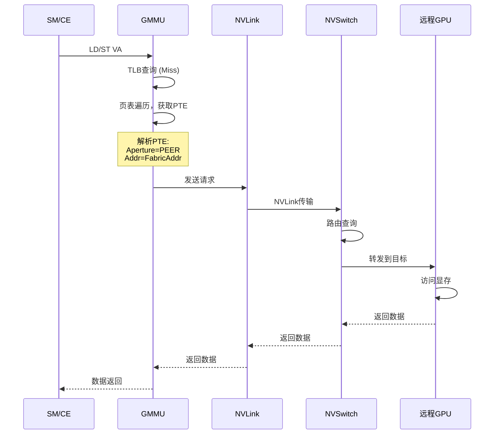
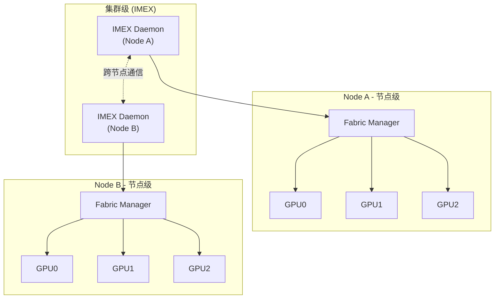
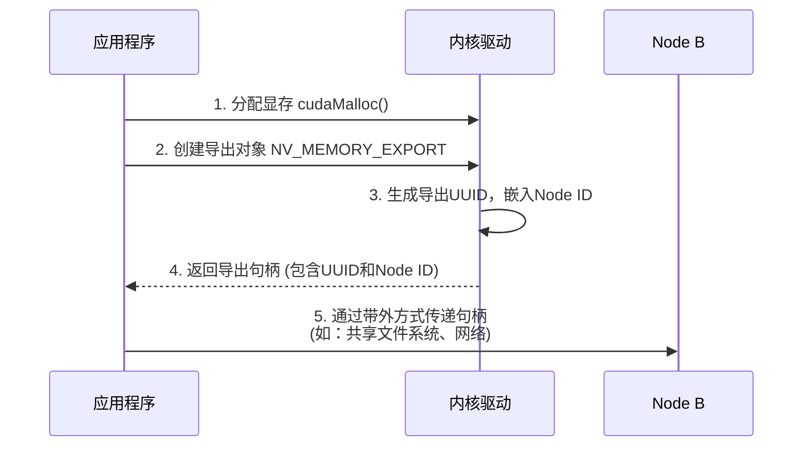
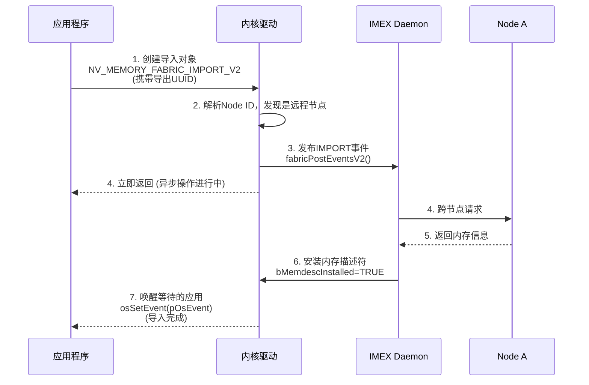
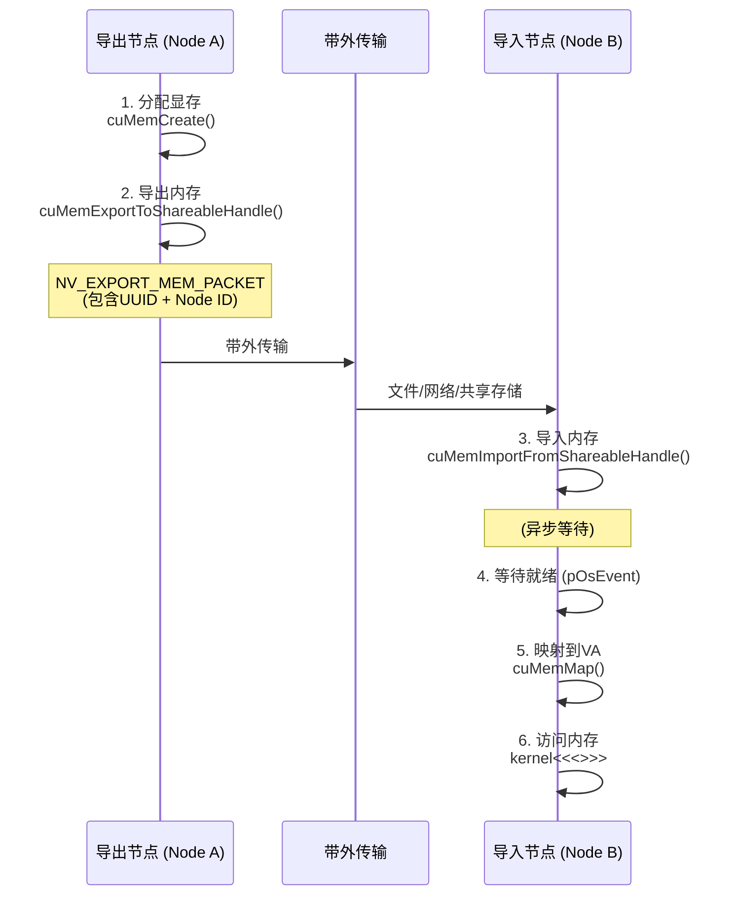
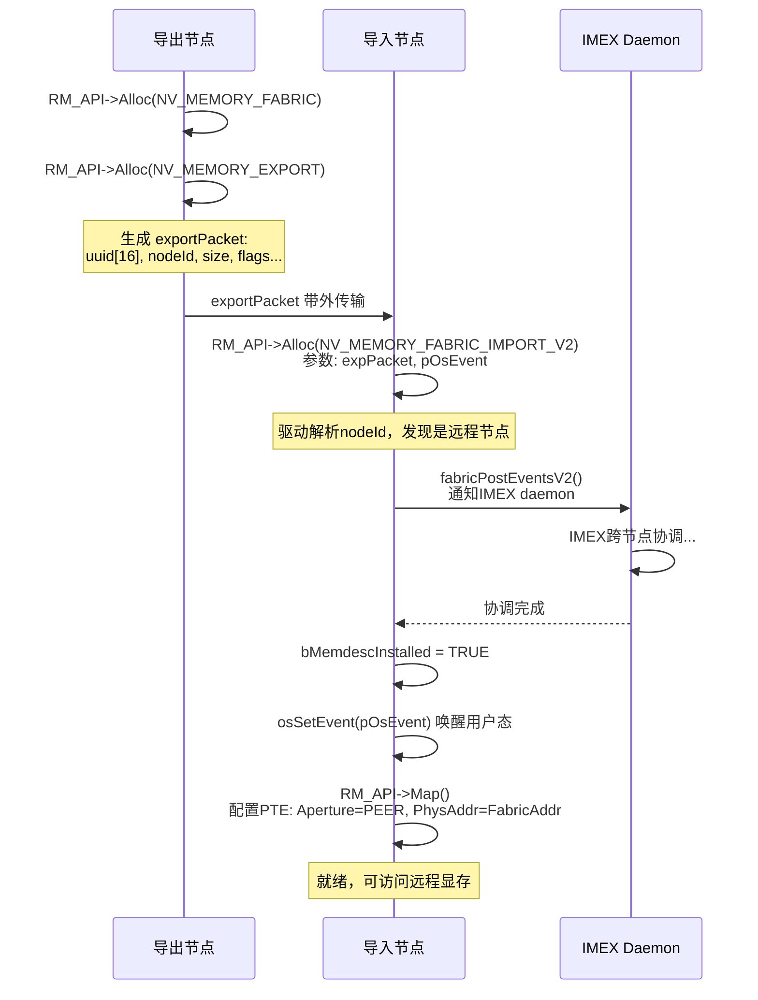

# 跨节点GPU显存统一访问架构

> 基于 NVIDIA 开源 GPU 内核模块源码分析

## 引言：从孤岛到统一

### 规模驱动的挑战

大规模AI模型的训练对计算基础设施提出了前所未有的挑战。当模型参数从数十亿增长到数万亿时，单个GPU的显存容量早已无法容纳完整的模型状态。即便采用模型并行、流水线并行等分布式策略，训练过程中仍需要在多个GPU之间频繁交换梯度、激活值和参数分片。

传统的数据中心架构中，GPU显存如同一座座"孤岛"：每个GPU只能直接访问自己的本地显存，跨GPU的数据交换必须经由CPU内存中转，或通过显式的内存拷贝操作完成。这种模式在小规模集群中尚可接受，但当集群规模扩展到数百乃至数千GPU时，数据搬移的开销成为严重的性能瓶颈。

### 核心问题

**如何让分布在不同物理节点上的GPU显存，像访问本地内存一样被透明访问？**

这个问题可以分解为三个层次：

- **单机多卡**：同一服务器内的多个GPU如何高效共享数据？
- **单一集群**：机柜内通过NVSwitch互联的GPU如何实现统一寻址？
- **跨节点扩展**：不同物理节点上的GPU显存如何被远程访问？

### 技术愿景

构建**全局统一的GPU内存地址空间**，*在NVSwitch Fabric域内*，使应用无需感知底层物理拓扑即可实现跨节点数据共享。具体而言：

- **位置透明**：应用通过统一的虚拟地址访问数据，无论数据实际存储在本地显存、远程GPU还是系统内存（*在同一Fabric域内*）
- **访问一致**：跨节点的内存访问在语义上与本地访问保持一致，无需显式的数据搬移（*通过显式导入/导出建立映射后*）
- **按需扩展**：地址空间设计目标是支持从单机多卡到跨节点的规模扩展

### 本章范围

本章基于NVIDIA开源GPU内核模块（open-gpu-kernel-modules）的源码，深入分析跨节点GPU显存访问的实现机制。我们将从GPU虚拟地址空间的基础概念出发，逐步展开单机P2P、NVSwitch互联、Fabric地址空间、跨节点导入导出等核心机制，并探讨其设计权衡与演进方向。

**适用范围**：
- **硬件平台**：支持NVLink/NVSwitch的NVIDIA GPU（Volta及更新架构）
- **软件版本**：基于open-gpu-kernel-modules 560.x分支分析
- **部署场景**：DGX系统、HGX平台、NVL72超级节点等多GPU环境

**证据等级说明**：

| 标记 | 含义 | 示例 |
|------|------|------|
| `代码实体` | 可直接在源码中定位的函数、结构体、宏 | `knvlinkGetUniqueFabricBaseAddress()` |
| *代码逻辑示意* | 基于源码简化的伪代码，展示核心逻辑 | 简化后的条件分支 |
| **设计推断** | 基于代码行为推断的设计意图 | 架构决策分析 |

文中所有技术术语尽可能标注代码出处，以提高分析的可追溯性。*部分设计推断基于代码行为分析，可能存在理解偏差。*

---

## 架构分层：硬件能力与软件抽象

跨节点GPU显存访问的实现涉及从硬件到应用的多个层次。理解这一分层架构，是把握整体设计的关键。

| 层级 | 核心组件 | 职责 |
|------|----------|------|
| **应用层** | CUDA Driver API / UVM | 统一虚拟地址 → 位置透明访问 |
| **协调层** | Fabric Manager + IMEX | 全局资源编排与跨节点协调 |
| **驱动层** | RM + GMMU | 地址翻译与路由配置 |
| **硬件层** | NVLink + NVSwitch | 高带宽低延迟互联 |

### 硬件层：高带宽低延迟互联

硬件层提供GPU间数据传输的物理通道，是整个架构的基础。

**NVLink**是NVIDIA专有的GPU互联协议，提供比PCIe更高的带宽和更低的延迟。在最新的架构中，单条NVLink链路可提供数百GB/s的双向带宽，多条链路可聚合使用。NVLink不仅连接GPU与GPU，也连接GPU与NVSwitch。

**NVSwitch**是专用的高速交换芯片，作为GPU间通信的"交换机"。在单机场景下（如DGX系统），多个NVSwitch芯片构成全互联拓扑，使任意两个GPU之间都能以最大带宽直接通信。在多节点场景下，NVSwitch还通过Trunk Link连接不同节点，实现跨节点路由。NVSwitch内部维护路由表，根据目标地址自动将数据包转发到正确的端口。

### 驱动层：地址翻译与资源管理

驱动层是连接硬件能力与上层抽象的桥梁，由内核态的GPU驱动实现。

**RM（Resource Manager）**是NVIDIA GPU驱动的核心组件，管理GPU资源的生命周期（*代码可见于`rmapi/`目录*）。RM通过统一的API（`RM_API`）向上层提供资源分配（`Alloc`）、释放（`Free`）、控制（`Control`）等操作。每种资源类型由唯一的Class ID标识，如显存分配（`NV01_MEMORY_LOCAL_USER`）、Fabric内存（`NV_MEMORY_FABRIC`）、内存导出（`NV_MEMORY_EXPORT`）等。

**GMMU（Graphics Memory Management Unit）**是GPU的内存管理单元，负责虚拟地址到物理地址的翻译（*代码可见于`kern_gmmu.c`、`gmmu_fmt.h`等*）。GMMU通过多级页表结构管理地址映射，PTE（Page Table Entry）中的关键字段决定了访问行为：Aperture字段指示目标地址空间类型（本地显存、远程GPU、系统内存），Peer Index字段指示目标GPU的标识。驱动通过配置GMMU页表，*在正确配置的情况下*，可实现对不同物理位置内存的统一访问。

### 协调层：全局资源编排

协调层负责多GPU、多节点间的资源协调与状态同步，由用户态守护进程实现。

**Fabric Manager（FM）**是单节点内的GPU集群管理器（*闭源用户态组件，本文基于驱动侧接口推断其行为*）。FM在系统启动时探测GPU拓扑，为每个GPU分配全局唯一的Fabric Base Address，配置NVSwitch的路由表。*根据代码中的属性检查逻辑*，FM还应负责监控NVLink链路状态。FM通过Inband消息与GPU通信，GPU通过Probe机制获取自己的Fabric地址和集群信息（*代码可见于`gpu_fabric_probe.c`*）。在内核中，`FmSessionApi`类管理FM与驱动的会话。

**IMEX Daemon**负责跨节点的内存导入/导出协调（*闭源用户态组件，本文基于驱动侧事件接口推断其行为*）。当一个节点需要访问另一个节点的GPU显存时，IMEX Daemon在节点间交换内存元数据（通过`NV_EXPORT_MEM_PACKET`），协调内存描述符的安装。从驱动代码可见，IMEX采用异步事件驱动模型：导入请求立即返回，后台完成跨节点握手后通过事件通知应用。在内核中，`ImexSessionApi`类管理IMEX与驱动的会话，`fabricPostEventsV2()`用于向IMEX发送事件。

### 应用层：位置透明的访问接口

应用层向用户提供统一的编程接口，屏蔽底层的复杂性。

**CUDA Driver API**提供高层的内存管理接口（*本文基于公开API文档和内核侧对应的RM对象推断用法*）。应用通过`cuMemCreate()`分配内存，通过`cuMemExportToShareableHandle()`导出为可跨节点共享的句柄，接收方通过`cuMemImportFromShareableHandle()`导入，最后通过`cuMemMap()`映射到本地虚拟地址空间。*在正确完成导入流程后*，GPU kernel可以像访问本地内存一样访问远程显存。

**UVM（Unified Virtual Memory）**提供更透明的内存管理。在UVM模式下，驱动自动处理页面迁移和访问权限管理，应用无需显式管理数据位置。

### 设计原则

这一分层架构体现了几个重要的设计原则：

**关注点分离**：硬件层专注于高性能数据传输，驱动层专注于地址翻译和资源管理，协调层专注于全局状态协调，应用层专注于提供易用的接口。每一层都有清晰的职责边界。

**抽象与封装**：下层向上层提供抽象，隐藏实现细节。应用无需了解NVSwitch的路由机制，只需使用统一的虚拟地址；驱动无需了解跨节点的协调协议，只需根据内存描述符配置页表。

**可扩展性**：分层设计使得系统可以在不同层次独立演进。硬件升级（如更高带宽的NVLink）不影响上层接口；新的协调机制可以在不修改驱动的情况下引入。

---

## 基础：GPU虚拟地址与内存访问

在深入跨节点访问机制之前，需要先理解GPU内存访问的基础原理。现代GPU采用与CPU类似的虚拟内存架构：应用程序使用虚拟地址访问数据，由硬件MMU完成虚拟地址到物理地址的翻译。这一机制提供了内存保护和隔离，同时也为统一访问不同物理位置的内存提供了可能——*在正确配置页表的前提下*，无论数据位于本地显存、系统内存还是远程GPU，都可以通过统一的虚拟地址空间进行访问。

本节从单卡场景出发，介绍GPU虚拟地址空间的硬件基础和软件抽象，然后扩展到单机多卡的P2P访问场景，为后续的多节点扩展奠定基础。

### GPU虚拟地址空间（VASpace）

#### 硬件基础：GMMU

**GMMU（Graphics Memory Management Unit）**是GPU内部的内存管理单元，功能类似于CPU的MMU。

> **关于命名**：GMMU中的"G"代表Graphics，这是GPU作为图形处理器时代的历史遗留命名。在现代AI/HPC场景下，GPU更多作为通用并行计算加速器使用，GMMU服务于所有类型的计算任务（包括CUDA kernel、Tensor Core运算等），而非仅限于图形渲染。NVIDIA在代码中延续了这一命名（如`KernelGmmu`类、`kern_gmmu.c`文件），但其功能已完全通用化。业界有时也使用"GPU MMU"或"Device MMU"等更中性的称呼。

每个GPU都有独立的GMMU，负责将GPU虚拟地址（GVA，GPU Virtual Address）翻译为物理地址。GMMU的核心功能包括：

- **地址翻译**：通过多级页表将虚拟地址翻译为物理地址
- **访问权限检查**：验证读/写/执行权限
- **缓存属性控制**：指定内存访问的缓存行为
- **目标路由**：根据Aperture字段将访问路由到不同的物理目标

GMMU采用**多级页表结构**管理地址映射。不同架构支持不同的页表格式（见下节），以Hopper架构（GMMU_FMT_VERSION_3）为例，支持6级页表（PD4 → PD3 → PD2 → PD1 → PD0/PT → PTE），可寻址的虚拟地址空间高达57位。页表的每一级称为一个Level，由`MMU_FMT_LEVEL`结构描述：

```
虚拟地址 (57位, Version 3)
    │
    ├─[56:48]─► PDE3 (Page Directory Entry Level 3)
    │               │
    ├─[47:39]─► PDE2 ──► 指向下一级页表的物理地址
    │               │
    ├─[38:30]─► PDE1
    │               │
    ├─[29:21]─► PDE0
    │               │
    └─[20:0] ─► PTE (Page Table Entry) ──► 最终物理地址 + 属性
```

在代码中，页表格式由`GMMU_FMT`结构描述（定义于`gmmu_fmt.h`）：

| 组件 | 代码实体 | 说明 |
|------|----------|------|
| **页表格式** | `GMMU_FMT`<br>`GMMU_FMT_PDE`<br>`GMMU_FMT_PTE` | 描述页表各级的格式 |
| **页表层级** | `MMU_FMT_LEVEL`<br>`GMMU_FMT_MAX_LEVELS` | 描述页表层级结构（最多6级） |
| **字段描述** | `NV_FIELD_DESC32`<br>`GMMU_FIELD_ADDRESS` | 描述PTE/PDE中各字段的位置 |

#### 软件抽象：VASpace对象

在驱动层，每个GPU的虚拟地址空间由`OBJGVASPACE`对象管理。应用可以创建多个VASpace，实现地址空间隔离。

**核心数据结构**：

| 概念 | 代码实体 | 说明 |
|------|----------|------|
| **虚拟地址空间** | `OBJGVASPACE`<br>`OBJVASPACE` | GPU VA空间对象，管理页表和映射 |
| **VASpace Class** | `FERMI_VASPACE_A`<br>`NV_VASPACE_ALLOCATION_PARAMETERS` | 用户态分配VASpace的RM接口 |
| **内存描述符** | `MEMORY_DESCRIPTOR`<br>`memdescGetAddressSpace()` | 描述物理内存的位置和属性 |
| **页表遍历** | `mmuWalkCBMapNextEntries()`<br>`gvaspaceWalk()` | 页表遍历和更新 |

#### 物理内存地址空间类型

GMMU可以将虚拟地址映射到多种物理目标，由`MEMORY_DESCRIPTOR`的地址空间属性标识：

| 类型 | 代码常量 | 说明 |
|------|----------|------|
| 本地显存 | `ADDR_FBMEM` | GPU自身的HBM/GDDR，最高带宽 |
| 系统内存 | `ADDR_SYSMEM` | CPU可访问的主机内存，通过PCIe访问 |
| Fabric内存（单播） | `ADDR_FABRIC_V2` | 跨GPU/跨节点的远程显存 |
| Fabric内存（多播） | `ADDR_FABRIC_MC` | 多播到多个GPU的显存 |

### GMMU与地址翻译

#### 核心概念

GMMU通过**多级页表**将GPU虚拟地址翻译为物理地址。理解以下核心概念是掌握地址翻译机制的关键：

| 概念 | 全称 | 说明 |
|------|------|------|
| **PD** | Page Directory | 页目录，存储PDE的内存区域，指向下一级PD或PT |
| **PT** | Page Table | 页表，存储PTE的内存区域，是页表层级的叶子节点 |
| **PDE** | Page Directory Entry | 页目录项，PD中的一个条目，指向下一级页表的物理地址 |
| **PTE** | Page Table Entry | 页表项，PT中的一个条目，指向最终物理页面的地址和属性 |

#### 多级页表结构

NVIDIA GPU支持多种页表格式，随架构演进不断扩展：

| 格式版本 | 代码常量 | 层级数 | VA位数 | 支持架构 |
|----------|----------|--------|--------|----------|
| Version 1 | `GMMU_FMT_VERSION_1` | 2级 | 40位 | Fermi ~ Maxwell |
| Version 2 | `GMMU_FMT_VERSION_2` | 5级 | 49位 | Pascal+ |
| Version 3 | `GMMU_FMT_VERSION_3` | 6级 | 57位 | Hopper+ |

以Version 3（Hopper架构）为例，完整的页表层级结构如下：

```
                    GPU虚拟地址 (57位)
                          │
   ┌──────────────────────┴──────────────────────┐
   │                                             │
   │  [56:48] ──► PD4 (根页目录)                  │
   │               │                             │
   │               ▼ PDE4                        │
   │  [47:39] ──► PD3                            │
   │               │                             │
   │               ▼ PDE3                        │
   │  [38:30] ──► PD2                            │
   │               │                             │
   │               ▼ PDE2                        │
   │  [29:21] ──► PD1                            │
   │               │                             │
   │               ▼ PDE1                        │
   │  [20:12] ──► PD0/PT (页表)                   │
   │               │                             │
   │               ▼ PTE                         │
   │  [11:0]  ──► 页内偏移 (4KB页)                │
   │                                             │
   └─────────────────────────────────────────────┘
                          │
                          ▼
              物理地址 + 访问属性
```

每一级页表由`MMU_FMT_LEVEL`结构描述（定义于`mmu_fmt_types.h`）：

```c
typedef struct MMU_FMT_LEVEL {
    NvU8   virtAddrBitLo;   // 该级别覆盖的VA起始位
    NvU8   virtAddrBitHi;   // 该级别覆盖的VA结束位
    NvU8   entrySize;       // 每个条目的大小（字节）
    NvBool bPageTable;      // 是否可包含PTE（叶子节点）
    NvU8   numSubLevels;    // 子级别数量
    struct MMU_FMT_LEVEL *subLevels;  // 指向子级别
} MMU_FMT_LEVEL;
```

#### PDE格式

PDE（页目录项）的主要职责是指向下一级页表的物理地址。其格式由`GMMU_FMT_PDE`结构描述：

| 字段 | 代码实体 | 说明 |
|------|----------|------|
| **Aperture** | `fldAperture` | 下一级页表存储在哪个地址空间（显存/系统内存） |
| **物理地址** | `fldAddrVidmem`<br>`fldAddrSysmem` | 下一级页表的物理地址 |
| **Volatile** | `fldVolatile` | 是否每次访问都重新读取 |
| **PCF** | `fldPdePcf` | 页目录控制字段（V3格式） |

#### PTE格式

PTE（页表项）是地址翻译的最终环节，包含丰富的属性字段。其格式由`GMMU_FMT_PTE`结构描述：

| 字段 | 代码实体 | 说明 |
|------|----------|------|
| **Valid** | `fldValid` | PTE是否有效 |
| **Aperture** | `fldAperture` | 物理页面所在的地址空间 |
| **物理地址** | `fldAddrVidmem`<br>`fldAddrSysmem`<br>`fldAddrPeer` | 物理页面地址（根据Aperture选择） |
| **Peer Index** | `fldPeerIndex` | 远程GPU的对等ID（Aperture=PEER时使用） |
| **ReadOnly** | `fldReadOnly` | 只读保护 |
| **Privilege** | `fldPrivilege` | 特权访问保护 |
| **Volatile** | `fldVolatile` | 禁用缓存 |
| **Kind** | `fldKind` | 内存类型/压缩格式 |
| **CompTagLine** | `fldCompTagLine` | 压缩标签 |

#### Aperture字段：访问路由的核心

PTE中的**Aperture字段**是实现统一虚拟地址的关键——它决定了物理地址应该路由到哪个目标：

| Aperture | 代码常量 | 目标 | 使用场景 |
|----------|----------|------|----------|
| **INVALID** | `GMMU_APERTURE_INVALID` | 无效 | 未映射的地址 |
| **VIDEO** | `GMMU_APERTURE_VIDEO` | 本地显存 | 访问GPU自身的HBM/GDDR |
| **PEER** | `GMMU_APERTURE_PEER` | 远程GPU显存 | P2P访问、NVSwitch跨节点访问 |
| **SYS_COH** | `GMMU_APERTURE_SYS_COH` | 系统内存（一致性） | 与CPU共享的内存，自动保持缓存一致性 |
| **SYS_NONCOH** | `GMMU_APERTURE_SYS_NONCOH` | 系统内存（非一致性） | 不经过CPU缓存，需要显式同步 |

当`Aperture=PEER`时，GMMU还会读取`fldPeerIndex`字段，确定目标GPU的编号。对于NVSwitch场景，物理地址字段中编码的是全局Fabric地址。

#### 地址翻译流程

完整的地址翻译流程如下：

1. **GPU SM/Copy Engine 发起内存访问请求**

2. **GMMU 接收虚拟地址 (VA)**

3. **TLB 查询**
   - 命中 → 直接获取物理地址，跳到步骤6
   - 未命中 → 继续页表遍历

4. **多级页表遍历 (Page Table Walk)**
   - VA[56:48] 索引 PD4 → 读取 PDE4 → 获取 PD3 物理地址
   - VA[47:39] 索引 PD3 → 读取 PDE3 → 获取 PD2 物理地址
   - VA[38:30] 索引 PD2 → 读取 PDE2 → 获取 PD1 物理地址
   - VA[29:21] 索引 PD1 → 读取 PDE1 → 获取 PT 物理地址
   - VA[20:12] 索引 PT → 读取 PTE → 获取最终物理地址

5. **解析 PTE**
   - 检查 Valid 位 → 无效则触发 Page Fault
   - 读取 Aperture → 确定目标地址空间
   - 读取物理地址字段
   - 对于 PEER，还需读取 PeerIndex

6. **路由访问请求**
   - `VIDEO` → 本地显存控制器
   - `SYS_*` → PCIe → 系统内存
   - `PEER` → NVLink → (NVSwitch) → 远程GPU

驱动层通过`dmaUpdateVASpace_HAL()`函数更新页表，该函数接收虚拟地址范围、物理地址、Aperture、Peer ID等参数，构建PTE并写入页表内存。

### 单机多卡：P2P直接访问

在单机多卡场景下，GPU之间可以通过PCIe或NVLink进行**P2P（Peer-to-Peer）直接访问**，无需CPU中转数据。P2P是跨节点访问的基础，理解其机制对于后续章节至关重要。

#### P2P的核心思想：复用单卡基础设施

*从代码结构分析*，P2P机制的设计精髓在于**最大程度复用单卡的VASpace和GMMU基础设施**，通过配置PTE的Aperture和Peer Index字段，将访问路由到远程GPU。

| 组件 | 单卡场景 | P2P场景 | 变化 |
|------|----------|---------|------|
| **VASpace** | 管理本GPU的虚拟地址空间 | 同一VASpace可映射远程显存 | 无变化 |
| **GMMU** | 翻译VA到本地物理地址 | 翻译VA到远程物理地址 | PTE配置不同 |
| **PTE** | `Aperture=VIDEO` | `Aperture=PEER`<br>`PeerIndex=N` | 字段值变化 |
| **页表管理API** | `dmaUpdateVASpace_HAL()` | 同一API | 参数不同 |

#### P2P连接建立流程

P2P访问需要先建立GPU间的对等连接，主要步骤如下：

1. **能力检测 (P2P Capability Check)**
   - 检查硬件支持：NVLink/PCIe P2P能力（`NV2080_CTRL_CMD_INTERNAL_GET_PCIE_P2P_CAPS`）
   - 检查拓扑可达性
   - 返回 `p2pCapsStatus`（读/写能力状态）

2. **创建P2P对象 (NV50_P2P)**
   - 用户态通过RM API分配 `NV50_P2P` 类对象
   - 参数：`NV503B_ALLOC_PARAMETERS`（源GPU, 目标GPU）
   - 内核创建 `P2PApi` 资源实例

3. **建立P2P映射**
   - 分配 Peer ID：`kbusGetPeerId_HAL()` — 每个GPU为其peer分配本地唯一ID (0~7)
   - 创建映射：`kbusCreateP2PMapping_HAL()` — 配置硬件路由表，使Peer ID指向正确的物理链路
   - (可选) NVLink训练：`knvlinkTrainP2pLinksToActive()`

4. **配置页表 (PTE)**
   - 调用 `dmaUpdateVASpace_HAL()` 写入PTE
   - 设置 `Aperture = GMMU_APERTURE_PEER`
   - 设置 `PeerIndex = peer_id`
   - 设置物理地址 = 远程GPU显存地址
   - PTE写入：`nvFieldSet32(&pPteFmt->fldPeerIndex, peerId, pte.v8)`

#### Peer ID机制

**Peer ID**是P2P访问的核心概念——每个GPU维护一个本地Peer ID表，将逻辑ID映射到物理链路：

| 概念 | 说明 |
|------|------|
| **Peer ID范围** | 通常为0~7，由硬件限制 |
| **本地唯一性** | Peer ID仅在本GPU内有意义 |
| **双向分配** | GPU_A访问GPU_B需要ID，GPU_B访问GPU_A需要另一个ID |
| **硬件映射** | Peer ID映射到具体的NVLink端口或PCIe BAR |

Peer ID通过`kbusGetPeerId_HAL()`获取，P2P映射通过`kbusCreateP2PMapping_HAL()`建立。

> 📎 *参见：`src/nvidia/src/kernel/gpu/bus/kern_bus.c`*

#### P2P类型与物理路径

NVIDIA GPU支持多种P2P实现方式：

| P2P类型 | 代码标识 | 物理路径 | 特点 |
|---------|----------|----------|------|
| **NVLink P2P** | `_CONNECTION_TYPE_NVLINK` | GPU ↔ NVLink ↔ GPU | 高带宽（~900GB/s），低延迟 |
| **PCIe P2P** | `_CONNECTION_TYPE_PCIE` | GPU ↔ PCIe ↔ GPU | 带宽受限（~32GB/s），通用性强 |
| **PCIe BAR1 P2P** | `_CONNECTION_TYPE_PCIE_BAR1` | 通过BAR1映射 | 兼容性好，性能略低 |
| **NVSwitch P2P** | `_CONNECTION_TYPE_NVLINK`<br>+ NVSwitch拓扑 | GPU ↔ NVLink ↔ NVSwitch ↔ NVLink ↔ GPU | 全互联，支持多对多 |

驱动通过`NV_P2PAPI_ATTRIBUTES`标志指定连接类型（如`DRF_DEF(_P2PAPI, _ATTRIBUTES, _CONNECTION_TYPE, _NVLINK)`）。

> 📎 *参见：`src/nvidia/src/kernel/gpu/mem_sys/arch/volta/kern_mem_sys_gv100.c`*

#### 地址翻译：GMMU如何路由P2P访问

当GPU SM发起内存访问时，GMMU根据PTE配置进行路由：

```
┌─────────────────────────────────────────────────────────────────────┐
│                           GPU_A                                     │
│  ┌─────────┐    ┌──────────────────────────────────────────────┐   │
│  │   SM    │───►│                   GMMU                        │   │
│  └─────────┘    │                                               │   │
│                 │  VA: 0x1_0000_0000                            │   │
│                 │          │                                    │   │
│                 │          ▼                                    │   │
│                 │  ┌─────────────────────────────────────────┐ │   │
│                 │  │              PTE 内容                    │ │   │
│                 │  │  Valid    = 1                           │ │   │
│                 │  │  Aperture = PEER (0x2)                  │ │   │
│                 │  │  PeerIndex = 1                          │ │   │
│                 │  │  PhysAddr = 0x0_8000_0000               │ │   │
│                 │  └─────────────────────────────────────────┘ │   │
│                 │          │                                    │   │
│                 │          ▼                                    │   │
│                 │  路由决策：Aperture=PEER → 查询 Peer ID 表    │   │
│                 │          │                                    │   │
│                 │          ▼                                    │   │
│                 │  Peer ID 1 → NVLink Port 2                   │   │
│                 └──────────────────────────────────────────────┘   │
│                            │                                        │
└────────────────────────────┼────────────────────────────────────────┘
                             │ NVLink
                             ▼
┌─────────────────────────────────────────────────────────────────────┐
│                           GPU_B                                     │
│                 ┌──────────────────────────────────────────────┐   │
│                 │              显存控制器                       │   │
│                 │  接收物理地址 0x0_8000_0000                   │   │
│                 │  执行读/写操作                                │   │
│                 └──────────────────────────────────────────────┘   │
└─────────────────────────────────────────────────────────────────────┘
```

#### 软件视角：用户态如何使用P2P

用户态程序（如CUDA应用）通过以下步骤使用P2P：

```c
// 1. 启用P2P访问（CUDA Runtime）
cudaDeviceEnablePeerAccess(peerDevice, 0);

// 2. 在GPU_A上分配内存
cudaSetDevice(0);
cudaMalloc(&d_A, size);

// 3. 在GPU_B上直接访问GPU_A的内存
cudaSetDevice(1);
kernel<<<...>>>(d_A);  // d_A 指向 GPU_A 的显存
```

底层实际发生的操作：
1. `cudaDeviceEnablePeerAccess` 触发驱动创建`NV50_P2P`对象
2. 驱动调用`kbusCreateP2PMapping_HAL`建立硬件映射
3. 后续内存访问时，驱动配置PTE使`d_A`的虚拟地址映射到GPU_A的物理地址
4. GPU_B的GMMU将访问路由到NVLink→GPU_A

#### P2P的局限性与多节点扩展展望

尽管P2P机制高效且设计优雅，但在扩展到更大规模系统时面临本质局限：

| 局限 | 说明 | 多节点需求 |
|------|------|------------|
| **Peer ID数量有限** | 通常只有8个槽位，限制直连GPU数量 | 需要全局唯一的地址标识 |
| **仅限同一物理域** | 无法跨PCIe Root Complex或物理机器 | 需要多跳路由能力 |
| **静态配置** | 映射建立后不易动态调整 | 需要动态资源管理 |
| **隐式发现** | 驱动自动发现本地拓扑 | 需要跨节点显式协调 |
| **故障域耦合** | 整机重启影响所有GPU | 需要节点级故障隔离 |

这些局限性催生了**Fabric地址空间**的设计思路：

```
单机P2P模型                          多节点Fabric模型
┌─────────────┐                     ┌─────────────────────────────┐
│ Peer ID 0~7 │  ───扩展───►        │ 全局 Fabric Base Address    │
│ (本地编号)   │                     │ (每GPU唯一，全集群可见)      │
└─────────────┘                     └─────────────────────────────┘
┌─────────────┐                     ┌─────────────────────────────┐
│ NVLink直连  │  ───扩展───►        │ NVSwitch多跳路由            │
│             │                     │ (任意GPU可达)               │
└─────────────┘                     └─────────────────────────────┘
┌─────────────┐                     ┌─────────────────────────────┐
│ 驱动自动发现 │  ───扩展───►        │ Fabric Manager协调          │
│             │                     │ (跨节点拓扑感知)             │
└─────────────┘                     └─────────────────────────────┘
```

**核心洞察**：多节点扩展的关键不是抛弃P2P，而是在P2P基础上引入**全局地址空间**和**跨节点协调机制**，使原有的GMMU/PTE机制能够"透明地"路由到任意远程GPU。这正是后续章节的核心内容。

---

## 核心机制：跨节点显存访问

上一章介绍了单机P2P的工作原理——通过PTE的Aperture和Peer Index字段，GMMU可以将访问路由到本地网络内的其他GPU。然而，当系统规模扩展到多节点（如NVL72超级节点）时，简单的Peer ID机制已无法满足需求：

- **Peer ID空间有限**：8个槽位无法容纳数百个GPU
- **路由信息不足**：Peer ID仅标识"谁"，不包含"如何到达"的信息
- **缺乏全局协调**：每个节点独立管理，无法感知跨节点拓扑

本章将分析NVIDIA如何通过**全局地址空间**和**软件协调机制**实现跨节点显存访问。*基于代码分析*，其核心思想可以概括为：

> **将全局路由信息编码到物理地址中，让NVSwitch硬件完成路由决策，GMMU复用现有的P2P机制配置PTE。**（*设计推断*）

```
┌──────────────────────────────────────────────────────────────────────────┐
│                     跨节点访问的核心设计                                   │
├──────────────────────────────────────────────────────────────────────────┤
│                                                                          │
│   单机P2P：  PTE[Aperture=PEER, PeerIndex=N]  →  NVLink端口N  →  GPU_N   │
│                                                                          │
│   跨节点：   PTE[Aperture=PEER, PhysAddr=FabricAddr]  →  NVSwitch路由    │
│                          │                                  │            │
│                          │                                  ▼            │
│              ┌───────────┴───────────┐         ┌─────────────────────┐  │
│              │ FabricAddr 包含：      │         │ NVSwitch 路由表：   │  │
│              │  - 目标GPU的全局ID     │         │  FabricBase → Port  │  │
│              │  - 显存偏移            │         └─────────────────────┘  │
│              └───────────────────────┘                                   │
│                                                                          │
└──────────────────────────────────────────────────────────────────────────┘
```

### 全局地址空间构建

#### 设计目标

全局地址空间（Fabric Address Space）的设计目标是：

1. **全局唯一性**：任意GPU的任意显存位置都有唯一的全局地址
2. **路由可计算**：NVSwitch可以从地址中直接提取路由信息
3. **向后兼容**：复用现有的GMMU/PTE机制，无需硬件改动
4. **动态可扩展**：支持节点动态加入/离开

#### 核心概念与代码实体

| 概念 | 代码实体 | 作用 | 说明 |
|------|----------|------|------|
| **Fabric Base Address** | `knvlinkGetUniqueFabricBaseAddress()`<br>`knvlinkGetUniqueFabricEgmBaseAddress()` | 每GPU全局唯一基址 | 由Fabric Manager分配，编码了GPU的全局位置 |
| **Node ID** | `exportNodeId`<br>`NV_FABRIC_INVALID_NODE_ID` | 节点标识 | 嵌入导出UUID，用于跨节点内存共享 |
| **Cluster UUID** | `clusterUuid` | 集群标识 | 用于集群身份识别和隔离 |
| **Clique ID** | `cliqueId`<br>`gpuFabricProbeGetFabricCliqueId()` | P2P连通域标识 | 标识哪些GPU可以直接P2P通信 |

#### Fabric Base Address详解

**Fabric Base Address**是跨节点访问的核心——每个GPU在加入Fabric网络时，由Fabric Manager分配一个全局唯一的基地址。

```
┌─────────────────────────────────────────────────────────────────────┐
│                    Fabric Base Address 结构                          │
├─────────────────────────────────────────────────────────────────────┤
│                                                                     │
│     高位                                              低位           │
│   ┌─────────────────┬───────────────────┬────────────────┐         │
│   │  节点/机架信息   │    GPU编号        │   保留/对齐     │         │
│   │  (路由前缀)      │    (设备标识)      │               │         │
│   └─────────────────┴───────────────────┴────────────────┘         │
│                                                                     │
│   示例：GPU_0@Node_0 = 0x0000_0000_0000_0000                        │
│         GPU_1@Node_0 = 0x0000_0080_0000_0000  (+128GB偏移)          │
│         GPU_0@Node_1 = 0x0001_0000_0000_0000  (+节点偏移)           │
│                                                                     │
└─────────────────────────────────────────────────────────────────────┘
```

驱动根据连接类型获取Fabric Base Address：
- **NVLink直连**：调用`knvlinkGetDirectConnectBaseAddress_HAL()`
- **NVSwitch连接**：调用`knvlinkGetUniqueFabricBaseAddress()`（标准显存）或`knvlinkGetUniqueFabricEgmBaseAddress()`（EGM）

> 📎 *参见：`src/nvidia/src/kernel/rmapi/nv_gpu_ops.c`*

#### 全局地址编码

全局Fabric地址的计算公式：**Fabric Base Address + 本地显存偏移**

地址编码由`kgmmuEncodePhysAddrs()`完成，将物理地址与Fabric Base合并写入PTE。

> 📎 *参见：`src/nvidia/src/kernel/gpu/mmu/kern_gmmu.c`*

> **注意：避免二次编码（Double Encode）**
> 
> Fabric内存描述符（`ADDR_FABRIC_V2`/`ADDR_FABRIC_MC`）的物理地址**可能已预编码**了Fabric Base Address。在这种情况下，驱动传入`NVLINK_INVALID_FABRIC_ADDR`以避免重复编码。源码注释明确指出：
> 
> *"Any fabric memory descriptors are pre-encoded with the fabric base address, use NVLINK_INVALID_FABRIC_ADDR to avoid encoding twice"* — `nv_gpu_ops.c`

#### 地址空间类型

驱动使用`memdescGetAddressSpace()`区分不同类型的内存：

| 地址空间类型 | 代码常量 | 含义 | PTE配置 |
|-------------|----------|------|---------|
| 本地显存 | `ADDR_FBMEM` | GPU自身的HBM/GDDR | `Aperture=VIDEO` |
| 系统内存 | `ADDR_SYSMEM` | CPU主机内存 | `Aperture=SYS_*` |
| Fabric单播 | `ADDR_FABRIC_V2` | 跨节点远程显存（单播） | `Aperture=PEER` + Fabric地址 |
| Fabric多播 | `ADDR_FABRIC_MC` | 跨节点远程显存（多播） | `Aperture=PEER` + 多播地址 |

驱动根据`memdescGetAddressSpace()`返回值选择Aperture：`ADDR_FBMEM`→`GMMU_APERTURE_VIDEO`，`ADDR_FABRIC_*`→`GMMU_APERTURE_PEER`。

> 📎 *参见：`src/nvidia/src/kernel/rmapi/nv_gpu_ops.c`*

#### GPU Fabric Probe：加入Fabric网络

GPU通过**Fabric Probe**机制加入Fabric网络，获取全局配置信息：

```
┌────────────────────────────────────────────────────────────────────┐
│                    GPU Fabric Probe 流程                            │
├────────────────────────────────────────────────────────────────────┤
│                                                                    │
│  1. 驱动启动                                                        │
│     │                                                              │
│     ▼                                                              │
│  2. 发起 Fabric Probe 请求                                          │
│     └── NV2080_CTRL_CMD_INTERNAL_START_GPU_FABRIC_PROBE_INFO       │
│     │                                                              │
│     ▼                                                              │
│  3. Fabric Manager 响应                                             │
│     ├── 分配 Fabric Base Address                                   │
│     ├── 返回 Cluster UUID                                          │
│     ├── 返回 Clique ID (P2P域)                                     │
│     └── 返回 Node ID                                               │
│     │                                                              │
│     ▼                                                              │
│  4. 驱动保存配置信息                                                 │
│     └── pGpu->pGpuFabricProbeInfoKernel                            │
│     │                                                              │
│     ▼                                                              │
│  5. Probe 状态转换                                                  │
│     ├── NOT_STARTED → IN_PROGRESS → COMPLETE                       │
│     └── 或 UNSUPPORTED (不支持Fabric)                               │
│                                                                    │
└────────────────────────────────────────────────────────────────────┘
```

Probe状态定义：

| 状态 | 代码常量 | 含义 |
|------|----------|------|
| 未开始 | `NV2080_CTRL_GPU_FABRIC_PROBE_STATE_NOT_STARTED` | Probe尚未发起 |
| 进行中 | `NV2080_CTRL_GPU_FABRIC_PROBE_STATE_IN_PROGRESS` | 正在与Fabric Manager通信 |
| 已完成 | `NV2080_CTRL_GPU_FABRIC_PROBE_STATE_COMPLETE` | 成功加入Fabric |
| 不支持 | `NV2080_CTRL_GPU_FABRIC_PROBE_STATE_UNSUPPORTED` | 硬件不支持Fabric |

#### Clique ID：P2P连通域

**Clique ID**标识了一组可以直接进行P2P通信的GPU（*代码可见于`mem_multicast_fabric.c`中的`cliqueId`字段*）。在大规模系统中，*推测*并非所有GPU都能直接互联，Clique ID帮助驱动识别哪些GPU属于同一个"直连域"：

```c
typedef struct mem_multicast_fabric_gpu_nvlink_attr
{
    NvU32   cliqueId;      // P2P连通域ID
    NvU64   bwModeEpoch;   // 带宽模式时代
    NvU8    bwMode;        // 带宽模式
} MEM_MULTICAST_FABRIC_GPU_NVLINK_ATTR;
```

同一Clique内的GPU可以通过NVSwitch直接通信；跨Clique的通信可能需要额外的路由跳数或不同的带宽配置。

### 访问路径：从PTE到远程显存

理解了全局地址空间的构建后，本节将详细分析一次跨节点内存访问的完整路径——从GPU SM发起请求到最终访问远程显存的全过程。

#### 访问路径总览

```
┌─────────────────────────────────────────────────────────────────────────────┐
│                        跨节点内存访问路径                                     │
├─────────────────────────────────────────────────────────────────────────────┤
│                                                                             │
│  本地GPU (Node A)                                                           │
│  ┌─────────┐     ┌──────────┐     ┌──────────┐                             │
│  │ SM/CE   │────►│  GMMU    │────►│ NVLink   │                             │
│  │ 发起访问 │     │ 地址翻译  │     │ 接口     │                             │
│  └─────────┘     └──────────┘     └──────────┘                             │
│       │               │                │                                    │
│       │         ┌─────┴─────┐          │                                    │
│       │         │ PTE查询    │          │                                    │
│       │         │ Aperture  │          │                                    │
│       │         │ =PEER     │          │                                    │
│       │         │ PhysAddr  │          │                                    │
│       │         │ =FabricAddr│          │                                    │
│       │         └───────────┘          │                                    │
│       │                                │                                    │
└───────┼────────────────────────────────┼────────────────────────────────────┘
        │                                │
        │                                ▼
        │                    ┌──────────────────────┐
        │                    │      NVSwitch        │
        │                    │  ┌────────────────┐  │
        │                    │  │ 路由表查询     │  │
        │                    │  │ FabricAddr     │  │
        │                    │  │   → 目标端口   │  │
        │                    │  └────────────────┘  │
        │                    └──────────────────────┘
        │                                │
        │                                ▼
┌───────┼────────────────────────────────────────────────────────────────────┐
│       │              远程GPU (Node B)                                       │
│       │         ┌──────────┐     ┌──────────┐     ┌──────────┐             │
│       │         │ NVLink   │────►│ 显存     │────►│ 数据返回  │             │
│       │         │ 接口     │     │ 控制器   │     │          │             │
│       │         └──────────┘     └──────────┘     └──────────┘             │
│       │                                                  │                  │
└───────┼──────────────────────────────────────────────────┼──────────────────┘
        │                                                  │
        └──────────────────────────────────────────────────┘
                        （响应返回路径）
```

#### 软件视角：PTE配置

从软件角度看，跨节点访问的关键在于**正确配置PTE**。驱动需要：

1. **确定Aperture类型** - 根据`memdescGetAddressSpace()`返回值：`ADDR_FBMEM`→`VIDEO`，`ADDR_FABRIC_*`→`PEER`
2. **设置物理地址** - 通过`kgmmuEncodePhysAddrs()`编码Fabric Base
3. **设置Peer Index** - 通过`nvFieldSet32(&pPteFmt->fldPeerIndex, ...)`标识NVLink出口

**关键洞察**：无论是单机P2P还是跨节点Fabric访问，都使用`GMMU_APERTURE_PEER`——GMMU硬件不区分这两种场景，路由决策由物理地址中的Fabric信息决定。

> 📎 *PTE构建流程参见：`src/nvidia/src/kernel/rmapi/nv_gpu_ops.c`*

#### PTE字段总结

| PTE字段 | 本地显存访问 | 跨节点Fabric访问 | 说明 |
|---------|-------------|-----------------|------|
| `fldValid` | 1 | 1 | PTE有效 |
| `fldAperture` | VIDEO | PEER | 目标地址空间 |
| `fldPeerIndex` | N/A | NVLink端口ID | 出口标识 |
| `fldAddrVidmem` | 本地偏移 | N/A | VIDEO专用 |
| `fldAddrPeer` | N/A | Fabric地址 | PEER专用，包含全局路由信息 |
| `fldKind` | 压缩格式 | 压缩格式 | 内存存储格式 |
| `fldVolatile` | 可选 | 通常=1 | 远程访问通常禁用缓存 |

#### 地址选择逻辑

`gmmuFmtPtePhysAddrFld()`根据Aperture类型选择PTE中的地址字段：
- `GMMU_APERTURE_SYS_*` → `fldAddrSysmem`
- `GMMU_APERTURE_PEER` → `fldAddrPeer`（含Fabric地址）
- `GMMU_APERTURE_VIDEO` → `fldAddrVidmem`

> 📎 *参见：`src/nvidia/src/libraries/mmu/gmmu_fmt.c`*

#### 缓存处理

跨节点访问通常设置`volatile=1`禁用缓存。映射时驱动调用`kmemsysCacheOp_HAL()`执行缓存无效化操作，确保每次访问都获取最新数据。

> 📎 *参见：`src/nvidia/src/kernel/gpu/mem_sys/kern_mem_sys.c`*

#### 完整访问流程时序



#### 关键代码实体总结

| 组件 | 代码实体 | 功能 |
|------|----------|------|
| **Aperture设置** | `gmmuFieldSetAperture()` | 写入PTE的Aperture字段 |
| **Peer Index设置** | `nvFieldSet32(&pPteFmt->fldPeerIndex, ...)` | 写入NVLink端口标识 |
| **地址编码** | `kgmmuEncodePhysAddrs()` | 将物理地址+Fabric Base编码到PTE |
| **地址字段选择** | `gmmuFmtPtePhysAddrFld()` | 根据Aperture选择地址字段 |
| **缓存操作** | `kmemsysCacheOp_HAL()` | 处理跨节点访问的缓存一致性 |
| **内存映射** | `nvGpuOpsMapGpuMemory()` | 高层API，完成VA到PA的映射 |

### 跨节点协调

前两节介绍了全局地址空间和访问路径——它们解决了"如何访问"的问题。但在访问之前，还有一个关键问题：**如何让一个节点知道另一个节点的内存存在，并获取其Fabric地址？**

这就是跨节点协调机制要解决的问题。NVIDIA采用**两级协调架构**：节点内由Fabric Manager管理，跨节点由IMEX机制协调。

#### 两级协调架构总览

```
┌─────────────────────────────────────────────────────────────────────────────┐
│                        两级协调架构                                          │
├─────────────────────────────────────────────────────────────────────────────┤
│                                                                             │
│  ┌─────────────────────────────────────────────────────────────────────┐   │
│  │                        集群级 (IMEX)                                 │   │
│  │                                                                     │   │
│  │    ┌──────────────┐         ┌──────────────┐                       │   │
│  │    │ IMEX Daemon  │◄───────►│ IMEX Daemon  │     (跨节点通信)       │   │
│  │    │   (Node A)   │         │   (Node B)   │                       │   │
│  │    └──────┬───────┘         └──────┬───────┘                       │   │
│  │           │                        │                               │   │
│  └───────────┼────────────────────────┼───────────────────────────────┘   │
│              │                        │                                    │
│  ┌───────────┼────────────────────────┼───────────────────────────────┐   │
│  │           │   节点级 (Fabric Manager)                               │   │
│  │           ▼                        ▼                               │   │
│  │    ┌──────────────┐         ┌──────────────┐                       │   │
│  │    │   Fabric     │         │   Fabric     │                       │   │
│  │    │   Manager    │         │   Manager    │     (节点内管理)       │   │
│  │    │   (Node A)   │         │   (Node B)   │                       │   │
│  │    └──────┬───────┘         └──────┬───────┘                       │   │
│  │           │                        │                               │   │
│  │     ┌─────┴─────┐            ┌─────┴─────┐                         │   │
│  │     ▼     ▼     ▼            ▼     ▼     ▼                         │   │
│  │   GPU0  GPU1  GPU2  ...    GPU0  GPU1  GPU2  ...                   │   │
│  │                                                                     │   │
│  └─────────────────────────────────────────────────────────────────────┘   │
│                                                                             │
└─────────────────────────────────────────────────────────────────────────────┘
```

<!-- mermaid 对比版本 -->


#### Fabric Manager：节点级管理

**Fabric Manager**是运行在每个节点上的用户态守护进程，负责管理本节点内的GPU Fabric配置。

| 职责 | 说明 |
|------|------|
| **GPU发现** | 检测节点内所有支持Fabric的GPU |
| **地址分配** | 为每个GPU分配Fabric Base Address |
| **拓扑配置** | 配置NVSwitch路由表 |
| **状态管理** | 维护Fabric初始化状态 |

**Fabric Manager状态机**：`UNINITIALIZED`（FM未启动）→ `IN_PROGRESS`（FM已注册）→ `INITIALIZED`（FM配置完成）

驱动通过属性检查FM状态：`PDB_PROP_SYS_FABRIC_MANAGER_IS_REGISTERED`（已注册）和`PDB_PROP_SYS_FABRIC_MANAGER_IS_INITIALIZED`（已初始化）。Fabric Manager通过`FmSessionApi`类与内核驱动交互，对应能力为`NV_RM_CAP_EXT_FABRIC_MGMT`。

> 📎 *参见：`src/nvidia/src/kernel/rmapi/client_resource.c`、`src/nvidia/src/kernel/compute/fm_session_api.c`*

#### IMEX机制：跨节点内存共享

**IMEX（Import/Export）**机制是跨节点内存共享的核心。它允许一个节点将内存"导出"，另一个节点"导入"该内存并访问。

##### 核心概念

| 概念 | 代码实体 | 说明 |
|------|----------|------|
| **IMEX Session** | `ImexSessionApi` | 管理IMEX会话的API类 |
| **IMEX Channel** | `imexChannel` | 标识IMEX通信通道（每个客户端一个） |
| **Export Packet** | `NV_EXPORT_MEM_PACKET` | 内存导出的描述信息包 |
| **Node ID** | `exportNodeId` | 导出内存所在节点的标识 |

##### 内存导出流程



##### 内存导入流程

导入流程是**异步**的，因为跨节点操作可能需要较长时间：



##### 异步机制实现

导入操作的异步特性通过以下机制实现：

| 机制 | 实现 | 代码位置 |
|------|------|----------|
| **等待队列** | `MEM_MULTICAST_FABRIC_CLIENT_INFO`结构体，含`pOsEvent`用于唤醒 | `mem_multicast_fabric.c` |
| **事件发布** | `fabricPostEventsV2()`向IMEX daemon发送`NV00F1_CTRL_FABRIC_EVENT` | `mem_fabric_import_v2.c` |
| **就绪通知** | 设置`bMemdescInstalled=TRUE`后调用`osSetEvent()`唤醒客户端 | `mem_multicast_fabric.c` |

**事件类型**：

| 事件类型 | 代码常量 | 触发时机 |
|----------|----------|----------|
| 内存导入 | `NV00F1_CTRL_FABRIC_EVENT_TYPE_MEM_IMPORT` | 应用请求导入远程内存 |
| 内存取消导入 | `NV00F1_CTRL_FABRIC_EVENT_TYPE_MEM_UNIMPORT` | 应用释放导入的内存 |
| GPU附加 | `NV00F1_CTRL_FABRIC_EVENT_TYPE_REMOTE_GPU_ATTACH` | 远程GPU加入多播组 |
| Clique ID变更 | `NV00F1_CTRL_FABRIC_EVENT_TYPE_CLIQUE_ID_CHANGE` | P2P连通域发生变化 |

> 📎 *参见：`src/nvidia/src/kernel/mem_mgr/mem_fabric_import_v2.c`、`src/nvidia/src/kernel/mem_mgr/mem_multicast_fabric.c`*

#### 协调流程总结

| 阶段 | 负责组件 | 主要操作 |
|------|----------|----------|
| **1. 节点初始化** | Fabric Manager | GPU发现、Fabric地址分配、NVSwitch配置 |
| **2. 内存导出** | 内核驱动 | 生成导出UUID（含Node ID）、返回句柄 |
| **3. 句柄传递** | 应用程序 | 通过带外方式传递导出句柄到远程节点 |
| **4. 内存导入** | 内核驱动 + IMEX | 异步协调、获取Fabric地址、安装内存描述符 |
| **5. 访问就绪** | 内核驱动 | 唤醒应用、配置PTE、开始访问 |

#### 关键代码实体总结

| 组件 | 代码实体 | 功能 |
|------|----------|------|
| **FM状态检查** | `PDB_PROP_SYS_FABRIC_MANAGER_IS_INITIALIZED` | 检查FM是否初始化完成 |
| **FM会话** | `FmSessionApi` | FM与驱动的交互接口 |
| **IMEX会话** | `ImexSessionApi` | IMEX守护进程的会话管理 |
| **事件生成** | `fabricGenerateEventId_IMPL()` | 生成唯一事件ID |
| **事件发布** | `fabricPostEventsV2()` | 向IMEX daemon发送事件 |
| **Node ID获取** | `memoryExportGetNodeId()` | 从导出包中提取Node ID |
| **就绪标志** | `bMemdescInstalled` | 标识内存描述符已安装就绪 |
| **客户端唤醒** | `osSetEvent()` | 唤醒等待的应用程序 |

#### 设计考量与权衡

跨节点协调机制的设计涉及多个关键权衡：

| 维度 | 设计选择 | 权衡分析 |
|------|----------|----------|
| **地址分配** | 静态预分配 | 简化NVSwitch路由表配置，但可能浪费地址空间；动态分配提高利用率但增加复杂度 |
| **一致性模型** | 最终一致 | 跨节点强一致性代价过高；最终一致性配合显式同步满足大多数场景 |
| **故障域** | 节点级隔离 | 单节点故障不影响其他节点，但限制了全局共享的灵活性 |
| **导入模式** | 异步 | 避免跨节点延迟阻塞应用关键路径；代价是编程模型略复杂（需处理事件） |
| **协调层级** | 两级架构 | FM处理节点内快速操作，IMEX处理跨节点慢速操作，职责清晰 |

*基于代码分析推断*，这些设计选择体现了**性能优先、故障隔离、渐进式复杂度**的倾向——在保证基本功能的前提下，减少跨节点操作的性能开销和故障影响范围。

---

## 编程模型与演进方向

理解了底层机制后，本章从开发者视角介绍如何使用跨节点显存访问能力，并展望其未来演进方向。

### 分层接口架构

NVIDIA为跨节点显存访问提供了分层的编程接口，从高层抽象到底层控制，满足不同场景需求：

```
┌─────────────────────────────────────────────────────────────────────────────┐
│                         编程接口分层架构                                      │
├─────────────────────────────────────────────────────────────────────────────┤
│                                                                             │
│  ┌─────────────────────────────────────────────────────────────────────┐   │
│  │                     应用层 (Application)                             │   │
│  │  AI框架 (PyTorch, TensorFlow)、HPC应用、自定义CUDA程序               │   │
│  └───────────────────────────────┬─────────────────────────────────────┘   │
│                                  │                                          │
│  ┌───────────────────────────────▼─────────────────────────────────────┐   │
│  │                  CUDA Runtime API (libcudart.so)                    │   │
│  │  cudaMalloc, cudaMemcpy, cudaDeviceEnablePeerAccess...             │   │
│  │  (封装Driver API，简化使用)                                          │   │
│  └───────────────────────────────┬─────────────────────────────────────┘   │
│                                  │                                          │
│  ┌───────────────────────────────▼─────────────────────────────────────┐   │
│  │                  CUDA Driver API (libcuda.so)                       │   │
│  │  cuMemCreate, cuMemExportToShareableHandle,                        │   │
│  │  cuMemImportFromShareableHandle, cuMemMap, cuMemSetAccess...       │   │
│  │  (跨节点内存共享的主要用户态接口)                                    │   │
│  └───────────────────────────────┬─────────────────────────────────────┘   │
│                                  │ ioctl                                    │
│  ════════════════════════════════╪══════════════════════════════════════   │
│                         用户态 │ 内核态                                     │
│  ════════════════════════════════╪══════════════════════════════════════   │
│                                  │                                          │
│  ┌───────────────────────────────▼─────────────────────────────────────┐   │
│  │                     RM API (内核驱动)                                │   │
│  │  Alloc(), Free(), Control(), Map(), DupObject()...                 │   │
│  │  (资源管理核心接口)                                                  │   │
│  └───────────────────────────────┬─────────────────────────────────────┘   │
│                                  │                                          │
│  ┌───────────────────────────────▼─────────────────────────────────────┐   │
│  │                     资源类 (Resource Classes)                        │   │
│  │  NV_MEMORY_EXPORT, NV_MEMORY_FABRIC, NV_MEMORY_FABRIC_IMPORT_V2... │   │
│  │  (对象类型定义)                                                      │   │
│  └─────────────────────────────────────────────────────────────────────┘   │
│                                                                             │
└─────────────────────────────────────────────────────────────────────────────┘
```

#### 各层职责

| 层级 | 接口 | 代码对应 | 职责 |
|------|------|----------|------|
| **CUDA Runtime** | `cudaMalloc`等 | libcudart.so | 简化编程，自动管理上下文 |
| **CUDA Driver** | `cuMemExport/Import`等 | libcuda.so（用户态） | 跨节点共享的主要接口 |
| **RM API** | `Alloc/Free/Control` | `RM_API`结构体 | 内核资源管理核心 |
| **资源类** | Class ID | `NV_MEMORY_EXPORT`等 | 定义对象类型和操作 |

### 核心资源类

跨节点内存共享涉及以下关键资源类：

| 资源类 | Class ID | 用途 | 关键参数 |
|--------|----------|------|----------|
| **NV_MEMORY_EXPORT** | 0x00E0 | 导出本地内存 | 生成UUID，嵌入Node ID |
| **NV_MEMORY_FABRIC** | 0x00F8 | 表示Fabric内存 | Fabric地址、大小、属性 |
| **NV_MEMORY_FABRIC_IMPORT_V2** | 0x00F9 | 导入远程内存 | 导出UUID、事件句柄 |
| **NV_MEMORY_MAPPER** | 0x00FE | 内存映射管理 | 地址范围、权限 |

### 编程范式：导出-导入模型

跨节点内存共享遵循**导出-导入（Export-Import）**模型：



#### 伪代码示例

**导出节点 (Node A)**：

```c
// 1. 创建物理内存
CUmemAllocationProp prop = {...};
cuMemCreate(&handle, size, &prop, 0);

// 2. 导出为可共享句柄
CUmemShareableHandle exportHandle;
cuMemExportToShareableHandle(&exportHandle, handle, 
                              CU_MEM_SHAREABLE_HANDLE_TYPE_FABRIC, 0);

// 3. 将exportHandle (包含NV_EXPORT_MEM_PACKET) 通过带外方式发送到Node B
// - 可以通过共享文件系统
// - 可以通过网络socket
// - 可以通过MPI通信
send_to_node_b(exportHandle);
```

**导入节点 (Node B)**：

```c
// 1. 接收导出句柄
CUmemShareableHandle importHandle = receive_from_node_a();

// 2. 导入远程内存（异步操作）
CUmemGenericAllocationHandle memHandle;
cuMemImportFromShareableHandle(&memHandle, importHandle,
                                CU_MEM_SHAREABLE_HANDLE_TYPE_FABRIC);

// 3. 等待导入完成（IMEX协调可能需要时间）
// 底层通过pOsEvent机制通知
wait_for_import_ready(memHandle);

// 4. 预留虚拟地址空间
CUdeviceptr ptr;
cuMemAddressReserve(&ptr, size, alignment, 0, 0);

// 5. 映射到虚拟地址
cuMemMap(ptr, size, 0, memHandle, 0);

// 6. 设置访问权限
CUmemAccessDesc accessDesc = {
    .location = {CU_MEM_LOCATION_TYPE_DEVICE, deviceId},
    .flags = CU_MEM_ACCESS_FLAGS_PROT_READWRITE
};
cuMemSetAccess(ptr, size, &accessDesc, 1);

// 7. 现在可以在kernel中访问远程内存了
my_kernel<<<grid, block>>>(ptr);
```

### 内核态视角：RM API操作序列

从内核驱动角度，上述用户态操作对应以下RM API序列：



### 当前局限性

尽管当前的编程模型功能完备，但仍存在一些局限：

| 局限 | 描述 | 影响 |
|------|------|------|
| **显式协调** | 导入/导出需要应用程序显式处理 | 对现有代码有侵入性，迁移成本高 |
| **带外传输** | 导出句柄需要额外的传输通道 | 增加部署复杂度 |
| **粗粒度共享** | 以allocation为单位，非页级 | 灵活性受限 |
| **静态映射** | 映射建立后难以动态调整 | 不适应动态负载 |
| **故障恢复** | 节点故障导致所有相关映射失效 | 影响系统可用性 |

### 演进方向

针对上述局限，跨节点内存访问技术正在向以下方向演进：

| 维度 | 当前状态 | 近期演进 | 远期目标 |
|------|----------|----------|----------|
| **访问模式** | 显式导入导出 | 半透明访问（UVM增强） | 全透明UVM（单集群内） |
| **共享粒度** | 粗粒度共享（Allocation） | 页级共享 | 细粒度按需迁移 |
| **数据放置** | 静态映射 | 动态迁移（按需） | 自适应放置（智能调度） |

| 演进方向 | 目标 | 技术挑战 | 潜在方案 |
|----------|------|----------|----------|
| **更透明的访问** | 自动页面迁移/复制，无需显式导入导出 | 一致性协议复杂度、性能开销 | UVM扩展、硬件辅助一致性 |
| **更细粒度共享** | 页级共享，按需迁移 | 元数据开销、TLB压力 | 分层页表、智能预取 |
| **更强的容错** | 节点故障自动恢复，不影响其他节点 | 状态一致性、恢复延迟 | 检查点、副本机制 |
| **更智能的放置** | 根据访问模式自动优化数据放置 | 预测准确性、迁移代价 | ML驱动调度、Profile引导 |

### 技术启示

从NVIDIA跨节点显存访问的设计中，可以提炼出以下通用设计原则：

| 原则 | 体现 | 启示 |
|------|------|------|
| **硬件-软件协同** | NVSwitch提供路由原语，软件定义策略 | 硬件提供能力，软件定义策略，保持灵活性 |
| **异步优先** | 导入操作异步化，事件驱动 | 跨节点延迟不可避免，同步会成为瓶颈 |
| **分层抽象** | CUDA API → RM API → 硬件 | 复杂性逐层下沉，上层保持简洁 |
| **渐进式扩展** | 单卡 → 单机多卡 → 跨节点（NVSwitch域内） | 设计要支持平滑演进，避免推倒重来 |
| **显式优于隐式** | 导入/导出需要显式操作 | 明确的语义减少歧义，便于调试和优化 |
| **故障隔离** | 节点级故障域 | 避免级联故障，提高整体可用性 |

*这些从代码中提炼的设计倾向*，对于理解大规模分布式系统的架构权衡具有一定的参考价值。

---

## 另一条路径：AMD XGMI方案对比

在跨GPU内存访问领域，AMD采用了与NVIDIA不同的设计路径。*以下对比基于AMD开源内核驱动（amdgpu）代码和公开文档，部分细节为推断*，理解这些差异有助于把握不同架构权衡背后的设计考量。

### 核心差异

| 维度 | NVIDIA | AMD |
|------|--------|-----|
| **互联硬件** | NVLink + NVSwitch（独立交换芯片） | XGMI + Infinity Fabric（集成） |
| **协调架构** | 用户态守护进程（Fabric Manager + IMEX） | PSP固件 + 内核驱动（无独立守护进程） |
| **地址分配** | FM动态分配Fabric Base Address | PSP启动时静态分配 |
| **共享模型** | 显式Export-Import | 隐式SVM + 同Hive透明访问 |
| **页面迁移** | UVM可选，应用控制 | SVM核心功能，借助Linux HMM框架 |

### AMD的"无Fabric Manager"设计

NVIDIA需要Fabric Manager守护进程协调多GPU，而AMD将这一职责内置于**PSP（Platform Security Processor）固件**：

```
NVIDIA: 应用 → 驱动 → Fabric Manager (用户态) → NVSwitch
AMD:    应用 → 驱动 → PSP XGMI TA (固件) → XGMI Fabric
```

*根据AMD公开的内核驱动代码和文档*，AMD的PSP是GPU芯片内置的安全处理器，运行XGMI Trusted Application，*推测*其职责包括：
- 分配全局唯一的`node_id`和`hive_id`
- 交换拓扑信息，配置硬件路由
- 无需额外安装软件，驱动自包含

**权衡**：AMD方案部署更简单，但灵活性和可观测性不如独立守护进程。

### 地址空间编码

两者都采用"基址+偏移"的全局地址编码，但实现细节不同：

```
NVIDIA:  Fabric地址 = Fabric_Base_Address(GPU) + 本地偏移
AMD:     物理地址   = physical_node_id × node_segment_size + 本地偏移
```

AMD的地址编码更直接——`node_segment_size`是固定的（如128GB/GPU），地址高位直接编码目标GPU编号。NVIDIA的Fabric Base Address则由FM动态分配，包含更丰富的路由信息。

### 内存共享模型对比

**NVIDIA显式模型**（前文详述）：
```c
// 导出节点
cuMemExportToShareableHandle(&handle, mem, FABRIC, 0);
send_out_of_band(handle);  // 带外传输

// 导入节点
cuMemImportFromShareableHandle(&mem, handle, FABRIC);
cuMemMap(ptr, size, 0, mem, 0);  // 显式映射
```

**AMD隐式模型**（同Hive内）：
```c
// GPU0上分配
hipSetDevice(0);
hipMalloc(&d_A, size);

// GPU1直接访问——XGMI透明路由，无需显式导入
hipSetDevice(1);
kernel<<<...>>>(d_A);  // 驱动自动配置跨卡PTE
```

AMD在同一XGMI Hive内提供了更透明的访问体验。其SVM（Shared Virtual Memory）机制借助Linux HMM框架，支持：
- CPU/GPU共享虚拟地址空间
- 按需页面迁移（通过`svm_range`管理）
- MMU Notifier自动同步CPU/GPU页表

### 设计哲学差异

| 原则 | NVIDIA倾向 | AMD倾向 |
|------|-----------|---------|
| **显式 vs 隐式** | 显式控制，应用负责数据放置 | 隐式透明，运行时自动管理 |
| **集中 vs 分布** | FM/IMEX集中协调 | PSP分布式协调 |
| **灵活 vs 简单** | 高度可配置，支持超大规模 | 开箱即用，中等规模优化 |
| **生态依赖** | CUDA生态深度绑定 | 借助Linux内核机制（HMM） |

### 适用场景（*观点性分析*）

- **NVIDIA方案**可能更适合：超大规模集群（数百GPU）、需要精细控制数据放置、跨物理节点共享
- **AMD方案**可能更适合：中等规模部署、快速上手、与CPU内存统一管理的场景

*以上适用场景分析基于架构特点推断，实际选择需结合具体工作负载和部署环境评估。*

*从公开资料和代码分析来看*，两种方案都采用了**将全局路由信息编码到地址中，让硬件完成路由决策**的核心思路，在协调机制和编程模型上做出了不同的权衡。

---

## 小结

*基于本文的代码分析*，NVIDIA的跨节点显存访问架构展示了**如何在分布式系统中构建统一内存抽象**的一种实现思路：

- **硬件奠基**：NVSwitch提供GPU互联网络，*在NVSwitch Fabric域内*支持任意GPU对的直接通信
- **地址统一**：全局Fabric地址空间（`fabricBaseAddr` + offset）消除位置感知（*代码可见于`kernel_nvlink.c`*）
- **机制复用**：跨节点访问复用单卡GMMU和P2P机制（*代码可见于`nv_gpu_ops.c`中的PTE构建逻辑*）
- **协调分离**：`FmSessionApi`管理节点内配置，`ImexSessionApi`协调跨节点操作（*从驱动侧接口推断*）
- **异步解耦**：`fabricPostEventsV2()` + `osSetEvent()` 避免跨节点延迟阻塞应用（*代码可见于`mem_fabric_import_v2.c`*）
- **接口分层**：从CUDA API到RM API，不同抽象层次满足不同需求

*这一架构的设计目标是*：通过软件抽象将多个GPU的显存统一为逻辑地址空间。*在实际部署中*，它为超大规模AI训练基础设施提供了内存访问层面的技术支撑，也为异构分布式内存系统的设计提供了参考。

---

## 附录：关键代码实体索引

### 基础机制

| 术语 | 源文件 | 代码实体 |
|------|--------|----------|
| GPU VASpace | `gpu_vaspace.c` | `OBJGVASPACE`<br>`OBJVASPACE` |
| VASpace Class | `resource_list.h` | `FERMI_VASPACE_A` |
| VASpace参数 | `rpc.c` | `NV_VASPACE_ALLOCATION_PARAMETERS` |
| 内存描述符 | `mem_desc.h` | `MEMORY_DESCRIPTOR`<br>`memdescGetAddressSpace()` |
| 地址空间类型 | 多处 | `ADDR_FBMEM`<br>`ADDR_SYSMEM`<br>`ADDR_FABRIC_V2` |
| GMMU Aperture | `gmmu_fmt.h` | `GMMU_APERTURE`枚举 |
| P2P Peer ID | `kern_bus.h` | `kbusGetPeerId_HAL()` |

### 跨节点机制

| 术语 | 源文件 | 代码实体 |
|------|--------|----------|
| Fabric Base Address | `kernel_nvlink.c` | `knvlinkGetUniqueFabricBaseAddress()` |
| GPA/FLA Address | `gpu_fabric_probe.c` | `gpuFabricProbeGetGpaAddress()`<br>`gpuFabricProbeGetFlaAddress()` |
| Cluster UUID | `gpu_fabric_probe.c` | `gpuFabricProbeGetClusterUuid()` |
| Clique ID | `gpu_fabric_probe.c` | `gpuFabricProbeGetFabricCliqueId()` |
| PTE Aperture | `gmmu_fmt.h`<br>`gmmu_fmt.c` | `GMMU_APERTURE`枚举<br>`gmmuFieldSetAperture()` |
| Fabric VASpace | `fabric_vaspace.c` | `FABRIC_VASPACE`类 |
| Memory Export | `mem_export.c`<br>`cl00e0.h` | `NV_MEMORY_EXPORT (0x00E0)` |
| Memory Import | `mem_fabric_import_v2.c`<br>`cl00f9.h` | `NV_MEMORY_FABRIC_IMPORT_V2 (0x00F9)` |
| Import Descriptor | `mem_fabric_import_v2.c` | `MEM_FABRIC_IMPORT_DESCRIPTOR`<br>`waitingImportersList` |
| Fabric Events | `mem_fabric_import_v2.c`<br>`ctrl00f1.h` | `fabricPostEventsV2()`<br>`NV00F1_CTRL_FABRIC_EVENT` |
| FM Session | `fm_session_api.c` | `FmSessionApi`类 |
| IMEX Session | `imex_session_api.c` | `ImexSessionApi`类 |
| RM API | `rmapi.h` | `RM_API`结构体 |

---

## 术语表

### NVIDIA术语

| 缩写 | 全称 | 说明 |
|------|------|------|
| **RM** | Resource Manager | NVIDIA GPU驱动核心，管理所有GPU资源 |
| **GMMU** | Graphics Memory Management Unit | GPU内存管理单元，负责地址翻译 |
| **VASpace** | Virtual Address Space | GPU虚拟地址空间 |
| **PTE** | Page Table Entry | 页表项，存储虚拟到物理地址映射 |
| **P2P** | Peer-to-Peer | GPU间直接访问，无需CPU中转 |
| **GPA** | Global Physical Address | 全局物理地址 |
| **FLA** | Fabric Linear Address | 织构线性地址 |
| **FM** | Fabric Manager | 织构管理器，管理NVSwitch拓扑 |
| **IMEX** | Import/Export | 跨节点内存导入/导出机制 |

### AMD术语

| 缩写 | 全称 | 说明 |
|------|------|------|
| **XGMI** | (AMD内部命名) | AMD GPU间高速互联协议 |
| **PSP** | Platform Security Processor | AMD GPU内置ARM安全处理器 |
| **TA** | Trusted Application | 运行在PSP上的可信应用 |
| **KFD** | Kernel Fusion Driver | ROCm的内核态计算驱动 |
| **SVM** | Shared Virtual Memory | CPU/GPU共享虚拟内存机制 |
| **HMM** | Heterogeneous Memory Management | Linux内核异构内存管理框架 |
| **Hive** | - | 通过XGMI互联的GPU组 |

---

*本文档基于 NVIDIA open-gpu-kernel-modules 源码分析，AMD部分基于 amdgpu 内核驱动源码分析。*
