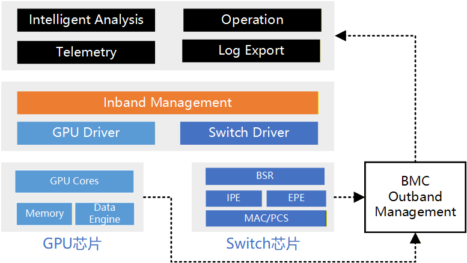

# RAS体系

<!-- - 硬件层：链路健康监控、ECC、重传/重路由策略。
- 软件层：心跳、租户隔离、流控保护。
- 观测与告警：Telemetry 数据采集、日志与追踪、SLO/SLA。
- 维修与演练：故障注入、滚动升级、降级策略。 -->

## 引言

在超节点系统不断向更高性能、更大规模演进的过程中，软件、硬件与网络互联技术的持续创新正在不断拓展系统设计的帕累托最优边界。然而，与性能与效率指标不同，RAS（Reliability, Availability, Serviceability，可靠性、可用性与可服务性）始终构成系统设计中的核心约束之一。一个在性能或成本上具有优势的方案，若无法满足基本的 RAS 要求，将难以在实际生产环境中落地。因此，超节点系统设计不仅需要追求性能-成本的最优解，更需要在满足既定 RAS 阈值的前提下，对方案空间进行约束与筛选，从而排除那些在可靠性或可运维性方面不可接受的设计。这种“以 RAS 为底线”的设计原则，是构建大规模、长时间稳定运行计算基础设施的前提。

本章节围绕超节点系统中的 RAS 设计展开，采用自底向上的结构进行系统性梳理。首先，在硬件层面，我们将从芯片、网络以及服务器整机三个维度，分析其所提供的 RAS 能力，包括错误检测与纠正机制、故障隔离与恢复能力，以及向上层软件暴露的关键运行信号与遥测信息。同时，也将介绍各类硬件组件自身所采用的 RAS 设计方案及其局限性。在软件层面，本章节进一步讨论操作系统、设备驱动以及训练与推理系统在 RAS 方面的机制设计，重点关注软硬件协同下的故障感知、容错与恢复能力，以及如何利用底层信号实现系统级的高可用。
此外，本章节还将总结来自业界主流厂商的典型 RAS 最佳实践与实际案例，展示在真实生产环境中如何构建具备高可靠性与高可服务性的超节点系统。在此基础上，我们也将讨论当前超节点 RAS 设计中仍然存在的关键挑战与开放问题，为后续研究与工程实践提供参考方向。

## 概述

#### 一、超节点的RAS保障机制

在超节点的训练推理任务中，RAS 是 Reliability、Availability 与 Serviceability 的缩写，分别对应可靠性、可用性与可维护性。该概念最早来源于高性能计算系统与企业级服务器架构设计，用于衡量系统在长时间、大规模运行条件下的稳定性与运维能力。在 AI/ML 大规模训练场景中，RAS 的重要性被显著放大。一方面，单次训练任务往往持续数天甚至数周，属于长生命周期计算负载；另一方面，训练规模通常扩展至数百乃至数千 GPU 节点，并依赖强同步的数据并行或模型并行机制。在这种结构下，单个节点、单张 GPU、网络链路或软件组件的异常，都可能导致全局同步阻塞甚至训练任务整体失败，进而造成进度丢失与算力成本浪费。因此，在分布式训练环境中，RAS 不仅是系统设计目标，更直接影响训练效率、集群利用率与总体成本。

从定义上看，可靠性是指系统在给定运行条件下、在规定时间区间内无故障运行的能力。通常通过平均无故障时间（MTTF）或故障率来衡量。可靠性越高，系统发生崩溃、硬件错误或异常中断的概率越低。在分布式训练场景中，需要特别注意规模效应。当集群规模扩展至 N 个相对独立的节点时，系统级故障发生频率会随规模增加而上升，这意味着即使单节点可靠性较高，在超大规模部署时整体系统仍然面临更频繁的中断风险。可用性是指系统在需要时处于可运行状态的比例，在分布式训练环境中，可用性不仅取决于硬件可靠性，还取决于故障检测机制、自动恢复能力以及是否支持局部失败而非全局失败。例如，是否支持快速重启与状态恢复，是否具备弹性扩缩容能力，都会直接影响实际可用性表现。可维护性强调系统便于诊断、修复和维护的程度。它通常体现在平均故障定位时间、日志完整性、监控精度以及是否具备自动化根因分析能力。缺乏可观测性和诊断工具时，问题定位可能需要跨团队协作并消耗大量时间，从而显著降低系统整体可用性。

为了更准确地评估分布式训练环境中的 RAS 状态，需要引入与训练语义紧密相关的指标：

* **Effective Training Time Ratio（ETTR）.** 定义为一次训练任务中实际用于有效计算的时间与总墙钟时间之比。ETTR 可以刻画由于故障恢复、通信阻塞、资源争用或性能退化带来的时间损耗，是反映训练效率的核心指标。
* **Goodput.** 衡量单位时间内系统实际完成的有效训练工作量，与理论峰值吞吐相比，Goodput 更能反映真实运行效率，因为它综合考虑了同步等待、负载不均衡和隐性退化等因素。
* **Mean Time To Failure（MTTF）.** 即观测时间窗口内系统运行总时间与故障次数之比，其倒数为故障率。对于集群级评估，还可进一步区分节点级 MTTF 与作业级 MTTF，以反映规模放大效应。

训练和推理过程中的RAS 保障机制主要基于周期性 checkpoint，即定期保存模型参数、优化器状态以及训练进度信息，在发生故障时通过重启并回滚至最近检查点继续训练。这种机制实现简单且通用，但存在明显局限。首先，回滚会导致最近一个 checkpoint 之后的计算结果全部失效，造成算力浪费。其次，checkpoint 机制属于被动恢复策略，无法避免同一根因问题的重复发生。此外，对于灰色故障场景，传统 checkpoint 难以及时发挥作用。灰色故障通常表现为训练未显式崩溃，但出现卡顿或性能严重退化，例如某次 ReduceScatter 操作阻塞、部分 GPU 或 RDMA NIC 处于异常但未触发硬错误状态，导致算力空转。在此情况下，GPU 或网络设备可能保持上电但不产生有效计算，直到人工排查或超时机制触发重启。这类问题往往显著降低 ETTR 与 Goodput，却难以通过简单的失败检测机制发现。同样，由通信拥塞、重传放大或负载不均衡引起的慢速退化问题，也难以仅依赖 checkpoint 机制解决。

因此，分布式训练下 RAS 水平的关键不在于单纯增强被动的错误恢复能力，而在于构建更强的系统级可观测性与跨层关联能力。具体而言，需要在硬件、驱动、操作系统、通信运行时、训练框架以及调度系统等多个层级采集高精度指标与事件，并通过统一的时间对齐机制进行关联分析。通过对硬件错误计数、通信延迟分布、算子执行时间、调度排队状态等信息进行联合建模，才能实现更准确的根因分析与异常检测。同时，可观测机制本身必须满足低开销与低侵入性要求。在大规模训练环境中，任何额外的监控开销都可能影响性能；观测系统应尽量避免修改训练框架或应用代码，并能够与现有监控体系进行高效集成，例如与主流指标采集与告警系统对接。只有在保证训练性能和开发效率不受明显影响的前提下，构建统一、细粒度且跨层的观测与分析体系，才能真正提升分布式训练的 RAS 能力。

#### 二、超节点的RAS可观测指标

超节点作为分布式训练的基础设施，可以分为多个层级：包括硬件层（GPU、CPU、RDMA NIC 等）、系统软件层（GPU 驱动、操作系统、通信运行时 如 NCCL）、分布式训练框架层（如 PyTorch）、应用层（具体模型与训练任务）以及调度器层（如 Slurm 或 Kubernetes）。这些层级之间存在紧密耦合关系，任何单层异常都可能通过系统级联放大为全局性能退化甚至任务失败。因此，提升 RAS 的前提是建立跨层可观测体系，对各层关键指标与异常事件进行持续采集与分析，并构建统一的时间对齐与因果关联机制。下面给出各层关键观测指标与常用工具。

|          层级           |                   主要工具                   |                         关键观测指标                         |             RAS相关意义              |                        eBPF是否可观测                        |
| :---------------------: | :------------------------------------------: | :----------------------------------------------------------: | :----------------------------------: | :----------------------------------------------------------: |
|           GPU           | DCGM, CUPTI, Nsight Systems / Nsight Compute | SM 利用率、Tensor Core 利用率、显存占用率、Kernel 执行时间、ECC 错误计数、Xid 错误、PCIe/NVLink 计数、温度与功耗 | 识别计算瓶颈、硬件异常、热稳定性问题 | 部分可行（需结合厂商工具或用户态代理；eBPF 可观测驱动 ioctl、调度事件，但无法直接读取 GPU 内部计数器） |
|           CPU           |                  perf, sar                   | IPC、cycles、instructions、cache miss ratio、context switch 次数、runqueue length、NUMA 远程访问比例 |        判断调度瓶颈与资源争用        | 可行（可通过 perf_event 与 eBPF 结合，或 tracepoint/kprobe 观测调度事件） |
|       RDMA / 网络       |    rdma-tool, perfquery, ethtool, ibstat     | QP 状态变化、重传次数、RNR NAK、PFC pause 帧、ECN 标记比例、RDMA 延迟分布、链路错误 |          识别通信拥塞与丢包          | 部分可行（可观测内核 RDMA 子系统与网络栈事件，但硬件级计数器需厂商工具） |
|     操作系统 / 驱动     |       /proc, /sys, dmesg, eBPF, iostat       | 调度延迟、软中断时间、I/O 等待时间、页错误率、OOM 事件、IRQ 延迟、驱动错误日志 |        判断系统抖动与驱动异常        | 可行（eBPF 原生优势领域，可挂载 tracepoint/kprobe 进行细粒度观测） |
| 通信 Runtime（如 NCCL） |          NCCL debug 日志、框架插桩           | AllReduce/ReduceScatter 耗时分布、timeout 次数、rank 间耗时差异、异步错误 |        识别通信长尾与灰色故障        |    可行（可通过 uprobe 对用户态函数插桩，实现非侵入观测）    |
| 训练框架（如 PyTorch）  |           PyTorch Profiler, Kineto           | 算子执行时间、CUDA stream 同步时间、显存峰值、DataLoader 延迟 |      定位算子瓶颈与数据加载问题      |             可行（可通过 uprobe 对关键 API 插桩)             |
|     应用层（模型）      |                自定义指标导出                |          tokens/sec、step time、loss 曲线、梯度统计          |           衡量真实训练效率           |  可行（可观测进程行为与 I/O，但语义指标通常需应用主动暴露）  |
|        调度器层         |          Slurm/K8s API, Prometheus           | job 状态变迁、失败次数、队列等待时间、资源利用率、集群Goodput |        评估集群整体 RAS 水平         | 可行（可观测系统调用与容器生命周期事件；调度语义需 API 集成） |

当前面临的核心挑战并不在于单层指标采集能力，而在于如何将这些跨层指标进行时间对齐与因果关联。例如，一次 AllReduce 操作耗时异常，可能源于 GPU kernel 执行抖动，也可能源于 RDMA 传输拥塞，甚至可能由 CPU 调度延迟导致通信线程未及时推进。若缺乏统一的跨层观测视图，运维系统只能看到“通信变慢”的表层现象，而无法判断根因所在。因此，提升 RAS 的关键在于构建自底向上的全局事件视图，将硬件计数器、操作系统事件、通信状态与训练语义进行关联分析。只有实现跨层事件融合与统一时间线重建，才能有效识别灰色故障、性能长尾与隐性退化问题，从而提升 ETTR 与 Goodput，并降低系统级 MTTR。

## 硬件为中心的RAS系统

### 芯片RAS

**芯片级 RAS** 指在芯片内部通过硬件机制实现的可靠性、可用性和可维护性能力，其目标是在系统运行过程中及时发现、校正并处理各类硬件异常，从而降低故障对整体系统稳定性的影响。为实现这一目标，芯片内部各类存储单元与通信模块通常集成完备的错误检测、校正与处理机制。其中，错误检测通过奇偶校验、循环冗余校验（CRC）、纠错码（ECC）或状态机监控等技术及时识别异常行为；错误校正机制提供自动修复能力，例如通过 ECC 纠正单比特错误或触发重传机制恢复丢失数据；在检测到异常后，错误处理机制按照预定义的故障响应流程执行相应操作，包括告警上报、故障模块隔离、冗余路径切换、安全降级操作以及系统级恢复策略，以确保故障不会扩散并影响整体系统稳定性。同时，系统还具备日志记录与访问能力，所有故障事件都会生成结构化事件日志，记录时间戳、错误类型、错误定位、触发条件及处理动作等关键信息，并可通过带内或带外管理通道进行访问，以支持后续的系统诊断与运维分析。

芯片级 RAS 关键技术涵盖计算核心、存储子系统、通信链路以及电源与热管理等多个方面，通过多层次的可靠性设计提升芯片在复杂运行环境下的稳定性与可维护性。

在计算核心 RAS方面，系统通过多种机制保证计算单元的持续可用性。计算核心冗余设计允许在检测到计算核心故障时自动启用备用核心，实现计算能力的无缝迁移与恢复；动态核心禁用机制在系统初始化阶段通过故障检测识别存在缺陷的计算核心，并对其进行隔离，从而避免潜在问题影响系统稳定性与可靠性。同时，系统还具备错误传播阻断能力，当检测到错误数据时会对相关数据块进行标记和隔离，防止污染后续计算，并在错误传播路径上设置屏障，阻止错误数据流向其他计算单元。

在显存 RAS方面，系统通过多种技术保障数据完整性和存储可靠性。ECC（Error Correcting Code）是显存可靠性的重要基础，可实现单比特错误纠正、双比特错误检测（SECDED），更高级的 ECC 算法还可进一步提升显存可靠性和可用性。行重映射（Row Remapping）技术在系统启动时由 GPU 执行自检，当 HBM 内存检测到坏块时，可自动将故障行映射到备用行，无需重启 GPU，从而降低 HBM 显存故障率。与此同时，Patrol Scrubbing（内存巡检）机制会在系统后台周期性扫描内存，并利用 ECC 自动纠正软错误，与传统内存错误检测方式相比，该技术能够提前发现并修复潜在错误，从而显著提升数据完整性。

在链路与协议保护方面，系统通过多层通信可靠性机制保障数据传输稳定。错误检测与纠正机制使用 CRC（ECRC）和 FEC 技术对数据进行校验和纠错，确保数据传输可靠性；链路自愈能力通过链路重训练（Link Retraining）以及自动重传机制实现链路的快速恢复，从而保障高速互连链路的持续可用；同时系统还具备智能诊断与预测能力，可精确报告错误类型并提供详细的错误信息，用于系统级故障诊断，从而提升整体可服务性。

**行业实证：NVIDIA Blackwell RAS Engine。** Blackwell 架构首次引入了专用的 AI 驱动 RAS Engine——一个嵌入芯片内部的专用微控制器，可在 GPU 运行时持续对数千个 SRAM 区域与寄存器文件执行预测性扫描与诊断。与传统"发现错误 → 报告 → 纠正"的被动模式不同，Blackwell RAS Engine 通过对历史错误模式进行建模，在硬件劣化导致不可纠正错误（UE）之前即触发预防性维护——例如将可疑 SRAM Bank 映射到备用资源、或主动隔离劣化互联通道。这一实践标志着芯片级 RAS 从"被动纠错"向"主动预防"的范式转变，为超节点集群的预测性运维提供了硬件基础。对于超大规模（数千 GPU）的超节点部署而言，当集群级 MTTF 因规模效应而大幅缩短时，芯片内置的预测性 RAS 能力将成为保障 ETTR 与 Goodput 的关键第一道防线[^ras-blackwell-ras].

在电源与热管理方面，系统通过实时监控和保护机制保障芯片运行安全。芯片能够实时监控并获取电压、电流、功耗及温度等关键参数，并通过标准接口上报至系统管理单元，为系统级监控、功耗优化以及热管理策略提供精准数据支持。同时系统具备完整的电源保护机制，包括 OCP（过流保护）、OVP（过压保护）以及 UVP（欠压保护），以防止供电异常导致芯片损坏或系统宕机。系统同时采用智能温控策略，当芯片温度达到保护阈值时自动触发降频机制，而当温度达到最大阈值时则会执行自动关机，从而保护芯片及系统硬件的安全。此外，系统支持带内或带外的错误注入验证机制，用于验证 RAS 相关功能和故障处理机制的有效性。

### 网络RAS

**网络 RAS** 关注数据中心互连网络在大规模运行环境下的可靠性、可用性和可维护性，通过链路级可靠性、系统级故障处理、网络可观测性以及光电融合 RAS 等多层机制，实现对网络故障的快速检测、隔离和恢复，从而在链路异常、设备故障或流量突发情况下维持网络连通性，并为系统级诊断与运维提供精确的运行状态数据，保障集群通信的稳定性。

/// caption
图 2: 网络RAS示意图
///
链路级可靠性是网络 RAS 的基础，旨在保证数据传输本身的正确性与连续性。高性能交换芯片和互联链路采用端到端循环冗余校验（ECRC）进行错误检测，同时配合基于 ACK/NACK 的链路级重传（LLR）机制，实现错误数据自动重传。多通路 Lane Reduce 设计和基于单通道故障的动态降级（Dynamic Lane Downgrade）机制进一步提升链路容错能力，使单通道异常不会影响整个链路的稳定性，从而保证节点间数据传输的高可靠性。

在链路或交换设备发生异常时，互联子系统级 RAS 能够提供系统级故障响应和隔离能力。通过高级错误报告（AER）机制，交换芯片能够准确识别和上报错误类型；下游端口隔离（DPC）防止故障扩散至其他链路或设备；链路带宽降级与动态管理策略在链路异常时及时调整流量分配；Completion Timeout（CTO）错误处理机制确保任务不会因链路异常长时间阻塞。子系统级故障处理确保网络能够在节点或链路出现问题时保持连通性和业务连续性。

网络可观测性是实现高可用网络的关键环节。现代交换芯片提供丰富的 Telemetry 数据，从平台到转发面多个维度实现实时监控。平台级监控包括交换芯片结温、电压、供电状态、光模块诊断信息，以及 CPU、DDR 内存和 Flash 存储使用率。交换机转发面业务级监控覆盖端口状态（UP/Down、速率、FEC 模式）、流量控制（FC/PFC）、MAC 统计信息，以及基于报文路径、端口和流的详细统计，包括 Packet/Byte Counter、TTL、Latency、Jitter、Discard Reason、Ingress/Egress Port、Flow 特征字段、Buffer Water Mark等。此外，系统可对微突发流量（Micro Burst）和大流量（Elephant Flow）进行实时检测与上报，实现流量异常的精细化可视化。高精度带内遥测（In-band Telemetry，INT）技术，如 CSIG 端到端可视化，实现链路级、路径级的纳秒级微突发捕获和瓶颈状态感知。CSIG 标签可插入链路层帧头的最后一个位置，提供常规 4 字节格式和扩展 8 字节格式，其中 4 字节格式兼容 VLAN-tag 交换机。该机制不仅可以实时监控转发路径和链路性能，还能为后续的流量优化、拥塞控制及链路故障诊断提供精确数据。

在大规模集群中，光模块、Retimer 及跨板铜缆构成的物理链路是网络故障的高风险区域。光电融合 RAS 通过光链路健康监控、误码率（BER）预警与劣化隔离，增强网络鲁棒性。网络 RAS 系统会持续采集光模块的发射光功率（Tx Power）、接收光功率（Rx Power）、温度、偏置电流等关键模拟参数，并对 Pre-FEC 与 Post-FEC BER 进行趋势分析。当 Pre-FEC BER 接近安全阈值且出现不可纠正趋势时，系统提前触发告警，并配合控制面启动流量排空与链路预隔离操作，从而在故障发生前主动应对，避免链路彻底失效才被动恢复。这种预测性机制不仅提升了链路弹性，还显著降低了因物理退化或流量突发导致的网络性能下降风险。 

### 服务器 RAS

在传统服务器领域，RAS 是衡量设备持续运行、抗故障、易维护能力的核心指标体系。下文首先介绍单节点服务器的 RAS 保障，然后再扩展到超节点服务器机柜的 RAS 支持。

#### 单节点服务器 RAS

**单节点可靠性（Reliability）。** 保障单节点可靠性一般首先从硬件设计和供应链物料选型着手，涵盖元器件与硬件可靠性、信号 / 链路传输可靠性、电源供电可靠性、散热系统可靠性以及关键部件容错能力等方面，通常通过采用企业级 CPU、低温飘电容、高可靠性长寿命存储磁盘或 SSD 等企业级规格元器件，选用支持 ECC 的内存等；电源设计时引入过流 / 过压、过温保护，采用高 Margin 电源方案；散热方面支持冗余风扇、智能 PID 调速的闭环温控措施；对关键信号选择差分布线或包地线等抗干扰手段来实现。

**单节点可用性（Availability）。** 保障单节点可用性的典型方法以冗余设计为主，辅以设备协议层自愈能力。硬件冗余（如 N+1 或 N+N 电源、N+X 风扇、构建 RAID 存储阵列、双网卡绑定）；通过 CPU / 内存分区和坏块屏蔽实现故障隔离，利用内存 sparing 自动替换坏页及 PCIe 链路 retrain 实现自愈，以及多节点冗余技术来保障分布式系统的高可用，确保业务持续稳定运行。

**单节点可服务性（Serviceability）。** 保障单节点可服务性主要经由故障精准诊断、远程管理与监控、故障日志与回溯、易维护易更换以及现场快速修复等实现。整机工程设计方案中支持热插拔的硬盘 / 电源 / 风扇 / PCIe 卡（部分平台甚至支持内存热插拔）是快速修复的必要前提。通过 BMC / IPMI、Redfish、KVM over IP 等带外管理方式，配合 UID 灯、故障定位灯及硬盘、电源、风扇状态灯等故障指示手段，借助 SEL 系统事件日志、硬件错误追踪实现故障记录与回溯，基于免工具拆装、前置维护、线缆理线优化等设计提升运维与修复的效率。随着服务器功耗的不断升高，降低数据中心和机房 PUE 的要求越来越紧迫，相应的液冷服务器市场占比越来越高，冷却液接口喷溅泄露、机内漏液、冷却液温度管理等的预防、检测和及时告警也是维护系统安全可靠、稳定运行的关键重要事项。

#### 超节点 RAS 支持

超节点作为 AI 场景下训练和推理的核心高价值资产，物理上包含了关键的计算服务器，还包含各类核心交换设备、存储设备、高速互联总线、机柜、液冷系统、以及上层运维监控、算力调度软件系统等。超节点一般是以机柜为单位实现芯片级全域高速互联、算力 / 内存 / 存储池化为目标，涉及多维度不同产品的融合、异构共生、系统软件协作，难度和复杂度均远超传统单台服务器或通用计算集群的要求。

机柜级紧耦合全互联的 Scale-Up 算力池化系统的 RAS 设计除常规物理冗余、温度监管、功耗监控、物理互联可靠和易维护之外，还要围绕紧耦合、高密度、异构化、训推一体化的核心特性展开，目标缩减单点故障的影响面、保障业务连续性。

从系统工程与大规模 AI 训推实践角度出发分析，超节点的 RAS 前提是建立在可靠的物理单元设备的基础之上，须优先从物理底层消除高密度部署带来的基础设施故障风险，同时叠加超节点管理软件栈的平台系统来综合实现。具体包含（1）模块化与热插拔和（2）监控与遥测两个方面的内容。

**模块化与热插拔。** 模块化设计通过将计算、互联、供电与散热等功能解耦为标准化单元，使系统能够以“积木式”方式进行构建与扩展，从而在高密度部署条件下实现灵活扩展与故障隔离。在具体实现上，计算模块通常以集成 CPU / GPU / NPU、内存与本地存储的一体化托盘形式存在，或由多个托盘组合形成统一算力池；互联模块则包括 NVSwitch、IB / RoCE、灵衢 / UB 等高速交换单元，可独立部署，并根据工程目标选择全互联、交换式或其他拓扑结构，常见实现方式包括正交互联、Cable 直连及 Cable Tray；散热模块同时支持风冷与液冷方案，其中风冷采用分区冗余风扇与智能调速（至少 N+1 冗余），液冷则由冷板、CDU 及快接管路构成，并具备防泄漏能力，同时通过散热单元模块化降低故障扩散风险；供电模块包括机柜级冗余电源（1+1 或 2N）、支持 Redfish / IPMI 接入的 Powershelf 供电模组，以及支持 PMBus 监控并具备过压、过流与掉电保持能力的单机 PSU；监控与管理模块则由机柜级 RMC 与单机 BMC 组成，并结合集中运维平台实现统一管理。

在此基础上，系统通过标准化 FRU（现场可更换单元）设计支持热插拔与在线维护能力，使 GPU / AI 芯片模块、电源、风扇、液冷模块及互联交换模块等关键部件能够在不中断系统运行的前提下完成更换，单部件更换时间通常可控制在分钟级以内；对于液冷节点，还可支持电、网、液三总线一体化盲插，无需精确对准即可完成快速对接。同时，通过轻量化工程设计，将单个热插拔模块重量控制在 20–30 kg 范围内，使单人即可完成维护操作。

针对液冷系统的在线维护，还需进一步考虑运行安全性与系统连续性，例如通过支持带压插拔的快接头实现节点更换过程中的冷却液零泄漏，并结合分液歧管隔离阀设计，在单节点维护时不影响整体循环系统运行；同时，液冷快接接口与机柜结构协同设计，以避免插拔过程中的喷溅风险。

**监控与遥测。** 在监控体系上，超节点构建了从单节点到机柜级再到统一平台的分层架构，并通过细粒度遥测数据实现对系统状态的全面感知与分析。在单节点层面，依托 BMC 对 GPU、CPU、内存、网卡、磁盘与风扇等关键部件进行全覆盖监控，并支持一键日志收集与故障信息聚合，从而实现快速定位故障根因；在机柜层面，通过独立的 RMC 模块实现统一管理，涵盖资产管理（自动 U 位识别与资产信息上报）、环境监控（温湿度、烟雾、水浸传感器接入）、电源管理（机柜级功耗监控与分配）以及液冷系统的运行守护（包括漏液监控与告警、流量监测及泵组控制）。

在更高层面，超节点健康监测平台对来自各层级的数据进行整合，形成从物理层（芯片温度、电压、光模块功率、链路误码率）、链路层（带宽、延迟、丢包率）、系统层（资源利用率、固件版本）到业务层（训练与推理任务进度、精度变化）的全链路可观测能力，使故障能够精确定位到芯片、链路或核心计算单元。在此基础上，系统构建“告警—定位—根因分析—修复—验证”的闭环自动化运维体系，对常见故障实现自动修复，减少人工干预；同时，对关键部件进行全生命周期数字化管理，包括运行状态监测、老化与寿命预测、预测性维护以及退役管理，通过对历史数据的持久化存储（通常不少于 90 天），支持问题回溯与趋势分析，从而将运维模式由被动响应转变为主动预防。

#### 超节点故障恢复

在超节点系统中，最核心的风险之一是单点故障引发的级联扩散效应，因此需要从通信、系统与资源调度等多个层面构建分层次的故障恢复机制，以在高密度、强耦合环境下保障端到端业务连续性。

在通信平面，系统通过多级容错机制提升互联可靠性与故障隔离能力，包括在链路层引入前向纠错（FEC）、逐包校验与动态路由能力，在链路发生异常时自动绕行或切换，避免单链路故障导致全局通信中断；在采用光互连的场景中，可通过单 Lane 故障降级运行或单激光器失效降级机制维持通信能力（具体实现依赖硬件平台能力，此部分描述可请光互联厂商介入给予建议）；在计算与通信协同层面，通过多卡通信状态同步与异常检测，在发生故障时重新触发通信子流程，从而恢复分布式执行（此部分描述可请 GPU 厂商介入给予建议）。

在系统恢复层面，超节点通常提供多级快速恢复能力，以实现不同粒度的故障隔离与修复，包括容器级基于镜像的快速重建、进程级的独立重启与状态恢复、资源单元级（如 Pod 或节点组）的快速重建，以及作业级的整体恢复与训练进程接续。这种分层恢复机制能够将故障影响限制在最小范围，避免不必要的全局中断。

针对长时间运行的大模型训练任务，断点续训（checkpoint / restore）机制是减少算力损失的关键手段。通过细粒度的迭代级 checkpoint、训练状态的实时或周期性持久化、多副本存储与一致性校验，可以在任务中断后快速恢复执行进度，但在实际部署中需要在 checkpoint 频率与训练性能开销之间进行权衡，以避免对整体效率造成显著影响。

在资源与调度层面，结合资源池化与弹性调度能力，系统可以在故障发生或负载波动时动态调整算力、内存、网络与存储资源分配，通过虚拟切分与弹性扩缩容实现资源的快速重构与复用，在保障高优先级业务服务质量的同时，提高整体资源利用率，并进一步增强系统在异常情况下的自适应恢复能力。

#### 服务器 RAS 小结

超节点作为 AI 算力资源宝贵生产力，节点业务的连续性异常重要和关键。故障发生后，其关键业务节点故障平均恢复时长 MTTR 建议一般不超过 30 分钟。

超节点 RAS 设计应聚焦 “高密度紧耦合全互联” 的架构本质，构建多层纵深 RAS 体系，保障大规模训推任务的业务连续性、算力可用性与运维高效性。

一般性原则为基于 “硬件级 RAS 增强 + 软件栈容错优化” 的软硬协同设计。硬件面强化高速互联容错、基础设施冗余；维护层面采用模块化热插拔设计、全链路细粒度可观测、自动化运维闭环，降低高密度超节点的运维复杂度，保障大规模集群基础设施的运维需求；软件层面优化训推任务容错、断点续训、资源动态调度，实现 RAS 能力全栈覆盖。

最后，从未来发展趋势来看，超节点 RAS 需求是多维并不断发展的，已不仅仅局限于关注核心硬件资源、算力调度系统和运维监控管理系统的发现和解决问题，正逐渐从 “被动应对问题” 变成 “主动预判问题、动态适配需求、自动解决问题”，趋向实现更高级别的自动化运维中心，以支撑未来大规模训推任务的业务连续性。

## 软件为中心的 RAS 系统

### 基础软件RAS

#### OS-level RAS

**Checkpoint /Restore 在 AI 系统 RAS 中的作用。** Checkpoint / Restore（C/R）是一种提升系统可靠性（Reliability）、可用性（Availability）与可维护性（Serviceability，RAS）的重要技术手段。其基本思想是在程序运行过程中周期性地保存执行状态，当系统发生故障时，可以从最近一次保存的状态恢复执行，从而避免从头开始重新计算。在 AI 计算基础设施中，C/R 已经成为支撑训练与推理系统稳定运行的重要机制:

1. 在大规模模型训练场景中，checkpoint 主要用于周期性保存模型参数、优化器状态以及训练进度。当训练任务因节点故障、网络问题或系统维护被中断时，可以从最近一次 checkpoint 恢复执行，避免长时间训练任务的计算成果丢失，从而显著降低训练成本并提升系统可靠性。
2. 在推理服务场景中，C/R 则可以支持更加灵活的服务管理能力。例如，在云环境中可以利用 checkpoint 技术实现推理服务的快速迁移、弹性扩缩容以及故障恢复；在 serverless AI 服务场景下，通过恢复预初始化的模型执行状态，可以显著减少冷启动延迟，从而提升服务响应速度与资源利用效率。 

**为什么需要在 OS 层面支持 C/R。** 目前，C/R 机制既可以在操作系统层实现，也可以通过用户态工具实现。例如，NVIDIA 提供的 **cuda-checkpoint** 工具就是一种用户态实现方式。该工具通过 CUDA Runtime API 提供的能力保存 GPU 相关执行状态，并在恢复时重新创建 GPU context 并恢复设备内存，从而实现 CUDA 应用的状态保存与恢复。然而，仅依赖用户态机制实现高效且正确的故障恢复存在挑战：AI 工作负载的优化空间极为复杂，并且随着模型规模与训练框架的演进不断变化，使得在用户态框架中实现高效的容错机制变得十分困难。例如，当前主流的大模型训练框架 Megatron 已经集成了多种并发 checkpoint 优化技术，而相关代码规模已经占据框架代码库的重要部分。同时，许多新兴训练框架（例如强化学习训练框架）仍然缺乏成熟的容错机制支持。这意味着每个框架都需要独立实现并持续维护自己的 checkpoint 优化逻辑，增加了开发和维护成本。

相比之下，在操作系统层面提供统一的 C/R 支持可以显著降低开发负担。OS-level C/R 能够对应用框架保持透明，无需开发者显式实现复杂的故障恢复机制，也无需针对不同框架进行重复开发。此外，操作系统级支持还能够为更高级的系统功能提供基础能力，例如云环境中的快速实例迁移、弹性资源管理以及 serverless AI 服务中的快速启动等。因此，从系统基础设施的角度来看，在 OS 层提供通用且高效的 cC/R 机制具有不可替代的价值。

**实现GPU C/R 的挑战。** 对于 CPU 程序而言，操作系统能够对程序执行状态进行较为完整的控制与观测。例如，操作系统可以直接访问和保存 CPU 寄存器状态、虚拟内存映射以及进程调度信息，并通过页表与 page fault 机制追踪内存访问状态。此外，操作系统内部许多机制本身就与 CPU 执行模型深度结合，例如 RCU（Read-Copy-Update）, Read-Copy-Write 等机制。这些能力使得操作系统可以通过已有机制较为完整地追踪进程的控制状态和数据状态，从而实现可靠的 C/R。

相比之下，GPU 对操作系统而言更接近一个“黑盒设备”。应用程序通常需要通过厂商提供的 API（例如 CUDA）与 GPU 交互，而操作系统本身并不直接管理 GPU 内部执行状态。应用程序可以向 GPU 提交复杂的 kernel 进行异步执行，这些 kernel 可能在 GPU 上进行大量计算并访问 GPU 设备内存。此外，CPU 与 GPU 之间还存在复杂的数据交换与通信机制，例如 PCIe 或 NVLink 数据传输等机制。因此，在实现 GPU 的 C/R 时，不仅需要考虑 CPU 侧的进程状态，还必须处理 GPU 设备内存、GPU kernel 执行状态以及 CPU–GPU 之间的数据一致性问题。这些因素都显著增加了 GPU C/R 的实现复杂度。

**基础的GPU C/R 和 并发GPU C/R。** 一种直接的实现方式是在进行 checkpoint 时暂停应用程序执行，然后复制所有相关执行状态。例如，一些现有工具（如 cuda-checkpoint）通常采用如下流程：当系统需要创建 checkpoint 时，首先暂停 CPU 进程执行，同时等待 GPU 上所有正在执行的 kernel 以及相关通信操作完成，从而使系统进入一个稳定状态。随后，系统将 CPU 侧内存状态以及 GPU 设备内存中的数据复制到 checkpoint 存储中。在恢复阶段，系统首先重新加载 CPU 内存数据与 GPU 设备内存数据，然后重新创建 GPU context 并恢复控制状态，最终使程序继续执行。

然而，这种“停止-复制-恢复”的方式会带来较大的性能开销。首先，在 checkpoint 阶段需要等待 GPU kernel 执行完成并进行大规模数据复制，这可能导致较长时间的 GPU stall。其次，在恢复阶段重新创建 GPU context 以及重新加载大量 GPU 内存数据也会带来显著的启动延迟。对于 GPU 资源利用率较高的 AI 训练或推理任务而言，这种停顿会对整体系统性能产生明显影响。

为了降低 checkpoint 带来的停顿开销，近年来研究开始探索 并发 C/R 机制。所谓并发 C/R，是指在应用程序仍然运行的情况下完成 checkpoint 操作，或者在恢复过程中允许应用程序与数据恢复过程并行执行。通过并发机制，系统可以在后台逐步保存程序状态，从而避免长时间暂停 GPU 执行。同时，在恢复阶段也可以在应用继续执行的同时逐步加载所需数据，从而显著降低恢复延迟。随着 AI 工作负载规模的不断增长，并发式 OS-level C/R 正逐渐成为提升系统可用性的重要技术方向。

**代表性的研究工作。** 近年来，学术界与工业界提出了多种面向 GPU 应用的 C/R 系统:

* Singularity[^ras-singularity] 通过设备代理（Device Proxy）架构实现了 OS 级 GPU C/R。该系统利用 LD_PRELOAD 拦截 GPU API 调用，并将其转发到独立地址空间中的代理进程，使主机进程保持相对“干净”的状态。这样可以直接使用 CRIU 工具对 CPU 进程状态进行标准快照，同时通过虚拟化 GPU 句柄以及 API 重放机制恢复 GPU 状态。相比传统的停止重启方式，Singularity 能够实现 work-conserving 恢复，使任务能够从精确的中断点继续执行而无需重新初始化或重复计算。此外，该系统还通过分布式屏障保证一致性，并利用内容去重、副本拼接（Replica Splicing）以及操作压缩（Squashing）等技术显著降低了 checkpoint 的存储开销与显存切换延迟。

* gCROP[^ras-gcrop] 系统通过引入 GPU Restore Server，实现了 CPU 与 GPU 状态恢复过程的并行化，从而打破了传统工具串行恢复的限制。该系统利用 gmmap 技术实现 GPU 显存的按需加载，并结合基于 profiling 的预取机制，使 GPU 计算能够与数据恢复过程并行执行。同时，gCROP 还提出了多级 checkpoint 去重技术以减少镜像存储开销。通过这些优化，该系统能够将大型 GPU 应用的冷启动延迟从秒级降低到 100ms 以内。

* PhoenixOS (PHOS)[^ras-phoenixos] 指出，在 OS 层实现并发 GPU C/R 的核心挑战在于 GPU 缺乏类似 CPU 内存管理中的硬件脏页位（dirty bits），这使得系统难以准确追踪 GPU 内存的修改状态。为了解决这一问题，PHOS 通过 LD_PRELOAD 拦截 GPU API，并结合验证预测（Validated Speculation）、二进制插桩（Binary Instrumentation）、软写时复制（Soft Copy-on-Write）、软重传（Soft Recopy）以及按需恢复（On-demand Restore）等机制，实现了对 GPU 内存修改状态的高效追踪，从而显著降低了传统 C/R 方法带来的应用停顿开销。

* Gemini[^ras-gemini] 系统则主要关注 checkpoint 的存储与传输效率问题。该系统在操作系统层面引入内存级 checkpoint，并提出接近最优的 checkpoint 放置策略，以最大化副本可用性。同时，通过通信流调度算法将 checkpoint 数据传输隐藏在训练任务的网络空闲阶段，从而减少对训练性能的影响。Gemini 能够实现亚秒级的 checkpoint 检索速度，并支持接近每轮训练迭代一次的高频 checkpoint。与前述工作相比，该系统主要优化 checkpoint 的存储与获取效率，与 GPU 执行状态管理等技术方向形成互补关系。

#### 基于eBPF的全栈可观测技术

eBPF 是一种源自 Linux 内核的可扩展机制，允许在不修改内核源码、不重启系统的情况下，动态加载并运行经过验证的用户自定义程序。其核心设计目标是在保证安全性的前提下，为内核和用户态程序提供高性能、低开销的可观测与可扩展能力。eBPF 程序通常使用 C 语言编写，经 LLVM 编译为 eBPF 字节码后加载至内核。加载阶段会经过内核验证器的严格检查，包括内存安全、边界检查、执行路径有界性等验证，确保程序不会破坏系统稳定性。验证通过后，eBPF 程序可被附加到多种挂载点，例如 tracepoint、kprobe、uprobe、或网络数据路径，并以事件驱动方式执行。与传统内核模块相比，eBPF 具有显著优势。首先，它无需修改内核源码或重新编译内核，具备高度非侵入性。其次，程序运行在受限执行环境中，具备强安全保证。再次，借助内核 JIT 编译机制，eBPF 程序可以接近原生代码性能运行。因此，eBPF 在现代 Linux 可观测性体系中逐渐成为核心基础设施。

在分布式训练环境中，eBPF 的核心价值在于构建跨层、低侵入、统一时间线的可观测框架。它既可以观测内核态行为，也可以对用户态库进行动态插桩，从而整合不同层级的观测源，实现 cross-layer 事件关联。

**内核态可观测能力。**eBPF 原生支持对内核关键路径进行细粒度观测。例如可以挂载在调度器 tracepoint 上获取任务调度延迟、运行队列长度变化等信息；可以挂载在网络协议栈或 RDMA 子系统函数上观测数据包发送、重传及队列状态；也可以跟踪存储 I/O、页错误或内存回收行为。在分布式训练场景中，这种能力可以帮助判断异常是否源于操作系统层。例如，当训练出现长尾的单步耗时时，可以通过调度延迟、软中断占比或 I/O 等待时间判断是否存在系统抖动。当通信出现超时，可以进一步关联网络栈或 RDMA 驱动事件，从而区分网络异常与上层同步问题。

**用户态可观测能力。**通过 uprobe 机制，eBPF 可以在不修改应用程序源码的情况下，对用户态函数进行动态插桩。这一能力对于训练框架与通信运行时尤为关键。例如，可以对深度学习框架关键 API 进行插桩，采集算子执行开始与结束时间，从而构建算子级时间线；也可以对通信库函数进行插桩，获取 AllReduce、ReduceScatter 等集合通信操作的耗时分布与调用频率。由于无需修改框架代码，这种观测方式对现有训练流程影响极小，符合低侵入设计原则。需要注意的是，eBPF 主要用于函数级事件观测，而不替代完整的框架级 profiler。其优势在于可以与内核事件进行统一时间对齐，实现跨层关联分析。

**硬件相关观测能力。**eBPF 本身无法直接访问任意硬件寄存器或专有设备内部状态，但可以通过与 perf event 子系统结合，读取 CPU 性能计数器（PMU）。此外，在较新的内核版本中，通过 kfunc 等机制可以访问部分内核导出的函数接口，从而增强观测能力。在 CPU 场景下，eBPF 可以结合 perf_event_open 采集 cycles、instructions、cache miss 等计数器数据，并与具体进程或函数调用进行关联分析。在 GPU 或 RDMA 设备场景中，eBPF 通常通过观测驱动层事件或与用户态监控代理协同，实现间接关联，而非直接读取设备内部微架构计数器。因此，eBPF 在硬件观测方面的优势主要体现在“事件关联能力”，而非完全替代厂商工具。

**基于 eBPF 的跨层事件关联。**提升 RAS 的关键在于实现 cross-layer 观测指标的统一视图。eBPF 程序之间可以通过 BPF Map 进行高效数据共享，并通过 ring buffer 和共享内存将事件实时传递至用户态分析组件。这种机制使得不同挂载点采集到的事件可以在统一时间轴上进行对齐。例如，可以将一次通信操作的开始时间，与同一时间窗口内的 CPU 调度延迟、RDMA 重传事件和 GPU 利用率变化进行关联，从而识别性能退化的真实来源。相比传统孤立监控方式，这种跨层事件融合能够显著缩短故障定位时间，降低 MTTR。已有研究与系统实践表明，基于 eBPF 的细粒度性能分析框架能够在不侵入代码的情况下，将算子语义与底层系统行为进行关联分析，从而定位性能瓶颈[^ras-profinfer]。这类工作验证了 eBPF 在 AI 基础设施可观测领域的可行性。

尽管 eBPF 在内核与用户态可观测方面具备明显优势，但在异构硬件环境中仍存在边界。首先，对于 GPU 设备内部执行状态、SM 级别调度或专有计数器，eBPF 无法直接访问。这主要源于 GPU 驱动与硬件实现的封闭性。在实际工程中，通常需要结合厂商工具如 DCGM 或 CUPTI，由用户态模块采集 GPU 指标，再与 eBPF 采集的系统事件进行时间关联。其次，在极端高频事件场景下，若不合理设计过滤策略，eBPF 可能引入额外观测开销。因此在大规模训练环境中，需要通过采样、聚合或分级触发机制控制监控成本。

围绕 GPU 可观测性的增强，已有研究提出两类思路。一类是协同模式，即通过跟踪 GPU 驱动相关内核事件获取粗粒度信息，同时由用户态轻量代理模块调用厂商 API 获取更细粒度指标，并通过共享缓冲区与内核态 eBPF 进行时间对齐。这种方法强调工程可落地性与稳定性。另一类是增强 GPU 可编程能力，通过在 GPU 内核执行路径中注入额外指令实现更细粒度观测。这类方法在研究环境中具有探索意义，但在生产环境中仍需综合考虑稳定性与兼容性。

总体而言，eBPF 并非替代所有监控工具，而是作为跨层事件关联的核心枢纽，与现有工具协同构建统一可观测框架。

基于超节点的模型训练和推理传统依赖 checkpoint 的被动恢复机制难以应对灰色故障、性能长尾与跨层耦合问题。构建统一、低侵入、跨层关联的可观测体系至关重要。eBPF 通过在内核态与用户态提供动态插桩能力，使系统能够在不修改训练代码的前提下采集关键事件，并通过统一时间线实现硬件、操作系统、通信运行时与训练语义之间的关联分析。尽管在 GPU 等异构硬件场景下仍需与厂商工具协同，但其作为跨层事件融合枢纽的角色具有独特优势。

面向未来的分布式训练基础设施，以 eBPF 为核心构建可观测与事件关联框架，有望实现快速故障定位、性能退化识别与预测性维护，从而提升 ETTR 与 Goodput，降低 MTTR，并在规模扩展条件下保持稳定、高效与可运维的系统运行能力。

## RAS 系统最佳实践

综合前文硬件为中心与软件为中心两条路线的讨论，超节点的 RAS 体系需要在"预防 → 检测 → 恢复 → 复盘"全生命周期中形成闭环。以下从指标体系、Telemetry 管线和故障演练三个维度给出建议框架。

### RAS 指标清单与目标值

| 指标 | 定义 | 千卡级目标值 | 万卡级目标值 |
|:-----|:-----|:-----------|:-----------|
| 集群 MTTF | 首次导致作业中断的故障间隔 | ≥ 4 h | ≥ 1 h |
| 作业级 ETTR | 有效训练时间 / 墙钟时间 | ≥ 95% | ≥ 90% |
| Goodput 比率 | 有效完成工作量 / 理论峰值 | ≥ 85% | ≥ 75% |
| MTTR（硬件） | 从故障检测到恢复通信的时间 | < 10 min | < 15 min |
| MTTR（软件） | 从 Checkpoint 回滚到恢复训练的时间 | < 3 min | < 5 min |
| 灰色故障检出率 | 性能退化 >10% 的事件被自动识别的比例 | ≥ 80% | ≥ 70% |

上述目标值应视为工程起点而非终态。随着集群规模持续扩展，万卡级场景下的集群 MTTF 不可避免地缩短，系统设计的重心应从"延长 MTTF"转向"压缩 MTTR + 提升灰色故障检出率"。NVIDIA Blackwell RAS Engine 所代表的芯片级预测性 RAS 正是这一思路在硬件层的具体体现[^ras-blackwell-ras].

### Telemetry 管线与告警分级

端到端的 Telemetry 管线应覆盖"采集 → 汇聚 → 关联 → 告警 → 归档"五个阶段：

1. **采集层**：各层按照前文观测指标表部署 Agent（芯片 DCGM、网络 perfquery/ethtool、OS eBPF、NCCL 插桩、框架 Profiler），以 ≤ 1 s 粒度输出时间戳对齐的指标流。
2. **汇聚层**：通过 Kafka / NATS 等消息总线将多节点指标汇聚到集群级时序数据库（如 VictoriaMetrics / Thanos），保留 ≥ 7 天的全量原始数据和 ≥ 90 天的降采样聚合数据。
3. **关联层**：利用统一事件 ID 和微秒级时间戳，将跨层事件在同一时间线上对齐；对 AllReduce 超时事件，自动下钻关联 GPU Xid、RDMA 重传、CPU 调度延迟等上下文。
4. **告警层**：实行三级告警——**P0**（作业中断 / UE / 链路断连，立即触发自愈或值班响应）、**P1**（性能退化 >15% / CE 突增 / Pre-FEC BER 趋近阈值，5 分钟内响应）、**P2**（轻微抖动 / 温度预警，纳入日报复盘）。
5. **归档层**：所有故障事件形成结构化 Incident Record（时间戳、根因分类、影响范围、恢复动作、耗时），输入故障知识库，用于后续根因建模与预测性维护。

### 典型故障剧本与演练计划

| 故障场景 | 注入方式 | 预期自愈行为 | 验收标准 |
|:---------|:---------|:-----------|:---------|
| 单 GPU Xid 硬错误 | 通过错误注入触发目标 GPU 的 Xid | 作业自动 Checkpoint → 故障 GPU 隔离 → 在备用 GPU 上恢复 | MTTR < 3 min，无需人工介入 |
| NVLink 单 Lane 劣化 | 物理拔插或驱动层模拟 Lane Reduce | 链路自动降级至剩余 Lane → 流量重均衡 | 吞吐下降 < 20%，作业不中断 |
| RDMA 网络拥塞 | 使用流量注入器制造 PFC 风暴 | ECN 触发拥塞控制 → 受影响流自动限速与重路由 | AllReduce 尾延迟回落至 2× 基线以内 |
| 存储路径中断 | 卸载 NVMe 设备或阻断远端存储路径 | Checkpoint 自动切换至备用存储路径 | Checkpoint 写出延迟增加 < 50% |
| 灰色故障（静默性能退化） | 在目标节点上注入 CPU 调度延迟或 NCCL 通道限速 | 跨层 Telemetry 自动检出异常节点并标记 | 从注入到检出 < 60 s |

建议以**季度为周期**开展全规模故障演练，在每次演练后更新故障剧本、校准告警阈值、并将新发现的故障模式纳入知识库。演练结果应直接反馈到 RAS 指标看板，驱动指标目标的持续收敛。

[^ras-blackwell-ras]: NVIDIA, "NVIDIA Blackwell Architecture," [https://www.nvidia.com/en-us/data-center/technologies/blackwell-architecture/](https://www.nvidia.com/en-us/data-center/technologies/blackwell-architecture/).
[^ras-singularity]: D. Shukla, M. Sivathanu, S. Viswanatha, et al., "Singularity: Planet-scale, preemptive and elastic scheduling of AI workloads," CoRR abs/2202.07848, 2022, [https://arxiv.org/abs/2202.07848](https://arxiv.org/abs/2202.07848).
[^ras-gcrop]: Y. Yang, D. Du, H. Song, and Y. Xia, "On-demand and parallel checkpoint/restore for GPU applications," in *Proceedings of the 2024 ACM Symposium on Cloud Computing (SoCC '24)*, 2024, pp. 415-433, [https://dl.acm.org/doi/10.1145/3698038.3698523](https://dl.acm.org/doi/10.1145/3698038.3698523).
[^ras-phoenixos]: X. Wei, Z. Huang, T. Sun, et al., "PhoenixOS: Concurrent OS-level GPU checkpoint and restore with validated speculation," in *Proceedings of the ACM SIGOPS 31st Symposium on Operating Systems Principles*, 2025, pp. 996-1013.
[^ras-gemini]: Z. Wang, Z. Jia, S. Zheng, et al., "GEMINI: Fast failure recovery in distributed training with in-memory checkpoints," in *Proceedings of the 29th Symposium on Operating Systems Principles (SOSP 2023)*, 2023, pp. 364-381, [https://dl.acm.org/doi/10.1145/3600006.3613143](https://dl.acm.org/doi/10.1145/3600006.3613143).
[^ras-profinfer]: H. Li, M. Pflueger, X. Yao, et al., "ProfInfer: An eBPF-based Fine-Grained LLM Inference Profiler," arXiv:2601.20755, 2026, [https://arxiv.org/abs/2601.20755](https://arxiv.org/abs/2601.20755).
