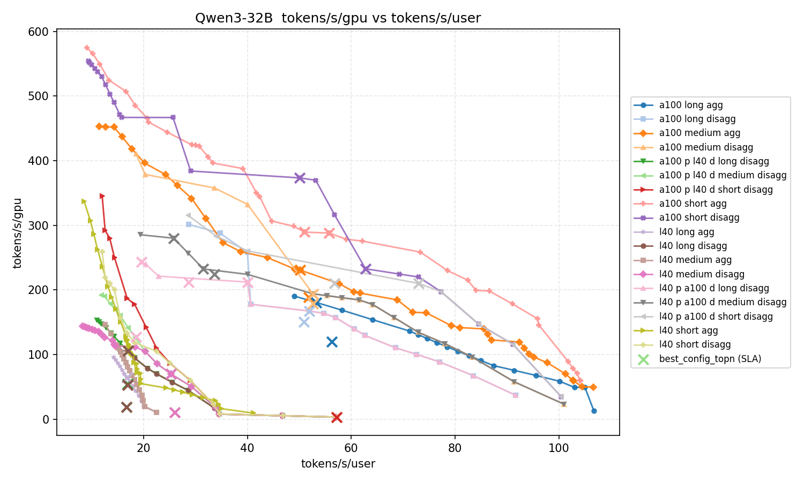
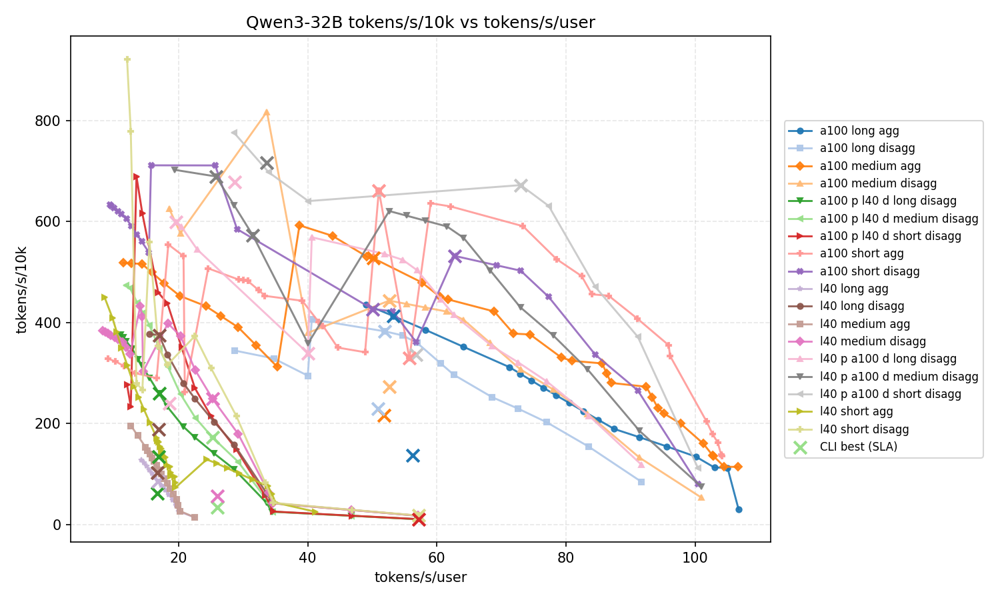

# 训练与推理系统工程

前三节围绕统一内存子系统，回答了"跨设备内存能否以可接受的代价被稳定兑现为 Goodput"。后两节分别讨论了通信运行时与 RAS 体系。本节将视角拉回到训练与推理这两个最终交付场景，讨论上述能力如何在真实负载下组合落地。

训练与推理对系统的压力画像截然不同。训练是强同步、周期性、批处理的执行流，核心瓶颈在梯度同步的通信开销和流水线气泡；推理是异步、随机到达、延迟敏感的执行流，核心瓶颈在尾延迟、KV Cache 管理和动态调度。超节点的 HBD 能力在两个场景下被兑现的路径不同，面临的工程约束也不同。因此，本节不把训练与推理只当作“两个应用场景”来排列，而把它们视作两类必须分开建模的系统负载：训练更偏大流、可预测、强同步，推理更偏小消息、低时延、高并发、弱可预测。若仍试图用同一组流量假设、同一套调度节奏和同一种性能指标去解释两者，最终往往既看不清训练的同步瓶颈，也看不清推理的长尾来源。

## 训练系统工程

### 并行策略与超节点拓扑的匹配

大规模训练的核心工程问题是：如何将数据并行（DP）、张量并行（TP）、管道并行（PP）和专家并行（EP）的组合策略，映射到超节点的分层互联拓扑上，使通信开销最小化。

这一问题的真实规模远超直觉。以 NVIDIA Blackwell NVL72 为例，其官方技术白皮书披露，仅在单一 NVL72 机柜上运行 1.8T 参数 MoE 模型（如 Llama 3.1 405B 级别），TP、PP、EP、DP 四个维度的组合就产生了超过 **2700 种候选并行配置**——每一种在吞吐、延迟、显存占用和气泡率上的表现各不相同，且不存在一种在所有指标上同时最优的配置。这一数量级的组合爆炸意味着：（1）并行策略选择本质上是一个多目标优化问题，帕累托分析是不可或缺的决策工具（详见[第三章方法论](../03-simulation/index.md#pareto-frontier)）；（2）超节点的互联拓扑设计必须为"策略搜索"留出足够的弹性空间，而非仅为单一预设策略优化。

关键原则是**将通信密集度最高的并行维度放在带宽最高的互联层级内**：

| 并行维度 | 通信模式 | 带宽敏感性 | 延迟敏感性 | 推荐互联层级 |
|:---------|:---------|:----------|:----------|:-----------|
| TP | AllReduce / ReduceScatter | 极高 | 极高 | HBD 域内（NVLink / Scale-Up） |
| EP | All-to-All（动态路由） | 极高 | 极高 | HBD 域内 |
| PP | 点对点 Send/Recv | 中 | 高 | 域内优先，可跨域 |
| DP | AllReduce（梯度同步） | 高 | 可容忍 | 可跨域（RDMA / Scale-Out） |

MoE 架构的普及使 EP 通信成为新的关键路径。与 TP 的规则对称通信不同，EP 的 All-to-All 流量模式是动态、稀疏、非对称的——路由结果取决于每个 token 的 gating 输出。这意味着超节点互联不仅需要高聚合带宽，还需要低排队延迟和动态负载均衡能力。HBD 域内的 NVSwitch 全交叉互联在这一场景下的优势，不在于峰值带宽，而在于可控的尾延迟和无拥塞热点的均匀通信。

进一步说，训练系统中的网络并不只是“一张用于同步梯度的网”。当系统规模继续扩大后，参数同步、训练数据搬运和管理控制流会自然分化为不同平面；如果这些流量仍被混放在同一调度与布线逻辑中，训练集群就很容易在并行策略尚未失效之前，先被跨平面干扰、拥塞扩散和资源错配拖垮。因此，并行策略与拓扑匹配不仅是把 `TP/PP/EP/DP` 映射到某种互联层级，更是在为参数面、数据面和业务面预留彼此可隔离的组织方式[^ultra-report-train-planes]。

### 通信-计算重叠与梯度同步

训练效率的工程兑现度，很大程度上取决于通信能否被计算隐藏。核心技术包括：

- **梯度桶（Bucket）聚合**：将反向传播产生的梯度按桶分组，桶满即触发 AllReduce，使通信与后续层的反向计算重叠。
- **分层同步策略**：HBD 域内使用高带宽 NVLink 做快速 Reduce，域间使用 RDMA 网络做跨 Pod AllReduce，通过收敛比控制域间通信量。
- **流水线气泡压缩**：1F1B、Interleaved 1F1B 和 ZeroBubble 等调度策略的选择，直接影响流水线效率。气泡率是训练 Goodput 的核心损耗项之一。

NVLink 4.0 域内带宽 900 GB/s 与 PCIe 5.0 x16 域间带宽 128 GB/s 之间存在约 7 倍的剪刀差。训练作业的并行策略设计必须围绕"域内近线速通信 + 域间收敛比"展开。

这也是为什么超大规模训练越来越依赖“通信策略 + 调度策略 + 网络平面”联动设计。仅有高带宽互联并不足以自动得到高利用率；只有当作业调度能够理解跨 Pod 通信需求、网络侧能够针对关键链路做带宽倾斜、训练系统能够把大流量交互尽可能压缩在更小的域内时，通信-计算重叠才不会停留在理论上[^ultra-report-train-cosched]。

### Checkpoint 与容错

大规模训练的 Checkpoint 写出涉及 HBM → CPU 内存 → NVMe / 远端存储的多级数据搬运。HBD 域内的 NVLink 带宽可以加速分布式快照的收集，但最终写出瓶颈往往在 PCIe 和网络 IO 上。异步 Checkpoint、增量快照与预写日志（WAL）等技术的工程落地，决定了 Checkpoint 频率与训练有效吞吐之间的权衡。

从长期运行视角看，Checkpoint 与容错也不只是“训练框架的一项功能”，而是大规模系统把故障损失限制在可接受范围内的核心机制。节点数上来之后，故障不再是低概率异常，而会变成持续背景噪声；如果恢复路径仍停留在人工介入、整作业重启或长时间资源重排，集群的理论峰值算力就很难被稳定兑现为有效训练时间[^ultra-report-train-ops]。

## 推理系统工程

### 推理优化的系统性挑战

推理系统优化常被简化为硬件性能比较问题，但实际工程决策通常并不对应单点 benchmark。线上推理服务的架构选择同时受到 TTFT、TPOT、吞吐、成本、扩展性等多方面约束。单个硬件指标可以帮助理解设备特征，却不足以直接支撑系统架构决策。

更根本的困难在于：不同团队使用的评估口径、benchmark 场景和指标 trade-off 经常不一致，导致方案难以横向比较、讨论反复拉扯。随着模型规模、GPU 成本与业务负载持续上升，只靠经验判断已经不够用。即便训练网络和推理网络复用同一套物理基础设施，两者也不应再被假设为相同问题：训练更关心同步效率和大流量收敛，推理更关心尾延迟、调度时效和局部热点控制；两者真正共享的不是同一组静态指标，而是都必须最终回到 Goodput、可服务能力和资源兑现度上来衡量。

推理系统的另一个难点在于，它同时承受“高并发、短时长、强实时”的调度压力。训练作业更接近批处理，推理服务则要求资源系统在更短时间内完成分配、回收和重平衡；一旦调度响应滞后于负载变化，就会出现部分实例排队、部分算力闲置、局部链路过热而全局利用率并不高的典型错配。这也是为什么推理优化最终会走向架构、调度和缓存策略的联合决策，而不是停留在单机 benchmark 比较[^ultra-report-infer-scheduler]。

### 推理的帕累托分析框架

帕累托前沿为推理架构决策提供了统一的分析语言（详见[第三章方法论落地案例](../03-simulation/index.md#方法论落地案例异构推理架构的帕累托决策)）。在推理场景中，帕累托分析的核心坐标系是：

- **tokens/s/user**：反映用户感知生成速度，是体验侧的硬约束代理指标。
- **tokens/s/GPU**：反映单位 GPU 吞吐，是成本与容量侧的核心变量。
- **tokens/10k\_rmb**（可选第三维）：反映单位成本产出，在成本敏感场景下决定方案的最终可行性。

这组指标天然互相冲突：减小 batch 提升单用户速度但降低系统吞吐；增大 batch 提升吞吐但抬高排队时间与尾延迟。帕累托前沿将这些冲突显式化，把"打地鼠"式的局部调优升级为"在地图上定位并选择"的系统决策。

推理优化可分为三个层次：

1. **可行区间→帕累托前沿（天级）**：通过 batch 调整、量化、执行参数调优等手段，在现有架构不变的前提下，将当前配置推到前沿附近。解决的是"低成本调参能收割多少免费午餐"。
2. **理论前沿→工程可达前沿（周～月级）**：系统调度、请求合并、缓存策略和实现细节决定了帕累托前沿上的点是否真正可达。安全边际（Safety Margin = (SLA约束 − 实际达成) / SLA约束）是度量工程兑现度的核心指标。
3. **旧前沿→新前沿（月～季度级）**：PD 分离、异构 GPU 组合、新一代硬件接入等架构变化，不是在现有前沿里移动，而是把整条边界往外推。

### Prefill/Decode 分离与异构调度

推理链路的 Prefill 和 Decode 两个阶段具有截然不同的资源需求画像：

| 阶段 | 计算特征 | 瓶颈资源 | 适配硬件特征 |
|:-----|:---------|:---------|:-----------|
| **Prefill** | 计算密集，处理完整 prompt | 算力（FLOPS） | 高算力密度、高性价比 |
| **Decode** | 访存密集，逐 token 生成 | 内存带宽（GB/s） | 高 HBM 带宽 |

这一结构性差异为异构部署提供了工程基础：用算力密度高但带宽较低的 GPU 承担 Prefill，用带宽高的 GPU 承担 Decode，可以在不降低整体性能的前提下优化成本结构。

但一旦进入真实线上环境，`PD` 分离能否成立并不只取决于两类 GPU 的静态特征是否匹配，还取决于统一调度层是否能把不同阶段的资源需求及时拼接起来。否则，系统很容易出现 Prefill 侧排队而 Decode 侧空闲、或 Decode 侧成为全局瓶颈而 Prefill 侧算力被低效占用的错配现象。异构推理真正困难的地方，不是发现“哪张卡更适合哪个阶段”，而是让这种阶段性匹配在动态请求流下持续成立[^ultra-report-infer-scheduler]。

下图展示了全场景、全架构的帕累托分布。横轴为用户感知生成速度（tokens/s/user），纵轴为单位 GPU 吞吐（tokens/s/GPU）。不同颜色对应不同架构（A100 聚合/分离、L40 聚合/分离、L40\_P + A100\_D 异构、反向异构）在三类场景（Short/Medium/Long）下的配置点。叉号标注满足 SLA 约束的最优配置。

/// caption
全场景 tokens/s/GPU 与 tokens/s/user 帕累托分布。不同场景和架构的相对位置清晰展示了用户体验与单位算力效率之间的权衡关系。L40\_P + A100\_D 异构方案（灰色三角）在多个场景下位于帕累托前沿上或其附近，而反向异构方案（绿色标记）普遍被支配。
///

实证分析表明，L40S（Prefill）+ A100（Decode）的异构分离方案在满足 SLA 约束后，相比纯 A100 聚合架构，Medium 场景成本效益提升约 31%，Long 场景提升约 45%。反向配置（A100 做 Prefill + L40S 做 Decode）在多数场景中被支配，证实了阶段瓶颈与硬件特征之间存在方向性匹配关系。

但异构方案的成立是有条件的：

- **SLA 稳健性非均匀**：Short 场景余量充裕，Medium 场景 TPOT 安全边际仅约 3%，处于工程可达的边界。部署策略必须分场景制定。
- **价格敏感性显著**：L40 月成本低于约 2.5 万时优势明显，价格上升后优势收敛。帕累托前沿的形状会随 TCO 变化发生结构性位移。下图将纵轴切换为 tokens/s/10k\_rmb（单位成本产出），直观展示价格因素如何改变帕累托前沿的形状与各方案的相对位置。

/// caption
全场景 tokens/s/10k\_rmb 与 tokens/s/user 帕累托分布。将成本维度纳入分析后，帕累托前沿的形状发生显著变化——L40 方案因单价优势在成本效益维度上位置前移，但其优势幅度直接取决于 GPU 价格区间。
///
- **规模扩展收益非线性**：从 8 卡到 32 卡，系统总吞吐近似线性增长，单位 GPU 效率继续改善，但 TPOT 并不单调改善——16 卡配置恰好落在延迟最优点，32 卡吞吐更高但延迟反而上升。

### KV Cache 管理与超节点内存池化

长上下文推理（百万 token 级）使 KV Cache 成为显存的主要消费者。在超节点范围内，KV Cache 的管理与统一内存子系统直接相关：

- **分页显存管理**（如 PagedAttention）将 KV Cache 切分为固定大小的物理块，通过逻辑-物理映射消除碎片化，但引入了页表维护和跨块访问的开销。
- **跨设备 KV 迁移**在 HBD 域内可以利用 NVLink 的低延迟完成，但需要第二章讨论的统一寻址和内存语义支撑——迁移的代价不在搬运本身，而在一致性维护和地址翻译。
- **冷热分层**将高频访问的 KV 块保留在 HBM，低频块卸载到 CPU 内存或 NVMe。分层策略的有效性取决于访问模式的可预测性和迁移延迟与 Decode 延迟的比值。

### 对超节点参考设计的启示

训练和推理对超节点能力的需求画像差异显著，这直接影响第四章参考设计的适用性判断：

| 维度 | 训练侧需求 | 推理侧需求 | 对参考设计的含义 |
|:-----|:----------|:----------|:---------------|
| 带宽 | 极高（梯度同步、EP All-to-All） | 高但间歇性（PD 分离后的跨阶段传输） | 训练更依赖 HBD 域内全二分带宽 |
| 延迟 | 可部分隐藏（通信-计算重叠） | 极敏感（TTFT/TPOT 直接影响 SLA） | 推理对单跳延迟更严格 |
| 拓扑弹性 | 作业粒度调度 | 请求粒度调度，需支持异构混部 | 推理更需要动态拓扑重构能力 |
| 内存 | 显存容量为主（模型状态 + 激活值） | KV Cache 容量 + 带宽并重 | 推理更依赖内存池化与分层调度 |

标准以太网方案的低延迟让步（250–500 ns vs 总线方案 <1 μs）在训练侧可被通信-计算重叠缓解，但在推理侧可能直接影响 TPOT SLA。MoE/长上下文推理的兴起使推理侧的带宽需求向训练侧靠拢，模糊了两者的传统分界——这进一步要求超节点方案在设计时兼顾两类负载的帕累托前沿。

从这个意义上说，训练与推理的统一工程目标并不是“使用同一套硬件”这么简单，而是让同一套系统在不同负载形态下都能维持较高的 Goodput 兑现度。训练更敏感于同步效率、故障恢复和长周期稳定性，推理更敏感于调度时效、尾延迟和资源重平衡速度；真正成熟的超节点方案，需要在这两种压力画像之间找到可共享的资源组织方式，而不是让其中一种负载长期挤压另一种负载的工程空间[^ultra-report-train-ops][^ultra-report-infer-scheduler]。

## 安全与机密计算

### 超节点安全的新维度

当超节点从"单租户专属集群"走向"多租户共享基础设施"时，安全不再是外挂的合规选项，而是系统架构的内生约束维度。传统数据中心安全主要关注网络边界防护和存储加密，但超节点的特殊之处在于：大量敏感数据（模型权重、训练数据、推理输入）以明文形态在 GPU 显存、NVLink 通道和 HBM 之间高速流动。一旦互联通道或内存被窃听或篡改，整个模型资产都可能泄露。

这一威胁模型催生了对"机密计算"（Confidential Computing）的需求——不仅数据在存储和传输中加密，在计算过程中也必须受到硬件级保护。

### 硬件可信执行环境（TEE）与互联加密

NVIDIA Blackwell 架构率先在 GPU 层面引入了完整的机密计算能力，其设计思路对超节点安全架构具有示范意义：

- **GPU TEE（Trusted Execution Environment）**：Blackwell GPU 支持硬件级可信执行环境，模型权重和中间激活值在 HBM 中以加密形态存储，仅在 GPU 的受保护执行单元内解密参与计算。即使拥有物理访问权限的数据中心运维人员，也无法读取 GPU 内存中的明文数据。
- **NVLink 线内加密**：Blackwell 在 NVLink 5.0 通道上实现了线速硬件加密，多 GPU 之间的所有通信（包括 AllReduce 梯度、EP All-to-All 路由、KV Cache 迁移等）在传输层即被加密保护，无需软件干预，也不产生可感知的带宽或延迟开销。
- **端到端认证链**：从固件启动到 CUDA Kernel 执行，整个信任链通过硬件 Root of Trust 和远程认证（Remote Attestation）协议建立，确保运行环境未被篡改。

### 对超节点架构的启示

从帕累托分析的视角看，安全是一个新增的约束维度——它与性能、成本和规模之间存在权衡关系：

| 安全能力 | 性能开销 | 对超节点设计的含义 |
|:---------|:---------|:-----------------|
| HBM 加密 | 带宽损失 < 5%（硬件 AES-XTS） | 内存池化方案必须在加密粒度上支持多租户隔离 |
| NVLink 线内加密 | 延迟增加 < 1%（流水线化） | Scale-Up 互联协议需预留加密帧头与密钥协商机制 |
| GPU TEE | 上下文切换开销增加 | 多租户调度需在安全域边界上切分，影响资源利用率 |
| 远程认证 | 启动延迟增加（一次性） | 弹性扩缩容场景需优化认证流程，避免阻塞作业调度 |

当前，NVIDIA 通过软硬件垂直整合实现了"零感知"的安全集成。对于开放生态的超节点方案而言，挑战在于如何在不依赖单一厂商的前提下，在 Scale-Up 互联协议（如 UALink、ESUN 等）和统一内存语义中原生支持等价的安全能力。这将是超节点标准化进程中不可回避的议题——安全能力的缺失，可能成为多租户商业部署的硬性阻断点。

[^ultra-report-train-planes]: 《超大规模智算集群关键技术及工程落地研究报告》, 2025 年 12 月, 第 16-19 页。涉及节点间互联、`DCN` 前后端网络以及参数面/数据面/业务面分层组织。仓库内文件：`pdf/超大规模智算集群关键技术及工程落地研究报告.pdf`。
[^ultra-report-train-cosched]: 《超大规模智算集群关键技术及工程落地研究报告》, 2025 年 12 月, 第 18-19 页。涉及算存网协同、带宽适配、流量调度和跨架构资源联动。仓库内文件：`pdf/超大规模智算集群关键技术及工程落地研究报告.pdf`。
[^ultra-report-train-ops]: 《超大规模智算集群关键技术及工程落地研究报告》, 2025 年 12 月, 第 27-28 页。涉及资源碎片、长期运行稳定性、故障频发、训练中断与快速恢复要求。仓库内文件：`pdf/超大规模智算集群关键技术及工程落地研究报告.pdf`。
[^ultra-report-infer-scheduler]: 《超大规模智算集群关键技术及工程落地研究报告》, 2025 年 12 月, 第 27 页、第 30-31 页。涉及智能体/推理业务的高并发、短时长、强实时特点，以及统一调度与场景化资源配置压力。仓库内文件：`pdf/超大规模智算集群关键技术及工程落地研究报告.pdf`。
