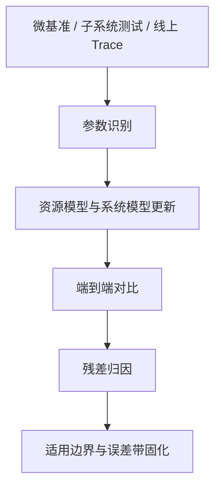
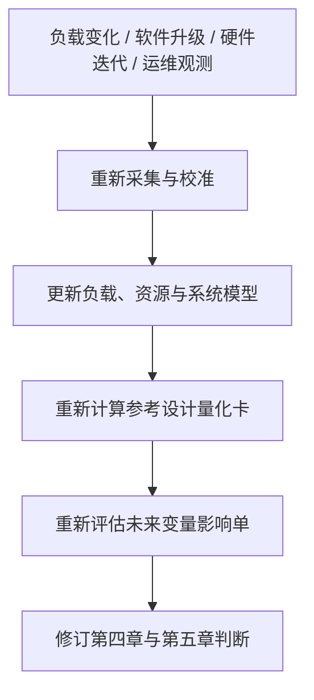

# 校准验证、输出接口与共演进闭环

前面的三个环节完成了第三章的主体建模工作：负载模型定义需求，资源模型定义供给，系统模型把两者映射成可推演的系统行为。但到这一步，模型仍然只是一个“看起来合理”的分析框架。它要真正进入第四章和第五章，还必须回答三个问题：

1. **模型如何被实测约束，而不是被实测替代？**
2. **模型结果如何转成后续章节直接可用的输出？**
3. **为什么模型不能一次定型，而必须随系统共演进持续更新？**

这三件事共同构成了第三章的收束：**校准验证保证可信度，输出接口保证可用性，共演进闭环解释帕累托前沿为何会被持续外推。**

## 校准验证：评测在第三章中的唯一职责

第三章中“评测”的地位必须非常克制。它不是独立目标，也不是一套另起炉灶的评分体系，而只是服务于建模的两类动作：

1. **参数识别**：为负载模型、资源模型和系统模型提供真实参数。
2. **误差验证**：检查模型在什么边界内可信、何时需要重校准。

也就是说，第三章使用评测的原则是：**用实测约束模型，而不是用实测替代模型。**

### 三层校准对象

在超节点场景下，模型校准通常分为三个层次：

| 校准层级 | 典型对象 | 主要作用 | 常见数据来源 |
|:---------|:---------|:---------|:-------------|
| **原子级校准** | GEMM、Attention kernel、P2P RTT、HBM/DDR 访问 | 识别资源模型中的基础参数 | 微基准、单机子系统测试 |
| **子系统级校准** | AllReduce/AllToAll、Paged KV、checkpoint、swap | 约束通信、分页与运行时行为 | collective benchmark、trace、压测 |
| **系统级校准** | step time、TTFT/TPOT、tokens/s/GPU、Goodput | 验证系统模型在真实场景下的解释力 | 端到端实验、线上业务观测 |

这三个层次的关系不是“越往后越重要”，而是逐级收紧：

- 原子级不准，后面的系统级误差就无法解释。
- 子系统级不准，系统模型对并发与拐点的判断就会失真。
- 系统级不准，则第三章的输出不应直接进入第四章和第五章。

### 校准工作流

/// caption
校准验证的目标不是把误差消灭，而是识别误差来源，并把“模型在哪些条件下可信”显式记录下来。
///

校准完成后，第三章最重要的交付物不是“模型已经正确”，而是：

- 哪些参数来自原子级实测；
- 哪些现象已被子系统级曲线校准；
- 哪些系统级结果可以带着误差带进入后续章节；
- 哪些变量仍只能作为受约束的推断。

## 输出接口：模型如何进入第四章与第五章

第三章不是独立终点，它必须把结果变成后续章节能够直接消费的对象。对这份白皮书而言，最关键的有两类输出。

### 1. 面向第四章的参考设计量化卡

第四章不是直接比较原始仿真曲线，而应比较第三章整理后的“参考设计量化卡”。每张量化卡至少回答以下问题：

| 输出项 | 要回答的问题 | 第四章如何使用 |
|:-------|:-------------|:---------------|
| **适用负载画像** | 该方案更适合 Dense、MoE、长上下文还是多模态？ | 支撑“适用负载”维度 |
| **边界位置** | 在规模、时延、功耗、内存与软件复杂度上位于何处？ | 形成七维评分的定量依据 |
| **兑现度结果** | 理论前沿与工程可达前沿之间差距多大？ | 让 Goodput 与安全边际进入比较 |
| **敏感性结果** | 工作负载、软件栈、拓扑变化时，前沿位置如何移动？ | 防止方案比较被写成静态结论 |
| **风险依赖** | 该方案依赖哪些控制面、软件能力或器件成熟度？ | 区分当前可部署与并行验证 |

这意味着第四章中的参考设计，本质上不应被理解为五个静态点，而应被理解为五组**带条件、带风险、带适用边界的参数化方案族**。

### 2. 面向第五章的未来变量影响单

第五章讨论的不是“未来技术大全”，而是“哪些变量会先改写主导约束”。第三章需要把这些变量整理为“未来变量影响单”，至少包括三类输出：

| 输出项 | 说明 | 第五章如何使用 |
|:-------|:-----|:---------------|
| **边界外移幅度** | 变量引入后，吞吐、时延、能效、容量可能改善多少 | 支撑优先级排序 |
| **约束重排方向** | 变量先缓解哪一类瓶颈，又把新的瓶颈推向哪里 | 判断它为什么重要 |
| **成立条件** | 变量真正影响方案排序前，必须满足哪些门槛 | 区分已验证趋势、工程推断与方向判断 |

因此，第三章给第五章提供的，不是确定性预测，而是**带校准程度、带依赖条件的边界变化假设集**。

## 共演进闭环：为什么这能契合“帕累托前沿突破”的叙事

如果帕累托前沿只是静态边界，那么第三章做到校准验证和输出接口就已经足够。但全书的主叙事并不是“在既有边界上找最优点”，而是“系统能力边界为何会被持续外推”。这就要求第三章再往前走一步：解释**负载、软件、硬件和运维如何共同推动前沿发生位移**。

### 共演进的四类变量

从闭环视角看，至少有四类变量在共同推动前沿变化：

| 变量类别 | 典型变化 | 影响哪一层模型 |
|:---------|:---------|:---------------|
| **负载变量** | 序列长度分布、专家路由偏斜、多模态混部、请求突发性 | 负载模型 |
| **软件变量** | kernel 融合、通信算法、continuous batching、调度策略、allocator | 系统模型与 Runtime 资源模型 |
| **硬件变量** | HBM 代际、互联协议、交换芯片、封装形态、功耗边界 | 资源模型 |
| **运维变量** | 故障恢复策略、QoS 规则、控制面重构、机柜约束 | 系统模型与 RAS 资源模型 |

这些变量并不是平行漂移的。很多时候，真正推动前沿外移的不是单一硬件升级，而是：

- **新负载先改变压力分布**；
- **软件先把旧硬件上的可达边界往外推**；
- **硬件再把新的资源上界打开**；
- **运维与控制面决定这些变化能否被稳定兑现**。

这正是“帕累托前沿突破”在第三章里的具体表达。

### 共演进闭环的工作流

/// caption
共演进闭环不是额外附加的一层治理流程，而是第三章解释“帕累托前沿为何会被持续外推”的方法基础。
///

在这个意义上，共演进闭环不是平台宣言，也不是产业治理说明，而是第三章的最后一层方法论收束：

- 它解释了为什么边界不是静态的；
- 它说明了为什么第三章不能只做一次性仿真；
- 它把“校准验证”与“前沿外移”两件事接到了一起。

## 对本章叙事的作用

如果按你定义的主线来总结，第三章最终就形成了一条完整链路：

**负载模型 + 资源模型 + 系统模型 + 校准验证 + 输出接口 + 共演进闭环**

其中前五项回答的是“如何把复杂系统建成一个可信、可用的仿真模型”，最后一项回答的是“为什么这个模型必须持续更新，才能真正解释帕累托前沿的突破与外移”。

这也是第三章与全书主叙事契合的地方：  
它不只是在当前边界上做度量，更是在方法论上解释**边界为什么会移动，以及我们如何持续追踪这种移动。**
