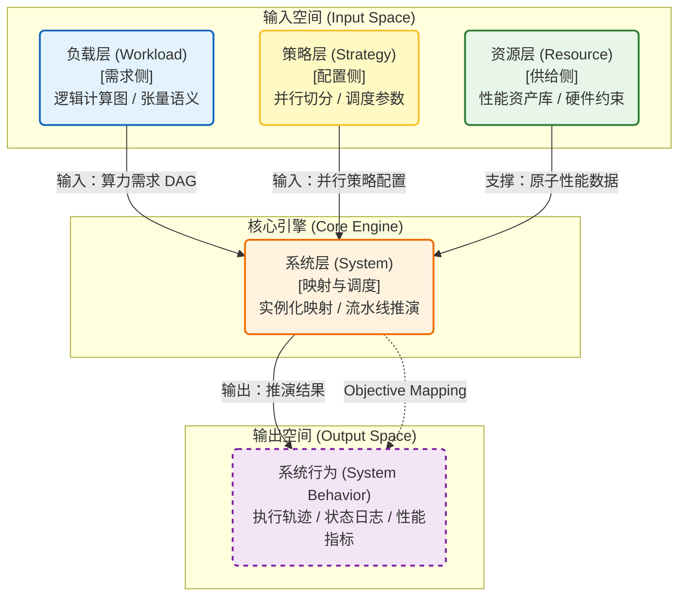

# 建模仿真

前两章分别回答了"系统能力边界如何被外移"（架构分析）和"这些被打开的边界如何被兑现"（软件系统）。但一个更基本的问题尚未回答：**如何度量你在当前能力边界上的位置？** 当系统设计涉及算力、带宽、功耗、时延、成本等多个彼此耦合的维度时，纯经验判断无法区分"沿边界重新分配权衡"与"真正让边界本身外移"，更无法量化边界变化的幅度与方向。

这正是建模仿真在本白皮书中的定位：**度量系统能力边界的决策工具**。在方法论上，本章继续使用帕累托前沿作为形式化语言；在工程表达上，它关心的是系统当前处在什么位置、哪些 trade-off 只是边界内移动、哪些变化会让可达边界真正外移。当系统规模进入万卡级，且负载形态从"规则稠密训练"演进到"稀疏/MoE、长序列、多模态与在线推理混合运行"时，试错成本过高——一次硬件选型误判、一次并行策略或调度参数配置错误，都可能带来数周进度损失与巨额算力浪费。仿真用一套可复用的规约、模型与推演框架，把"争论"转化为"可验证的假设"，把"经验"转化为"可校准的资产"。

内容从方法论与适用边界出发，经过负载建模、系统层仿真、性能资产库与校准流程，最终讨论仿真如何与真实系统迭代形成软硬协同闭环。仿真的价值不止于预测性能，更在于形成统一评估口径并为参考设计提供量化依据；但没有性能资产库、校准闭环和适用边界说明，仿真只会制造新的不确定性。

下一章将把这些方法论真正沉淀为参考设计，回答"在当前能力边界上，针对不同约束与负载画像，应该选择哪些点"。

---

## 方法论概述与适用边界 {#methodology}

本节给出方法论框架与适用边界：明确仿真体系的输入/输出是什么，按什么顺序逐层加复杂度，以及如何通过性能资产库与校准闭环提升可信度与可迁移性。

### 客观映射体系（Objective Mapping System）

系统仿真本质上是一个确定性的演绎引擎。它构建了一套从**输入空间**（负载需求、硬件能力、系统配置）到**输出空间**（系统行为）的客观映射关系：

$$\text{Simulation}(Workload, Resource, Strategy) \rightarrow \text{System Behavior}$$

该引擎不预设主观偏好，而是依据严谨的因果逻辑，如实反映数据在系统中的流动、计算与交互过程。输出的**系统行为**不仅包含量化的**性能指标（Metrics）**，还涵盖系统的**逻辑状态（State）**与全过程**执行轨迹（Trace）**。

### 仿真维度递进：功能、性能与行为

本体系遵循严格的验证次序，从三个维度对系统进行全方位评估：

1. **功能仿真（Functionality）**：验证功能正确性，确保计算图依赖关系准确、数据切分逻辑与张量形状匹配，并验证系统中不存在死锁或资源竞争导致的逻辑冲突。
2. **性能仿真（Performance）**：评估性能效率，量化吞吐量（Throughput）、端到端延迟（Latency）、硬件资源利用率（Utilization）以及流水线执行效率。
3. **行为仿真（Behavior）**：分析系统鲁棒性，模拟故障注入（Fault Injection）、网络拥塞震荡、长尾延迟等非理想状态下的系统响应机制与稳定性表现。

### 层次化建模架构：需求-映射-供给

为解决大规模分布式系统的复杂耦合挑战，本白皮书采用**正交解耦**的建模方法论。我们将仿真对象划分为三个逻辑层次，形成从逻辑需求到物理供给的闭环映射体系：

1. **负载层（Workload Layer - 需求侧）**
   - **定义**：描述应用在逻辑层面的算力需求。
   - **核心职能**：定义逻辑计算图（Computation Graph）与张量数据流语义。该层严格遵循**硬件无关**与**策略无关**原则，确保负载描述的纯粹性与可复用性。

2. **系统层（System Layer - 映射引擎）**
   - **定义**：描述需求与供给之间的映射关系。
   - **核心职能**：作为仿真器的核心推演引擎，负责将抽象的负载“实例化”到具体的物理资源上。其核心职责是执行**并行策略映射（Mapping）**与**流水线编排（Scheduling）**。

3. **资源层（Resource Layer - 供给侧）**
   - **定义**：描述物理硬件的性能边界。
   - **核心职能**：对计算、存储、网络子系统进行抽象建模，构建**性能资产库（Performance Asset Library）**，提供高保真的原子级性能数据。

#### 建模架构逻辑视图

---

## 帕累托前沿：多目标优化的共同语言 {#pareto-frontier}

在过去一段时间的推理系统优化、扩容决策以及与硬件/框架供应商的协作过程中，我们逐渐意识到：很多分歧并不源于“技术做不到”，而源于**评估口径、Benchmark 场景与指标 trade-off 缺乏统一视角**——导致方案难以横向比较、决策反复拉扯，最终仍依赖经验判断。随着模型规模、GPU 成本与业务负载持续上升，这种“经验式优化”越来越难以支撑理性的工程决策。

因此，本白皮书将**帕累托前沿（Pareto Frontier）**作为建模分析的核心方法论之一：它不是给出唯一的“最好点”，而是把系统能力边界在多目标约束下的形状转化为一张可视化、可比较、可复用的“性能地图”。

在工程上，这一点还有一个很重要的延伸：当系统从一种硬件平台迁移到另一种硬件平台（或从 A 代际演进到 B 代际）时，**帕累托前沿本身也可以被近似与迁移**，从而降低跨平台重复 Benchmark 的成本，并将“经验结论”转化为可复用的决策资产[^icpe20-pareto-transfer]。

### 基本概念：支配关系、帕累托最优与前沿

在多目标优化中，我们通常同时关心多个指标（例如：延迟、吞吐量、成本、显存占用、能耗）。对任意两个方案 \(A\) 与 \(B\)：

- **支配关系（Dominance）**：若 \(A\) 在所有目标上都不差于 \(B\)，且至少一个目标严格优于 \(B\)，则称 \(A\) 支配 \(B\)。
- **帕累托最优（Pareto Optimality）**：不存在任何方案能支配该方案，则该方案是帕累托最优。
- **帕累托前沿（Pareto Front）**：所有帕累托最优点构成的集合（在二维平面上常表现为一条“上包络/下包络”边界）。

一个直观类比是“买车”的二目标选择：油耗更低、加速更快往往互相冲突。帕累托前沿上的点代表“最优权衡”：想让油耗再低一点，通常就必须牺牲加速；想让加速更快一点，通常就必须付出更高油耗。

> 图（待补）：二维平面上的点云与帕累托前沿示意图。

### 为什么推理优化需要帕累托：把“打地鼠”变成“画地图”

推理优化的痛点往往不是“没有手段”，而是同时面对：

- **配置组合爆炸**：TP/PP、batch、量化、并行度、KV 策略、调度参数等形成 \(10^4\) 量级组合空间；
- **目标天然冲突**：延迟↓ ↔ 吞吐↑ ↔ 成本↓（以及显存/功耗/稳定性等约束）；
- **负载动态变化**：突发流量、长尾分布、冷热模型混部，使得单点最优解很难稳定复用。

帕累托分析提供的“地图视角”在工程上有三个直接收益：

- **识别“免费午餐”**：快速剔除被支配区域，找到无需牺牲其他目标即可改进的配置点。
- **给出“理论边界”**：把可行域与不可行域分开，让团队对“哪里是调参问题、哪里是系统瓶颈”形成共识。
- **形成可复用的决策面**：把不同团队的优化宣称、线上观测与离线 Benchmark 放在同一坐标系中对齐比较。

### 指标建议：用“用户体验 vs 单位资源效率”做核心坐标系

在推理部署优化中，我们建议至少同时跟踪两类核心指标（可作为二维帕累托坐标系的默认选择）：

- **用户感知生成速度**（例如 tokens/s/user）：反映单请求路径的端到端效率，是体验侧硬约束的代理指标。
- **单位资源吞吐量**（例如 tokens/s/GPU 或 tokens/s/GPU/s）：反映系统级并行利用效率，是成本与容量侧的核心变量。

它们往往此消彼长，天然构成帕累托问题：只优化任一指标，都可能在另一维度付出隐性代价（例如减小 batch 提升单用户速度但降低系统吞吐；增大 batch 提升吞吐但抬高排队时间与尾延迟）。

### 将帕累托前沿落到“建模仿真”工作流

在本章的方法论框架中，帕累托前沿用于把建模结果组织成可决策的输出：

1. **定义目标向量与约束**：明确优化目标（如吞吐、P99、成本、能耗）与硬约束（如 SLA、显存上限、稳定性阈值）。
2. **生成配置点与推演结果**：通过仿真器（或离线 sweep）得到每个配置点在目标空间中的坐标。
3. **计算非支配集合**：得到帕累托最优点集（前沿）。
4. **分层解释“优化层次”**：
   - **可行区间内移动（天级）**：通过配置/调参找到“免费午餐”；
   - **提升可达性（月级）**：修补系统工程与运行时缺陷，让“理论前沿”变成“可稳定达成的前沿”；
   - **外移前沿（季度~年度）**：通过架构/算法/硬件变化抬升整条边界。

### 前沿外推的实证：从代际跃迁到软件加速

帕累托前沿并非静态。在本白皮书的双轨分析框架中，前沿的外推（即整条帕累托边界向更优方向平移）是衡量系统级进步的核心指标。外推的驱动力来自两个时间尺度：

**代际硬件跃迁（~2 年周期）**

NVIDIA 的平台演进提供了最清晰的参照系。以推理场景的"tokens/s/user vs tokens/s/MW"帕累托坐标系为例：Blackwell NVL72（B200, FP4, 72 GPU）相比 Hopper NVL8（H200, FP8, 8 GPU）在甜点配置上实现了约 25–40× 的综合提升。而 Rubin 平台（Vera Rubin NVL72）进一步将帕累托前沿外推：在 Kimi-K2-Thinking 等推理工作负载上，相比 Blackwell 实现了 10× 的吞吐密度（tokens/s/MW）提升和 10× 的单位 token 成本下降[^nvidia-rubin-sim]。训练侧同样显著：训练 10T MoE 模型达到相同目标，Rubin 仅需 Blackwell 约 1/4 的 GPU 数量。

这种代际跃迁的本质是在帕累托空间中**同时改善多个维度**——它不是沿前沿移动，而是把前沿整体向外推。

**同代软件优化（周~月周期）**

更值得关注的是同代硬件上的软件驱动外推。NVIDIA 在 2025 年 8–10 月间的 InferenceMax 基准测试中展示了一个典型案例：在同一 GB200 NVL72 硬件上，仅通过数周的软件迭代（TensorRT 推理栈升级、NVSwitch 内存访问并行化、多 token 预测），GPT-OSS 推理模型的帕累托前沿被推出了近 5×[^nextplatform-pareto-sim]。具体而言：

- 8 月→9 月底：前沿沿全线几乎翻倍
- 10 月 3 日（TensorRT + NVSwitch 优化）：前沿不仅外推，且两端被显著拉伸——最大吞吐超过 60,000 tokens/s/GPU，最大交互性接近 500 tokens/s/user
- 10 月 9 日（多 token 预测）：前沿形状发生质变，最大交互性突破 1,000 tokens/s/user，中段吞吐提升 5×

这组数据揭示了一个对建模仿真具有直接启示的现象：**软件优化对前沿的贡献速度正在加快**，曾经需要两年才能实现的 5× 软件增益，现在可能在数周内完成。这意味着仿真模型的校准周期也需要相应缩短，帕累托前沿不能被视为稳态资产，而是需要持续更新的动态决策面。

**对仿真方法论的启示**

将代际跃迁与软件加速纳入帕累托框架后，前述的三层优化层次可以被更精确地量化：

1. **沿前沿移动**（天级）：在当前软件版本下调整配置参数，可测量为帕累托前沿上不同点之间的距离
2. **逼近可达前沿**（周级）：升级软件栈版本，可测量为同一硬件上新旧前沿之间的面积差
3. **外推前沿**（年级）：引入新一代硬件平台，可测量为代际帕累托前沿之间的系统级增益倍数

这三个尺度为仿真验证提供了明确的校准目标和精度要求。

[^nvidia-rubin-sim]: Kyle Aubrey. “Inside the NVIDIA Rubin Platform: Six New Chips, One AI Supercomputer.” *NVIDIA Technical Blog*, Jan 2026. `https://developer.nvidia.com/blog/inside-the-nvidia-rubin-platform-six-new-chips-one-ai-supercomputer/`
[^nextplatform-pareto-sim]: Timothy Prickett Morgan. “Software Pushes The AI Pareto Frontier More Than Hardware.” *The Next Platform*, Oct 2025. `https://www.nextplatform.com/ai/2025/10/21/software-pushes-the-ai-pareto-frontier-more-than-hardware/`

### 开放问题（建议用仿真与实测闭环回答）

- **前沿的连续性**：相邻的帕累托最优解在参数空间是否连续？训练侧往往高度不连续，难以依赖经验外推。
- **前沿跳变点的成因**：前沿上“突然更好/突然更差”的跳变通常由哪些因素触发（缓存阈值、调度策略、通信模式切换、NUMA/拓扑边界等）？需要用具体案例拆解。

[^icpe20-pareto-transfer]: Pavel Valov, Jianmei Guo, and Krzysztof Czarnecki. “Transferring Pareto Frontiers across Heterogeneous Hardware Environments.” ICPE 2020. `https://research.spec.org/icpe_proceedings/2020/proceedings/p12.pdf`

