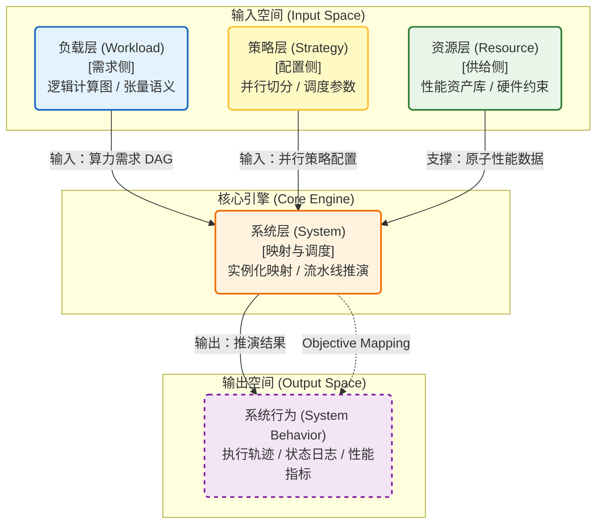

# 建模仿真

前两章分别回答了"系统能力边界如何被外移"（架构分析）和"这些被打开的边界如何被兑现"（软件系统）。但一个更基本的问题尚未回答：**如何度量你在当前能力边界上的位置？** 当系统设计涉及算力、带宽、功耗、时延、成本等多个彼此耦合的维度时，纯经验判断无法区分"沿边界重新分配权衡"与"真正让边界本身外移"，更无法量化边界变化的幅度与方向。

这正是建模仿真在本白皮书中的定位：**度量系统能力边界的决策工具**。在方法论上，本章继续使用帕累托前沿作为形式化语言；在工程表达上，它关心的是系统当前处在什么位置、哪些 trade-off 只是边界内移动、哪些变化会让可达边界真正外移。当系统规模进入万卡级，且负载形态从"规则稠密训练"演进到"稀疏/MoE、长序列、多模态与在线推理混合运行"时，试错成本过高——一次硬件选型误判、一次并行策略或调度参数配置错误，都可能带来数周进度损失与巨额算力浪费。仿真用一套可复用的规约、模型与推演框架，把"争论"转化为"可验证的假设"，把"经验"转化为"可校准的资产"。也因此，本章需要把两个基础口径提前说清：其一，网络最终不能只用链路带宽和单跳时延来评价，而应回到 GPU 利用率、系统 Goodput、训练效率、推理尾延迟和恢复时间；其二，负载模型不能假设一种统一流量形态，而必须分别刻画训练的大流强同步与推理的小消息弱可预测这两类机制。

在章节叙事上，本章应明确收束为六个连续环节：**负载模型、资源模型、系统模型、校准验证、输出接口、共演进闭环**。其中，评测不是独立主线，而是服务于校准验证；共演进闭环也不是额外附加的治理说明，而是用来解释为什么帕累托前沿会随着负载、软件、硬件和运维共同变化而被持续外推。

因此，本章的价值不止于预测性能，更在于形成统一评估口径并为参考设计提供量化依据；但没有资源模型、校准闭环和适用边界说明，仿真只会制造新的不确定性。

这一点在超大规模集群工程中尤为重要。超大规模集群的落地不是单纯“算力更大”的问题，而是一个同时受硬件部署、软件适配、服务交付和长期运营共同约束的复杂系统工程；其难点包括跨平面流量协调、异构统一调度、资源碎片、故障恢复与长期稳定运行等多个维度[^ultra-report-sim-complexity]。这意味着，如果仿真仍只覆盖峰值吞吐、静态带宽和单次时延，而不把恢复时间、调度效率、跨平面干扰、故障率与运维开销纳入同一推演框架，那么模型得到的将只是“理论性能上限”，而不是可被产业交付验证的系统边界。

下一章将把这些方法论真正沉淀为参考设计，回答"在当前能力边界上，针对不同约束与负载画像，应该选择哪些点"。

---

## 方法论概述与适用边界 {#methodology}

本节给出方法论框架与适用边界：明确仿真体系的输入/输出是什么，按什么顺序逐层加复杂度，以及如何通过资源模型、校准验证与共演进闭环提升可信度与可迁移性。

换句话说，本章的方法主线不是“先做 benchmark，再谈架构判断”，而是：

1. 用负载模型定义需求侧压力。
2. 用资源模型定义供给侧边界。
3. 用系统模型推演映射与编排结果。
4. 用校准验证约束模型误差与适用范围。
5. 用输出接口把结果沉淀为第四章和第五章可直接使用的对象。
6. 用共演进闭环解释边界为何会持续移动。

### 客观映射体系（Objective Mapping System）

系统仿真本质上是一个确定性的演绎引擎。它构建了一套从**输入空间**（负载需求、硬件能力、系统配置）到**输出空间**（系统行为）的客观映射关系：

$$\text{Simulation}(Workload, Resource, Strategy) \rightarrow \text{System Behavior}$$

该引擎不预设主观偏好，而是依据严谨的因果逻辑，如实反映数据在系统中的流动、计算与交互过程。输出的**系统行为**不仅包含量化的**性能指标（Metrics）**，还涵盖系统的**逻辑状态（State）**与全过程**执行轨迹（Trace）**。

### 仿真维度递进：功能、性能与行为

本体系遵循严格的验证次序，从三个维度对系统进行全方位评估：

1. **功能仿真（Functionality）**：验证功能正确性，确保计算图依赖关系准确、数据切分逻辑与张量形状匹配，并验证系统中不存在死锁或资源竞争导致的逻辑冲突。
2. **性能仿真（Performance）**：评估性能效率，量化吞吐量（Throughput）、端到端延迟（Latency）、硬件资源利用率（Utilization）以及流水线执行效率。
3. **行为仿真（Behavior）**：分析系统鲁棒性，模拟故障注入（Fault Injection）、网络拥塞震荡、长尾延迟等非理想状态下的系统响应机制与稳定性表现。

其中，行为仿真在超大规模集群语境下并不是可有可无的附加项。万卡级集群在长期运行中会面对资源碎片、节点故障、训练中断、异构协同失配等持续性扰动；若缺乏智能容错和快速恢复机制，单次故障就可能带来小时级训练损失[^ultra-report-sim-ops]。因此，本章所谓“行为仿真”，至少应显式覆盖三类变量：一是**故障发生率与故障域传播**，二是**恢复路径与恢复时间**，三是**调度系统在扰动下的队列退化与资源重分配效率**。只有这三类变量进入系统模型，仿真结果才真正具备“可验证、可落地、可对照工程交付”的含义。

### 层次化建模架构：需求-映射-供给

为解决大规模分布式系统的复杂耦合挑战，本白皮书采用**正交解耦**的建模方法论。我们将仿真对象划分为三个逻辑层次，形成从逻辑需求到物理供给的闭环映射体系：

1. **负载层（Workload Layer - 需求侧）**
   - **定义**：描述应用在逻辑层面的算力需求。
   - **核心职能**：定义逻辑计算图（Computation Graph）与张量数据流语义。该层严格遵循**硬件无关**与**策略无关**原则，确保负载描述的纯粹性与可复用性。

2. **系统层（System Layer - 映射引擎）**
   - **定义**：描述需求与供给之间的映射关系。
   - **核心职能**：作为仿真器的核心推演引擎，负责将抽象的负载“实例化”到具体的物理资源上。其核心职责是执行**并行策略映射（Mapping）**与**流水线编排（Scheduling）**。

3. **资源层（Resource Layer - 供给侧）**
   - **定义**：描述物理硬件的性能边界。
   - **核心职能**：对计算、存储、网络子系统进行抽象建模，构建**性能资产库（Performance Asset Library）**，提供高保真的原子级性能数据。

在本白皮书的方法里，资源层不应只记录“芯片、显存、链路”的静态能力，也应吸收那些已经在大规模工程实践中充分暴露出来的系统约束。例如：

- **网络平面分层**：参数面、数据面、业务面的带宽与干扰关系；
- **异构调度能力**：`Kubernetes` / `Device Plugin` 一类统一调度框架带来的资源抽象能力与调度开销；
- **长期运营变量**：节点故障率、恢复时间、作业级中断损失、资源碎片率；
- **设施侧边界**：供电、液冷、建设周期和 `PUE` 对可部署规模的反向约束。

这些量并不都是同一精度层面的“硬件参数”，但它们共同决定了从供给侧可达到的真实能力边界，因此应被建模为资源层与系统层之间的约束接口，而不是被留在文字说明里[^ultra-report-sim-vars]。

#### 建模架构逻辑视图



---

## 帕累托前沿：多目标优化的共同语言 {#pareto-frontier}

在过去一段时间的推理系统优化、扩容决策以及与硬件/框架供应商的协作过程中，我们逐渐意识到：很多分歧并不源于“技术做不到”，而源于**评估口径、Benchmark 场景与指标 trade-off 缺乏统一视角**——导致方案难以横向比较、决策反复拉扯，最终仍依赖经验判断。随着模型规模、GPU 成本与业务负载持续上升，这种“经验式优化”越来越难以支撑理性的工程决策。

因此，本白皮书将**帕累托前沿（Pareto Frontier）**作为建模分析的核心方法论之一：它不是给出唯一的“最好点”，而是把系统能力边界在多目标约束下的形状转化为一张可视化、可比较、可复用的“性能地图”。

一个来自工业界的真实案例可以说明这种方法论为什么不可或缺。NVIDIA 在 Blackwell NVL72 技术白皮书中披露，仅在一个 72 卡机柜上部署 1.8T 参数 MoE 模型时，TP、PP、EP、DP 四个并行维度的排列组合就产生了超过 **2700 种候选配置**。每种配置在吞吐、延迟、显存占用、气泡率和能耗上的表现各不相同，且不存在一种在所有指标上同时最优的配置。换言之，这 2700 个点中的一部分构成了一条多维帕累托前沿——工程师的真正任务不是“找到最好的配置”，而是“在这条前沿上选择与业务约束最匹配的点”。如果没有帕累托分析作为共同语言，对这 2700 种配置的评估将退化为依赖个人经验的逐点比较，既无法复用，也无法在团队间形成共识。

在工程上，这一点还有一个很重要的延伸：当系统从一种硬件平台迁移到另一种硬件平台（或从 A 代际演进到 B 代际）时，**帕累托前沿本身也可以被近似与迁移**，从而降低跨平台重复 Benchmark 的成本，并将“经验结论”转化为可复用的决策资产[^icpe20-pareto-transfer]。

### 基本概念：支配关系、帕累托最优与前沿

在多目标优化中，我们通常同时关心多个指标（例如：延迟、吞吐量、成本、显存占用、能耗）。对任意两个方案 \(A\) 与 \(B\)：

- **支配关系（Dominance）**：若 \(A\) 在所有目标上都不差于 \(B\)，且至少一个目标严格优于 \(B\)，则称 \(A\) 支配 \(B\)。
- **帕累托最优（Pareto Optimality）**：不存在任何方案能支配该方案，则该方案是帕累托最优。
- **帕累托前沿（Pareto Front）**：所有帕累托最优点构成的集合（在二维平面上常表现为一条“上包络/下包络”边界）。

一个直观类比是“买车”的二目标选择：油耗更低、加速更快往往互相冲突。帕累托前沿上的点代表“最优权衡”：想让油耗再低一点，通常就必须牺牲加速；想让加速更快一点，通常就必须付出更高油耗。

```vegalite
{
  "$schema": "https://vega.github.io/schema/vega-lite/v5.json",
  "description": "Pareto frontier illustration.",
  "width": 500,
  "height": 300,
  "layer": [
    {
      "data": {
        "values": [
          {"name": "A", "cost": 18, "perf": 36, "frontier": false},
          {"name": "B", "cost": 28, "perf": 52, "frontier": false},
          {"name": "C", "cost": 12, "perf": 48, "frontier": true},
          {"name": "D", "cost": 24, "perf": 67, "frontier": true},
          {"name": "E", "cost": 40, "perf": 84, "frontier": true},
          {"name": "F", "cost": 52, "perf": 72, "frontier": false},
          {"name": "G", "cost": 34, "perf": 44, "frontier": false}
        ]
      },
      "mark": {"type": "circle", "size": 140, "opacity": 0.9},
      "encoding": {
        "x": {
          "field": "cost",
          "type": "quantitative",
          "title": "成本 / 复杂度（越低越好）"
        },
        "y": {
          "field": "perf",
          "type": "quantitative",
          "title": "性能 / 效率（越高越好）"
        },
        "color": {
          "field": "frontier",
          "type": "nominal",
          "scale": {"domain": [true, false], "range": ["#2563eb", "#94a3b8"]},
          "legend": {
            "title": "是否位于帕累托前沿",
            "labelExpr": "datum.label == 'true' ? '前沿点' : '被支配点'"
          }
        },
        "tooltip": [
          {"field": "name", "title": "方案"},
          {"field": "cost", "title": "成本/复杂度"},
          {"field": "perf", "title": "性能/效率"}
        ]
      }
    },
    {
      "transform": [{"filter": "datum.frontier == true"}],
      "mark": {"type": "line", "strokeWidth": 3, "color": "#2563eb"},
      "encoding": {
        "x": {"field": "cost", "type": "quantitative"},
        "y": {"field": "perf", "type": "quantitative"},
        "order": {"field": "cost", "type": "quantitative"}
      }
    },
    {
      "mark": {"type": "text", "dy": -14, "fontSize": 11, "fontWeight": "bold"},
      "encoding": {
        "x": {"field": "cost", "type": "quantitative"},
        "y": {"field": "perf", "type": "quantitative"},
        "text": {"field": "name"},
        "color": {"value": "#334155"}
      }
    }
  ],
  "config": {
    "view": {"stroke": null},
    "axis": {"gridColor": "#e5e7eb", "domainColor": "#cbd5e1", "tickColor": "#cbd5e1"}
  }
}
```
/// caption
二维目标空间中的帕累托前沿示意图。蓝色点及其连线构成不可支配解集合：在这些点上，若想进一步降低成本/复杂度，就必须牺牲部分性能/效率；若想进一步提升性能/效率，则必须接受更高的成本/复杂度。灰色点则被至少一个蓝色点支配。
///

### 为什么推理优化需要帕累托：把“打地鼠”变成“画地图”

推理优化的痛点往往不是“没有手段”，而是同时面对：

- **配置组合爆炸**：TP/PP、batch、量化、并行度、KV 策略、调度参数等形成 \(10^4\) 量级组合空间；
- **目标天然冲突**：延迟↓ ↔ 吞吐↑ ↔ 成本↓（以及显存/功耗/稳定性等约束）；
- **负载动态变化**：突发流量、长尾分布、冷热模型混部，使得单点最优解很难稳定复用。

帕累托分析提供的“地图视角”在工程上有三个直接收益：

- **识别“免费午餐”**：快速剔除被支配区域，找到无需牺牲其他目标即可改进的配置点。
- **给出“理论边界”**：把可行域与不可行域分开，让团队对“哪里是调参问题、哪里是系统瓶颈”形成共识。
- **形成可复用的决策面**：把不同团队的优化宣称、线上观测与离线 Benchmark 放在同一坐标系中对齐比较。

### 指标建议：用“用户体验 vs 单位资源效率”做核心坐标系

在推理部署优化中，我们建议至少同时跟踪两类核心指标（可作为二维帕累托坐标系的默认选择）：

- **用户感知生成速度**（例如 tokens/s/user）：反映单请求路径的端到端效率，是体验侧硬约束的代理指标。
- **单位资源吞吐量**（例如 tokens/s/GPU 或 tokens/s/GPU/s）：反映系统级并行利用效率，是成本与容量侧的核心变量。

它们往往此消彼长，天然构成帕累托问题：只优化任一指标，都可能在另一维度付出隐性代价（例如减小 batch 提升单用户速度但降低系统吞吐；增大 batch 提升吞吐但抬高排队时间与尾延迟）。

### 将帕累托前沿落到“建模仿真”工作流

在本章的方法论框架中，帕累托前沿用于把建模结果组织成可决策的输出：

1. **定义目标向量与约束**：明确优化目标（如吞吐、P99、成本、能耗）与硬约束（如 SLA、显存上限、稳定性阈值）。
2. **生成配置点与推演结果**：通过仿真器（或离线 sweep）得到每个配置点在目标空间中的坐标。
3. **计算非支配集合**：得到帕累托最优点集（前沿）。
4. **分层解释“优化层次”**：
   - **可行区间内移动（天级）**：通过配置/调参找到“免费午餐”；
   - **提升可达性（月级）**：修补系统工程与运行时缺陷，让“理论前沿”变成“可稳定达成的前沿”；
   - **外移前沿（季度~年度）**：通过架构/算法/硬件变化抬升整条边界。

### 前沿外推的实证：从代际跃迁到软件加速

帕累托前沿并非静态。在本白皮书的双轨分析框架中，前沿的外推（即整条帕累托边界向更优方向平移）是衡量系统级进步的核心指标。外推的驱动力来自两个时间尺度：

**代际硬件跃迁（~2 年周期）**

NVIDIA 的平台演进提供了最清晰的参照系。以推理场景的"tokens/s/user vs tokens/s/MW"帕累托坐标系为例：Blackwell NVL72（B200, FP4, 72 GPU）相比 Hopper NVL8（H200, FP8, 8 GPU）在甜点配置上实现了约 25–40× 的综合提升。而 Rubin 平台（Vera Rubin NVL72）进一步将帕累托前沿外推：在 Kimi-K2-Thinking 等推理工作负载上，相比 Blackwell 实现了 10× 的吞吐密度（tokens/s/MW）提升和 10× 的单位 token 成本下降[^nvidia-rubin-sim]。训练侧同样显著：训练 10T MoE 模型达到相同目标，Rubin 仅需 Blackwell 约 1/4 的 GPU 数量。

这种代际跃迁的本质是在帕累托空间中**同时改善多个维度**——它不是沿前沿移动，而是把前沿整体向外推。

**同代软件优化（周~月周期）**

更值得关注的是同代硬件上的软件驱动外推。NVIDIA 在 2025 年 8–10 月间的 InferenceMax 基准测试中展示了一个典型案例：在同一 GB200 NVL72 硬件上，仅通过数周的软件迭代（TensorRT 推理栈升级、NVSwitch 内存访问并行化、多 token 预测），GPT-OSS 推理模型的帕累托前沿被推出了近 5×[^nextplatform-pareto-sim]。具体而言：

- 8 月→9 月底：前沿沿全线几乎翻倍
- 10 月 3 日（TensorRT + NVSwitch 优化）：前沿不仅外推，且两端被显著拉伸——最大吞吐超过 60,000 tokens/s/GPU，最大交互性接近 500 tokens/s/user
- 10 月 9 日（多 token 预测）：前沿形状发生质变，最大交互性突破 1,000 tokens/s/user，中段吞吐提升 5×

这组数据揭示了一个对建模仿真具有直接启示的现象：**软件优化对前沿的贡献速度正在加快**，曾经需要两年才能实现的 5× 软件增益，现在可能在数周内完成。这意味着仿真模型的校准周期也需要相应缩短，帕累托前沿不能被视为稳态资产，而是需要持续更新的动态决策面。

**对仿真方法论的启示**

将代际跃迁与软件加速纳入帕累托框架后，前述的三层优化层次可以被更精确地量化：

1. **沿前沿移动**（天级）：在当前软件版本下调整配置参数，可测量为帕累托前沿上不同点之间的距离
2. **逼近可达前沿**（周级）：升级软件栈版本，可测量为同一硬件上新旧前沿之间的面积差
3. **外推前沿**（年级）：引入新一代硬件平台，可测量为代际帕累托前沿之间的系统级增益倍数

这三个尺度为仿真验证提供了明确的校准目标和精度要求。

[^nvidia-rubin-sim]: Kyle Aubrey. “Inside the NVIDIA Rubin Platform: Six New Chips, One AI Supercomputer.” *NVIDIA Technical Blog*, Jan 2026. `https://developer.nvidia.com/blog/inside-the-nvidia-rubin-platform-six-new-chips-one-ai-supercomputer/`
[^nextplatform-pareto-sim]: Timothy Prickett Morgan. “Software Pushes The AI Pareto Frontier More Than Hardware.” *The Next Platform*, Oct 2025. `https://www.nextplatform.com/ai/2025/10/21/software-pushes-the-ai-pareto-frontier-more-than-hardware/`

### 方法论落地案例：异构推理架构的帕累托决策

前述三层优化框架和帕累托前沿方法论并非仅停留在概念层面。本节以一个真实的推理系统架构决策为案例，展示帕累托分析如何从抽象框架变成可操作的工程决策工具。

#### 问题背景

在线推理服务的架构选型面临典型的多目标冲突：用户体验（tokens/s/user）要求低延迟，运营效率（tokens/s/GPU）要求高吞吐，成本约束（tokens/10k\_rmb）要求高性价比。传统做法是分别 benchmark 单项指标，然后凭经验在冲突目标间做取舍。但当配置空间涵盖多种 GPU 型号、TP/PP 组合、worker 数量、批大小和 PD 分离策略时，组合数可达 $10^4$ 量级——人工实测穷举需要数十天，且结论难以跨场景复用。

案例对象为 L40S + A100 异构分离推理方案，核心问题是：在 Prefill/Decode 分离架构下，用低成本 GPU（L40S）承担计算密集的 Prefill 阶段、高带宽 GPU（A100）承担访存密集的 Decode 阶段，能否在满足 SLA 约束的前提下，把帕累托前沿向外推移？

#### 三层优化框架的实例化

该案例将帕累托框架的三层优化逐一落地：

| 层次 | 案例中的对应操作 | 优化周期 | 可量化产出 |
|:-----|:---------------|:--------|:----------|
| **第一层：可行区间→前沿** | 调整 batch、TP、worker 数等参数，将线上配置从可行区推到当前架构的帕累托前沿 | 天级 | 识别"免费午餐"——不改架构即可获得的性能提升空间 |
| **第二层：理论前沿→工程可达** | 评估每个前沿点的安全边际（Safety Margin = (SLA约束 − 实际达成) / SLA约束），确定可稳定上线的配置 | 周级 | 量化"理论能达到"与"工程能兑现"之间的差距 |
| **第三层：旧前沿→新前沿** | 从纯 A100 聚合架构切换到 L40\_P + A100\_D 异构分离架构，评估整条前沿是否外移 | 月级 | 判断架构变更是否真正推移了系统能力边界 |

下图展示了不同技术路线（MTP 多 token 预测、PD 分离、128 卡扩展、FP8 量化等）如何将推理系统的帕累托前沿逐级外推。每条曲线对应一种技术组合，曲线越靠右上方，系统在用户体验与资源效率两个维度上的综合表现越优。


/// caption
不同技术路线对推理帕累托前沿的外推效应。MTP、PD 分离、FP8 量化和规模扩展不只是把某个点调得更好，而是在不同程度上把整条性能边界往外推——对应三层优化中的第三层操作。
///

#### 帕累托坐标系与核心发现

以 tokens/s/user 和 tokens/s/GPU 为二维坐标，在 Short（512/128）、Medium（2048/512）、Long（4000/1000）三类请求场景下分别绘制帕累托前沿，案例得出以下关键结论：

**异构分离确实推移了前沿。** L40\_P + A100\_D 方案在三类场景中均位于帕累托前沿上，且在成本效益维度（tokens/10k\_rmb）上，Medium 场景提升约 31%，Long 场景提升约 45%。反向架构（A100\_P + L40\_D）在多数场景中被支配，验证了结论的机理基础——阶段性瓶颈与硬件特征的方向性匹配是前沿外推的真正原因，而非"混搭"本身。

**安全边际揭示了工程兑现度的非均匀性。** Short 场景 TTFT 和 TPOT 均有充裕余量，可优先推进；Medium 场景 TPOT 安全边际仅约 3%，处于工程可达的边界；Long 场景整体可行但余量偏小。这一分析将"理论前沿"与"可稳定兑现的前沿"显式区分开——正是本白皮书反复强调的 Goodput 兑现问题在推理侧的具体表达。


/// caption
SLA 约束对最优配置点的筛选效应。红色虚线为 TPOT ≤ 50 ms 的 SLA 约束边界，无约束最优吞吐点（星号，285 tokens/s/GPU）与满足 SLA 的最优点（方块，280 tokens/s/GPU）仅差 1.02×——但在其他场景下，SLA 约束可能导致可用配置空间大幅收缩，安全边际成为区分"理论可达"与"工程可兑现"的关键度量。
///

**价格变化会移动帕累托前沿本身。** 当 L40 月成本低于约 2.5 万时，异构方案在帕累托前沿上占据优势位置；当价格上升时，优势收敛甚至被纯 A100 反超。帕累托前沿不是纯技术概念——TCO 维度的变化会导致前沿形状发生结构性位移。

#### 对建模仿真方法论的支撑

该案例对本章方法论框架有三点直接支撑：

1. **三层优化可以被量化度量。** "沿前沿移动"可测量为同一架构下不同配置点的坐标距离；"逼近可达前沿"可测量为安全边际；"外推前沿"可测量为新旧架构帕累托前沿之间的面积差。这三个度量使优化层次从定性描述变为可追踪指标。

2. **帕累托框架统一了多团队的决策语言。** 硬件团队关注 tokens/s/GPU，产品团队关注 tokens/s/user，财务团队关注 tokens/10k\_rmb——三类指标在帕累托坐标系中被统一呈现，不同团队可以在同一张图上讨论"当前在哪、该往哪走"。

3. **仿真 + 帕累托的组合将穷举成本降低了一个数量级。** 全组合人工实测需要 45 天以上，而仿真驱动的帕累托搜索将候选空间快速收敛到前沿点集，实测仅用于校准关键点。这一模式可以直接迁移到超节点级的方案评估：在第四章的五个参考设计之间，同样存在组合爆炸的配置空间，同样需要仿真先行定位帕累托前沿、实测校准关键区域。

: 推理系统性能优化分析报告. 内部技术报告, 2026. 完整案例覆盖 L40S + A100 异构 PD 分离推理在三类请求场景下的帕累托分析、安全边际评估、成本敏感性分析与规模扩展验证。

### 开放问题（建议用仿真与实测闭环回答）

- **前沿的连续性**：相邻的帕累托最优解在参数空间是否连续？训练侧往往高度不连续，难以依赖经验外推。
- **前沿跳变点的成因**：前沿上“突然更好/突然更差”的跳变通常由哪些因素触发（缓存阈值、调度策略、通信模式切换、NUMA/拓扑边界等）？需要用具体案例拆解。
- **跨场景前沿迁移**：同一硬件在不同请求分布下的帕累托前沿形状差异显著（如 Short vs Long 场景）。能否建立请求分布参数到前沿形变的映射模型，降低跨场景重复 benchmark 成本？

## 从第三章到第四、五章的输出接口

当负载规约、系统推演、[资源模型](platform.md) 与[校准验证、输出接口与共演进闭环](coevolution.md)一起成立后，第三章就不再只是解释“系统为什么这样”，而开始提供后续章节直接可用的量化输入。换句话说，第四章和第五章不应被理解为“在第三章之后另起一套判断”，而应被理解为第三章输出在“当前选型”和“未来变量”两个方向上的不同落点。

第三章最核心的三类输出如下：

| 输出物 | 第四章如何使用 | 第五章如何使用 |
|:-------|:---------------|:---------------|
| **参考设计量化卡** | 量化不同方案在七维空间中的位置、适用负载与风险边界 | 作为未来变量改变当前排序时的基线坐标 |
| **未来变量影响单** | 解释为什么某些方案需要并行验证而非立即部署 | 量化某个变量会先改写什么约束、可能外移多大边界 |
| **校准基线与置信范围** | 让评分和结论具备“哪些已校准、哪些仍是区间判断”的透明度 | 区分已验证趋势、工程推断与方向判断三类口径 |

因此，第三章的真正交付物，不是一组孤立的仿真曲线，而是两种可持续更新的决策对象：

1. 面向第四章的**当前边界地图**：在统一工作负载集、统一指标口径和统一校准基线上，识别五个参考设计分别位于边界上的哪里。
2. 面向第五章的**边界变化假设集**：在已校准的当前边界上，评估光互联、HBM4、Chiplet、MoE、长上下文等变量将如何重排主导约束与方案优先级。

只有当这两种输出都成立时，第三章才真正具备“量化锚点”的作用。

[^icpe20-pareto-transfer]: Pavel Valov, Jianmei Guo, and Krzysztof Czarnecki. “Transferring Pareto Frontiers across Heterogeneous Hardware Environments.” ICPE 2020. `https://research.spec.org/icpe_proceedings/2020/proceedings/p12.pdf`
[^ultra-report-sim-complexity]: 云计算开源产业联盟, 《超大规模智算集群关键技术及工程落地研究报告》, 2025 年 12 月, 第 25-28 页。报告将超大规模智算集群定义为覆盖“硬件部署-软件适配-服务交付-长期运营”的复杂系统工程，并强调非线性复杂度提升。仓库内文件：`pdf/超大规模智算集群关键技术及工程落地研究报告.pdf`。
[^ultra-report-sim-ops]: 云计算开源产业联盟, 《超大规模智算集群关键技术及工程落地研究报告》, 2025 年 12 月, 第 27-28 页。报告讨论了资源碎片、长期运行稳定性、故障频发、训练中断与智能容错机制缺失带来的影响。仓库内文件：`pdf/超大规模智算集群关键技术及工程落地研究报告.pdf`。
[^ultra-report-sim-vars]: 云计算开源产业联盟, 《超大规模智算集群关键技术及工程落地研究报告》, 2025 年 12 月, 第 18-21 页、第 25-26 页。报告涉及参数面/数据面/业务面分层、算存网协同、异构统一调度以及建设周期、能耗和部署成本等约束。仓库内文件：`pdf/超大规模智算集群关键技术及工程落地研究报告.pdf`。


