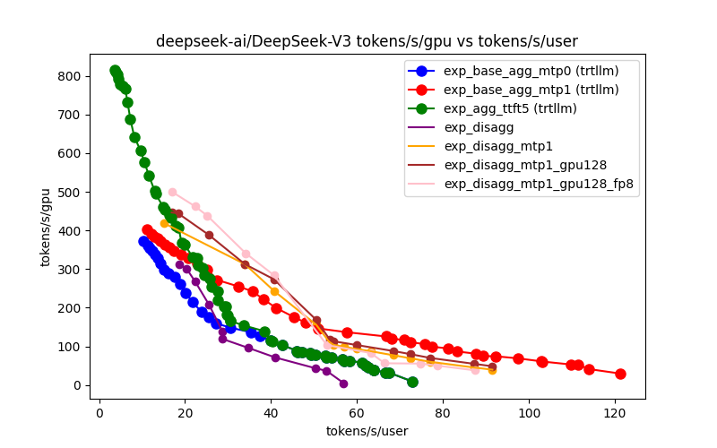
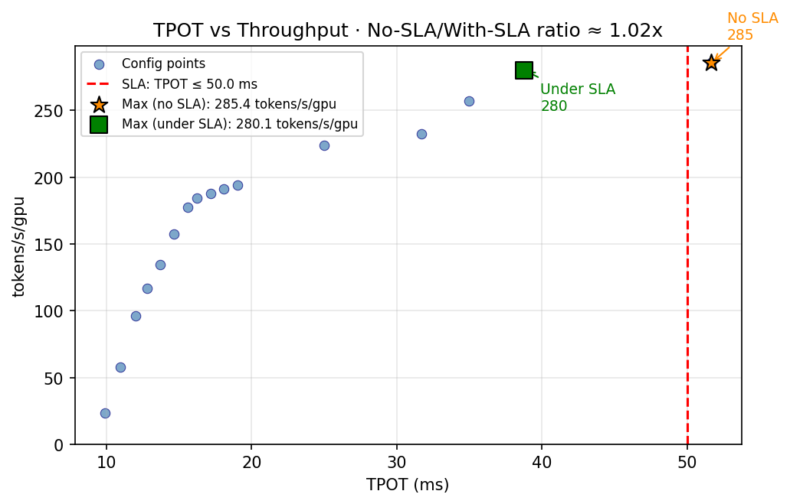

# 建模仿真

前两章已经分别回答了两个问题：超节点的系统能力边界为何会被打开，以及这些被打开的边界如何通过软件栈被兑现。但对白皮书而言，这还不够。真正决定方案比较能否成立的，是第三个问题：**当不同路线都宣称自己更快、更省、更开放时，我们究竟用什么尺度判断它们处在怎样的系统边界上。**

如果这个问题没有建立统一方法，后续关于互联、软件栈、参考设计和未来演进的讨论，最终都容易退回到规格表比较、单项 benchmark 对照，或者经验驱动的局部结论。建模仿真在全书中的位置，正是把这些离散、局部、易失真的观察，组织成一张能够支撑方案判断的边界地图。

公开研究和工程实践已经为这一问题提供了重要基础。训练侧有 `ASTRA-sim` 一类端到端分布式训练仿真框架，并通过 `Chakra` 这样的执行跟踪规约，将负载描述、并行策略与网络/内存后端解耦[^astra-sim-1][^astra-sim-2][^chakra]；自动并行领域有 `Alpa` 等系统，用成本模型在巨大配置空间中搜索给定目标下的更优策略[^alpa]；推理侧则有 `Orca`、`Sarathi-Serve` 等 serving 系统，把持续批处理、预填充/解码调度以及吞吐-时延权衡纳入统一优化框架[^orca][^sarathi]。这些工作说明，大模型基础设施的建模与推演已经形成了扎实的方法和工具基础。

但超节点决策的难点并不只是“把某一个点算得更准”，也不只是“在既定目标函数下找到一个更优点”。它面对的是更高一层的问题：**在吞吐、时延、成本、能效、可靠性、恢复代价和工程复杂度等多个目标同时冲突时，一组方案族的能力边界到底在哪里；哪些变化只是沿边界重新选点，哪些变化真正把边界向外推。**

## 帕累托前沿：超节点比较的共同语言 {#pareto-definition}

在多目标优化中，如果方案 A 在所有目标上都不劣于方案 B，且至少在一个目标上严格优于 B，则称 A **支配** B。不被任何其他方案支配的方案即为**帕累托最优解**，所有帕累托最优解在目标空间中的投影构成**帕累托前沿**（Pareto Front）。前沿内侧是当前方案族的可达域，前沿外侧是尚不可达的理想域；边界本身，就是系统能力的上限地图。

对超节点级系统比较，目标向量通常包含但不限于以下维度：

| 目标维度 | 训练侧典型指标 | 推理侧典型指标 |
|:---------|:--------------|:--------------|
| 吞吐 | step time, samples/s | tokens/s/GPU, tokens/s/MW |
| 时延 | 迭代同步延迟, 气泡率 | TTFT, TPOT, P95/P99 |
| 成本 | GPU·hours, $/converged-loss | tokens/10k_rmb, $/1M-tokens |
| 能效 | FLOPS/W, tokens/s/MW | tokens/s/kW |
| 可靠性 | Goodput / 理论峰值, MTTR | SLA 达标率, 可用性 |
| 工程复杂度 | 软件栈适配成本, 运维人效 | 部署周期, 混部管理开销 |

这些维度天然彼此拉扯。更高吞吐往往意味着更复杂的软件组织、更高功耗或更窄的部署条件；更低时延往往要为此付出成本和容量代价。因此，超节点选型的关键不再是“谁有一个最好的点”，而是“谁的边界更靠外、边界在什么条件下成立，以及应当在边界的什么位置取点”。从这个意义上说，帕累托前沿不是辅助分析概念，而是超节点比较的共同语言。

## 从单点测优到边界判断 {#methodology}

一旦把问题改写为“判断边界”，方法论也会随之收束。超节点级比较不可能依赖逐点精算，因为真实候选空间往往在数千甚至上万量级，而高保真推演或端到端实测的单点成本又足以让全空间穷举失去可行性。真正可行的路径只能是：**先用足够快的模型把边界大致描出来，再把有限的高成本验证资源压到最关键的区域。**

这意味着建模仿真首先不是在回答“某个配置到底快不快”，而是在回答四个更基础的问题：当前方案族在多目标空间中的位置究竟在哪里；哪些调整只是沿前沿重新分配权衡；哪些变化真正把可达边界向外推出；以及这些判断如何被沉淀为可持续更新的量化对象，而不是一次性实验结论。

如果只追问“最优点在哪里”，训练侧会得到一个更短的 `step time`，推理侧会得到一个满足 `SLA` 的更优吞吐，自动并行会得到一个更好的策略，系统工程则会得到一张局部 benchmark 胜负表。这些结果都有价值，但仍不足以支撑超节点决策。超节点真正关心的，是当比较对象从单个配置变成一组方案族时，**边界为什么在这里、边界是否可信、边界又是否发生了外移。**

围绕这一目标，本章的方法链条也就非常明确：负载模型定义需求侧压力，资源模型定义供给侧边界，系统模型把两者压缩成多目标空间中的离散候选点，校准验证负责在关键区域收紧误差，共演进闭环则把这些点沉淀为当前边界地图与未来边界变化假设。换言之，这一章试图建立的不是一台新的仿真器，而是一套能够持续服务超节点比较的分析能力。

从章节结构上看，本章前半部分用于建立这套方法的判断框架，后半部分则通过一个完整的推理架构案例验证这套框架是否真正可用。也就是说，案例并不是与方法并列的另一组知识点，而是整章方法论的收束与落地。

工业界实践已经充分说明这种视角的必要性。NVIDIA 在 Blackwell NVL72 技术白皮书中披露，仅在一个 72 卡机柜上部署 1.8T 参数 `MoE` 模型时，`TP`、`PP`、`EP`、`DP` 四个并行维度的组合就产生了超过 **2700 种候选配置**。这些配置在吞吐、延迟、显存占用、气泡率和能耗上各不相同，也不存在一种方案能够同时在所有指标上取胜。工程上真正需要回答的，不是“最好的配置是哪一个”，而是“哪一条前沿与业务约束最匹配，以及不同方案族的前沿相对位置究竟如何”[^icpe20-pareto-transfer]。

这一点在推理侧尤为明显。`TP/PP`、`batch`、量化、并行度、`KV` 策略和调度参数会迅速形成 \(10^4\) 量级的组合空间；延迟、吞吐、成本、显存、功耗和稳定性之间又天然冲突；突发流量、长尾分布和冷热模型混部则进一步让单点最优难以复用。帕累托分析真正提供的，不是一幅更复杂的图，而是一种“地图视角”：先剔除被支配区域，再分离可行域与不可行域，最后把不同团队的优化主张、线上观测和离线测试纳入同一坐标系比较。

在推理部署中，这张地图最常落到两类核心指标上：`tokens/s/user` 代表单请求路径的用户感知效率，`tokens/s/GPU` 或 `tokens/s/GPU/s` 代表系统级资源利用效率，也是成本与容量侧最敏感的变量。两者往往此消彼长，因此天然构成帕累托问题。只追求任一维度，都会在另一维度埋下隐性代价。

## 前沿不是静态的 {#pareto-frontier}

对白皮书而言，更重要的一点在于：帕累托前沿不是静态资产，而是系统进步是否真实发生的直接度量。所谓“边界外推”，就是整条前沿在多个维度上向更优方向平移，它至少来自两个典型来源。

第一类来源是代际硬件跃迁。以推理场景的 `tokens/s/user vs tokens/s/MW` 坐标系为例，Blackwell NVL72 相比 Hopper NVL8 在甜点配置上实现了约 25–40× 的综合提升，而 Rubin 平台又进一步在吞吐密度和单位 token 成本上将前沿整体外推[^nvidia-rubin-sim]。训练侧同样如此：训练 10T `MoE` 模型达到相同目标，Rubin 仅需 Blackwell 约四分之一的 GPU 数量。代际跃迁改变的不是前沿上的取点，而是前沿本身的上界。

第二类来源是同代硬件上的软件迭代。NVIDIA 在 2025 年 8–10 月间的 InferenceMax 基准测试中展示了一个典型现象：在同一 GB200 NVL72 硬件上，仅通过数周的软件迭代，GPT-OSS 推理模型的帕累托前沿就被推出了近 5×[^nextplatform-pareto-sim]。这一事实说明，边界并不能被视为一次测定后长期有效的稳态对象；如果软件栈、负载画像和运行条件持续变化，模型校准与边界更新就必须成为持续过程。

这一逻辑在后文的[方法论验证案例：异构推理架构的帕累托分析](case-inference.md)中得到了具体展开。该案例在 `L40S + A100` 的异构 `PD` 分离架构上，通过 4 种候选架构、3 类请求场景以及多并发、多配置的系统级扫描，描出了 `tokens/s/gpu` 与 `tokens/s/user` 坐标系下的帕累托前沿，再结合安全边际校准和成本敏感性分析，区分出哪些收益是稳健的、哪些只是局部改善、哪些变化真正把边界向外推移。下表概括了几类典型优化路径对前沿的影响：

| 优化路径 | 前沿变化特征 | 代表性数据点 |
|:---------|:-----------|:------------|
| MTP（Multi-Token Prediction） | 同硬件上沿吞吐轴外推，时延几乎不变 | tokens/s/GPU 提升 ~30–50%，TPOT 持平 |
| PD 分离（Prefill-Decode Disaggregation） | 打开新前沿分支：时延与吞吐可独立调优 | TTFT P99 降低 2–3×，吞吐密度提升 ~1.5× |
| FP8 量化 | 前沿整体平移：成本维度显著改善 | tokens/s/GPU 提升 ~1.8×，精度损失 <0.5% |
| 规模扩展（Scale-out PD 节点） | 沿前沿延伸但斜率递减：边际收益受网络约束 | 4→16 节点吞吐线性度 ~0.85，>32 节点降至 ~0.7 |

这些数字的意义并不在于给出一组固定答案，而在于说明方法本身如何工作: 它不再笼统地判断“哪条路线更好”，而是进一步追问“哪条路线沿哪个方向推动了边界、推动了多远、在什么约束下仍然成立”。

/// caption
不同技术路线对推理帕累托前沿的外推效应。`MTP`、`PD` 分离、`FP8` 量化和规模扩展不只是把某个点调得更好，而是在不同程度上把整条性能边界往外推。
///

/// caption
`SLA` 约束会直接改变可用前沿。红色虚线代表 `TPOT <= 50 ms` 的约束边界，它提醒我们：理论上更优的点，并不一定是工程上真正可交付的点。
///

## 从边界地图回到全书主线

当上述链条走完之后，沉淀下来的并不是几张零散图表，而是两类可以直接支撑全书后续判断的对象。

第一类是**当前边界地图**。在统一负载集、统一指标口径和统一校准基线上，不同参考设计位于边界的什么位置、分别适用于怎样的负载画像、理论前沿与工程可达前沿之间存在怎样的差距，以及当负载、软件栈或拓扑变化时边界会怎样移动，都应被组织为可比较的量化对象。有了这张地图，参考设计比较就不再是静态规格对照，而成为带条件、带风险、带适用边界的方案族位置关系。

第二类是**边界变化假设集**。在已校准的当前边界之上，光互联、`HBM4`、`Chiplet`、`MoE`、长上下文等变量会把前沿向什么方向推、多大程度上缓解现有瓶颈、又会在何处引入新的约束，应当以“带条件的变化假设”而不是“技术罗列”来表达。只有如此，未来演进的讨论才能建立在量化基线之上，而不是停留在抽象展望。

这两类结果也将本章与全书其余部分真正连起来：参考设计比较的是当前边界地图上的相对位置，未来演进追踪的是边界变化假设中的移动方向。至此，全书主线才形成闭环：先解释边界为何被打开，再解释边界如何被兑现，最后解释边界究竟在哪里、如何比较，以及它将如何继续移动。

[^nvidia-rubin-sim]: Kyle Aubrey. "Inside the NVIDIA Rubin Platform: Six New Chips, One AI Supercomputer." *NVIDIA Technical Blog*, Jan 2026. `https://developer.nvidia.com/blog/inside-the-nvidia-rubin-platform-six-new-chips-one-ai-supercomputer/`
[^nextplatform-pareto-sim]: Timothy Prickett Morgan. "Software Pushes The AI Pareto Frontier More Than Hardware." *The Next Platform*, Oct 2025. `https://www.nextplatform.com/ai/2025/10/21/software-pushes-the-ai-pareto-frontier-more-than-hardware/`
[^astra-sim-1]: Saeed Rashidi, Srinivas Sridharan, Sudarshan Srinivasan, and Tushar Krishna. "ASTRA-SIM: Enabling SW/HW Co-Design Exploration for Distributed DL Training Platforms." ISPASS 2020. `https://ieeexplore.ieee.org/document/9238637/`
[^astra-sim-2]: William Won, Taekyung Heo, Saeed Rashidi, Srinivas Sridharan, Sudarshan Srinivasan, and Tushar Krishna. "ASTRA-sim2.0: Modeling Hierarchical Networks and Disaggregated Systems for Large-model Training at Scale." ISPASS 2023. `https://arxiv.org/abs/2303.14006`
[^chakra]: MLCommons Chakra Working Group. "Chakra Schema and Tools." 2023-. `https://github.com/mlcommons/chakra`
[^alpa]: Lianmin Zheng, Zhuohan Li, et al. "Alpa: Automating Inter- and Intra-Operator Parallelism for Distributed Deep Learning." OSDI 2022. `https://www.usenix.org/conference/osdi22/presentation/zheng-lianmin`
[^orca]: Gyeong-In Yu, Joo Seong Jeong, Geon-Woo Kim, Sukjoon Lee, and Byung-Gon Chun. "Orca: A Distributed Serving System for Transformer-Based Generative Models." OSDI 2022. `https://www.usenix.org/conference/osdi22/presentation/yu`
[^sarathi]: Amey Agrawal, Nitin Kedia, Ashish Panwar, et al. "Taming Throughput-Latency Tradeoff in LLM Inference with Sarathi-Serve." OSDI 2024. `https://www.usenix.org/conference/osdi24/presentation/agrawal`
[^icpe20-pareto-transfer]: Pavel Valov, Jianmei Guo, and Krzysztof Czarnecki. "Transferring Pareto Frontiers across Heterogeneous Hardware Environments." ICPE 2020. `https://research.spec.org/icpe_proceedings/2020/proceedings/p12.pdf`
