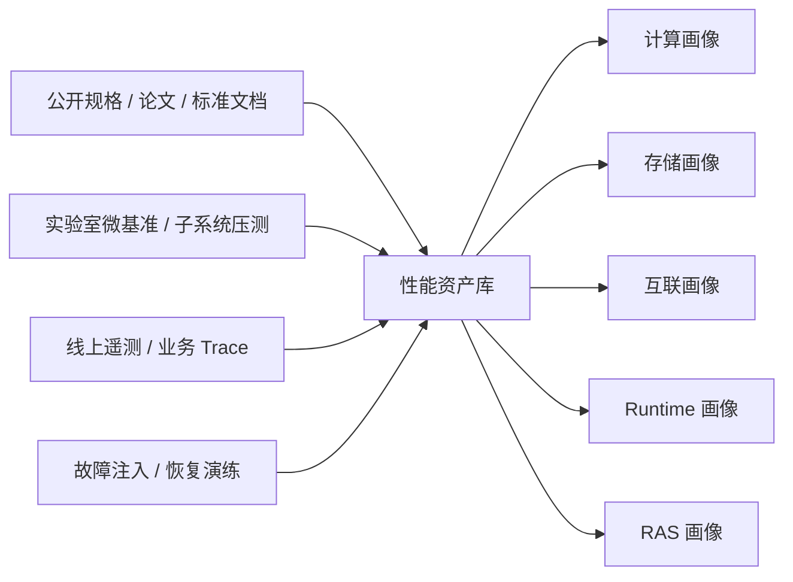

# 资源模型：把供给侧能力边界参数化

负载模型回答的是“系统需要承受什么压力”，资源模型回答的则是“系统到底能提供什么能力”。如果没有资源模型，系统仿真就只能在抽象的需求图上空转；如果资源模型只停留在规格表层面，又无法解释真实系统中的排队、抖动、尾延迟和恢复行为。

因此，本节的核心任务不是讨论“平台应该如何建设”，而是定义**供给侧能力边界如何被参数化、如何进入系统模型、以及哪些真实测量应被沉淀为资源画像**。性能资产库在这里不是独立目标，而是资源模型的承载形态。

## 资源模型回答什么问题

对第三章而言，资源模型至少要回答三件事：

1. **上界在哪里**：计算、存储、互联、Runtime 与 RAS 的理论能力边界是什么。
2. **代价如何体现**：当资源进入排队、拥塞、分页、重传与恢复状态时，性能和稳定性会如何退化。
3. **哪些参数可被系统模型直接调用**：系统模型在做映射与编排时，需要怎样的查询接口与粒度。

这意味着资源模型不是对硬件做百科式介绍，而是把硬件、软件运行时和运维行为抽象成一组可供系统模型调用的参数与曲线。

## 五类核心资源对象

对超节点而言，真正决定系统行为的供给侧对象至少有五类：

| 资源对象 | 建模重点 | 典型参数 |
|:---------|:---------|:---------|
| **计算资源** | 算子执行效率、精度模式切换、并发占用与功耗 | kernel latency、TFLOPS、occupancy、power |
| **存储资源** | HBM/DDR/NVMe 的层次访问成本与分页行为 | 带宽、访问时延、page miss penalty、swap latency |
| **互联资源** | 节点内、机柜内、机柜间的通信能力与拥塞代价 | P2P RTT、AllReduce/AllToAll 曲线、重传/排队开销 |
| **Runtime 资源** | 编译器、通信库、调度器、allocator 引入的固定与动态开销 | launch overhead、queueing delay、fragmentation、runtime jitter |
| **RAS 资源** | 故障检测、恢复与降级机制对可用性的影响 | detection time、recovery time、Goodput loss、availability |

这里特别需要把 `Runtime` 与 `RAS` 视为资源的一部分。对超节点来说，“供给侧能力”并不只是芯片算力和网络带宽，还包括这些能力能否被运行时稳定调度、能否在异常场景下继续兑现为 Goodput。

## 资源模型的分层粒度

并不是所有资源都需要以同一保真度进入模型。为了兼顾可解释性与建模成本，本章采用三级粒度：

| 粒度层级 | 典型来源 | 表达形态 | 适用场景 |
|:---------|:---------|:---------|:---------|
| **L1：解析层** | 公开规格、协议公式、Roofline、TCO 估算 | 参数表、解析模型、经验公式 | 快速扫空间、做大范围 what-if 推演 |
| **L2：画像层** | 微基准、子系统压测、collective benchmark、Trace 拟合 | 查表模型、分布画像、拟合曲线 | 支撑主要的方案比较与甜点区识别 |
| **L3：行为层** | 细粒度事件、故障注入、控制面日志、拥塞演练 | 时序模型、状态机、退化模式 | 解释尾延迟、控制面约束和灰色故障 |

三级模型并非竞争关系，而是服务于不同问题：

- 当问题是“某方案是否大致可行”，优先用 L1。
- 当问题是“两个方案在当前边界上谁更接近前沿”，优先用 L2。
- 当问题是“为什么理论上更优的方案在线上不稳定”，才进入 L3。

这种分层方式的价值，在于避免把第三章写成一个必须处处做包级仿真的“大而全平台说明书”。

## 性能资产库：资源模型的承载形态

资源模型并不天然存在，它需要被组织、测量和版本化。性能资产库正是资源模型的承载形态：它把不同来源的性能事实沉淀为可查询、可校准、可复用的资源画像。

/// caption
性能资产库不是独立于模型之外的“平台功能”，而是资源模型的具体承载形态。不同来源的事实最终都要沉淀成可供系统模型调用的资源画像。
///

在工程上，资产库至少需要支持三类能力：

1. **版本化存储**：同一指标必须携带硬件版本、软件版本、负载版本和测试条件。
2. **统一查询**：系统模型能够按 workload、topology、precision、message size 等维度直接调用资源参数。
3. **误差可追踪**：每个画像都能回溯到其证据来源与适用边界。

没有资产库，资源模型只能停留在零散表格；有了资产库，资源模型才可能持续更新并进入闭环。

## 资源版本与适用边界

为了防止“同名参数不可比较”，资源模型至少需要携带以下元数据：

- **硬件版本**：芯片 SKU、HBM 代际、互联协议、交换芯片型号、拓扑结构。
- **软件版本**：驱动、固件、编译器、通信库、训练/推理框架版本。
- **负载版本**：模型结构、输入长度分布、并行策略、精度模式、SLA 约束。
- **测量条件**：规模、环境温度、功耗上限、是否开启 QoS/重传/压缩等机制。
- **证据等级**：公开规格、实验室测试、试点环境、生产环境、故障演练。

这些元数据不是管理细节，而是资源模型成立的前提。因为超节点里很多关键参数并不是“设备属性”，而是“设备 × 软件版本 × 负载画像”共同决定的结果。

## 资源模型如何输入系统模型

资源模型最终必须回到系统模型的调用接口上。对系统模型而言，最重要的不是看到一堆原始测量值，而是能直接查询以下几类对象：

| 查询对象 | 系统模型需要的返回结果 |
|:---------|:-----------------------|
| **算子执行查询** | 在给定 shape、precision、batch 下的执行时间、并发占用与功耗 |
| **访存查询** | 在给定层次与访问模式下的带宽、时延与命中/缺页代价 |
| **通信查询** | 在给定拓扑、消息大小、并发度与算法下的耗时与拥塞开销 |
| **Runtime 查询** | launch、调度、分配与同步带来的固定与动态开销 |
| **RAS 查询** | 故障触发后检测、恢复、降级与重试带来的性能损失 |

只有当资源模型能以这种“可调用”的方式进入系统模型，第三章的链条才真正打通：负载模型给出需求，资源模型给出供给，系统模型据此推演行为。

## 对本章叙事的作用

在你定义的章节叙事中，资源模型的角色应当非常明确：

- 它不是“评测平台章节”的替代物。
- 它不是“未来路线图章节”的替代物。
- 它是第三章里承接负载模型与系统模型的中间层，是供给侧能力边界的参数化表达。

也正因为如此，资源模型必须足够克制：只回答“系统有哪些可供建模的能力与代价”，不提前替第四章做方案排序，也不提前替第五章做未来判断。那些判断应当由系统模型、校准验证和共演进闭环在后文统一收束。
