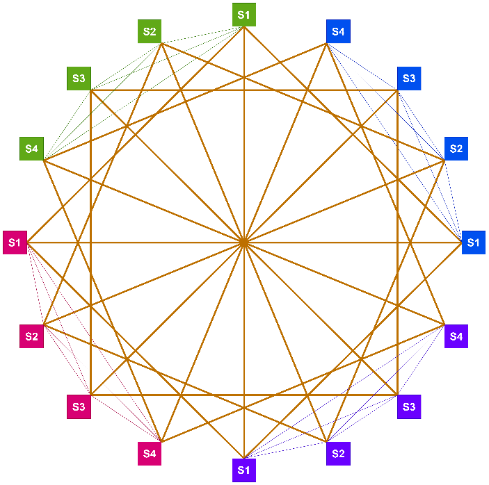

# 探索构型（Dragonfly + OCS 型）

Dragonfly 拓扑旨在实现高可扩展性和低网络争用。它结合了fat-tree和butterfly拓扑，使用交换机和链路的分层结构来互连 GPU。结构：Dragonfly拓扑由连接到本地交换机的GPU 组组成，这些GPU 又通过高带宽链路连接到其他交换机。这些组以最小化拥塞和最大化吞吐量的方式互连。Dragonfly 拓扑在可扩展性、性能和成本效率之间实现了平衡。它通常用于超级计算系统和大型集群，在大型系统中的 GPU 之间提供快速、直接的通信。但是，某些工作负载可能难以实施和优化，并且如果管理不当，层次结构可能会引入瓶颈。

/// caption
图 1: Dragonfly 拓扑结构示意图
///

## 光路交换 OCS

光路交换OCS(Optical Circuit Switching)具备全光交换优点，光信号完全透明传输，支持光纤中任意速率/任意调制格式/任意通信波长光信号交换，具有无时钟抖动，无延迟，不读取数据，无泄漏风险等特点。

## 谷歌 TPUv4 案例

光路交换有效地提升了谷歌TPUv4集群互连可靠性，在主机可靠性降到99.0%仍能保证TPU切片有较好的性能，可使系统的性能有显著提升。谷歌TPU的片间互连ICI（Inter Chip Interconnect）采用自定义网络堆栈，相对于以太网和InfiniBand，ICI具有低延迟和高性能。TPUv4 系统每台服务器有 8 个 TPUv4 芯片和 2 个 CPU。对于TPUv4，部署单元是更大的切片，由 64 个 TPU和 16 个 CPU 组成。这 64 个TPU通过直接连接的铜缆在 \(4^3\) 立方体中与 ICI 网络内部连接。在这个 64 芯片单元之外，通过光路交换实现了Pod内部和之间的可重构全光互连。

光路交换的一大优势是通过重构ICI光信号传输路径，可以完成任何切片之间的任意互连。光路交换互连网络开销在谷歌TPUv4系统中成本和功耗占比不到超算总成本的 5% 和总功率的3%，这些功耗和成本的节省非常可观。另外，光路交换互连网络还具有高灵活性和容错性，倘若发现部分芯片或ICI网络出错或者失效，光路交换可以动态调整互连和路由，从而绕过失效的部分，不影响整体功能。
