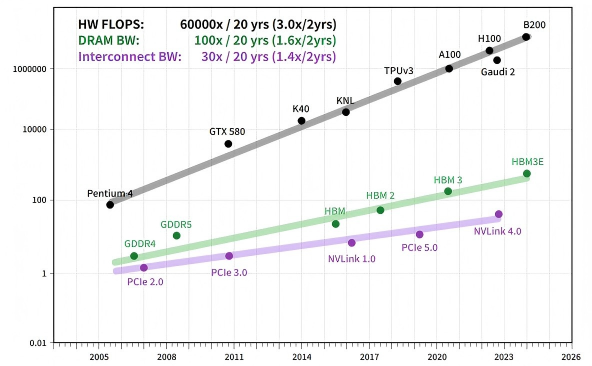

# 标准构型：总线全对等互联方案

总线型 Scale-Up 方案的共同目标，是在机柜级高带宽域内提供接近片内互联的内存语义能力：加速器之间可以直接执行 `Load/Store/Atomic`，而不必把所有通信都退化为消息传递。但如果把它仅仅理解为一种"低时延协议"，就会低估这条路线真正锚定的约束。更准确地说，标准总线构型优先保留的是：**把更多强语义访问稳定留在受控域内，让远端资源在软件上尽可能继续表现为本地资源。**

因此，这条路线的核心取舍并不是"带宽越高越好"，而是：**以原生内存语义和最低访存时延为优先约束，在此约束下争取开放生态与可扩展性。** 只要这个目标成立，`TP` 主导的细粒度同步、长上下文推理中的 `KV Cache` 共享、跨卡原子访问和显存池化都会显著受益；而一旦这一目标不能成立，系统就必须把更多代价转移给消息路径、DMA 搬运和软件运行时。

在当前产业格局中，这条路线并不只有单一协议实现。公开标准侧，以 `UALink` 为代表；厂商或联盟侧，也出现了 `HSL`、`UB`、`ALS-D` 等总线语义互联实践。它们在开放程度、规模能力与工程成熟度上各不相同，但共享同一设计哲学：**用总线的方式做互联，而不是用网络的方式模拟总线。**

## 锚定约束

超节点之所以需要总线型方案，根源并不只是“追求更高带宽”，而是系统必须先划清一条边界：哪些访问必须继续被看作强语义访问，而不能被退化成普通消息搬运。过去二十年，计算和存储持续高速演进，但互联带宽的提升明显滞后，导致系统整体越来越容易被跨卡访存与同步开销卡住。

/// caption
计算峰值与显存带宽的提升速度，长期快于芯片间互联带宽。这也是超节点需要更强 Scale-Up 互联语义的直接背景：如果互联不能同步演进，系统 Goodput 终将被跨设备通信而非单卡算力决定。
///

对于 `TP`、细粒度 `MoE All-to-All`、长上下文推理中的 `KV Cache` 共享等负载，问题尤为突出。此类场景不仅在意总带宽，更在意小粒度远端访问的时延、确定性和拷贝次数。以太型 Scale-Up 方案（`ESUN/SUE`）通过在以太网协议栈上叠加内存语义来逼近总线性能，但其本质仍然是“把网络尽量改造成总线”；总线型方案则试图从协议栈底层直接把这部分高价值访问留在一个更强约束的局部性边界内。

## 协议基础：总线语义协议族与 UALink 代表路线

标准总线构型不应被理解为某一家厂商的产品说明，而应理解为一类协议家族。它们通常具备以下共性：

- **原生内存语义**：支持 `Load/Store/Atomic`，而非只支持消息收发
- **固定或强约束 Flit 传输**：减少变长帧解析与缓存不确定性
- **统一寻址或扁平地址空间**：使远端显存访问尽可能接近本地编址
- **专用交换或专用总线域**：以交换芯片或近端互联构建低跳数高带宽域
- **更强的时延确定性**：面向小包、高频同步和跨卡显存共享

在这些路线中，`UALink 1.0` 是当前最适合作为公开代表进行分析的一条路线：规范公开、产业参与者广、技术边界清晰。其核心技术特征包括：

- **FAM（Flat Address Memory）架构**：将加速器显存映射到全局扁平地址空间
- **固定 640B DL Flit + 64B TL Flit**：降低帧处理复杂度，提升载荷效率
- **单通道 200 GT/s，四通道 800 Gbps 全双工**：物理层复用以太网 SerDes，链路与事务层自定义
- **64B 负载 RTT < 1 μs**：目标是把端到端远端访存控制在亚微秒量级
- **链路利用率约 93%**：通过固定 Flit、`LLR + CBFC` 等机制逼近专有总线效率
- **单 Pod 规模 ≤1024 加速器**：定义了单级交换域的目标边界

与 `ESUN` 的关键区别在于：`ESUN` 保留以太帧与以太交换生态，`UALink` 则放弃以太帧格式，转而使用专用 Flit 设计，以换取更低的转发时延和更高的有效载荷率。两者在物理层都可复用高速 SerDes，但链路层与事务层的架构哲学并不相同。

与此同时，也应看到总线型路线并不只存在 `UALink` 一种表达。部分厂商和联盟路线同样采用自定义 Flit、内存语义和专用交换域设计，但在开放程度、接口公开性和可复用生态上更为有限。将这些路线与 `UALink` 并列观察，可以更准确地理解总线型构型的真实边界：**它是一类方向，而不是单一产品。**

## 同步语义为何重要

总线型方案的核心价值，在于把跨卡访问从“异步消息搬运”尽可能前移为“同步内存语义访问”。这并不意味着消息语义会消失，而是意味着系统明确选择把一部分最昂贵、最依赖顺序、最不适合软件绕行的访问继续留在受控域内处理。对于小粒度、高频率、强依赖顺序的访问模式，这种选择可以显著减少显式拷贝、协议翻译和软件栈绕行。

| 对比维度 | 同步内存语义 | 异步消息语义 |
|:---------|:-------------|:-------------|
| 典型操作 | `Load/Store/Atomic/Barrier` | `Read/Write/Send/Recv/RDMA` |
| 发起主体 | CPU / GPU / XPU 直接发起 | CPU/GPU 配合 DMA 或通信引擎 |
| 执行特征 | 更强调完成顺序与可见性 | 更强调吞吐与异步重叠 |
| 典型粒度 | Cache line 到小块数据 | 页级到大块消息 |
| 优势场景 | TP、细粒度共享、远端显存访问 | EP/DP、大块数据搬运 |
| 主要代价 | 一致性与地址管理复杂 | 软件路径更长、拷贝和排队更多 |

这也是为什么总线型方案在 `TP-heavy` 训练、长上下文推理和显存共享场景中更具吸引力：它追求的不是把网络做得“尽量快”，而是把远端资源做得“尽量像本地资源”。从构型选择的角度看，它代表的是一种更激进的边界组织方式：优先守住语义，再去讨论生态与规模。

## 架构定义与组网方式

标准总线构型通常采用“加速器端口 + 专用交换域”的两级结构：

- **计算节点层**：GPU/XPU 通过片上或近端 PHY 接入总线域，暴露内存语义访问接口
- **交换层**：专用交换芯片承担 Flit 转发、地址路由、仲裁与流控，必要时支持多播或规约加速

以 `UALink 1.0` 为参照，机柜级部署的典型参数可概括如下：

| 参数 | 典型值 |
|:-----|:------|
| 单 Pod 加速器规模 | 64–1024 XPU |
| 单链路带宽 | 800 Gbps 全双工（四通道） |
| 交换层级 | 1 级（单级总线交换域） |
| 内存语义 | 原生 `Load/Store/Atomic` |
| 64B 负载 RTT | < 1 μs |
| 链路利用率 | 约 93% |
| 地址空间 | 全局扁平或统一编址 |

在更广义的总线型路线中，节点内也可能先采用直连拓扑，再向“节点内交换 + Pod 级交换”演进；而当规模从单 Pod 继续扩大时，通常需要回到“Pod 内总线 + Pod 间网络”的两级结构。这意味着总线型方案并不是无限外推的通用解，更适合作为超节点内部的高带宽域，而不是整个万卡系统唯一的互联层。

## 核心组件

### 专用交换芯片

总线型构型能否落地，最关键的不是协议文本，而是交换芯片是否就绪。对于这类方案，交换芯片不仅要转发数据，还要理解地址、流控、仲裁以及必要的规约语义，其角色更接近 `NVSwitch`，而不是传统以太交换机。

这也是 `UALink` 当前最大的现实约束。虽然 `UALink 1.0` 规范已经发布，但截至目前，产业界仍缺少公开量产的 `UALink` 交换芯片产品。换言之，`UALink` 在协议层已经成型，但在最关键的交换芯片层仍存在明显缺口。这一缺口直接决定了它目前更像“高潜力标准路线”，而不是“已被广泛部署的成熟工程选项”。

### 加速器侧 PHY / 互联引擎

总线型方案要求加速器在片上或封装侧集成对应物理层与事务引擎。与完全自研私有 PHY 相比，复用以太网或 `PCIe` 系列 SerDes 的路线更容易控制硅片成本，也更便于纳入现有高速接口生态。这也是 `UALink` 以及部分国内总线型协议都强调“复用成熟 PHY、重定义上层协议”的原因。

### 互联介质与整机形态

在 Pod 内部，互联距离通常控制在几米以内，以铜缆 `DAC`、背板或短距高速连接器为主；在整机设计上，则更强调低跳数、短路径和高密度布线。这类系统经常天然适配高密度刀片、背板直连或液冷机柜，但工程优势只有在专用交换芯片和配套管理软件同时成熟时才能真正兑现。

## 软件与控制面

总线型方案的软件栈与以太型方案存在根本差异，其编程模型更接近共享内存，而不是消息传递。也正因为如此，它对组织能力的要求并不止于做出交换芯片，而是要同时承接地址空间、一致性、通信库与故障域控制：

- **统一地址映射**：运行时需要管理全局地址空间，使上层框架能够透明访问远端显存
- **一致性策略**：在硬件一致性、目录一致性与软件管理一致性之间寻找平衡
- **集合通信库**：`AllReduce`、`All-to-All` 等操作需要针对 Flit 与内存语义做深度适配
- **RAS 与故障隔离**：总线域内单个端点或链路故障可能影响更大范围的一致性与可达性

### 与 CXL 的关系

总线型 Scale-Up 与 `CXL` 在内存语义层面存在交集，但定位并不相同：

- **CXL** 更强调 CPU-设备、内存扩展与池化场景
- **总线型 Scale-Up 协议** 更强调加速器间低时延、高带宽、细粒度访问

在实际超节点中，两者更可能是互补关系：总线型互联用于 Pod 内高性能加速器互联，`CXL` 用于 CPU-GPU 协同和内存池化。

## 行业实践与生态

从生态角度看，总线型路线大致可分为三类：

- **公开标准路线**：以 `UALink` 为代表，优势是开放性和跨厂商协同潜力，短板是交换芯片与系统化量产仍未成熟
- **厂商私有或半开放路线**：具备更强的端到端系统一致性，但生态复用和跨厂商兼容性较弱
- **兼容或衍生实现路线**：如兼容 `UALink` 数据面的系统方案，尝试在开放标准与本地化工程之间建立桥梁

对国内产业而言，这一路线的意义并不只在于“是否采用 `UALink`”，更在于是否能够建立一条不依赖专有封闭互联的总线型高性能路径。但与以太型方案不同，它的关键瓶颈并不在 NIC、光模块或运维软件，而在**专用交换芯片及其配套软件栈**。

## 帕累托视角分析

从取舍结构看，总线型方案更靠近这样一侧：**访存时延和内存语义完整性更强，但生态成熟度、供应链就绪度和运维便利性明显弱于以太型方案**。换句话说，它不是"更先进的网络"，而是把更大一部分高价值访问留在受控域内之后，自觉承担由此带来的硬件、软件和工程代价。

| 维度 | 帕累托位置 | 与以太型（ESUN/SUE）对比 |
|:-----|:----------|:------------------------|
| 访存时延 | 远端访问更接近总线语义 | 更适合细粒度共享与 `TP` 通信 |
| 内存语义 | 原生 `Load/Store/Atomic` | 以太型通常需要额外事务映射 |
| 有效载荷率 | Flit 设计下更高 | 省去标准以太帧的额外开销 |
| 生态成熟度 | 协议在推进，产品仍早期 | 以太交换和运维生态更成熟 |
| 供应链灵活性 | 取决于专用交换芯片 | 不如多厂商以太交换生态 |
| 运维复杂度 | 需要全新管理工具链 | 难以直接复用以太运维体系 |
| 适用负载 | `TP-heavy`、显存共享、长上下文推理 | 与以太型形成负载互补 |

关键权衡在于：总线型方案为了获得更完整的内存语义和更低的远端访存代价，必须接受专用交换芯片、专用软件栈和更高工程不确定性。在 `UALink` 交换机尚未成熟的前提下，这一路线目前更多是“帕累托前沿上的高价值位置”，而不是“已经完全兑现的成熟标准构型”。

因此，该方案在当前前沿上的最佳适配区域是：**以 `TP` 为主的稠密训练、需要跨卡显存共享的长上下文推理，以及强调非专有生态但又不能接受纯以太语义损失的高性能互联场景**。如果一个组织既把强语义访问看成必须保留在局部性边界内的系统对象，又具备建设专用交换芯片、统一地址空间和配套控制面的能力，那么这条路线才真正进入它的优势区间。

## W1/W2/W3 适配

| 负载画像 | 适配度 | 判断 |
|:---------|:------|:-----|
| **W1: Dense 训练** | 高 | `TP` 同步、显存共享和细粒度访问都更接近这一路线的优势区间。 |
| **W2: MoE 训练** | 中 | 当 `EP All-to-All` 占主导时，总线语义优势会被更高的软件与交换复杂度部分抵消。 |
| **W3: 长上下文推理** | 高 | `KV Cache` 共享、远端显存访问和时延确定性都更契合该构型。 |

## 局限与演进方向

- **交换芯片缺位**：`UALink` 最关键的现实短板不是协议本身，而是公开量产交换芯片尚未出现。这一点必须被明确写入工程判断。
- **规模外推有限**：总线域更适合做 Pod 内高带宽域，跨 Pod 后仍需借助 `Scale-Out` 网络。
- **一致性代价上升**：当规模扩大到数百卡以上，完全硬件一致性的代价可能迅速放大。
- **与以太型路线并存**：长期看，总线型与以太型很可能不是彼此替代，而是分别覆盖不同负载和不同成熟度区间。
- **国产化关键不在 PHY，而在交换芯片**：复用成熟 SerDes 并不困难，真正决定路线成败的是交换芯片、管控面与通信库的系统协同能力。
