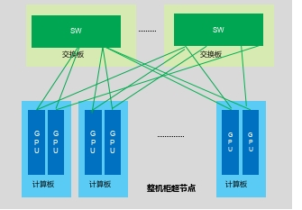
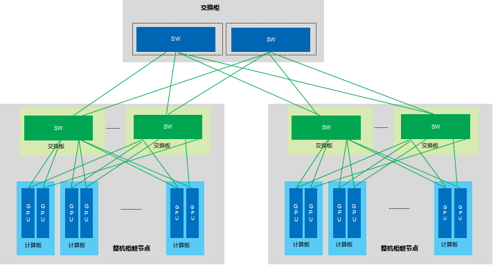

# 标准构型：以太全对等互联方案

如果说总线型方案试图以原生方式提供内存语义，那么以太型方案优先锚定的约束则更工程化：**在尽可能不放弃开放以太生态的前提下，把内存语义融合进标准交换网络。** 它以标准以太网物理层为底座，通过 `ESUN`（Ethernet for Scale-Up Networking）等增强协议在链路层和事务层引入低时延可靠传输与内存语义支持，构建机柜级全对等高带宽域。

从构型选择的角度看，这条路线并不是单纯的"开放协议方案"，而是在主动做一个取舍：**接受部分语义与时延让步，换取供应链连续性、运维连续性和跨厂商协同能力。** 它把兼容开放以太生态放在更前的位置，并在这一前提下尽可能逼近总线型互联的延迟与语义能力。

## 锚定约束

总线型方案已经说明，超节点真正需要的并不只是更高带宽，而是更接近“远端资源像本地资源”的访问体验。但问题在于，原生总线语义虽然更强，却往往伴随专用交换芯片、专用软件栈和更高的工程不确定性。对于需要兼容多种加速器、复用现有以太网管理运维体系、或在采购中避免单一供应商锁定的组织而言，一个基于开放标准的 Scale-Up 互联路径同样是刚需。也就是说，这条路线从一开始就不是在追求语义最强，而是在追求**产业连续性条件下可接受的最优解**。

然而，传统以太网并非为这类场景设计。标准以太帧头开销大、没有原生内存语义，也缺乏面向超低时延 Scale-Up 域优化的链路级可靠传输。因此，以太型路线的核心不是与总线型路线重复，而是通过“**以太网 PHY + 增强链路层 + 内存语义事务层**”的叠加，把标准以太交换网络改造为能够承载内存语义的 Scale-Up 域。`ESUN` 及其配套实现（如 Broadcom `SUE-T`）正是为解决这一问题而生。它真正试图守住的，不是所有语义都原生，而是**在不重建整个产业链的前提下，把足够多的高价值访问重新拉回受控域内。**

## 协议基础：ESUN 与 SUE

ESUN 于 2025 年 OCP 全球峰会由 NVIDIA、AMD、Broadcom、Cisco 等联合发起，定位为面向 AI Scale-Up 场景的开放技术协作平台。其核心增强包括：

- **帧格式精简**：在标准以太帧基础上仅增加 4 字节，有效载荷率显著提升，对 AI 训练中高频小数据包（梯度同步、参数聚合）的传输效率改善明显
- **链路级可靠传输（LLR + CBFC）**：逐跳重传替代端到端重传，消除 PFC 死锁风险，在拥塞场景下维持稳定吞吐
- **内存语义事务层**：支持 Load/Store/原子操作映射，使加速器间可通过标准以太网实现远端显存直接访问
- **单跳延迟 250–500 ns**：相比传统 RoCEv2 的微秒级延迟，显著缩小了与 NVLink（<100 ns 单跳）的差距

Broadcom 的 SUE-T（Scale Up Ethernet - Transport）是 ESUN 的首个工业实现，将帧头进一步压缩至 10 字节，支持事务动态打包（上限 2 KB），配合 Tomahawk Ultra 交换芯片实现 204.8 Tbps 整机柜互联带宽。

## 以太 Scale-Up 协议全景

ESUN/SUE 并非孤立的技术点，而是一条正在形成规模效应的协议簇的组成部分。自 2024 年起，国内外多条以太 Scale-Up 技术路线几乎同步爆发，共同指向同一个工程判断：**以太网物理层 + 增强链路层 + 内存语义事务层的三层叠加，是在开放生态约束下逼近专有总线性能的帕累托最优路径**。

下表列出当前主要的以太 Scale-Up 协议及其关键参数：

| 协议/方案 | 发起方 | 支持规模 | 核心技术亮点 | 典型延迟/带宽 |
|:----------|:------|:--------|:-----------|:------------|
| **SUE** | Broadcom / OCP（2025） | ≤1024 XPU | AFH 10 字节精简帧头、CBFC、LLR | <400 ns RTT，9.6 Tbps/卡聚合 |
| **ESUN** | OCP（2025） | 灵活（与 SUE 配合） | 开放以太帧/无损/帧头优化、互操作 | 结合 SUE 实现低开销 |
| **UEC** | UEC 联盟（2026 v1.0.2） | AI/HPC 百万主机 | 传输层优化（AI Base/Full/HPC 剖面）、包修剪、拥塞控制 | 优化小包 + 低尾延迟 |
| **ETH-X** | ODCC / 腾讯（2024–） | 单柜 64+，扩展万卡 | RoCE 开放 Ethernet、背板连接器、风液混合 | 204.8 Tbps/柜 |
| **ETHLink** | 字节跳动（2025） | ≤1024 | 标准以太帧 + 6 字节 OEFH 精简头部、LLR、CBFC | <400 ns 端到端，单 GPU ≥800 GB/s |
| **CLink** | 工信部 / 电子四院（2025） | ≤1024 | 支持标准以太帧及头部优化、LLR、CBFC、轻量化 FEC | 单端口 400G/800G，整机带宽 TB 级 |

这些协议的核心共性可以归纳为"寄生在标准以太网之上"：

- **物理层**：100% 或高度复用 IEEE 802.3 SerDes（112G / 224G PAM4），支持标准 OSFP / QSFP-DD 端口、CPO / LPO 光模块与 Retimer——不需要定制物理层硅片。
- **链路层**：前 14 字节（DA 6B + SA 6B + EtherType 2B）结构保持不变，仅重定义字段含义或插入轻量自定义头；FCS/CRC 保持标准。交换机可直接转发，无需专用 ASIC 或固件修改。
- **事务层**：各协议在以太帧之上叠加内存语义映射（Load/Store/Atomic），但映射方式和帧头压缩策略各有侧重。

这种"物理层全复用 + 链路层最小化改动"的策略，使以太型方案在帕累托空间中的生态成熟度维度具备结构性优势：全球数据中心以太网的庞大供应链、开源软件栈和运维经验可以直接继承，无需承担协议栈重建的生态迁移成本。换言之，这条路线把更多代价留给了协议增强和软件适配，而不是把代价一次性前推到交换芯片和整套运维体系重建上。

从产业趋势看，国际层面 ESUN、SUE 与 UEC 三条路线正逐步融合为层次清晰、接口统一的开放协议族；国内层面 ETH+、ETH-X、ETHLink 等方案正加速向 CLink（工信部主导的统一互联标准）收敛。这一趋同过程本身就是帕累托前沿在生态成熟度维度上的外推：协议碎片化减少意味着供应链集中度下降、互操作性提升、软件适配成本摊薄。

从工程方法看，这条路线最值得强调的原则可以概括为“**最大化复用、最小化创新**”: 不重新发明物理层、不重建交换机生态、不推翻既有运维体系，而是在标准以太网之上补齐 Scale-Up 所需的低时延、可靠传输与内存语义能力。也正因为如此，以太型方案的竞争力并不只是来自某一条协议参数，而是来自整套现成产业链被整体接入超节点的能力。

## 架构定义与组网方式

该构型采用典型的两级组网结构：

- **计算接入层**：GPU/XPU 节点通过 ESUN-capable 网卡（或片上集成以太网端口）接入交换网络。网卡负责 ESUN 链路层协议处理、内存语义映射与 RDMA 卸载。
- **交换层**：高基数以太交换机（如 Broadcom Tomahawk Ultra，51.2 Tbps，128×400G 或 64×800G）构成域内全对等互联 Fabric。单级交换即可覆盖数百至上千个加速器端口。

在机柜级部署中，典型配置为：

| 参数 | 典型值 |
|:-----|:------|
| 单 Pod 加速器规模 | 64–1024 XPU |
| 单端口带宽 | 400G / 800G / 1.6T（演进） |
| 交换层级 | 1 级（Fat-Tree leaf）或 2 级（Spine-Leaf） |
| 域内二分带宽 | 1:1 全对等（单级），或可配置超额比（双级） |
| 单跳延迟 | 250–500 ns |
| 整机柜聚合带宽 | 204.8 Tbps+（Tomahawk Ultra） |

/// caption
整机柜高带宽域（HBD）内部组网示意。计算节点通过柜内交换层形成低跳数全对等互联，目标是在单柜范围内把多卡系统组织成一个可统一调度的高带宽域。
///

对于 64–256 卡规模，单级全对等交换即可满足需求；当规模向 512–1024 卡扩展时，需要引入 Spine-Leaf 两级拓扑，此时网络直径从 1 跳增至 3 跳，尾延迟与拥塞管理的复杂度相应上升。这也说明，以太型构型并不追求把所有高价值通信都永久锁在最小边界内，而是愿意在可接受范围内让边界随规模自然扩张。

### 纵向扩展：从 HBD 到多柜互联

以太型方案的规模扩展不止于单机柜。以整机柜超节点构建的高带宽域（HBD, High Bandwidth Domain）为基本单元（覆盖 32–64 卡），可通过 Scale-Up 交换柜实现纵向扩展——区别于通过参数面 Scale-Out 的横向扩展方案——构建更大规模的高带宽域，最大可支持 8192 卡。

/// caption
多个高带宽域通过交换柜实现纵向扩展示意。该结构保留了单个 HBD 内部的低跳数互联特性，同时通过上层交换完成从单柜到多柜的平滑扩展。
///

这种纵向扩展的关键在于：HBD 内部保持全对等单跳互联的低延迟特性，HBD 间通过交换柜引入的额外跳数被控制在可接受范围内。从帕累托视角看，这是在规模维度上的外推——以少量延迟让步（多 1–2 跳）换取规模从千卡级向万卡级的提升，同时保持以太生态的核心优势不变。

## 核心组件

### 以太交换芯片

交换芯片是该构型的性能瓶颈所在。当前 Broadcom Tomahawk Ultra（51.2 Tbps）是首个原生支持 ESUN/SUE 的量产交换芯片。关键能力包括：

- LLR + CBFC 硬件卸载，保证链路级可靠传输不依赖软件栈
- 低排队延迟的 Cut-through 转发，支持 AI 场景的尾延迟敏感流量
- 内存语义事务层处理（SUE-T），使交换机不仅转发数据包，还能理解和路由内存访问请求

### 智能网卡 / 片上以太引擎

加速器侧需要支持 ESUN 协议栈的网络接口。两种实现路径：

- **外挂智能网卡**：如 Broadcom Thor 系列，通过 PCIe 接入加速器，负责 ESUN 协议处理与 RDMA 卸载。优势是加速器无需修改硅片设计，劣势是 PCIe 成为额外延迟瓶颈。
- **片上集成**：加速器芯片直接集成以太 MAC + ESUN 协议引擎，消除 PCIe 中转开销。NVIDIA Blackwell 已在片上集成 NVLink 与以太双模端口，后续加速器也可能原生支持 ESUN。

### 光模块

机柜内铜缆 DAC（≤3m）可覆盖大部分连接；机柜间或更长距离则需要 400G/800G 光模块。随着 LPO/NPO 成熟，光模块功耗与成本将持续下降。

这一点也是以太型方案的重要现实优势。由于底层接口、模块形态和布线体系都高度复用数据中心既有标准，整机集成时不需要为超节点单独发明一整套连接器、光模块和维护流程，这使其在交付周期、备件体系和长期运维上更具确定性。

## 软件与控制面

以太型方案的核心优势之一是可复用成熟的以太网管理生态。这一优势不是抽象的"生态兼容"，而是可以具体落实到每一个软件组件上。它代表的是另一种组织方式：不要求组织从零重建一个总线世界，而是在既有数据中心软件体系中逐步吸收 Scale-Up 语义。

### 网络操作系统：SONiC 原生支持

SONiC（Software for Open Networking in the Cloud）已成为以太型 Scale-Up 方案的事实标准网络操作系统。SONiC 2025.11 版本原生支持 LLR（链路层重传）、CBFC（基于信用流控）等 Scale-Up 关键特性的配置接口及 SAI 抽象层扩展。这意味着：

- SUE / ESUN 可直接在 SONiC 上运行，通过 SAI 扩展实现协议特性配置
- ETH+ / ETH-X 联盟成员已向 SONiC 社区贡献驱动，标准 SONiC 版本即可实现全生命周期管理
- 全球主流云服务商（Microsoft Azure、Meta、阿里云、腾讯云等）均已规模化部署 SONiC，新增 Scale-Up 协议只需简单配置变更即可纳入现有运维体系

### 管理接口与可观测性

所有以太 Scale-Up 协议均通过标准 SAI（Switch Abstraction Interface）暴露南向接口，支持 gNMI / Redfish 北向监控，实现配置、监控和告警统一。SNMP、DMTF Redfish、Prometheus 等现成运维工具直接可用，无需定制开发。

### 拥塞控制与可靠传输

ESUN 的 LLR + CBFC 在链路层保证可靠传输，端到端层面可叠加 ECN 反馈与速率控制。UEC 进一步定义了面向 AI 场景的传输层优化（AI Base / Full / HPC 三种剖面），为不同负载画像提供差异化的拥塞控制策略。

### 集合通信库与框架集成

NCCL / RCCL / HCCL 等主流通信库需要适配 ESUN 的内存语义接口，使 AllReduce、All-to-All 等集合操作能利用 Load/Store 路径而非传统 RDMA verb。值得强调的是，PyTorch、Megatron、vLLM 等主流框架无需代码修改，直接调用集合通信库标准接口即可透明适配——协议层对上层应用完全透明。

### 拓扑感知调度

在多级交换拓扑中，调度器需要感知 Spine-Leaf 结构，将通信密集的 GPU 组放置在同一 Leaf 下以减少跨级流量。

这套"SONiC + SAI + 标准运维工具 + 通信库透明适配"的软件栈，使现有网络运维团队无需重新学习，监控策略、故障定位方法论、负载均衡算法与自动化运维工具全部复用。这正是以太型方案在帕累托空间中软件复杂度维度上获得最高评分的根本原因。它的价值不止于"更容易部署"，而在于把组织能力门槛显著压低，使更多团队有机会进入超节点构型选择的有效区间。

换句话说，以太型方案的软件优势并不只是“能跑起来”，而是它能够在现有数据中心软件体系中被低摩擦吸收：驱动、管理接口、监控指标、告警路径、自动化工具和运维组织都可以延续既有经验。这种工程连续性，正是它相对于总线型方案最强的现实护城河。

## 行业实践与生态

ESUN 的生态优势在于其联盟基础：OCP 背书，NVIDIA、AMD、Broadcom、Cisco 等主要厂商参与。这使其具备成为事实标准的潜力。但以太 Scale-Up 生态远不止 ESUN 一家——多条技术路线的并行探索恰恰是该方案生态活力的证明。

### 国际路线

**SUE（Broadcom）**：采用轻量协议框架 + AFH（AI Forwarding Header）头部复用策略。AFH Gen2 仅 6–12 字节，将 MAC 地址压缩为 XPU ID + Hop Count + Entropy 字段，支持端口灵活配置与可编程。通过 CBFC 替代传统 PFC、LLR 实现零丢包、单跳交换优先级调度。Broadcom 已将 SUE 贡献至 OCP 社区，当前演进为 SUE-T（传输层规范）与 ESUN（底层以太网框架增强）双轨架构，通过 Tomahawk Ultra + SUE-T 提供从交换芯片到智能网卡的端到端解决方案。

**ESUN（OCP）**：定位为面向 AI Scale-Up 场景的开放技术协作平台。NVIDIA 以联合发起方身份参与，Spectrum-X 平台已支持以太网 Scale-Up 场景，后续有望原生集成 ESUN。ESUN 的核心价值不在于定义全新协议，而在于提供互操作框架——使不同厂商的 Scale-Up 增强协议能够在同一以太网底座上协同工作。

**UEC（Ultra Ethernet Consortium）**：2026 年 1 月发布 v1.0.2 规范，是业界最为广泛认同的基于 RoCEv2 增强的网络技术规范。UEC 定义了 AI Base / Full / HPC 三种传输剖面，支持包修剪与拥塞控制优化。其最初聚焦 Scale-Out 场景，但已明确将推广应用到 Scale-Up 领域，有望成为统一 Scale-Up 与 Scale-Out 传输层的关键桥梁。微软、谷歌等主要云厂商均为核心成员。

### 国内路线

国内以太 Scale-Up 生态的爆发速度与技术成熟度是该方案帕累托定位的重要支撑。多条路线在不同维度上各有侧重：

**ETH-X（腾讯 / ODCC）**：采用"硬件架构重构优先、协议层最小化改动"的策略。复用标准 RoCEv2 与现有 RDMA verbs 接口，通过整机柜架构创新（Compute Tray + Switch Tray 背板设计）实现单跳低延迟，避免协议栈深度定制带来的生态碎片化。代表产品包括华勤 ETH-X AI RACK、锐捷 ETH 128 等，单柜聚合带宽达 204.8 Tbps（可扩展至 409.6 Tbps）。

**ETHLink（字节跳动）**：采用分层解耦设计，将 Scale-Up 语义层与网络转发层分离。OEFH（Optimized ETH-Link Forwarding Header）仅 6 字节，取代传统 ETH + IP + UDP 头部叠加开销；RH（Reliability Header）实现硬件级端到端重传。原生支持 Load/Store 内存语义与 RDMA verbs 双语义映射，在小包场景效率优势显著。

**ETH+（阿里）**：通过报文头压缩与机会性拼包将有效载荷比提升至 74%（小包场景）；链路层 LLR + 物理层重传协同 + RDMA 网内计算（CCA）卸载。其核心目标是统一 Scale-Up 与 Scale-Out 技术底座，避免异构网络割裂。首款国产 400G 全支持方案，已开源协议 IP。

**CLink（工信部 / 电子四院）**：构建兼容以太网、支持多级拓扑与低延迟高带宽的加速器互连协议，融合 FEC、LLR 重传、多重拥塞控制与在网计算。CLink 的定位不是又一个竞争协议，而是融合统一国内主流类以太 Scale-Up 协议的国家标准，正在成为国内各方案收敛的终点。

### 生态格局

对于国产加速器而言，以太型方案的门槛显著低于专有总线——无需自研交换芯片，可直接采购商用以太交换机（Broadcom、Cisco、Marvell、中兴、华为、盛科等多厂商可选），重点投入在网卡侧的协议适配与通信库优化上。这种"硬件全复用 + 软件全兼容"的策略，使超大规模云服务商及数据中心运营商得以复用现有技术栈与供应链体系，平滑演进至万卡级 Scale-Up 超节点。

## 帕累托视角分析

从取舍结构看，以太型方案更靠近这样一侧：**生态兼容性和可运维性更强，但在绝对延迟和带宽密度上需要让出部分空间**。它不是"总线型的低配替代"，而是一种更强调产业连续性和组织连续性的局部性边界组织方式。

| 维度 | 帕累托位置 | 与专有总线（NVLink）的差距 |
|:-----|:----------|:------------------------|
| 单跳延迟 | 250–500 ns | NVLink <100 ns，差距 3–5× |
| 域内带宽密度 | 204.8 Tbps/机柜 | NVL72 130 TB/s，量级可比 |
| 内存语义完整性 | 支持 Load/Store/Atomic | 接近 NVLink 语义能力 |
| 生态开放性 | 完全开放（OCP 联盟标准） | NVLink 封闭 |
| 供应链灵活性 | 多厂商可选 | NVIDIA 单一来源 |
| 运维复杂度 | 复用以太网运维体系 | 需要专有工具链 |
| 软件生态成熟度 | 通信库适配中，尚未完全成熟 | NCCL 深度优化 |

关键权衡：以太型方案为了兼容开放生态，在延迟上付出了 3–5× 的代价。对于 TP（张量并行）这类对单跳延迟极度敏感的通信模式，这一差距会直接转化为 Goodput 损失。但对于 EP（专家并行）和 DP（数据并行），带宽总量比单跳延迟更重要，以太型方案的竞争力显著提升。

因此，该方案在帕累托前沿上的最佳适配区域是：**以 EP/DP 为主的 MoE 训练、中等规模推理集群、以及需要多厂商加速器混部的场景**。如果一个组织首先要守住的是供应链灵活性、运维连续性与跨厂商协同，而不是把每一类强语义访问都留在最小受控域内，那么这条路线往往会成为更现实的选择。

## W1/W2/W3 适配

| 负载画像 | 适配度 | 判断 |
|:---------|:------|:-----|
| **W1: Dense 训练** | 中 | 可以支撑大规模训练，但在 `TP` 主导的强耦合同步上仍会承受额外时延代价。 |
| **W2: MoE 训练** | 高 | `EP/DP` 主导时，生态连续性、规模扩展和多厂商协同优势更容易转化为系统收益。 |
| **W3: 长上下文推理** | 中高 | 若更看重混部、运维连续性与资源弹性，该路线具备现实吸引力；若极度追求远端访问语义，则不如总线型。 |

## 局限与演进方向

- **延迟瓶颈**：250–500 ns 的单跳延迟对 TP-heavy 负载仍有明显影响。随着 ESUN 规范持续优化与交换芯片代际演进，这一差距有望收窄至 2× 以内。
- **软件成熟度**：ESUN 内存语义的通信库适配仍在早期，NCCL 等主流库对 ESUN 的原生支持尚未完全就绪。
- **交换芯片瓶颈**：当前仅 Broadcom 有量产的 ESUN 交换芯片，供应链集中度有待改善。
- **演进路径**：ESUN 的物理层与以太网完全兼容，随着 800G→1.6T 以太网演进，域内带宽将同步提升。长期看，ESUN 与 CPO（共封装光学）的结合有可能在功耗和密度上进一步外推帕累托前沿。

### 协议趋同与产业展望

2026 年标志着以太 Scale-Up 产业从"技术验证与场景落地"向"规模化量产与生态深度融合"的关键转折。产业发展主线呈现多维并进特征：带宽能力持续跃升（800G→1.6T）、协议栈层级统一（传输层 UEC + 链路层 ESUN/SUE + 物理层 IEEE 802.3）、光电互连深度融合（CPO / LPO / NPO）、标准体系逐步收敛。

国际层面，ESUN、SUE 与 UEC 三大路线正形成层次清晰的分工——UEC 覆盖传输层，ESUN/SUE 覆盖链路层与帧格式，IEEE 802.3 覆盖物理层——使"开放以太 Scale-Up 协议族"不再是松散的方案集合，而是一套可互操作的分层架构。国内层面，各技术方案加速向 CLink 收敛，构建自主可控的算力互联技术底座。

从帕累托演进的角度看，这一协议趋同过程正在改变以太型方案的前沿位置：协议碎片化的减少使供应链集中度下降、互操作性提升、软件适配成本摊薄，进一步巩固了该方案在生态成熟度维度上的前沿优势。同时，1.6T 以太网与 CPO 的结合有望在带宽密度和功耗维度上实现新的外推，使以太型方案在帕累托空间中覆盖更宽的区域。
