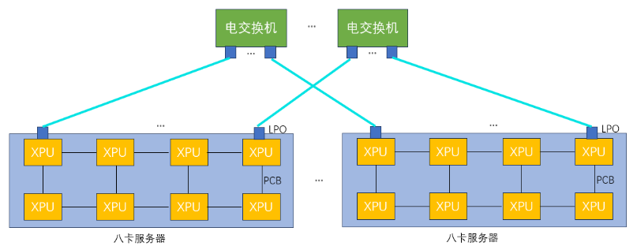
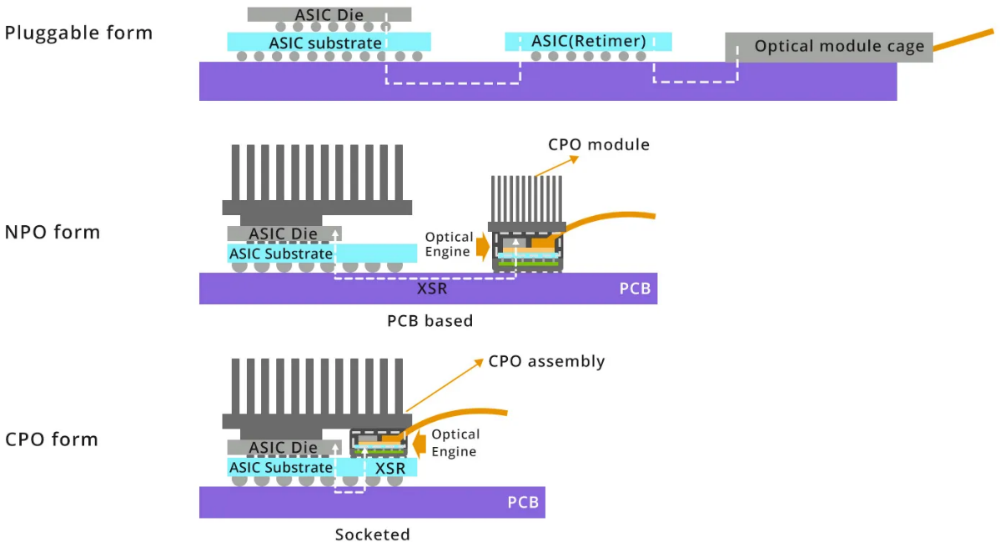

# 探索构型（3D Torus + OCS 型）

以太互联 + 3D Torus + OCS 弹性配置，设计目标在于邻近通信友好、可重构的光交换增益。本节介绍基于分布式光路交换（dOCS）的超节点互连方案。

## dOCS（分布式光路交换）技术

dOCS（distributed Optical Circuit Switching）模块指将光电路交换（OCS）能力分布式集成到可插拔光模块内部的互连器件，使单个光模块同时具备高速光互连传输（光模块基本功能）和线路级/通道级的动态交换与重构能力（OCS功能）。

该范式在 SIGCOMM 2025 《InfiniteHBD: Building Datacenter-Scale High-Bandwidth Domain for LLM with Optical Circuit Switching Transceivers》论文中首次被明确提出并命名为 transceiver-centric HBD architecture：在收发器层统一"连接 + 动态交换"，而不是"收发器点到点 + 依赖集中式交换机做动态交换"。

光互连光交换dOCS超节点方案基于分布式光交换芯片与光互连网络架构，其核心技术包括：

1. **基于硅光的光互连光交换dOCS芯片**：传统OCS技术一般采用MEMS或者DLC等技术，dOCS芯片采用硅光技术，可利用成熟的CMOS工艺，实现更小的尺寸、更低的成本、更高的可靠性。

2. **全光互连光交换替代电互连电交换**：传统Scale-up网络依赖电交换机（如PCIe或以太网交换机），受限于铜线传输的距离与包交换带来的延迟限制。而光互连光交换dOCS芯片，通过光信号直接传输数据，突破传统电互连的物理带宽与延迟瓶颈。并且由于无包交换处理，链路传输延迟得到大幅降低。

3. **分布式光交换拓扑**：通过部署多颗光互连光交换dOCS芯片（每颗芯片支持多路光信号交换），构建可扩展的光交换网络。例如，32卡超节点通过100多颗分布式光互连芯片互连，形成灵活的拓扑结构。

## 线性直驱光模块（LPO）

线性直驱光模块（Linear-drive Pluggable Optics, LPO）是一种在数据链路中仅使用线性模拟元件的光通信技术，省去了传统光模块中的数字信号处理（DSP）和时钟数据恢复（CDR）芯片。这种设计使得LPO在功耗和成本上相较于传统光模块有了显著的优势，特别适用于短距离、高带宽、低功耗和低延迟的数据通信场景。

### LPO技术优势

首先，LPO的设计省略了DSP和CDR芯片，直接减少了光模块的功耗。这一优化不仅使得LPO在功耗上表现出色，而且在长期使用中可以大大减少散热问题，延长设备的使用寿命。低功耗特性尤其适合数据中心、大规模计算集群等高密度计算环境。

其次，LPO去除了DSP和CDR等复杂组件，这使得光模块的物料成本降低了20%到40%。传统的光模块依赖于这些复杂的数字处理元件来确保信号的质量和可靠性，而LPO通过简化设计，减少了这些高成本部件，从而降低了整体生产成本。

此外，LPO对协议具有透明性，意味着它能够兼容不同GPU厂商的计算互连协议，不依赖于特定的协议栈。这一特性大大提升了LPO的兼容性和灵活性，使其在多种不同硬件平台和技术架构下均可稳定运行。

/// caption
图 1: LPO线性驱动可插拔光学技术
///

## 16卡超节点互连方案

目前主流的国产算力通常是单机8卡内部直连形成超节点规模为8的系统。通过横向扩展集群规模提升整体算力的方式受到全局批量大小不能无限增长的限制，导致在集群规模增大到一定程度后，有效算力出现明显下降。模型参数量增大需要更大的模型并行规模，模型并行中张量并行或混合专家类型的专家并行都会在计算模块之间产生大量的通信，并且这部分通信很难与计算进行重叠。通过构建更大的超节点，以纵向提升的方式提升系统算力是解决上述问题的有效途径之一。

通过LPO进行光直连可以拓展到16卡超节点。在国产电缆盒成熟之前，单机柜内的互连，LPO也是一个比较好的解决方案。另外，通过简单的LPO直连可以验证LPO在XPU互连中的应用，为更复杂的互连网络打下坚实基础。

如图所示，通过LPO光模块可以不受距离限制将传统的八卡服务器连成16卡组成的超节点（以下图为例组成但不限于二维环绕拓扑），二维环绕拓扑具有高扩展性和高吞吐量。

/// caption
图 2: 16卡超节点LPO光直连方案
///

通过LPO光模块直连可以将16卡连成一个整体，相比传统的8卡机内互连然后再通过网卡互连，16卡超节点可以提高XPU资源的利用率和计算效率。

## 32卡/64卡超节点互连方案

### 部分电交换光互连方案

相比光直连方案，通过电交换增加了不同并行方式的组合可能性，如数据并行、模型并行和流水线并行的混合使用，另外电交换允许根据不同任务需求动态调整GPU资源分配。国产XPU需要适配特定电交换芯片，因为国产电交换芯片端口密度和带宽方面的限制，可以选择部分带宽机内通过PCB走线互连，部分带宽拉出通过LPO和电交换机进行光互连。

如图所示，几台8卡服务内部一部分带宽通过PCB走线进行互连，另外一部分带宽通过光互连连到电交换机上，通过电交换机增加并行策略灵活性，提高超节点计算使用效率。

/// caption
图 3: 部分电交换光互连方案
///

在这种架构中，PCB走线用于处理高带宽的局部通信，适合于同一台服务器内部的XPU之间的高速数据交换，而光互连则用于将带宽扩展到更远的节点，以满足跨节点的数据传输需求。

### 分布式光交换方案

OCS最常见的实现方式是基于微机电（MEMS）原理，MEMS OCS利用静电力产生机械运动，改变镜面方向，从而改变光路。MEMS OCS具有低损耗、低串扰和偏振无关的优点。然而，它的芯片尺寸较大，切换速度较慢（以毫秒为单位）。此外，MEMS OCS稳定性差，需要复杂的控制反馈系统来保持镜面角度。

与MEMS OCS不同，硅光OCS通过调整芯片上集成相位调节器的相位来控制光路。相位调节器可以是基于热光效应的热光相位调节器，也可以是基于等离子体色散效应的电光相位调节器。这两种类型的相位调节器非常稳定，并且提供快速切换，根据不同原理可以实现从微秒到纳秒的切换时间。与MEMS相比，硅光OCS具有紧凑性、稳定性和更快的切换速度优势。

dOCS光学可插拔模块是一种带有硅光OCS的线性可插拔光模块，以分布式互连的方式插在XPU服务器上，因此简称dOCS (Distributed Optical Circuit Switch)。dOCS采用低功耗的可插拔模块，不包含数字信号处理（DSP）芯片。链路中端到端的信号路径被视为线性，从而实现更低的功耗，并且与通信协议无关，不需要依赖先进工艺。

如图所示，通过dOCS技术，传统的8卡服务器的带宽可以被完全拉出，并通过光纤实现高速互连（图中所示的互连方式包括但不限于环形拓扑）。dOCS系统的灵活性使得XPU之间的互连关系可以根据实际需求进行动态调整。这种灵活性意味着，可以将多个XPU配置为一个64卡的超节点，或者拆分成两个32卡的超节点，根据不同应用场景的需求进行调整，从而提高资源的利用率和计算效率。

/// caption
图 4: dOCS分布式光交换架构
///

基于dOCS的计算系统，能够将8卡服务器作为最小备用单元进行灵活配置。这种配置方式不仅可以应对现场的故障处理需求，绕过故障计算模块，保证系统的稳定运行，还能在出现故障时，通过快速重配置实现故障恢复。通过这种方式，计算集群的部署成本得到了显著降低，因为无需为每个计算节点单独配置冗余设备或外部交换机，从而提高了成本效益。

此外，采用dOCS与光纤直连的方案，连接多个服务器时，不需要依赖传统的外部电交换机或类似谷歌使用的中央光路交换机。这不仅减少了对传统交换机设备的依赖，还有效降低了互连的复杂性和成本。

## 128卡/256卡超节点互连方案

### 一层全交换光互连方案

在市场上，如果可用的电交换机端口密度提高，可以实现更高效的带宽管理和资源配置，从而进一步优化大规模计算系统的架构。通过LPO技术，每个XPU的带宽可以通过光纤远距离传输并连接到带有LPO接口的电交换机。

如图所示，将每个XPU所有带宽通过LPO拉出通过光纤远距离连接到带LPO的电交换机，在传统的类似英伟达DGX服务器的8卡系统中，所有8个XPU通常通过一台内部交换机进行连接。由于交换机端口数有限且带宽较为集中，节点内部和节点之间的带宽存在层级化现象。为了优化带宽和计算资源的分配，使用更高端口密度的电交换机并将每个XPU的带宽通过LPO光纤拉出，可以完全解耦原来传统的8卡系统架构。

/// caption
图 5: 128卡/256卡一层全交换光互连方案
///

通过这种架构，节点的计算能力不再局限于固定的带宽分配和硬件结构，内部和外部之间的带宽实现了均衡化。各个XPU之间的通信不再受到单一交换机端口数限制，使得计算节点之间的数据传输更加高效和灵活。

### 光电混合分布式光交换

在当前的国产芯片产业背景下，由于先进制程产量有限，市场上可用的电交换芯片往往具备较低的端口密度。这种限制使得传统的高密度交换结构难以满足大规模高性能计算集群的需求，因此需要采取创新的设计策略，以提高系统的扩展性和灵活性，同时降低成本和复杂性。

如图所示，在这一架构中，每个八卡服务器内部包含8个XPU，这些XPU通过多个低端口密度的电交换芯片进行机内全交换。虽然每个电交换芯片的端口密度较低，但通过将多个芯片联合使用，仍然能够完成高效的数据交换和通信。

/// caption
图 6: 光电混合分布式光交换架构
///

多个八卡服务器之间，通过分布式光交换模块（dOCS）实现连接。这些dOCS模块通过光纤提供高带宽、低延迟的通信通道，形成了一个大规模的超节点架构。dOCS技术的核心优势在于其灵活性和扩展性，它可以调控各个服务器之间的连接方式。

基于dOCS的计算系统具备极强的动态配置能力，可以根据实际计算需求进行灵活配置，并迅速适应不同的工作负载。dOCS的灵活性还体现在它的容错能力上。在实际的计算环境中，可能会遇到个别计算模块故障的问题。借助分布式光交换模块，整个系统可以绕过故障节点，实现动态重配置。

## 先进互连拓扑演进

先进互连拓扑正从"电为主、光为辅"加速迈向"光进铜退 + 智能重构 + 全域协同"，核心是封装级Chiplet互连、数据中心光驱动拓扑重构、片上网络（NoC）定制化与跨地域DCI光互连四条主线并行推进。

### 封装/芯片内：Chiplet异构集成互连拓扑

核心互连拓扑为Chiplet异构集成互连拓扑，其性能突破核心依赖光互连技术。该层级以UCIe 1.1-2.0协议为基础，核心依托硅光OIO光互连技术，搭配先进封装工艺，彻底突破传统电互连瓶颈；结合定制化NoC互连技术，与光互连协同优化数据交互效率。光互连可将Chiplet间互连带宽提升10倍、功耗降低50%，打破片内互连桎梏。

### 机柜/超节点：扁平光立方先进互连拓扑

核心互连拓扑从电互连主导的Spine-Leaf，演进为光互连驱动的扁平光立方拓扑，光互连是该层级性能提升的核心。采用OCS光交叉连接器+电Leaf混合架构，OCS实现机柜内All-to-All高速光互连，时延<1μs且支持故障自愈；搭配CPO、NPO光互连模块，CPO可降低30-40%互连功耗。

### 数据中心内：RDCN可重构先进互连拓扑

核心互连拓扑为RDCN可重构互连拓扑，其核心优势源于光互连技术的深度应用，打破传统电互连固定拓扑局限。以OCS光交叉连接器替代传统电交换，结合SDN调度，可动态切换适配型光互连拓扑，提升AI训练互连效率20%以上。

### 跨地域DCI：全域算力池化先进互连拓扑

核心互连拓扑为跨地域全域算力池化互连拓扑，光互连是其唯一核心支撑，突破长距离互连瓶颈。以高阶调制相干光互连为核心，推动单波速率从400G向600G演进；结合C+L波段波分复用，单纤光互连容量突破100T；搭配空芯光纤，降低传输损耗、提升传输距离50%。

## 封装技术演进

从传统的2D封装，到基于硅中介层的2.5D/3D IC封装，再到如今的光电协同封装，技术演进的核心逻辑是不断缩短互连距离、提升带宽密度、降低单位比特能耗。

### LPO/NPO/CPO技术定位

三者并非简单的替代关系，而是面向不同场景、不同阶段的技术阶梯：

- **LPO**：聚焦对现有可插拔生态的"降功耗"改良
- **NPO**：作为中间形态，平衡了集成度与可维护性
- **CPO**：代表终极形态，追求极致的能效与带宽密度

### 线性驱动可插拔光学（LPO）

LPO的核心革新在于移除了传统可插拔光模块中的高速数字信号处理器（DSP），代之以模拟的线性驱动器和线性跨阻放大器（TIA）。DSP原本负责复杂的数字信号补偿（如色散、非线性效应），功耗巨大。LPO通过简化链路，并依赖交换芯片ASIC侧更强的信号处理能力来协同补偿，从而在短距传输内实现显著功耗降低。

其最大优势是在基本保持可插拔形态和互换性的前提下，将光模块功耗降低约50%，极具成本效益。主要挑战在于：链路性能依赖于ASIC与模块的协同优化，对信道损伤的容忍度降低，可能影响互操作性；传输距离目前限于500米至2公里内的数据中心短距互连。

/// caption
图 7: LPO在AI/ML集群中的应用
///

LPO是面向现有数据中心网络升级最直接的解决方案，尤其适用于AI/ML集群中GPU/XPU之间高速、短距的脊叶架构互连。它能够快速部署，缓解机架顶交换机面临的功耗和散热压力，是向更高集成度光电封装过渡前，最具商业可行性的"立即可用"技术。

### 近封装光学（NPO）

NPO将光学引擎（光模块）从面板前移至距离计算ASIC（如交换芯片、GPU）仅几厘米的PCB基板上，通过极短的高密度板载布线（如MDI接口）相连。它通常采用"可插拔"或"板上固定"的光引擎模块，与ASIC分立封装但紧密共居。

NPO在集成度与灵活性间取得了折中：相比可插拔，它提升了带宽密度并降低了功耗；相比CPO，它降低了封装复杂度和热管理难度，维护更便捷。挑战在于：板级高速通道设计难度高；光学引擎与ASIC之间需要高密度、低损耗的连接器；整体系统的机械与散热设计更为复杂。

/// caption
图 8: 近封装光学技术架构
///

NPO适用于对带宽和能效有较高要求，但又需要一定模块化灵活性以适配不同距离或技术迭代的场景，如高端数据中心交换平台、以及特定规模的AI训练集群。

### 共封装光学（CPO）

CPO代表了最高集成度，它将多路光学引擎（通常基于硅光技术）与计算ASIC通过先进封装技术（如硅中介层、再布线层、微凸块）集成在同一封装基板或插槽内。电信号在封装内部以极短距离互连，直接转换为光信号射出。

CPO能实现数量级的能效提升（目标低于5 pJ/bit），并大幅提高带宽密度（单个插槽内实现数十Tb/s乃至更高）。它极大简化了系统设计，减少了连接器和PCB层数，从本质上解决了信号完整性问题。

/// caption
图 9: 共封装光学技术架构
///

挑战极为严峻：首先是热管理，高功耗ASIC与对温度敏感的光学元件紧密相邻，散热设计空前复杂；其次是测试与可靠性，封装后难以单独测试光电部件，良率提升和故障诊断困难；此外，供应链重构、标准缺失以及高昂的初期成本都是商业化道路上必须跨越的障碍。

## 总结

3D Torus + OCS型探索构型通过分布式光路交换技术，实现了超节点架构的灵活性和可扩展性。从16卡到256卡的渐进式扩展方案，结合LPO、NPO、CPO等先进封装技术，为构建下一代高性能计算集群提供了技术路径。该构型特别适合邻近通信友好的应用场景，通过光交换的动态重构能力，显著提升了系统的鲁棒性和资源利用率。
