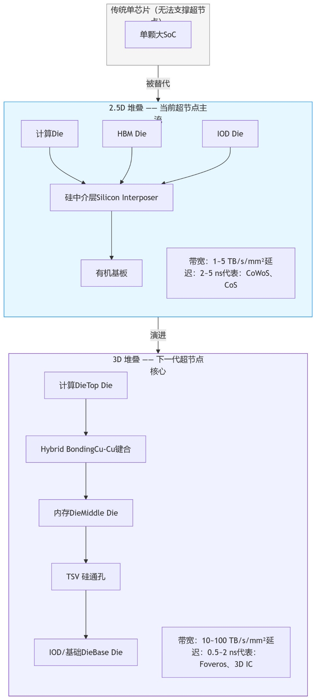
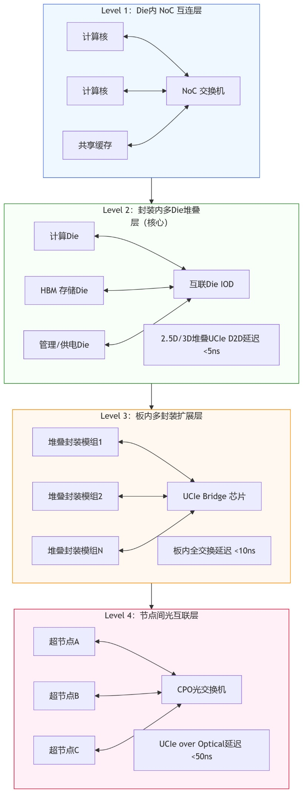
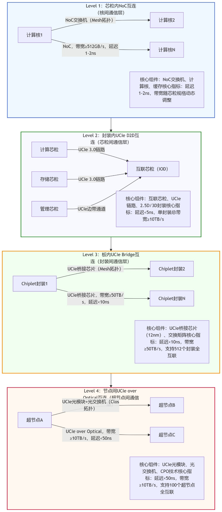
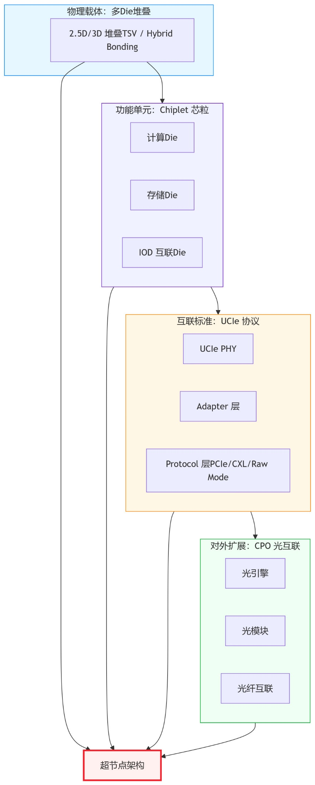

# 多Die堆叠技术（Chiplet 与 UCIe）

## 多Die堆叠在超节点中的定位 {#multi-die-stacking}

本节承接第五章里“哪些变量会先改写单节点能力边界”这一问题。对超节点而言，Chiplet 与多 Die 堆叠并不是单纯的封装工艺升级，而是在重新定义一个节点内部到底能装下多少算力、带宽和近存储能力。单芯片工艺逼近物理极限、良率成本急剧恶化、功耗密度持续突破上限的背景下，多 Die 堆叠（Multi-Die Stacking）已成为超节点架构中不可缺少、不可替代的底层支撑技术。

多 Die 堆叠，是指将多颗功能独立、工艺解耦的裸芯片（Die/Chiplet）通过 2.5D 中介层、3D 垂直键合、TSV、微凸点等先进封装手段，在物理空间上高密度集成，形成一个逻辑统一、带宽共享、延迟极低的“超级芯片”或“超级算力模块”。它不是 Chiplet 的子集，而是 Chiplet 得以规模化、高性能化、工程化落地的物理载体与实现基础。第五章之所以把它单独拿出来讨论，正是因为它会直接改变第四章参考设计里“多少压力留在节点内、多少压力被推到节点间”的边界划分。

多 Die 堆叠的核心是把关键互联距离从"板级/连接器级"压缩到"封装/微互联级"，从而为更高带宽、更低单位比特能耗、以及更强的系统语义（寻址/原子/一致性能力）创造条件。在工程落地上，需要关注三个核心约束面：

- **互联与协议**：Die-to-Die（D2D）互联决定了堆叠能否规模化复制；UCIe 等标准化分层接口有助于降低跨厂商/跨代际集成成本。
- **供电与散热**：堆叠会把热点推入封装内部，PDN 与热路径往往比信号更先成为瓶颈，需要与液冷/冷板/热扩散结构协同设计。
- **测试与可靠性**：堆叠越深越需要"分层测试 + 可追溯遥测"闭环（Known-Good-Die、封装前后测试、运行时错误隔离），否则系统级良率与运维成本会反向吞噬带宽收益。

没有多 Die 堆叠，超节点将无法实现高密度集成、无法解决带宽墙、无法控制成本、无法满足功耗约束，超节点这一架构本身将不具备工程可行性。因此，多 Die 堆叠不是超节点的"可选优化"，而是超节点成立的前提条件。

## 多Die堆叠技术基础体系

多 Die 堆叠是后摩尔时代最核心的芯片系统集成范式，其本质是把"板级系统"搬进"封装级系统"。

### 基本概念与分类

多 Die 堆叠按集成方式可分为两大类：

**2.5D 堆叠（中介层架构）**

- 多颗 Die 并排放置在硅中介层（Silicon Interposer）上
- 通过中介层内的走线实现 Die-to-Die 互联
- 典型代表：CoWoS、CoS、InFO_LSI

**3D 堆叠（垂直键合架构）**

- Die 之间垂直叠放
- 依靠 TSV（硅通孔）+ 微凸点 / Cu-Cu 键合直接相连
- 典型代表：Foveros、3D IC、Hybrid Bonding

| 技术路线 | 通俗理解 | 超节点定位 | 典型带宽密度 | 典型延迟 |
|:---|:---|:---|:---|:---|
| 传统单芯片 | 一颗大 SoC | 无法支撑超节点 | — | — |
| 2.5D 堆叠 | 芯片"并排坐"在硅底板上 | 超节点主力方案 | 1–5 TB/s/mm² | 2–5 ns |
| 3D 堆叠 | 芯片"上下叠" | 下一代超节点核心 | 10–100 TB/s/mm² | 0.5–2 ns |
| 板级 PCIe/CXL | 芯片插在主板上 | 只能做外部扩展 | 0.01–0.1 TB/s/mm² | 50–200 ns |

多 Die 堆叠的带宽比主板互联高 100~1000 倍，延迟低 50~200 倍——这正是超节点必须依赖它的根本原因。

### 关键支撑技术

1. **微凸点（Micro-bump）**：间距通常 ≤ 20μm，实现高密度互联。
2. **混合键合（Hybrid Bonding）**：Cu-Cu 直接键合，间距 ≤ 10μm，3D 堆叠的核心工艺。
3. **硅通孔 TSV**：穿透硅衬底的垂直导电通道，实现 3D 堆叠的上下供电、信号、接地。
4. **硅中介层 Interposer**：多颗 Die 的"高速布线底板"，可集成 RDL、去耦电容、供电网络。
5. **重布线层 RDL**：实现 Pin 脚重新映射，适配不同 Die 的 I/O 分布。
6. **内插式散热与均热板**：解决堆叠带来的热阻塞问题，超节点工程化的关键。

## 主流多Die堆叠封装架构

/// caption
图 1：多 Die 堆叠主流技术路线对比——2.5D 与 3D 堆叠的结构差异、核心参数及演进关系
///

### 2.5D CoWoS（Chip-on-Wafer-on-Substrate）

当前超节点最主流方案。多颗 Chiplet（Compute、HBM、IOD）贴在硅中介层上，中介层再贴在有机基板上，供电从基板穿过中介层给 Die 供电，HBM 可与计算 Die 紧邻放置，获得 TB 级内存带宽。

硅中介层采用高密度布线，凸点间距控制在 5 μm 以下，实现芯粒间的高速互联；单封装内可集成 8–16 颗芯粒，互联带宽达到 10–16 TB/s，延迟 <5 ns。该技术兼容性强，可集成不同尺寸、不同工艺的芯粒，成本相对 3D 封装较低，适配超节点的规模化部署需求。

超节点价值：

- 单封装可集成 8~16 颗芯粒
- 支持 HBM2e/HBM3/HBM3e
- 良率高、可靠性高、可量产
- 是今天 AI 超节点的标准底座

### 2.5D CoS（Chip-on-Substrate）

简化版 2.5D，省去硅中介层，直接在有机基板上集成，成本更低，适合规模化自主可控超节点。

### 3D Foveros / 3D IC

下一代超节点核心架构。计算 Die、内存 Die、IOD Die 垂直堆叠，互联距离从毫米 → 微米 → 纳米，带宽密度提升一个数量级，延迟可降至 1 ns 以内。

该技术采用 Cu-Cu 键合工艺，凸点间距控制在 2 μm 以下，单封装内可集成 16–32 颗芯粒，互联带宽达到 20 TB/s 以上，延迟 <3 ns。优势是互联密度高、延迟低、功耗低，适配超高算力超节点需求；缺点是成本高、工艺复杂，良率相对较低，主要用于高端 AI 训练超节点。

超节点价值：

- 真正实现"算力叠算力、内存叠内存"
- 单机柜算力密度从 EFLOPS 向 10 EFLOPS 迈进

### 混合堆叠：2.5D + 3D 融合架构

未来 3 年超节点主流形态，底层用 3D 堆叠提升密度，顶层用 2.5D 扩展 HBM 与 IOD，兼顾密度、带宽、良率、成本。

## 多Die堆叠核心优势

### 突破算力密度上限

超节点要求单机柜 ≥1 EFLOPS FP16，单芯片算力已无法满足。多 Die 堆叠可以把 N 颗算力 Die 集成为一个模块，算力 = 单 Die 算力 × N，面积不随算力线性膨胀。没有多 Die 堆叠，就没有高密度超节点。

### 彻底解决带宽墙

大模型训练的瓶颈不是算力，是带宽。板级互联仅几十 GB/s，2.5D 堆叠提升至 TB/s 级，3D 堆叠达到 10 TB/s 级。多 Die 堆叠让芯粒之间像片上网络一样通信，这是超节点能够高效扩展的基础。

### 工艺解耦，降低成本与良率风险

多 Die 堆叠允许不同功能采用最佳工艺——计算 Die 用 3nm/5nm，IOD/互联 Die 用 12nm/14nm，管理 Die 用 28nm，成本下降 30%–70%。小尺寸芯粒良率远高于单片大 SoC，大幅降低量产成本与风险。

### 功耗能效数量级提升

板级信号传输能耗在 pJ/bit 级，封装级 D2D 互联降至 0.1–0.5 pJ/bit，3D 堆叠进一步降至 <0.1 pJ/bit。超节点机柜功耗通常 20–50 kW，多 Die 堆叠是唯一能让系统能效达标的路径。

### 支持线性扩展

超节点需要从百卡 → 千卡 → 万卡平滑扩展。多 Die 堆叠 + UCIe 构成标准化积木：计算积木、存储积木、互联积木、管理积木，即插即用、线性扩展、架构不变。

## Chiplet 在超节点中的场景与用途

Chiplet（芯粒）是超节点不可或缺的核心组成部分，其核心用途是通过功能解耦、工艺分治、异构集成，突破单芯片性能极限、优化互联效率、控制量产成本、实现线性扩展。Chiplet 的出现是后摩尔时代超节点发展的必然选择。

### 核心应用场景

Chiplet 在超节点中的应用场景高度聚焦于高端算力需求，核心覆盖三大类场景：

**万亿参数级 AI 大模型训练场景**

超节点最核心的应用场景，核心需求是超高算力密度（单机柜 ≥1 EFLOPS）、超大带宽（单机柜 ≥50 TB/s）、超低延迟（端到端 <10 μs），以及全局内存共享能力。Chiplet 通过模块化聚合计算芯粒、存储芯粒，实现算力与带宽的精准匹配。多 Die 堆叠使计算 Die 与 HBM3e 紧耦合，单封装内存带宽 ≥3–8 TB/s，多 Die 之间通过 Raw Mode 低延迟通信，All-to-All 集体通信效率提升 30%–60%。

指标要求：单机柜算力 ≥1 EFLOPS，端到端延迟 <10 μs，线性扩展效率 ≥95%。

**E 级科学计算场景**

E 级超算适配流体力学、量子计算、气象预测、航空航天仿真等复杂场景，核心需求是高精度计算（FP64）、高可靠性（99.999% 以上）、低延迟互联。Chiplet 通过 CPU 与 FPGA 异构堆叠集成，TSV + Hybrid Bonding 保证信号完整性，双冗余 Die 热备，全链路 ECC 与错误隔离，优化互联效率与可靠性。

指标要求：单机柜 FP64 ≥0.5 EFLOPS，系统可用性 99.999%，可连续运行数月不重启。

**自主可控高端算力场景**

聚焦政务、金融、国防等核心领域，核心需求是全产业链自主可控。多 Die 堆叠是国产替代的最大突破口——不必强求最先进工艺，用成熟工艺 Die + 先进封装即可接近国际水平。国产 2.5D/3D 封装、国产 Interposer、国产 TSV、国产 Bridge + 自主 UCIe 兼容协议 + 国产芯粒 = 自主超节点。

指标要求：自主可控率 100%，成本较同类进口方案低 25%–40%，良率 ≥90%。

### 核心用途

结合超节点的场景需求，Chiplet 在超节点中承担五大核心用途：

1. **算力聚合，突破单芯片性能极限**：将计算功能拆解为多颗独立计算芯粒，采用先进工艺单独流片，再通过先进封装集成，实现算力模块化聚合。

2. **功能解耦，优化超节点互联效率**：将互联功能解耦为独立互联芯粒，专门负责芯粒间、节点间高速互联，使计算芯粒聚焦算力输出，大幅提升互联效率。

3. **异构融合，适配多场景算力需求**：按需组合不同类型芯粒（NPU/GPU、CPU/FPGA），形成定制化算力模块，实现异构算力融合。

4. **成本与良率优化，支撑规模化部署**：核心计算芯粒用先进工艺，非核心芯粒用成熟工艺，小尺寸芯粒良率远高于单片 SoC，大幅降低量产成本与风险。

5. **线性扩展，适配算力迭代需求**：标准化接口实现"即插即用"扩展，通过增加芯粒模块实现算力线性提升，无需重新设计整个系统。

### 核心重要性

Chiplet 在超节点中具有不可替代的核心地位：

- **技术层面**：Chiplet 是超节点突破单芯片性能极限的核心路径。没有 Chiplet 的模块化聚合，超节点无法实现千卡级算力密度。同时，Chiplet 的异构融合能力是超节点适配多场景的核心支撑。

- **工程层面**：Chiplet 的成本与良率优化是超节点规模化部署的前提。其线性扩展能力使超节点能够跟上算力增长节奏，具备长期应用价值。

- **产业层面**：在自主可控场景中，Chiplet 是实现高端算力自主化的核心载体，推动先进封装、互联协议等相关产业升级，完善高端算力产业链。

## Chiplet 与 UCIe 核心技术解析

Chiplet 与 UCIe 的技术融合，是超节点统一互连体系构建的核心。

### Chiplet 核心技术

Chiplet 的核心技术围绕"模块化设计、先进封装、芯粒互联"三大环节展开。

#### 技术框架

Chiplet 的技术框架分为三层：

1. **芯粒设计层**：功能解耦与标准化设计，将超节点的算力、存储、互联、管理功能拆解为独立芯粒。每个芯粒聚焦单一功能，采用模块化设计，芯粒接口采用标准化设计（如 UCIe），确保不同厂商、不同工艺的芯粒能够无缝对接。

2. **封装集成层**：先进封装技术负责将多颗芯粒集成为一个完整的封装模块。超节点中主要采用 2.5D/3D 先进封装技术，核心技术包括硅中介层（Interposer）、凸点（Bump）制造、芯粒对齐、热管理等。

3. **互联适配层**：芯粒间的高速互联技术，超节点中主要采用 UCIe 标准互联，核心技术包括链路训练、信号完整性优化、流量控制等。

#### 超节点常用 Chiplet 类型

| Chiplet 类型 | 核心功能 | 工艺选择 | 超节点应用场景 | 核心指标参考 |
|:---|:---|:---|:---|:---|
| 计算芯粒（Compute Die） | 核心算力输出，承担 AI 训练、科学计算等核心任务 | 3nm/5nm/7nm 先进工艺 | AI 大模型训练、E 级科学计算 | 算力：128–256 TFLOPS（FP16），UCIe 带宽：2 TB/s |
| 互联芯粒（IOD） | 芯粒间、封装间、节点间高速互联，负责数据交换 | 12nm/14nm 成熟工艺 | 所有超节点场景，核心互联载体 | 双向带宽：4–6 TB/s，延迟：<5 ns |
| 存储芯粒（Memory Die） | 内存扩展与共享，提供高带宽存储访问 | 8nm/10nm 工艺 | AI 大模型训练、科学计算 | 容量：16–32 GB，带宽：2.0–3.2 TB/s |
| 管理芯粒（Management Die） | 电源管理、故障监控、时序控制、安全管控 | 28nm 成熟工艺 | 所有超节点场景，保障系统稳定 | 可靠性：99.999%，响应时间：<10 ms |
| 加速芯粒（Accelerator Die） | 专用计算加速（如 FPGA/TPU），提升特定任务效率 | 7nm/12nm 工艺 | 科学计算、特定 AI 任务加速 | 算力：128 TFLOPS，延迟：<4 ns |

### UCIe 核心技术与协议解析

UCIe（Universal Chiplet Interconnect Express）是面向 Chiplet 裸片间互联的开放工业标准，核心价值是实现 Chiplet 跨厂商、跨工艺、跨架构的互通，为超节点构建统一的互联体系。

#### 协议核心架构

UCIe 协议分为物理层（PHY）、Die-to-Die 适配层（Adapter Layer）、协议层（Protocol Layer）三层：

**物理层（PHY）**

Chiplet 互联的物理载体，负责定义电气特性、链路训练、信号完整性与可靠性。超节点中采用 UCIe-A（Advanced）模式，适配 2.5D/3D 先进封装：

- **速率与带宽**：UCIe 3.0 版本采用 QDR（四数据速率）采样技术，基础时钟 16 GHz，单通道速率 64 GT/s，单 x64 链路双向带宽可达 2 TB/s，可通过多组链路聚合提升带宽。
- **链路训练与校准**：支持动态链路训练与实时重校准，初始化阶段通过训练序列调整信号幅度、相位与均衡参数，运行过程中每 10 ms 校准一次，补偿 PVT（工艺、电压、温度）变化。
- **Lane 冗余与修复**：预留 10%–15% 的冗余 Lane，当某条 Lane 失效时自动切换至冗余 Lane，无需中断系统运行。
- **能效优化**：采用动态电压调节、快速关断机制，典型能效 <0.3 pJ/bit，较板级 PCIe 节能 90% 以上。

**适配层（Adapter Layer）**

物理层与协议层的桥梁，负责链路管理、流量控制、错误处理与多协议复用：

- **链路管理**：实现链路初始化、状态协商与状态监控，异常时触发降级或切换机制。
- **流量控制**：采用信用（Credit）机制，接收端向发送端反馈可用缓存空间，避免缓存溢出；支持差异化信用分配，优先保障高优先级数据传输。
- **错误处理**：采用 CRC 校验、重传机制与错误隔离，将错误局限于单条链路或单个芯粒，避免错误扩散。
- **多协议复用**：支持 FDI（Flit-aware D2D Interface）与 RDI（Raw D2D Interface）双接口，FDI 适配 PCIe/CXL 等 Flit 化协议，RDI 适配流式协议。

**协议层（Protocol Layer）**

承载上层业务协议，核心支持三类协议：

- **PCIe 6.0/7.0 协议**：兼容现有服务器、存储生态，延迟较板级 PCIe 降低 80% 以上。
- **CXL 3.0/4.0 协议**：打破内存墙的核心协议，支持 CXL.cache（缓存共享）与 CXL.mem（内存扩展），实现超节点全局统一内存共享。
- **流式协议（Raw Mode）**：UCIe 3.0 新增特性，跳过 Flit 封装与解析开销，直接传输数据流，延迟降低 40% 以上，适配 AI 训练集体通信场景。

#### UCIe 协议版本演进

| UCIe 版本 | 发布时间 | 单通道速率 | x64 链路双向带宽 | 核心特性 | 超节点应用场景 |
|:---|:---|:---|:---|:---|:---|
| UCIe 1.0 | 2022 年 | 32 GT/s | 1 TB/s | 基础 D2D 互联，支持 PCIe 5.0/CXL 2.0 | 中低端超节点、边缘计算 |
| UCIe 2.0 | 2023 年 | 48 GT/s | 1.5 TB/s | 提升带宽，支持 CXL 3.0，优化能效 | 中端 AI 训练、科学计算 |
| UCIe 3.0 | 2024 年 | 64 GT/s | 2 TB/s | 新增 Raw Mode，支持 CXL 4.0，低延迟优化 | 高端 AI 训练、E 级超算 |
| UCIe 4.0（研发中） | 2026 年 | 128 GT/s | 4 TB/s | 更高带宽，支持 3D IC 封装，协议兼容优化 | 万卡级超节点、下一代 E 级超算 |

#### 超节点中 UCIe 的核心技术优化

针对超节点的高密度、低延迟需求，UCIe 在超节点应用中进行了三项核心技术优化：

1. **链路聚合优化**：通过多组 UCIe 链路聚合提升芯粒间、封装间的带宽。例如计算芯粒与存储芯粒间采用 x32 链路（带宽 1 TB/s），计算芯粒与互联芯粒间采用 x64 链路（带宽 2 TB/s）。

2. **延迟优化**：优化适配层流程，减少链路初始化与错误处理开销；结合 Raw Mode 跳过 Flit 封装，将芯粒间通信延迟从 10 ns 降至 6 ns 以下。

3. **可靠性优化**：启用双重冗余机制（Lane 冗余 + 芯粒冗余），单封装内预留 1–2 颗冗余互联芯粒，链路失效时自动切换，确保超节点 99.999% 的可用性；数据误码率控制在 \( 10^{-15} \) 以内。

## 超节点四层统一互连架构

Chiplet 的模块化优势与 UCIe 的标准化优势相结合，构建了超节点从芯粒内到节点间的四层统一互连架构。

### 技术融合核心逻辑

Chiplet 与 UCIe 的技术融合，本质是"模块化异构集成"与"标准化互联"的协同：

1. **功能解耦与接口标准化协同**：Chiplet 将超节点功能拆解为计算、存储、互联、管理等独立芯粒，每个芯粒均采用 UCIe 标准接口，打破生态封闭。

2. **性能匹配协同**：UCIe 3.0 的低延迟（<5 ns）、高带宽（2 TB/s）特性，与 Chiplet 的模块化聚合需求精准匹配。

3. **扩展能力协同**：Chiplet 的模块化扩展与 UCIe 的标准化接口相结合，超节点可通过增加芯粒模块实现线性扩展。

### 四层架构详解

/// caption
图 2：多 Die 堆叠在超节点中的四层统一部署架构——各层级的核心组件、互联方式及延迟特性
///

/// caption
图 3：基于 Chiplet + UCIe 的超节点四层统一互连架构
///

#### Level 1：芯粒内 NoC 互连（核间通信层）

最底层，负责单颗 Chiplet 内部计算核、缓存、接口的互联。核心组件是计算芯粒内部的 NoC（Network on Chip）交换机，采用 Mesh 拓扑实现计算核间全互联。

- 延迟：1–2 ns
- 带宽根据计算芯粒规格动态调整（如 3nm NPU 计算芯粒内部 64 个计算核，NoC 带宽达 512 GB/s）

NoC 交换机通过内部接口与 Chiplet 的 UCIe 物理层对接，将计算核产生的数据传输至 UCIe 链路，实现芯粒内与芯粒间的通信衔接。

#### Level 2：封装内 UCIe D2D 互连（芯粒间通信层）

核心层级，负责同一封装内多颗 Chiplet（计算、存储、互联、管理）的高速互联，是超节点实现算力聚合的关键。核心组件是互联芯粒（IOD）与 UCIe 链路，采用星型 + Mesh 混合拓扑。

- 延迟：<5 ns
- 单封装内总带宽：10–20 TB/s
- 采用 2.5D CoWoS / 3D Foveros 封装，凸点间距 ≤5 μm
- 互联芯粒集成多组 UCIe PHY 与交换单元，实现无阻塞交换
- 通过 UCIe 边带通道实现各芯粒的管理与监控

这是超节点的"算力细胞"。

#### Level 3：板内 UCIe Bridge 互连（封装间通信层）

负责超节点主板上多个 Chiplet 封装间的互联，形成板级全域交换 fabric，是超节点规模化扩展的基础。核心组件是 UCIe 桥接芯片，采用 Mesh 拓扑。

- 延迟：5–10 ns
- 板内总带宽：50–100 TB/s
- 支持 512 个封装全互联，线性扩展效率 ≥95%
- UCIe 桥接芯片采用 12nm 工艺，集成多组 UCIe PHY 与交换矩阵
- 主板采用高密度布线，控制链路阻抗（50 Ω ±10%）

#### Level 4：节点间光互联层（超节点间通信层）

负责多个超节点间的高速互联，实现万卡级集群扩展。核心组件是 UCIe 光模块与光交换机，将 UCIe 协议直接映射到光信号。

- 延迟：30–50 ns
- 节点间链路带宽：≥10 TB/s
- 支持 100 个超节点全互联
- 采用 CPO（共封装光学）技术，将光引擎与互联芯粒共封装
- 结合 UCIe Raw Mode 进一步降低传输延迟

## 多Die堆叠与 Chiplet、UCIe、CPO 的协同关系

/// caption
图 4：多 Die 堆叠与 Chiplet、UCIe、CPO 的协同架构——四者组合构成完整超节点技术路线
///

多 Die 堆叠、Chiplet、UCIe 与 CPO 四者在超节点架构中各司其职、协同互补：

| 技术角色 | 定位 | 核心贡献 |
|:---|:---|:---|
| 多 Die 堆叠 | 物理载体 | 提供密度——将多颗 Die 在物理空间上高密度集成 |
| Chiplet | 功能单元 | 提供模块化——功能解耦、工艺分治、异构组合 |
| UCIe | 互联语言 | 提供互通——标准化 D2D 接口，跨厂商/跨代际兼容 |
| CPO | 对外出口 | 提供扩展——光电融合封装，实现节点间高带宽低延迟通信 |

四者组合就是完整的超节点技术路线：堆叠提供密度、Chiplet 提供模块化、UCIe 提供互通、CPO 提供扩展。这一统一技术路线使超节点从"集群即单板、单板即芯片"的愿景走向工程现实。

## 工程化挑战与解决方案

尽管 Chiplet + 多 Die 堆叠在超节点中已实现多场景落地，但规模化部署中仍面临严峻的工程化挑战。

### 热阻塞与热点集中

!!! warning "最致命的工程约束"
    堆叠后热量无法有效散出，局部温度可超 120℃。计算芯粒功耗密度达 100 W/cm²，高密度部署进一步加剧散热压力。

**解决方案：**

- 热仿真驱动的 Die 布局优化
- 内插式均热板与热缓冲层
- 微流道液冷 / 直面液冷（散热效率提升 3 倍）
- 功耗动态均衡算法与热感知任务调度
- 冷热通道分离，管理芯粒动态调节功耗
- DVFS 技术降低空闲功耗

### TSV/微凸点可靠性

!!! warning "垂直互联的机械应力"
    垂直互联点多、机械应力大，不同芯粒 CTE（热膨胀系数）差异导致封装应力，易引发芯粒开裂或接触失效。

**解决方案：**

- 低应力 TSV 结构设计
- CTE 匹配材料与柔性基板
- 冗余互联设计（10%–15% 冗余 Lane + 芯粒冗余）
- 老化筛选与在线监测
- Cu pillar 凸点设计，对齐误差控制在 ±0.3 μm

### 供电电压降（IR Drop）

!!! warning "多Die共用电网的电流极限"
    多 Die 共用供电网络，电流极大，压降导致供电不稳，影响信号完整性与计算精度。

**解决方案：**

- 嵌入式去耦电容
- 中介层内嵌供电层
- 分区独立供电
- 动态电压调节

### 测试与良率

!!! warning "多Die串联的良率挑战"
    多 Die 串联封装，一颗坏则全模块废。先进封装成本高、产能有限。

**解决方案：**

- 预测试 Known-Good-Die（KGD）流程
- 冗余 Die / 冗余 Lane 设计
- 分级修复策略
- 内建自测试（BIST）
- 混合封装策略——核心芯粒用 3D Foveros，辅助芯粒用 2.5D CoWoS，平衡性能与成本

### 信号完整性

!!! warning "高密度链路的串扰风险"
    高密度 UCIe 链路（数百条/封装）串扰严重（噪声 ≥20%），高速传输信号衰减明显，PVT 变化导致信号漂移。

**解决方案：**

- 差分布线（间距 ≥2 倍线宽）+ 链路间接地屏蔽，串扰噪声降至 5% 以下
- 自适应均衡（FFE/DFE）+ CDR 时钟恢复，误码率控制在 \( 10^{-15} \) 以内
- 每 10 ms 动态重校准，补偿 PVT 漂移

### 跨厂商生态协同与标准落地

!!! warning "生态碎片化"
    不同厂商 UCIe 协议实现差异大，跨厂商芯粒互通性不足；UCIe 版本不兼容；Chiplet 测试标准不统一；软件生态不完善。

**解决方案：**

1. 联合厂商制定 UCIe 协议实现规范，建立兼容性测试平台
2. 芯粒接口支持版本自适应，固件在线升级
3. 制定 Chiplet 测试标准与认证制度，建立统一测试平台
4. 联合软件厂商开发 Chiplet 调度、监控软件，适配现有应用生态

## 国产化路径与产业展望

### 国内已具备的能力

- 2.5D CoWoS 类封装：可量产
- TSV、微凸点、RDL：技术突破
- 国产中介层、基板、键合设备：逐步替代
- 国产 KGD、测试、可靠性平台：基本建成

### 差距与突破方向

- 3D 混合键合工艺
- 超高密度凸点
- 高端封装材料
- 全流程良率提升

### 国产化落地路径

1. **核心技术突破**：聚焦国产芯粒设计（3nm/7nm 计算、互联芯粒）、先进封装（国产 2.5D/3D）、UCIe 协议适配（自主协议栈），产学研协同攻克卡脖子难题。

2. **生态协同构建**：构建"芯粒–封装–设备–软件"全产业链生态，建立芯粒复用平台与行业标准，推动跨厂商协同。

3. **规模化量产**：扩大国产芯粒与封装产能，优化生产流程，降低成本。

4. **场景深度适配**：针对 AI 训练、科学计算、自主可控场景优化芯粒选型与架构，实现国外产品替代。

### 三步走落地路径

1. **2.5D 规模化（当前）**：以 CoWoS 类方案为主力，规模化部署
2. **3D 工程化（2026–2027）**：3D Foveros/Hybrid Bonding 进入工程验证与小批量应用
3. **3D + CPO + UCIe 一体化超节点（2028 后）**：全面融合，构建下一代自主可控超节点

### 产业发展展望

1. **技术迭代**：Chiplet 工艺向 2nm/1nm 演进，UCIe 升级至 4.0（4 TB/s 带宽），封装向 3D IC 演进，互联延迟降至 1 ns 以内。

2. **生态成熟**：跨厂商芯粒互通性提升，芯粒复用率 ≥80%，形成"芯粒超市"模式，降低研发成本。

3. **国产化提升**：全产业链自主可控实现突破，国产超节点在高端场景规模化应用。

4. **场景延伸**：Chiplet + UCIe 技术将从高端算力场景向中低端延伸，覆盖边缘计算超节点、工业级算力平台等领域；同时向跨领域融合延伸，与量子计算、光子计算、存算一体等新兴技术结合，构建下一代超节点架构。

## 对参考设计的影响

从第四章的参考设计视角看，Chiplet 与多 Die 堆叠的意义在于重写“一个节点/一个封装到底能装下多少算力与带宽”这个前提：

- **对标准构型的影响**：更成熟的 2.5D/3D 集成会先提升标准以太和标准总线方案的单节点能力，使它们在不改变大框架的情况下获得更高密度与更强显存带宽。
- **对探索构型的影响**：当封装内与板内互联能力显著增强时，Dragonfly + OCS、Torus + OCS 这类方案可以把更多系统压力留在节点内或机柜内，从而改变组间拓扑的最优边界。
- **对方案排序的影响**：如果 Chiplet + UCIe + 光互联协同成熟，第四章中的一些探索构型会从“依赖外部交换重构”更多转向“封装内高密 + 节点间轻量重构”的新平衡。

从第五章总表的口径看，Chiplet 与多 Die 堆叠总体仍属于**工程推断**：方向已非常明确，量产节奏也已开启，但真正决定其成为主导变量的，是良率、测试闭环、热管理与跨厂商接口治理能否同步成熟。编写委员会后续需要补强的关键产业证据，包括 2.5D/3D 封装的实测良率与成本曲线、UCIe 生态的兼容性进展，以及系统集成商对封装内高密互联的部署反馈。

也就是说，Chiplet 与多 Die 堆叠对第五章的价值，不在于把更多技术名词塞进封装章节，而在于重写一个更根本的问题：**一个节点内部到底能装下多少算力、带宽和内存语义能力。** 一旦这个前提被改写，第四章中很多原本必须通过机柜级互联解决的问题，就会重新回到封装内或节点内。未来 2–3 年里，Chiplet 真正会影响的，是参考设计之间“节点内解决多少、节点间解决多少”的边界划分。
