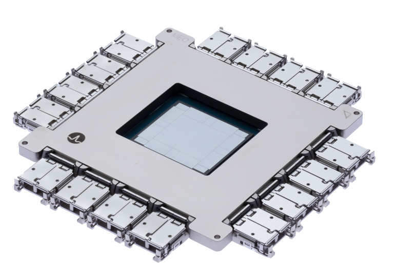
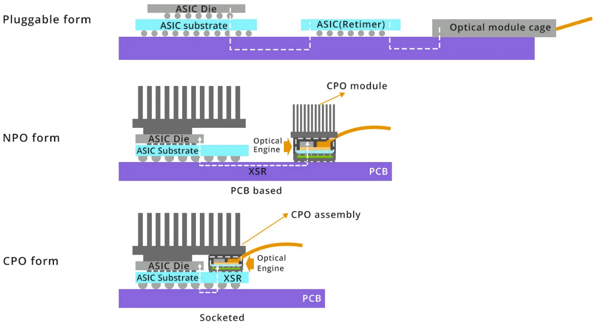

# 互连技术演进

## 光互连技术演进

### 16卡超节点互连方案

#### 线性直驱光模块（LPO）

线性直驱光模块（Linear-drive Pluggable Optics, LPO）是一种在数据链路中仅使用线性模拟元件的光通信技术，省去了传统光模块中的数字信号处理（DSP）和时钟数据恢复（CDR）芯片。这种设计使得LPO在功耗和成本上相较于传统光模块有了显著的优势，特别适用于短距离、高带宽、低功耗和低延迟的数据通信场景。

首先，LPO的设计省略了DSP和CDR芯片，直接减少了光模块的功耗。这一优化不仅使得LPO在功耗上表现出色，而且在长期使用中可以大大减少散热问题，延长设备的使用寿命。低功耗特性尤其适合数据中心、大规模计算集群等高密度计算环境，在这些环境下，大量设备的能效管理成为一个重要考量因素。LPO的低功耗和高效能特性，有助于提升整体系统的能效，降低运营成本。

其次，LPO去除了DSP和CDR等复杂组件，这使得光模块的物料成本降低了20%到40%。传统的光模块依赖于这些复杂的数字处理元件来确保信号的质量和可靠性，而LPO通过简化设计，减少了这些高成本部件，从而降低了整体生产成本。这一优势在需要大量部署光模块的应用场景中尤为突出。对于计算互连而言，延迟是至关重要的性能指标之一。LPO由于不需要进行信号恢复处理，因此减少了传统光模块中的复杂信号处理过程，从而显著降低了系统的延迟。在高性能计算、人工智能训练和大数据分析等应用中，低延迟是实现高速计算和高效数据交换的核心要求。LPO的设计确保了极低的通信延迟，从而能够有效支持低延迟、高速的数据传输需求。

此外，LPO对协议具有透明性，意味着它能够兼容不同GPU厂商的计算互连协议，不依赖于特定的协议栈。这一特性大大提升了LPO的兼容性和灵活性，使其在多种不同硬件平台和技术架构下均可稳定运行，满足跨厂商、跨平台的计算互连需求。随着异构计算和多种硬件平台的快速发展，LPO的这一优势使得它能够适应不断变化的计算架构，提供更加灵活的互连解决方案。

#### 光直连方案

目前主流的国产算力通常是单机8卡内部直连形成超节点规模为8的系统。通过横向扩展集群规模提升整体算力的方式受到全局批量大小不能无限增长的限制，导致在集群规模增大到一定程度后，有效算力出现明显下降。模型参数量增大需要更大的模型并行规模，模型并行中张量并行或混合专家类型的专家并行都会在计算模块之间产生大量的通信，并且这部分通信很难与计算进行重叠。通过构建更大的超节点，以纵向提升的方式提升系统算力是解决上述问题的有效途径之一。

通过LPO进行光直连可以拓展到16卡超节点。在国产电缆盒成熟之前，单机柜内的互连，LPO也是一个比较好的解决方案。另外，通过简单的LPO直连可以验证LPO在XPU互连中的应用，为更复杂的互连网络打下坚实基础。

/// caption
图 2: 16卡超节点拓扑示意图
///

通过LPO光模块可以不受距离限制将传统的八卡服务器连成16卡组成的超节点（以二维环绕拓扑为例），二维环绕拓扑具有高扩展性和高吞吐量。通过LPO光模块直连可以将16卡连成一个整体，相比传统的8卡机内互连然后再通过网卡互连，16卡超节点可以提高XPU资源的利用率和计算效率。

此外，LPO光模块的应用也为未来的更高效、更大规模的XPU互连网络打下了坚实的基础。在未来的系统设计中，LPO光模块将成为连接多个XPU节点的核心技术之一，支持更高带宽和更低延迟的计算需求，推动国产算力系统向更高水平发展。

---

### 32卡/64卡超节点互连方案

#### 部分电交换光互连方案

相比光直连方案，通过电交换增加了不同并行方式的组合可能性，如数据并行、模型并行和流水线并行的混合使用，另外电交换允许根据不同任务需求动态调整GPU资源分配。国产XPU需要适配特定电交换芯片，因为国产电交换芯片端口密度和带宽方面的限制，可以选择部分带宽机内通过PCB走线互连，部分带宽拉出通过LPO和电交换机进行光互连。几台8卡服务内部一部分带宽通过PCB走线进行互连，另外一部分带宽通过光互连连到电交换机上，通过电交换机增加并行策略灵活性，提高超节点计算使用效率。

/// caption
图 3: 部分电交换光互连架构图
///

在这种架构中，PCB走线用于处理高带宽的局部通信，适合于同一台服务器内部的XPU之间的高速数据交换，而光互连则用于将带宽扩展到更远的节点，以满足跨节点的数据传输需求。这种方式结合了电交换机的灵活性和光纤互连的高带宽优势，有助于在不增加过多成本的情况下实现高效的跨节点通信。

某些情况下，可能需要更多的XPU用于执行某个数据密集型的任务，而在另一些场景下，可能需要通过模型并行来处理大规模模型。电交换允许系统根据这些变化进行实时调整，实现更高效的资源利用。这种动态资源分配能力对于需要高度灵活性和可扩展性的计算环境尤为重要。通过调整XPU之间的连接方式和带宽分配，系统能够适应各种不同的计算需求，避免资源浪费，同时提高计算任务的并行度和吞吐量。

通过结合电交换与光互连，系统能够更高效地利用超节点的计算资源。在传统的光直连方案中，带宽和计算资源的分配可能存在一定的局限性，尤其是在需要跨节点进行大量数据交换时，带宽可能成为瓶颈。而在电交换架构中，由于每个XPU的带宽不仅通过内部PCB进行高速互连，还可以通过光纤与电交换机进行灵活调度，系统的带宽利用更加均衡，计算任务的执行效率得到提升。

#### 分布式光交换方案

OCS最常见的实现方式是基于微机电（MEMS）原理，MEMS OCS利用静电力产生机械运动，改变镜面方向，从而改变光路。MEMS OCS具有低损耗、低串扰和偏振无关的优点。然而，它的芯片尺寸较大，切换速度较慢（以毫秒为单位）。此外，MEMS OCS稳定性差，需要复杂的控制反馈系统来保持镜面角度。与MEMS OCS不同，硅光OCS通过调整芯片上集成相位调节器的相位来控制光路。相位调节器可以是基于热光效应的热光相位调节器，也可以是基于等离子体色散效应的电光相位调节器。这两种类型的相位调节器非常稳定，并且提供快速切换，根据不同原理可以实现从微秒到纳秒的切换时间。与MEMS相比，硅光OCS具有紧凑性、低功耗、低成本的大规模生产潜力，能够利用传统的CMOS制造工艺。

dOCS光学可插拔模块是一种带有硅光OCS的线性可插拔光模块，以分布式互连的方式插在XPU服务器上，因此简称dOCS (Distributed Optical Circuit Switch)。dOCS采用低功耗的可插拔模块，不包含数字信号处理（DSP）芯片。链路中端到端的信号路径被视为线性，从而实现更低的功耗，并且与通信协议无关，不需要依赖先进工艺。通过消除可插拔模块的DSP/重定时功能，dOCS光学可插拔模块相比竞争方案具有更低的功耗、更低的成本和更低的延迟。以低光互连成本和功耗，提供高集群可靠性，减少对高端交换芯片的依赖。

/// caption
图 4: dOCS分布式光交换系统架构
///

通过dOCS技术，传统的8卡服务器的带宽可以被完全拉出，并通过光纤实现高速互连（包括但不限于环形拓扑）。dOCS系统的灵活性使得XPU之间的互连关系可以根据实际需求进行动态调整。这种灵活性意味着，可以将多个XPU配置为一个64卡的超节点，或者拆分成两个32卡的超节点，根据不同应用场景的需求进行调整，从而提高资源的利用率和计算效率。

基于dOCS的计算系统，能够将8卡服务器作为最小备用单元进行灵活配置。这种配置方式不仅可以应对现场的故障处理需求，绕过故障计算模块，保证系统的稳定运行，还能在出现故障时，通过快速重配置实现故障恢复。通过这种方式，计算集群的部署成本得到了显著降低，因为无需为每个计算节点单独配置冗余设备或外部交换机，从而提高了成本效益。

此外，采用dOCS与光纤直连的方案，连接多个服务器时，不需要依赖传统的外部电交换机或类似谷歌使用的中央光路交换机。这不仅减少了对传统交换机设备的依赖，还有效降低了互连的复杂性和成本。通过这种高效的光纤互连方式，dOCS不仅为数据中心和高性能计算集群提供了更加灵活、可扩展的架构，也推动了计算资源的动态调度和故障容错能力的提升，尤其在大规模数据处理和高性能计算的应用中，展现出了巨大的优势。

---

### 128卡/256卡超节点互连方案

为了实现更大规模的超节点，如果是一层电交换网络，电交换机需要更高的交换机端口密度来进行全交换，如果只有较小的交换机端口密度的交换机，则需要两层电交换网络来实现全互连，这会显著增加系统互连成本，并且引入数量规模的光模块也带来了系统可靠性维护的挑战。每增加一层交换网络，都会增加系统的复杂度和延迟。每个数据包都必须经过多次交换，导致网络带宽的利用效率降低，并且可能引入额外的延迟，影响系统的实时计算能力。其次，这种结构需要大量的交换机来完成不同节点之间的连接，增加了设备采购、部署以及长期维护的成本。另外，当系统中部署大量电交换机时，可能会面临光模块和电交换机之间的连接问题。由于光模块的数量随着交换机端口密度的增加而增加，系统的可靠性和维护难度也会随之增大。

#### 一层全交换光互连方案

在市场上，如果可用的电交换机端口密度提高，可以实现更高效的带宽管理和资源配置，从而进一步优化大规模计算系统的架构。通过LPO技术，每个XPU的带宽可以通过光纤远距离传输并连接到带有LPO接口的电交换机。这种方法的最大优势在于，XPU不再受限于传统的电交换机的带宽瓶颈，光纤提供了更高的传输速度和更远的传输距离。这种高带宽的连接方式确保了即使是大规模并行计算时，各个XPU之间也能保持高速、低延迟的数据交换。

将每个XPU所有带宽通过LPO拉出通过光纤远距离连接到带LPO的电交换机，在传统的类似英伟达DGX服务器的8卡系统中，所有8个XPU通常通过一台内部交换机进行连接。由于交换机端口数有限且带宽较为集中，节点内部和节点之间的带宽存在层级化现象。为了优化带宽和计算资源的分配，使用更高端口密度的电交换机并将每个XPU的带宽通过LPO光纤拉出，可以完全解耦原来传统的8卡系统架构。

通过这种架构，节点的计算能力不再局限于固定的带宽分配和硬件结构，内部和外部之间的带宽实现了均衡化。各个XPU之间的通信不再受到单一交换机端口数限制，使得计算节点之间的数据传输更加高效和灵活。

通过将每个XPU的带宽全部通过LPO拉出并连接到高端口密度的电交换机，可以避免原来系统中存在的带宽不均衡问题。传统架构中，由于带宽主要集中在内部交换机上，可能导致某些XPU之间的通信瓶颈，而在新的架构中，由于每个XPU都拥有独立的高带宽光纤连接，这使得整个节点的带宽分配更加均匀，确保每个XPU都能够得到充分的带宽支持。

这种均衡化的带宽分配大大提升了计算节点之间的数据传输效率，使得不同的计算任务能够更快速地传递数据。无论是单一XPU的计算任务还是多XPU并行处理任务，都能够获得最佳的带宽支持，从而提升系统的整体性能。

采用将所有带宽通过电交换机进行全交换的方式，相比传统的部分电交换系统，可以实现更高的灵活性。这种方式使得不同并行计算方式的组合变得更加灵活和高效，能够充分发挥每个XPU的计算潜力。尤其是在需要大量并行计算的任务中，节点之间的数据传输速度和带宽充足，能够最大化XPU的使用效率。例如，在某些并行计算场景下，多个XPU可能需要频繁交换数据。如果依赖传统的部分交换结构，可能会存在数据传输瓶颈，限制系统的性能。而通过高带宽的光纤连接和高端口密度电交换机的全交换结构，各个XPU之间的通信几乎没有瓶颈，从而能够充分利用每个XPU的计算能力，确保任务的高效执行。除了提升内部带宽的均衡性和系统的并行计算效率外，这种架构还提高了系统的资源利用率。由于每个XPU的带宽都能够得到充分利用，因此计算资源的利用率大幅提升，系统在处理各种负载时都能够保持高效运行。

通过引入高端口密度的电交换机和LPO光互连技术，整个计算系统的带宽分配变得更加均衡，节点内部和节点之间的通信能力得到显著提升。这种架构打破了传统8卡系统的局限，使得算力提升不再是层级化的，而是均衡化和高效化的。通过全交换架构，可以进一步优化不同并行计算方式的组合，提升XPU的使用效率，确保每个XPU在计算任务中的最大潜力得到充分发挥。同时，系统的可扩展性和资源利用效率也得到了显著提高，为大规模计算任务提供了更强的支持。

#### 光电混合分布式光交换

在当前的国产芯片产业背景下，由于先进制程产量有限，市场上可用的电交换芯片往往具备较低的端口密度。这种限制使得传统的高密度交换结构难以满足大规模高性能计算集群的需求，因此需要采取创新的设计策略，以提高系统的扩展性和灵活性，同时降低成本和复杂性。一种有效的解决方案是结合低端口密度的电交换芯片与分布式光交换技术（dOCS），从而构建出大规模超节点。

/// caption
图 3: 光电混合分布式光交换架构
///

在这一架构中，每个八卡服务器内部包含8个XPU，这些XPU通过多个低端口密度的电交换芯片进行机内全交换。虽然每个电交换芯片的端口密度较低，但通过将多个芯片联合使用，仍然能够完成高效的数据交换和通信。这种设计充分利用了现有低端口密度芯片的优势，同时避免了对更高端电交换芯片的依赖。多个八卡服务器之间，通过分布式光交换模块（dOCS）实现连接。这些dOCS模块通过光纤提供高带宽、低延迟的通信通道，形成了一个大规模的超节点架构。

dOCS技术的核心优势在于其灵活性和扩展性，它可以调控各个服务器之间的连接方式。不同于传统的电交换机，dOCS模块不依赖复杂的电路交换设备，而是通过光交换技术将多个服务器连接成一个统一的计算资源池。在这个架构中，dOCS使得多个8卡服务器可以组成128卡或256卡的超节点，也可以根据需要灵活调整成4个32卡或64卡的子节点。基于dOCS的计算系统具备极强的动态配置能力，可以根据实际计算需求进行灵活配置，并迅速适应不同的工作负载。dOCS的灵活性还体现在它的容错能力上。在实际的计算环境中，可能会遇到个别计算模块故障的问题。借助分布式光交换模块，整个系统可以绕过故障节点，实现动态重配置。这种基于dOCS的计算系统能够以每个8卡服务器作为最小的备用单元，在发生故障时快速调整互连关系，保证计算任务的连续性。这一特性极大提升了系统的可靠性和可用性，同时减少了由于硬件故障导致的停机时间。通过在系统内部使用dOCS和光纤直连技术，避免了传统架构中对外部电交换机或中央光路交换机的需求。例如，谷歌等大型数据中心通常会依赖中央光路交换机来实现不同服务器之间的连接和数据传输，而这些交换机的成本往往十分昂贵且复杂。而采用分布式光交换模块的架构，不仅避免了这种昂贵设备的引入，还能通过光纤直连降低传输延迟和功耗。此外，采用dOCS技术使得系统能够根据实际负载进行优化配置，避免了大量冗余硬件的投入，从而进一步降低了整体的部署成本。随着系统规模的扩大，使用这种设计的成本效益会变得更加明显，尤其是在需要大规模部署的场景中，能够有效节约大量的硬件和运维成本。

结合低端口密度的电交换芯片与分布式光交换模块（dOCS）构建的大规模超节点架构，不仅在成本上具有优势，还能提供高度的灵活性和扩展性。这种方案通过创新地结合电交换和光交换技术，解决了市场上电交换芯片端口密度较低的挑战，能够满足大规模、高性能计算的需求，特别适用于资源有限的国产芯片环境。同时，基于dOCS的容错与现场配置能力，进一步提升了系统的可靠性和维护效率，为未来的计算系统提供了更具竞争力的方案。

---

## 先进互连拓扑演进

先进互连拓扑正从"电为主、光为辅"加速迈向"光进铜退 + 智能重构 + 全域协同"，核心是封装级 Chiplet 互连、数据中心光驱动拓扑重构、片上网络（NoC）定制化与跨地域 DCI 光互连四条主线并行推进，以适配 AI 超算的高带宽、低时延、低功耗需求。

/// caption
图 1: 先进互连拓扑演进路线图
///

这四条主线相互协同，共同构建了从芯片级到跨地域的全方位光互连网络，为 AI 超算提供持续进化的互连基础。

### 封装/芯片内：Chiplet异构集成互连拓扑

核心互连拓扑为Chiplet异构集成互连拓扑，其性能突破核心依赖光互连技术。该层级以UCIe 1.1-2.0协议为基础，核心依托硅光OIO光互连技术，搭配先进封装工艺，彻底突破传统电互连瓶颈；结合定制化NoC互连技术，与光互连协同优化数据交互效率。光互连可将Chiplet间互连带宽提升10倍、功耗降低50%，打破片内互连桎梏，推动2026-2030年Chiplet互连规模化商用。

### 机柜/超节点：扁平光立方先进互连拓扑

核心互连拓扑从电互连主导的Spine-Leaf，演进为光互连驱动的扁平光立方拓扑，光互连是该层级性能提升的核心。采用OCS光交叉连接器+电Leaf混合架构，OCS实现机柜内All-to-All高速光互连，时延<1μs且支持故障自愈；搭配CPO、NPO光互连模块，CPO可降低30-40%互连功耗，2026年率先商用；协同高速互连协议，实现单柜全光互连，构建机柜级光互连集群。

### 数据中心内：RDCN可重构先进互连拓扑

核心互连拓扑为RDCN可重构互连拓扑，其核心优势源于光互连技术的深度应用，打破传统电互连固定拓扑局限。以OCS光交叉连接器替代传统电交换，结合SDN调度，可动态切换适配型光互连拓扑，提升AI训练互连效率20%以上。光互连赋予其故障隔离、平滑演进、低成本高效三大优势，构建以光互连为核心的数据中心互连体系。

### 跨地域DCI：全域算力池化先进互连拓扑

核心互连拓扑为跨地域全域算力池化互连拓扑，光互连是其唯一核心支撑，突破长距离互连瓶颈。以高阶调制相干光互连为核心，推动单波速率从400G向600G演进；结合C+L波段波分复用，单纤光互连容量突破100T；搭配空芯光纤，降低传输损耗、提升传输距离50%，构建跨地域全光互连网络，支撑跨域算力调度。
