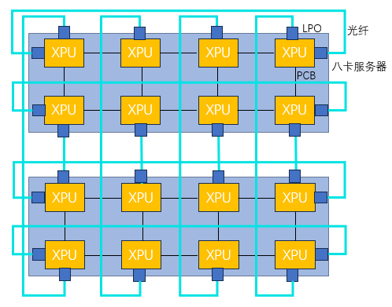
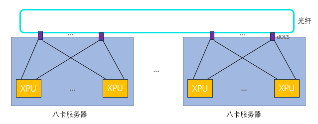
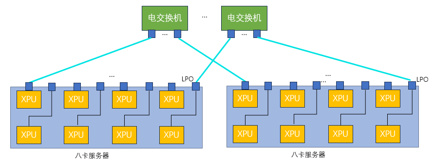
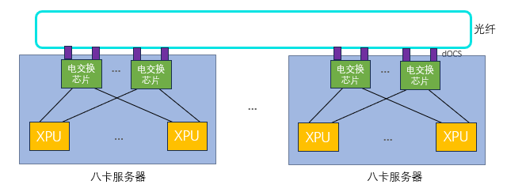
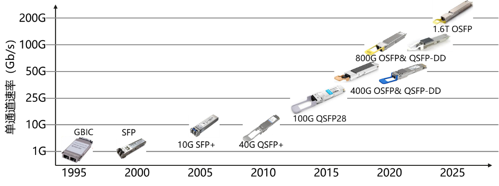
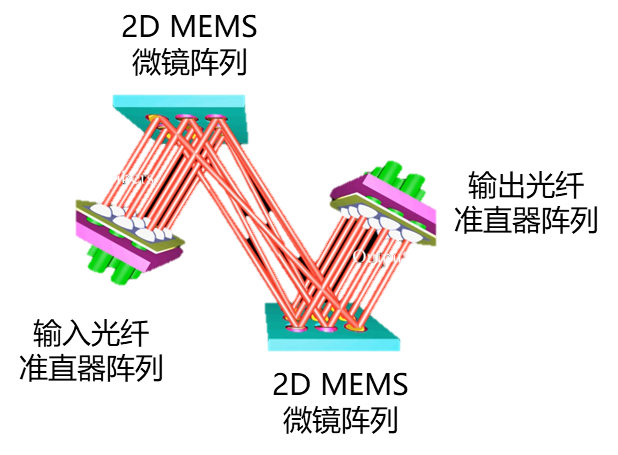
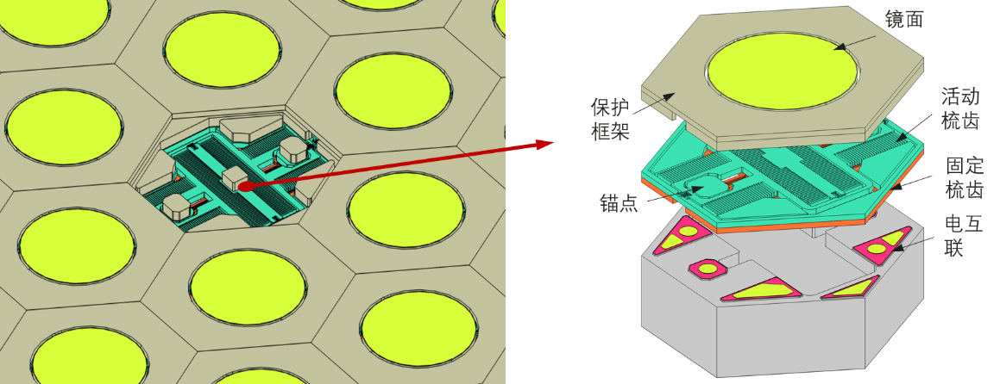
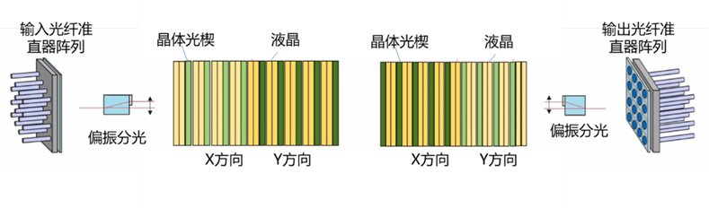
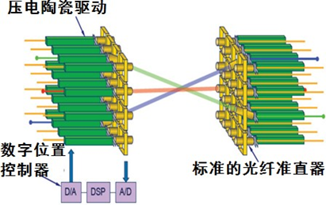
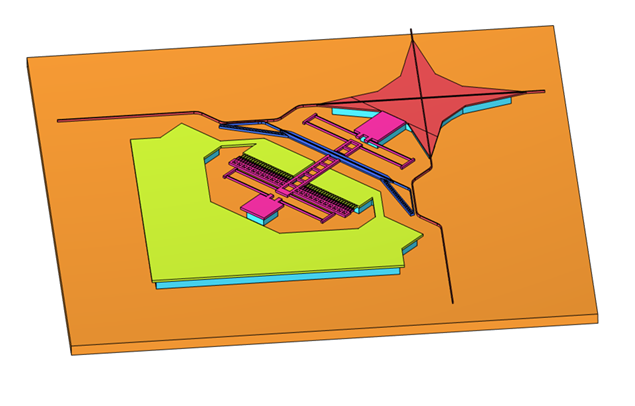

# 互联技术演进

## 光互联技术演进 {#optical-interconnect}

### 16卡超节点互连方案

#### 线性直驱光模块（LPO）

线性直驱光模块（Linear-drive Pluggable Optics, LPO）是一种在数据链路中仅使用线性模拟元件的光通信技术，省去了传统光模块中的数字信号处理（DSP）和时钟数据恢复（CDR）芯片。这种设计使得LPO在功耗和成本上相较于传统光模块有了显著的优势，特别适用于短距离、高带宽、低功耗和低延迟的数据通信场景。

首先，LPO的设计省略了DSP和CDR芯片，直接减少了光模块的功耗。这一优化不仅使得LPO在功耗上表现出色，而且在长期使用中可以大大减少散热问题，延长设备的使用寿命。低功耗特性尤其适合数据中心、大规模计算集群等高密度计算环境，在这些环境下，大量设备的能效管理成为一个重要考量因素。LPO的低功耗和高效能特性，有助于提升整体系统的能效，降低运营成本。

其次，LPO去除了DSP和CDR等复杂组件，这使得光模块的物料成本降低了20%到40%。传统的光模块依赖于这些复杂的数字处理元件来确保信号的质量和可靠性，而LPO通过简化设计，减少了这些高成本部件，从而降低了整体生产成本。这一优势在需要大量部署光模块的应用场景中尤为突出。对于计算互连而言，延迟是至关重要的性能指标之一。LPO由于不需要进行信号恢复处理，因此减少了传统光模块中的复杂信号处理过程，从而显著降低了系统的延迟。在高性能计算、人工智能训练和大数据分析等应用中，低延迟是实现高速计算和高效数据交换的核心要求。LPO的设计确保了极低的通信延迟，从而能够有效支持低延迟、高速的数据传输需求。

此外，LPO对协议具有透明性，意味着它能够兼容不同GPU厂商的计算互连协议，不依赖于特定的协议栈。这一特性大大提升了LPO的兼容性和灵活性，使其在多种不同硬件平台和技术架构下均可稳定运行，满足跨厂商、跨平台的计算互连需求。随着异构计算和多种硬件平台的快速发展，LPO的这一优势使得它能够适应不断变化的计算架构，提供更加灵活的互连解决方案。

#### 光直连方案

目前主流的国产算力通常是单机8卡内部直连形成超节点规模为8的系统。通过横向扩展集群规模提升整体算力的方式受到全局批量大小不能无限增长的限制，导致在集群规模增大到一定程度后，有效算力出现明显下降。模型参数量增大需要更大的模型并行规模，模型并行中张量并行或混合专家类型的专家并行都会在计算模块之间产生大量的通信，并且这部分通信很难与计算进行重叠。通过构建更大的超节点，以纵向提升的方式提升系统算力是解决上述问题的有效途径之一。

通过LPO进行光直连可以拓展到16卡超节点。在国产电缆盒成熟之前，单机柜内的互连，LPO也是一个比较好的解决方案。另外，通过简单的LPO直连可以验证LPO在XPU互连中的应用，为更复杂的互连网络打下坚实基础。

/// caption
图 1: 16卡超节点拓扑示意图
///

通过LPO光模块可以不受距离限制将传统的八卡服务器连成16卡组成的超节点（以二维环绕拓扑为例），二维环绕拓扑具有高扩展性和高吞吐量。通过LPO光模块直连可以将16卡连成一个整体，相比传统的8卡机内互连然后再通过网卡互连，16卡超节点可以提高XPU资源的利用率和计算效率。

此外，LPO光模块的应用也为未来的更高效、更大规模的XPU互连网络打下了坚实的基础。在未来的系统设计中，LPO光模块将成为连接多个XPU节点的核心技术之一，支持更高带宽和更低延迟的计算需求，推动国产算力系统向更高水平发展。

---

### 32卡/64卡超节点互连方案

#### 部分电交换光互连方案

相比光直连方案，通过电交换增加了不同并行方式的组合可能性，如数据并行、模型并行和流水线并行的混合使用，另外电交换允许根据不同任务需求动态调整GPU资源分配。国产XPU需要适配特定电交换芯片，因为国产电交换芯片端口密度和带宽方面的限制，可以选择部分带宽机内通过PCB走线互连，部分带宽拉出通过LPO和电交换机进行光互连。几台8卡服务内部一部分带宽通过PCB走线进行互连，另外一部分带宽通过光互连连到电交换机上，通过电交换机增加并行策略灵活性，提高超节点计算使用效率。

/// caption
图 2: 部分电交换光互连架构图
///

在这种架构中，PCB走线用于处理高带宽的局部通信，适合于同一台服务器内部的XPU之间的高速数据交换，而光互连则用于将带宽扩展到更远的节点，以满足跨节点的数据传输需求。这种方式结合了电交换机的灵活性和光纤互连的高带宽优势，有助于在不增加过多成本的情况下实现高效的跨节点通信。

某些情况下，可能需要更多的XPU用于执行某个数据密集型的任务，而在另一些场景下，可能需要通过模型并行来处理大规模模型。电交换允许系统根据这些变化进行实时调整，实现更高效的资源利用。这种动态资源分配能力对于需要高度灵活性和可扩展性的计算环境尤为重要。通过调整XPU之间的连接方式和带宽分配，系统能够适应各种不同的计算需求，避免资源浪费，同时提高计算任务的并行度和吞吐量。

通过结合电交换与光互连，系统能够更高效地利用超节点的计算资源。在传统的光直连方案中，带宽和计算资源的分配可能存在一定的局限性，尤其是在需要跨节点进行大量数据交换时，带宽可能成为瓶颈。而在电交换架构中，由于每个XPU的带宽不仅通过内部PCB进行高速互连，还可以通过光纤与电交换机进行灵活调度，系统的带宽利用更加均衡，计算任务的执行效率得到提升。

#### 分布式光交换方案

OCS最常见的实现方式是基于微机电（MEMS）原理，MEMS OCS利用静电力产生机械运动，改变镜面方向，从而改变光路。MEMS OCS具有低损耗、低串扰和偏振无关的优点。然而，它的芯片尺寸较大，切换速度较慢（以毫秒为单位）。此外，MEMS OCS稳定性差，需要复杂的控制反馈系统来保持镜面角度。与MEMS OCS不同，硅光OCS通过调整芯片上集成相位调节器的相位来控制光路。相位调节器可以是基于热光效应的热光相位调节器，也可以是基于等离子体色散效应的电光相位调节器。这两种类型的相位调节器非常稳定，并且提供快速切换，根据不同原理可以实现从微秒到纳秒的切换时间。与MEMS相比，硅光OCS具有紧凑性、低功耗、低成本的大规模生产潜力，能够利用传统的CMOS制造工艺。

dOCS光学可插拔模块是一种带有硅光OCS的线性可插拔光模块，以分布式互连的方式插在XPU服务器上，因此简称dOCS (Distributed Optical Circuit Switch)。dOCS采用低功耗的可插拔模块，不包含数字信号处理（DSP）芯片。链路中端到端的信号路径被视为线性，从而实现更低的功耗，并且与通信协议无关，不需要依赖先进工艺。通过消除可插拔模块的DSP/重定时功能，dOCS光学可插拔模块相比竞争方案具有更低的功耗、更低的成本和更低的延迟。以低光互连成本和功耗，提供高集群可靠性，减少对高端交换芯片的依赖。

/// caption
图 3: dOCS分布式光交换系统架构
///

通过dOCS技术，传统的8卡服务器的带宽可以被完全拉出，并通过光纤实现高速互连（包括但不限于环形拓扑）。dOCS系统的灵活性使得XPU之间的互连关系可以根据实际需求进行动态调整。这种灵活性意味着，可以将多个XPU配置为一个64卡的超节点，或者拆分成两个32卡的超节点，根据不同应用场景的需求进行调整，从而提高资源的利用率和计算效率。

基于dOCS的计算系统，能够将8卡服务器作为最小备用单元进行灵活配置。这种配置方式不仅可以应对现场的故障处理需求，绕过故障计算模块，保证系统的稳定运行，还能在出现故障时，通过快速重配置实现故障恢复。通过这种方式，计算集群的部署成本得到了显著降低，因为无需为每个计算节点单独配置冗余设备或外部交换机，从而提高了成本效益。

此外，采用dOCS与光纤直连的方案，连接多个服务器时，不需要依赖传统的外部电交换机或类似谷歌使用的中央光路交换机。这不仅减少了对传统交换机设备的依赖，还有效降低了互连的复杂性和成本。通过这种高效的光纤互连方式，dOCS不仅为数据中心和高性能计算集群提供了更加灵活、可扩展的架构，也推动了计算资源的动态调度和故障容错能力的提升，尤其在大规模数据处理和高性能计算的应用中，展现出了巨大的优势。

---

### 128卡/256卡超节点互连方案

为了实现更大规模的超节点，如果是一层电交换网络，电交换机需要更高的交换机端口密度来进行全交换，如果只有较小的交换机端口密度的交换机，则需要两层电交换网络来实现全互连，这会显著增加系统互连成本，并且引入数量规模的光模块也带来了系统可靠性维护的挑战。每增加一层交换网络，都会增加系统的复杂度和延迟。每个数据包都必须经过多次交换，导致网络带宽的利用效率降低，并且可能引入额外的延迟，影响系统的实时计算能力。其次，这种结构需要大量的交换机来完成不同节点之间的连接，增加了设备采购、部署以及长期维护的成本。另外，当系统中部署大量电交换机时，可能会面临光模块和电交换机之间的连接问题。由于光模块的数量随着交换机端口密度的增加而增加，系统的可靠性和维护难度也会随之增大。

#### 一层全交换光互连方案

在市场上，如果可用的电交换机端口密度提高，可以实现更高效的带宽管理和资源配置，从而进一步优化大规模计算系统的架构。通过LPO技术，每个XPU的带宽可以通过光纤远距离传输并连接到带有LPO接口的电交换机。这种方法的最大优势在于，XPU不再受限于传统的电交换机的带宽瓶颈，光纤提供了更高的传输速度和更远的传输距离。这种高带宽的连接方式确保了即使是大规模并行计算时，各个XPU之间也能保持高速、低延迟的数据交换。

/// caption
图 5: 一层全交换光互连架构
///

将每个XPU所有带宽通过LPO拉出通过光纤远距离连接到带LPO的电交换机，在传统的类似英伟达DGX服务器的8卡系统中，所有8个XPU通常通过一台内部交换机进行连接。由于交换机端口数有限且带宽较为集中，节点内部和节点之间的带宽存在层级化现象。为了优化带宽和计算资源的分配，使用更高端口密度的电交换机并将每个XPU的带宽通过LPO光纤拉出，可以完全解耦原来传统的8卡系统架构。

通过这种架构，节点的计算能力不再局限于固定的带宽分配和硬件结构，内部和外部之间的带宽实现了均衡化。各个XPU之间的通信不再受到单一交换机端口数限制，使得计算节点之间的数据传输更加高效和灵活。

通过将每个XPU的带宽全部通过LPO拉出并连接到高端口密度的电交换机，可以避免原来系统中存在的带宽不均衡问题。传统架构中，由于带宽主要集中在内部交换机上，可能导致某些XPU之间的通信瓶颈，而在新的架构中，由于每个XPU都拥有独立的高带宽光纤连接，这使得整个节点的带宽分配更加均匀，确保每个XPU都能够得到充分的带宽支持。

这种均衡化的带宽分配大大提升了计算节点之间的数据传输效率，使得不同的计算任务能够更快速地传递数据。无论是单一XPU的计算任务还是多XPU并行处理任务，都能够获得最佳的带宽支持，从而提升系统的整体性能。

采用将所有带宽通过电交换机进行全交换的方式，相比传统的部分电交换系统，可以实现更高的灵活性。这种方式使得不同并行计算方式的组合变得更加灵活和高效，能够充分发挥每个XPU的计算潜力。尤其是在需要大量并行计算的任务中，节点之间的数据传输速度和带宽充足，能够最大化XPU的使用效率。

通过引入高端口密度的电交换机和LPO光互连技术，整个计算系统的带宽分配变得更加均衡，节点内部和节点之间的通信能力得到显著提升。这种架构打破了传统8卡系统的局限，使得算力提升不再是层级化的，而是均衡化和高效化的。通过全交换架构，可以进一步优化不同并行计算方式的组合，提升XPU的使用效率，确保每个XPU在计算任务中的最大潜力得到充分发挥。同时，系统的可扩展性和资源利用效率也得到了显著提高，为大规模计算任务提供了更强的支持。

#### 光电混合分布式光交换

在当前的国产芯片产业背景下，由于先进制程产量有限，市场上可用的电交换芯片往往具备较低的端口密度。这种限制使得传统的高密度交换结构难以满足大规模高性能计算集群的需求，因此需要采取创新的设计策略，以提高系统的扩展性和灵活性，同时降低成本和复杂性。一种有效的解决方案是结合低端口密度的电交换芯片与分布式光交换技术（dOCS），从而构建出大规模超节点。

/// caption
图 4: 光电混合分布式光交换架构
///

在这一架构中，每个八卡服务器内部包含8个XPU，这些XPU通过多个低端口密度的电交换芯片进行机内全交换。虽然每个电交换芯片的端口密度较低，但通过将多个芯片联合使用，仍然能够完成高效的数据交换和通信。这种设计充分利用了现有低端口密度芯片的优势，同时避免了对更高端电交换芯片的依赖。多个八卡服务器之间，通过分布式光交换模块（dOCS）实现连接。这些dOCS模块通过光纤提供高带宽、低延迟的通信通道，形成了一个大规模的超节点架构。

dOCS技术的核心优势在于其灵活性和扩展性，它可以调控各个服务器之间的连接方式。不同于传统的电交换机，dOCS模块不依赖复杂的电路交换设备，而是通过光交换技术将多个服务器连接成一个统一的计算资源池。在这个架构中，dOCS使得多个8卡服务器可以组成128卡或256卡的超节点，也可以根据需要灵活调整成4个32卡或64卡的子节点。基于dOCS的计算系统具备极强的动态配置能力，可以根据实际计算需求进行灵活配置，并迅速适应不同的工作负载。dOCS的灵活性还体现在它的容错能力上。在实际的计算环境中，可能会遇到个别计算模块故障的问题。借助分布式光交换模块，整个系统可以绕过故障节点，实现动态重配置。这种基于dOCS的计算系统能够以每个8卡服务器作为最小的备用单元，在发生故障时快速调整互连关系，保证计算任务的连续性。这一特性极大提升了系统的可靠性和可用性，同时减少了由于硬件故障导致的停机时间。通过在系统内部使用dOCS和光纤直连技术，避免了传统架构中对外部电交换机或中央光路交换机的需求。

结合低端口密度的电交换芯片与分布式光交换模块（dOCS）构建的大规模超节点架构，不仅在成本上具有优势，还能提供高度的灵活性和扩展性。这种方案通过创新地结合电交换和光交换技术，解决了市场上电交换芯片端口密度较低的挑战，能够满足大规模、高性能计算的需求，特别适用于资源有限的国产芯片环境。同时，基于dOCS的容错与现场配置能力，进一步提升了系统的可靠性和维护效率，为未来的计算系统提供了更具竞争力的方案。

## 光模块技术演进

光模块核心功能是实现电信号与光信号在传输链路两端的精密转换，从而实现端到端电-光-电互联。光模块作为光互联技术的主流方案，在算力集群互连中扮演重要角色，有效支撑算力数据中心互连带宽高速增长，逐渐成为算力集群扩展能力、能效比以及总体成本的关键因素。

光模块技术历经30多年的发展，从最初标准化的GBIC（Gigabit Interface Converter）到如今持续向1.6T容量迈进，其演进史就是一部不断追求"更高速率、更小体积、更低功耗"过程中，持续突破物理极限与工程障碍的历史。

### 早期标准化阶段

光模块标准化始于20世纪90年代，运营商与设备制造商共同成立多源协议组织，旨在通过统一的标准推动市场的规模化与兼容性。最早的代表性封装是1x9封装，主要用于早期的以太网交换机，速率通常不超过1Gbps，采用SC光接口，因其焊接式设计不支持热插拔，在灵活性和兼容性上存在显著局限性。随后出现GBIC封装，引入热插拔技术，允许用户在不中断设备条件下进行光模块的更换，该特性的出现极大的简化了网络维护流程。

### SFP到万兆时代

随着21世纪到来，光通信技术开始走向成熟，市场对端口密度的要求日益迫切。SFP（Small Form-factor Pluggable）应运而生，体积仅为GBIC的一半左右，却能支持高达4Gbps的速率，同时采用了更小尺寸的LC光接口。随着万兆以太网需求的兴起，SFP+封装在2006年正式推出，它在保持SFP外形尺寸不变的前提下，将速率提升至10Gbps，随后成为光互连的主要接口形态。

### 并行传输与QSFP时代

单通道速率的提升在接近25Gbps时遇到了显著的电磁干扰与信号完整性挑战。为了实现更高的吞吐量，行业转向了并行传输架构。QSFP（Quad Small Form-factor Pluggable）标准通过集成四个电学通道实现了速率的跨越，实现单模块容量突破100Gbps。

/// caption
图 6: 光模块形态与速率演进
///

### 400G：PAM4调制的转折点

400G是光模块演进史上的一个关键转折点。它不仅是速率的简单提升，更伴随着信号调制方式从非归零码（NRZ）向四电平脉冲幅度调制（PAM4）的全面转变。单通道速率突破50Gbps，继续采用NRZ码型面临Nyquist带宽限制，电链路传输损耗急剧增加。PAM4通过四个电平等级（00, 01, 10, 11）在每个符号周期内传输两个比特位，有效地将相同波特率下的比特速率翻倍，降低了信号波特率，从而缓解了对电学组件带宽的要求。

针对400G的封装，行业内形成了两大竞争阵营：QSFP-DD（Double Density）和OSFP（Octal Small Form-factor Pluggable）。QSFP-DD通过在传统的QSFP接口上增加第二排金手指，将电学通道由4路扩展至8路（8x50G PAM4），实现了向后兼容性。OSFP模块尺寸略大于QSFP-DD，针对性优化模块散热，集成散热片，能够支持15W+功耗。此外在400G代际，硅光集成技术开始在400G DR4（500m）场景下体现其高度集成规模化优势。通过将调制器、检测器及波导分光器等器件集成在硅光芯片上，实现4路100G单波信号高效传输，不仅降低了模块的物料复杂度，同时有效减少光收发单元的封装尺寸。

### 800G：AI驱动的刚性需求

2023年以来，以ChatGPT为代表的生成式AI推动了万卡级别GPU集群的建设。这种极高密度的计算环境对800G光模块产生了巨大的刚性需求。800G光模块的电学接口通常基于每通道100Gbps的PAM4信号（8x100G）。而在光学端，目前的市场主流是单波100G的8通道方案。根据传输距离，具体可分为SR8、DR8、2xFR4和2xLR4四种规格：

- **800G SR8**：采用VCSEL垂直腔面发射激光器，适用于多模光纤，通常覆盖100米以内的短距互联，采用MPO-16光接口；
- **800G DR8和2xFR4**：主要基于EML或硅光器件，在单模光纤信道实现500m和2km传输距离；DR光模块采用8个光纤信道实现并行传输，而FR光模块则是通过合分波器实现4个CWDM（1271/1291/1311/1331nm）波长复用一根光纤，通过2组收发实现8个通道通信；
- **LR**：在FR基础上进一步把传输距离拓展至10km。

为进一步降低成本和功耗，单波200G的4通道方案（4x200G）正成为重要的演进方向，相关标准工作已进入基线化阶段。

### 1.6T：下一代容量标杆

随着单波200G光电器件走向成熟，模块容量在800G（8通道）基础上实现容量翻倍，进一步达到1.6T传输容量。1.6T光模块是为满足下一代超大规模数据中心、云计算以及AI计算集群呈指数级增长的带宽需求而设计的核心光通信组件。相比现有的800G模块，它的传输容量翻倍，同时在封装密度、功耗控制和光电转换技术上实现了重大突破。预计2026年，1.6T光模块发货量将实现规模爆发。

1.6T光模块封装形态主要有OSFP224以及QSFP-DD1600两种形态。两种模块形态电口侧均支持8x200Gbps，OSFP模块形态向后兼容现有的OSFP插槽，散热更优，是目前市场的主流选择；而QSFP-DD形态体积更小，散热和物理空间限制导致其设计难度更高，目前进度略晚于OSFP。光收发器件材料平台一般有三种选择，包括硅光技术、传统EML以及薄膜铌酸锂等。硅光及EML技术作为800G代际的延续，相对成熟，成为1.6T光模块的主流选择。而薄膜铌酸锂技术受益其高带宽及低插损优势，有望带来一定功耗优势，逐渐进入量产视野。

### 未来：单通道448G与更高容量

随着模块容量的演进，单通道速率也在持续演进，单通道448G正成为下一个标准化的重要速率节点，IEEE E4AI工作组正在积极开展相关标准工作。预计相关标准将支持光模块容量从1.6T持续向3.2T、6.4T演进。

---

## 光交换设备

### 光交换（OCS）技术概述

光交换机负责在光纤间建立和断开连接，高性能的光交换能够实现毫秒级或更快的切换速度，对于满足数据中心动态流量需求至关重要。根据实现技术的不同，光交换技术一般可分为3D MEMS技术、数字液晶DLC技术、直接光束偏转DLBS技术、硅光MEMS快速开关技术。

光交换的主要性能指标包括：

1. **切换速度**：直接影响到数据中心网络的动态响应能力，高性能的光交换应具备毫秒级的切换速度，以满足高频率的流量变化需求；
2. **插入损耗**：光信号通过光交换时的功率损耗，较低的插入损耗有助于提高信号质量和传输距离；
3. **回波损耗**：光信号在通过光交换时反射回源端的功率，较高（绝对值）的回波损耗有助于减少信号反射和干扰；
4. **耐用性和可靠性**：确保数据中心网络稳定运行的关键，高性能的光交换应具备较长的使用寿命和较低的故障率。

### 3D MEMS 光交换

MEMS光交换由输入光纤准直器阵列（FAU: Fibre array unit）、输入MEMS微镜阵列、输出MEMS微镜阵列、输出光纤准直器阵列及配套驱动、控制软硬件构成。其中输入输出MEMS微镜单元为二维双轴反射型微镜面阵，两片MEMS微镜阵列平行放置构成N×N的矩阵开关阵列。输入光信号经过光纤阵列并以一定角度依次入射MEMS微镜阵列对应微镜单元，每个微镜单元拥有独立的驱动控制，通过施加不同的电信号实现所需的转角；输入MEMS微镜阵列通过调整微镜单元的转角将入射光信号偏转到目的输出微镜阵列对应的微镜单元，完成选路或交叉，输出微镜阵列负责将光信号偏转，正入射到输出光纤准直器阵列对应端口，实现最佳耦合输出使得光交换插损最优。

/// caption
图 7: MEMS光交换工作原理示意图
///

MEMS微镜阵列由半导体工艺实现，MEMS微镜单元由反射镜、驱动结构和电互联组成，镜面直径约几百微米。常见的驱动方式有：

- **磁电驱动**：采用洛伦兹工作原理，驱动电压较低、线性度较好，但需要磁铁阵列，封装相对复杂，且容易产生发热与温漂问题；
- **热电驱动**：通过改变微镜驱动臂的温度实现微镜偏转，功耗较高、响应速度较慢、转角精度较差；
- **静电驱动**（最常用）：在构成的垂直梳齿结构的固定梳齿和可动梳齿之间施加电压，在交错的梳齿之间静电力作用下，可动梳齿发生位移，驱动微镜旋转。

/// caption
图 8: MEMS微镜阵列结构与工作原理
///

### 数字液晶（DLC）光交换

液晶是一种特性介于固态和液态之间的物质相态，兼有晶体和液体的部分性质。液晶分子在排列上的有序性和各向异性，使得液晶材料具备折射率各向异性、介电常数各向异性等物理特性。在液晶盒两端施加电压时，液晶分子会发生偏转，导致液晶的双折射系数发生变化，产生相位延迟，这一现象即液晶的电光效应。

数字液晶光交换利用液晶的电光效应与晶体光楔的级联产生光束偏转，能够将第N个端口的输入光任意交换到任意第N个输出端口，完成N×N的液晶光交换功能。

数字液晶光交换的核心部件包括：

- **二维保偏准直光纤阵列FAU**：提供N×N端口信号光的输入与输出；
- **偏振处理模块**：对入射光进行S偏振与P偏振的分束与合束；
- **LCLM液晶光模块阵列**：LC可调延迟器与双折射晶体光楔的组合经过多层级联，实现N×N信号光偏转。

其中，1层LC可调延迟器与晶体光楔的组合可以实现2个离散角度的偏转（2态调制）。系统交换维度扩展到M维端口切换则需要共L层组合，满足 \( 2^L > M \)。例如，对于256端口，需要对应8层可调LC和晶体光楔的组合。该技术对装调工艺要求很高，预计最大可支持512端口。

/// caption
图 9: 数字液晶DLC光交换原理示意图
///

### 直接光束偏转（DLBS）光交换

直接光束偏转光交换是将光纤准直器直接固定在压电陶瓷驱动器上，每个准直器尾部与压电陶瓷相连，排列成二维准直器阵列，将两个二维准直器阵列面对面放置，构成光开关矩阵，利用压电陶瓷机电耦合效应，驱动准直器位移与角度倾斜，使两阵列对应端口匹配对准，完成通道连接，实现光交换功能。

该方案中光信号传输光程短，利于降低光信号传输及耦合损耗。然而随着通道数增加，交叉矩阵规模增大，大角度交叉对准时对压电陶瓷驱动的性能要求提高，且所需空间体积增加，一定程度上制约了光交叉连接的规模。

/// caption
图 10: DLBS直接光束偏转光交换示意图
///

### 硅光 SiP MEMS 快速开关光交换

硅光MEMS快速开关光交换的核心是硅光MEMS快速开关阵列，开关阵列由N×N个开关单元构成。每个开关单元主要由MEMS开关驱动器（包括可动波导）、固定波导和电极组成。MEMS开关驱动器通过静电力控制，驱动可动波导进行上下或水平移动，进而精确控制可动波导与固定波导之间的距离：

- 当间距较大时，波导相互之间的耦合效率较低，光信号直通到输出端；
- 当间距较小时，波导耦合效率增大，光信号耦合到可动波导再到固定波导，实现路径切换。

/// caption
图 11: SiP MEMS开关光交换结构示意图
///

硅光MEMS快速开关的核心优势是通道切换时间短，MEMS开关尺寸在百微米级别，本征谐振频率在兆赫兹级别，切换时间在微秒到十几微秒级别，适合需要通道快速切换的场景。同时集成度相比于其他光交换技术更高。

主要挑战有两点：

1. 一个通道涉及到通道路径上所有的开关单元，对MEMS阵列的单元良率要求较高，需要预留足够的端口冗余；
2. 对于64×64规模，端到端插损一般＞3.5dB，对于128×128规模，端到端插损预计5dB~7dB，已超过光模块功率预算，需要通过系统方案补偿。

### 光交换技术对比

| 技术方案 | 相对成本 | 端口数量 | 切换时间 | 插入损耗(dB) | 驱动电压(V) |
|---------|---------|---------|---------|------------|-----------|
| MEMS | 低 | 320×320（可扩展至千端口） | 几十毫秒 | ~3 | ≈100 |
| DLC | 低 | 300×300 | 几百毫秒 | ~4 | ≤10 |
| DLBS | 高 | 576×576 | 几十毫秒 | ~2.5 | ≈10 |
| SiP MEMS | 中 | 128×128 | 十几微秒 | ＞5 | 30~50 |

光交换机实现了任意输入N端口到输出N端口的无阻塞交换，属于端口交换，其优点是与信号波长、调制格式及速率无关，协议透明，具有极高的调度效率。

### 故障恢复与能耗

光交换网络的故障恢复策略主要为硬件冗余保护策略，常见的硬件冗余方式包括双电源冗余、双控制器冗余和双光开关冗余等。内部器件故障导致某条光路无法使用时，需要修改外部光纤连接关系，因此通常需要在外部预留冗余端口。

光交换机没有光电转换部件，因此功耗极低，其设备功耗为相同规模电交换机的十几分之一，甚至百分之一以下。

### 控制平面

光交换机的控制平面负责管理网络资源，包括路径计算和光开关的控制。控制平面需要具备的基本功能包括：

- **路径计算**：根据网络拓扑和流量需求，计算出最优的光信号传输路径；
- **光开关控制**：实时监控网络状态，动态调整光开关的配置，以应对流量变化和故障恢复。

控制平面架构层面需要考虑：控制协议的高效性、信令流程的简洁性，以及控制器架构的高可靠性与可扩展性（集中式控制器具有全局视图优势但存在单点故障风险，分布式控制器通过协同工作提高可靠性和可扩展性）。

---

## 信道介质

光纤技术正经历一场深刻的演进，从传统的多模、单模光纤，向多芯光纤和空芯光纤等新型结构方向发展，以应对日益增长的带宽和传输需求。在数据中心内部，不同类型的光纤凭借其独特优势，承担着不同的连接角色，共同构成了一个分层、高效的光互联网络。

### 多模光纤

多模光纤纤芯直径50μm，允许多种模式的光同时传输。多模光纤存在模式色散大、带宽窄的问题，主要适用于中短距离、小容量的传输，主要用于机架内服务器与交换机的连接（Top-of-Rack）以及短距离的水平布线。

核心优势：

- **成本低廉**：采用低成本的VCSEL激光光源，收发器模块的制造成本远低于单模方案，对于需要部署海量连接的数据中心至关重要；
- **技术成熟**：部署和维护简单，可靠性高；
- **持续演进**：随着AI智算中心对带宽需求的激增，激光优化的OM3、OM4乃至更先进的多模光纤已被广泛应用，能够支持100G、400G甚至800G的高速以太网链路，传输距离覆盖30米至150米的典型机房场景。

### 单模光纤

在数据中心领域，"小直径高密单模光纤"通常指的是一类通过减小光纤涂覆层直径来实现更高布线密度的技术。这与G.657抗弯技术（解决弯曲半径问题）是相辅相成的，二者结合构成了现代超大规模数据中心和AI算力中心布线的基石。

核心规格：传统单模光纤的涂覆层直径通常为250µm，"小直径"光纤则将这一尺寸缩小至200µm（甚至190µm及以下）。直径减少20%，单根光纤的横截面积减少约36%，在同等空间内理论上可以多容纳约50%的光纤数量。

核心优势：

- **提升机柜密度**：使用小直径光纤配合高密度连接器，单个1U机柜可容纳多达48芯甚至更多，密度可提升300%；
- **优化气流与散热**：光缆变细后机柜内部线缆堵塞问题得到显著缓解，有助于降低PUE；
- **减轻桥架负载**：大量细径光纤可以显著减轻重量和体积，为未来扩容预留物理空间。

现代数据中心的跳线往往是"G.657.A2（抗弯）+ 200µm（细径）+ LC/MDC（高密连接器）"的结合体，完美支撑了从400G到800G乃至1.6T的速率升级。

### 空芯光纤

空芯光纤（HCF）是颠覆性的新一代传输介质，不再依赖传统的实心石英玻璃导光，而是利用由多层微米级玻璃管构成的"空气芯"来传输光信号。主要应用于对时延和带宽要求极为苛刻的场景，特别是连接不同智算中心的"超级动脉"。

核心优势：

- **超低时延**：光在空气中的传播速度比在玻璃中快约30%-47%，能显著缩短数据传输时间；
- **超大容量**：具有极弱的非线性效应和超宽的工作波段，单纤传输容量可突破100Tbps；
- **超低损耗**：2024至2025年间，反谐振空芯光纤的传输损耗已突破性地降至0.11 dB/km甚至0.05 dB/km，首次低于传统单模光纤的理论极限（约0.14 dB/km）；
- **超低非线性**：空气芯极大地减弱了光与物质的相互作用，为提升单纤容量和传输距离扫清了障碍。

发展挑战：目前仍处于发展初期，面临大规模工业化拉丝能力不足、熔接与工程部署技术不成熟等挑战。

商业化进展：微软（Microsoft）计划在Azure网络中大规模部署空芯光纤，并已通过收购Lumenisity等举措推动其落地。国内运营商和设备商也已开展现网试点，验证其在智算中心互联中的巨大潜力。

### 多芯光纤

多芯光纤通过在一根光纤的包层内集成多根纤芯，实现"空分复用"，成倍地增加传输信道，主要面向数据中心互联（DCI）和智算中心内部的高密度骨干连接。

核心优势：

- **容量倍增**：例如一根4芯光纤可使传输容量提升4倍，在不增加光缆管道资源的前提下极大提升了传输效率；
- **高密度连接**：在管道资源紧张或需要极高连接密度的场景下，可显著减小光缆的体积和重量。

发展挑战：关键在于如何有效降低不同纤芯之间以及同一纤芯内不同模式之间的信号串扰，以保证传输质量。

综上，光纤技术的演进路径清晰可见：从多模到单模奠定了现代通信的基础；而面向未来，多芯光纤通过增加"车道"数量、空芯光纤通过改变"路面"材质，共同为突破容量和时延瓶颈提供了两种极具前景的技术方向。

---

## 先进互联拓扑演进 {#advanced-topology}

互联拓扑的演进与光互联强相关：当铜互联在**距离/插损/功耗/维护复杂度**上触顶时，系统往往会同时引入“更强的拓扑稀疏化”和“可重构链路（OCS）”来提升有效带宽与鲁棒性。

- 详细拓扑讨论见：[先进互联拓扑演进](topology.md)

---

## 新型总线技术演进 {#new-bus}

除“介质与交换”外，Scale-Up 体系的另一条主线是“总线语义与编程模型”的演进：统一寻址、原子操作、隔离与可观测能力，决定了上层通信库与系统软件能否把硬件带宽转化为稳定的 Goodput。

- 详细讨论见：[新型总线技术演进](bus.md#bus-evolution)
