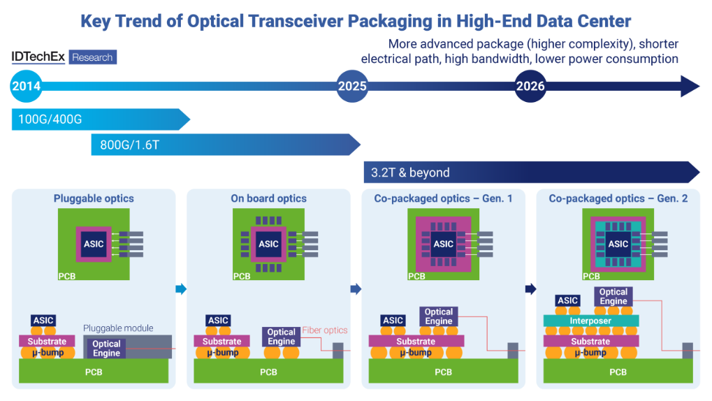
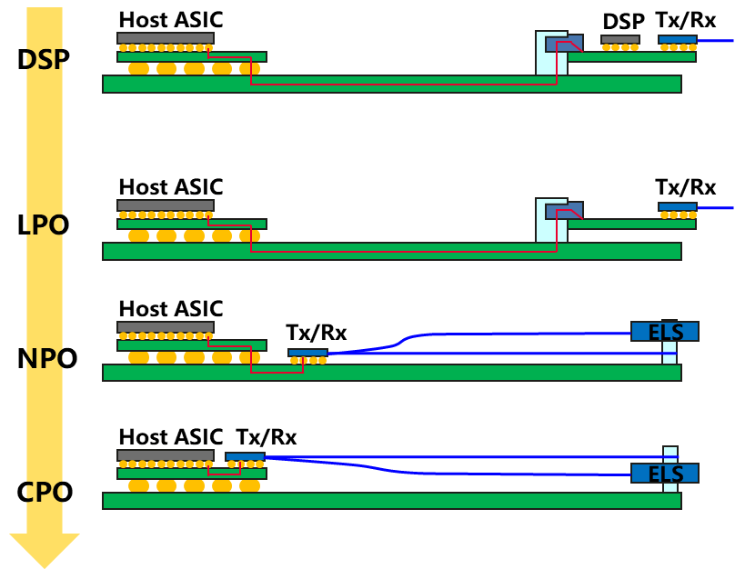
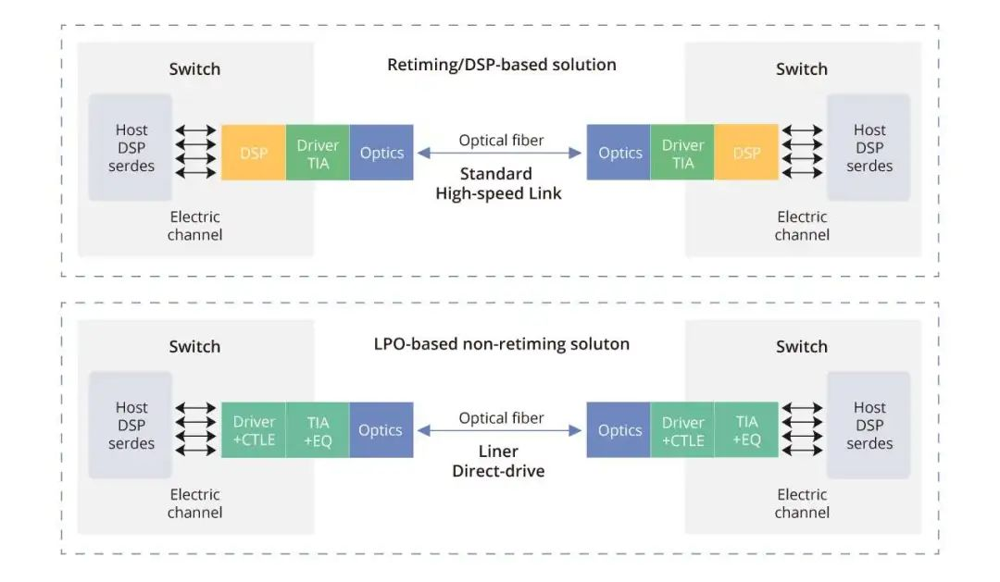
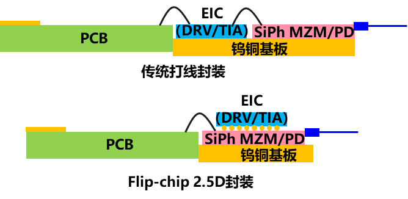
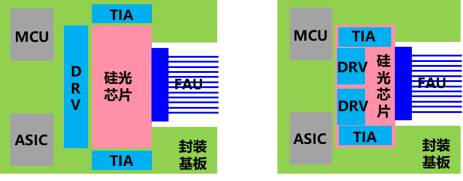
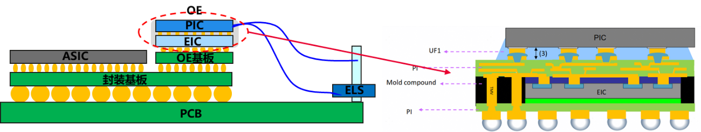
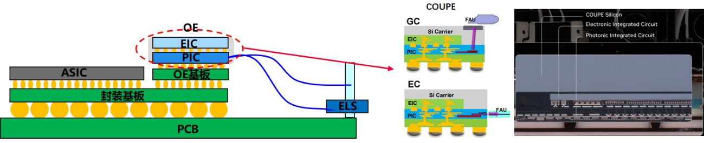

# 先进封装技术演进

## LPO/CPO/NPO封装技术 {#lpo-cpo-npo}

从传统的2D封装，到基于硅中介层的2.5D/3D IC封装，再到如今的光电协同封装，技术演进的核心逻辑是不断缩短互连距离、提升带宽密度、降低单位比特能耗。可插拔光模块（如QSFP-DD）代表了光电分离的现状，而LPO是其改良，NPO/CPO则是朝向光电深度融合的范式革命，体现了"封装即系统"的理念。

/// caption
图 1: 封装技术演进路线图（从可插拔到CPO）
///

在人工智能大模型训练和推理需求爆炸式增长的背景下，全球数据中心正经历从传统云架构向高性能计算集群（HPC）的深刻转型。随着GPU算力的指数级提升，网络互联带宽已成为制约系统效率的关键瓶颈。研究数据显示，在缺乏高效互联的情况下，高达33%的GPU时间可能因等待网络可用性而被浪费，这在算力成本极高的今天意味着巨大的经济损失。同时，随着端口速率持续向800G、1.6T容量演进，传统可插拔光模块面临着"功耗墙"与"信号完整性"的双重挑战。在这一背景下，线性直驱可插拔光学（LPO）、近封装光学（NPO）以及共封装光学（CPO）三种形态便应运而生，分别代表了从改良主义到革命性的不同技术路径。

/// caption
图 2: 几种不同的光互连形态示意图
///

## LPO/NPO/CPO技术定位

三者并非简单的替代关系，而是面向不同场景、不同阶段的技术阶梯。LPO聚焦对现有可插拔生态的"降功耗"改良；NPO作为中间形态，平衡了集成度与可维护性；CPO则代表终极形态，追求极致的能效与带宽密度。它们在集成度、功耗、成本、标准化和可维护性上构成连续光谱。

---

## 线性驱动可插拔光学（LPO）

LPO（Linear-drive Pluggable Optics）作为一种过渡性但极具市场潜力的技术方案，旨在通过剥离光模块内部的高功耗数字信号处理芯片（DSP）来解决当前的散热与能耗压力。在传统的重定时（Re-timed）可插拔模块中，数字信号处理器是不可或缺的核心单元，用于时钟恢复、色散补偿以及信号损伤修复。然而，随着速率提升至800G，DSP的功耗占比已接近模块总功耗的一半，成本约占光模块总成本的1/3。

LPO的核心革新在于移除了传统可插拔光模块中的高速数字信号处理器（DSP），代之以模拟的线性驱动器和线性跨阻放大器（TIA）。DSP原本负责复杂的数字信号补偿（如色散、非线性效应），功耗巨大。LPO通过简化链路，并依赖交换芯片ASIC侧更强的信号处理能力来协同补偿，从而在短距传输内实现显著功耗降低。

/// caption
图 2: LPO与传统光模块架构对比
///

综合来看，LPO模块在维持可热插拔的条件下可有效降低光互连功耗、成本与时延，能够高度契合AI计算中心短距离、大带宽、低功耗、低延时的需求。其最大优势是在基本保持可插拔形态和互换性的前提下，将光模块功耗降低约50%，极具成本效益。

主要挑战在于：链路性能依赖于ASIC与模块的协同优化，对信道损伤的容忍度降低，可能影响互操作性；传输距离目前限于500米至2公里内的数据中心短距互连；产业亟需建立统一的线性接口标准。

### 封装形式

LPO当前主要采用硅光器件平台，通过激光器分光共享进一步降低BOM成本。LPO主要采用与DSP模块相同的封装方案，一般有两种封装形式：

- **打线（Wire Bonding）封装**：EIC与硅光芯片平铺在散热基板上，通过打线方式实现PCB到EIC、再到硅光PIC的电互连；
- **倒装（Flip-chip）封装**：EIC通过金球或焊料面对面贴装在硅光芯片上，硅光芯片再通过打线方式或倒贴焊接方式与PCB连接。这种封装方式下信号路径经过金线连接次数明显减少，有利于提升信号链路带宽。

/// caption
图 3: LPO光模块两种典型的封装形式
///

LPO是面向现有数据中心网络升级最直接的解决方案，尤其适用于AI/ML集群中GPU/XPU之间高速、短距的脊叶架构互连。它能够快速部署，缓解机架顶交换机面临的功耗和散热压力，是向更高集成度光电封装过渡前，最具商业可行性的"立即可用"技术。

---

## 近封装光学（NPO）

NPO（Near-packaged Optics）是一种介于传统可插拔光学与全集成CPO之间的中间形态。其核心出发点是在解决"信号完整性"问题的同时，规避CPO在封装复杂度、热管理及可靠性方面的风险。NPO将光引擎从面板处的可插拔插槽移走，放置在交换机PCB主板上，并使其紧挨着ASIC芯片，通常距离控制在1至5厘米范围内。在这种形态下，光引擎通常采用模块化、可插拔或焊接的形式固定在主板上，并通过超短距离的电走线与ASIC连接。

/// caption
图 4: NPO技术架构图
///

NPO在集成度与灵活性间取得了折中：相比可插拔，它提升了带宽密度并降低了功耗；相比CPO，它降低了封装复杂度和热管理难度，维护更便捷。挑战在于：板级高速通道设计难度高；光学引擎与ASIC之间需要高密度、低损耗的连接器；整体系统的机械与散热设计更为复杂。

### 封装形式

NPO模组一般有两种封装方式：

- **MCM（Multi-chip module）2D封装**：电芯片与硅光芯片均贴装在封装基板上，通过封装基板实现电信号的高速互连；
- **Flip-chip 2.5D封装**：与光模块的2.5D封装方式类似，可以进一步减小光模组尺寸，有效降低电链路插损。

/// caption
图 5: NPO光组件两种典型的封装形式
///

对于超大规模数据中心而言，NPO提供了一个可以在较短时间内实现且风险可控的升级路径，无需依赖TMV、TSV等先进封装工艺，直接在传统光模块厂商进行最后组装。

NPO适用于对带宽和能效有较高要求，但又需要一定模块化灵活性以适配不同距离或技术迭代的场景，如高端数据中心交换平台、以及特定规模的AI训练集群。它可被视为CPO全面成熟前的重要过渡方案，或是在某些对可维护性要求极高的场景中的长期选择。

---

## 共封装光学（CPO）

CPO（Co-packaged Optics）被公认为短距光互连演进的终极方案。它打破了电信号在PCB上传输的物理范式，将光电转换环节直接移入交换芯片或计算芯片的封装内部，实现了物理层面上光电转换与ASIC逻辑芯片的深度集成。

CPO代表了最高集成度，它将多路光学引擎（通常基于硅光技术）与计算ASIC通过先进封装技术（如硅中介层、再布线层、微凸块）集成在同一封装基板或插槽内。电信号在封装内部以极短距离互连，直接转换为光信号射出。这种架构几乎消除了高速电信号在PCB上的传输，实现了芯片级的光电融合。

CPO的系统级架构通常由核心电芯片、光引擎模块、硅中介层及外部激光器源（ELS）组成。通过硅光技术，将原本复杂的离散光器件集成到微小的芯片上，CPO实现了传统形态无法企及的带宽密度。例如，Broadcom的Bailly平台在单个封装内集成了8个6.4T光引擎，构建出总容量高达51.2T的交换能力。

CPO能实现数量级的能效提升（目标低于5 pJ/bit），并大幅提高带宽密度（单个插槽内实现数十Tb/s乃至更高）。它极大简化了系统设计，减少了连接器和PCB层数，从本质上解决了信号完整性问题，为未来ExaFLOP级算力集群提供了必需的互连基础。

挑战极为严峻：首先是热管理，高功耗ASIC与对温度敏感的光学元件紧密相邻，散热设计空前复杂；其次是测试与可靠性，封装后难以单独测试光电部件，良率提升和故障诊断困难；此外，供应链重构、标准缺失以及高昂的初期成本都是商业化道路上必须跨越的障碍。

### 封装技术路线

当前CPO主流封装技术路线主要有两种3D封装技术路线：

#### FOWLP（Fan-out Wafer-level Packaging）

以Broadcom、Cisco为代表。

/// caption
图 6: 博通公司6.4T OE光引擎FOWLP封装结构
///

在该方案中，EIC芯片嵌入在molding材料中，molding材料中引入垂直互连结构TMV（Through Molding Via），PIC倒装在EIC芯片上，电互连通过底端的bump进入TMV，通过上层的RDL进入EIC，之后EIC再通过micro bump与PIC进行互连。

采用EIC内嵌的封装方式对于光引擎散热不太友好，新加坡A*Star也报道了PIC内嵌的CPO OE封装方案，整个工艺过程需要对光口进行保护，避免molding过程中有机材料污染光口，降低光口耦合性能。

#### COUPE（Compact Universal Photonic Engine）

以Nvidia、TSMC为代表。

/// caption
图 7: TSMC的COUPE光引擎封装方案结构及Nvidia CPO光引擎截面
///

与FOWLP方案相比，该方案同为3D封装结构，但采用了更为先进的TSV（Through Silicon Via）结构。EIC与PIC通过Hybrid bonding技术直接堆叠，避免焊球结构引入的寄生效应，大幅改善电互连链路带宽。另一方面，PIC芯片集成TSV结构，电信号直接穿过PIC芯片与EIC互连，相比TMV的封装结构可减少RDL的走线长度，改善链路带宽。

在光耦合方面，可以选择端面耦合与面耦合方案。面耦合结构中，可以采用基于光栅的面耦合方式以及基于封装工艺的90°反射镜结构，由于在顶层硅载板层集成扩束透镜，配合光纤端面的90°反射镜可实现较高的耦合效率。

Nvidia公司发布了Quantum-X以及Spectrum-X系列CPO交换机，主要采用TSMC的COUPE封装技术方案。

/// caption
图 8: CPO封装架构示意图
///

如图所示，CPO技术通过将光学引擎与计算ASIC紧密集成，实现了芯片级的光电融合，极大地提升了互连密度和能效。

---

## 3D DRAM技术 {#3d-dram}

3D DRAM（以 HBM 等 3D 堆叠内存为代表）正在把“内存带宽/容量/访问形态”变成训练与推理系统的第一约束之一：训练侧体现为参数/激活/优化器状态与并行策略的耦合；推理侧体现为 KV Cache 常驻、分页与碎片化带来的尾延迟与成本压力。

面向超节点，建议聚焦三类工程问题：

- **带宽/容量配比如何映射到负载**：对训练与推理分别给出“瓶颈判据”和“降级路径”（例如带宽受限时优先做哪些重叠/分层通信；容量受限时 KV/权重缓存如何分层）。
- **封装协同与热耦合**：当 3D DRAM 与高功耗逻辑芯片近封装/共封装时，热耦合会直接影响内存频率与稳定性，需要封装、冷却与遥测闭环共同设计。
- **向系统软件暴露的控制面**：容量不足时，系统需要更明确的放置/迁移/一致性/完成语义来控制性能长尾；这会把 3D DRAM 的工程落地与“内存语义/通信库/调度系统”绑定在一起，而不仅是硬件选型问题。
