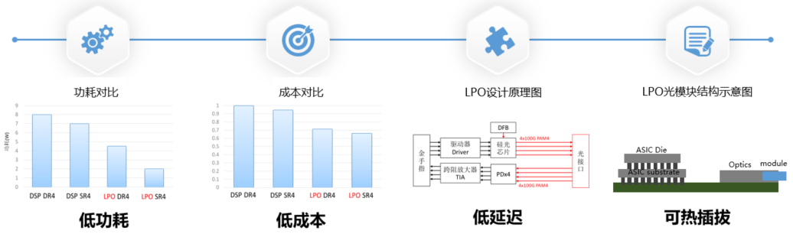
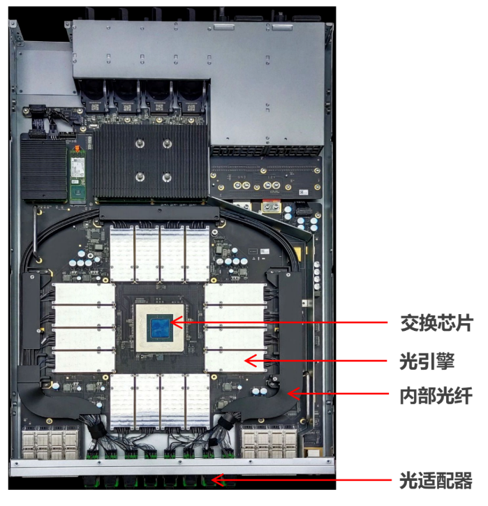

# 先进封装技术演进

## LPO/CPO/NPO封装技术

从传统的2D封装，到基于硅中介层的2.5D/3D IC封装，再到如今的光电协同封装，技术演进的核心逻辑是不断缩短互连距离、提升带宽密度、降低单位比特能耗。可插拔光模块（如QSFS-DD）代表了光电分离的现状，而LPO是其改良，NPO/CPO则是朝向光电深度融合的范式革命，体现了"封装即系统"的理念。

/// caption
图 1: 封装技术演进路线图（从可插拔到CPO）
///

## LPO/NPO/CPO技术定位

三者并非简单的替代关系，而是面向不同场景、不同阶段的技术阶梯。LPO聚焦对现有可插拔生态的"降功耗"改良；NPO作为中间形态，平衡了集成度与可维护性；CPO则代表终极形态，追求极致的能效与带宽密度。它们在集成度、功耗、成本、标准化和可维护性上构成连续光谱。

---

## 线性驱动可插拔光学（LPO）

LPO的核心革新在于移除了传统可插拔光模块中的高速数字信号处理器（DSP），代之以模拟的线性驱动器和线性跨阻放大器（TIA）。DSP原本负责复杂的数字信号补偿（如色散、非线性效应），功耗巨大。LPO通过简化链路，并依赖交换芯片ASIC侧更强的信号处理能力来协同补偿，从而在短距传输内实现显著功耗降低。

/// caption
图 2: LPO与传统光模块架构对比
///

其最大优势是在基本保持可插拔形态和互换性的前提下，将光模块功耗降低约50%，极具成本效益。主要挑战在于：链路性能依赖于ASIC与模块的协同优化，对信道损伤的容忍度降低，可能影响互操作性；传输距离目前限于500米至2公里内的数据中心短距互连；产业亟需建立统一的线性接口标准。

/// caption
图 3: LPO技术架构详图
///

LPO是面向现有数据中心网络升级最直接的解决方案，尤其适用于AI/ML集群中GPU/XPU之间高速、短距的脊叶架构互连。它能够快速部署，缓解机架顶交换机面临的功耗和散热压力，是向更高集成度光电封装过渡前，最具商业可行性的"立即可用"技术。

---

## 近封装光学（NPO）

NPO将光学引擎（光模块）从面板前移至距离计算ASIC（如交换芯片、GPU）仅几厘米的PCB基板上，通过极短的高密度板载布线（如MDI接口）相连。它通常采用"可插拔"或"板上固定"的光引擎模块，与ASIC分立封装但紧密共居。这种方式大幅缩短了高速电通道长度，降低了信号损耗和功耗，同时保留了光引擎单独升级或维护的灵活性。

/// caption
图 4: NPO技术架构图
///

NPO在集成度与灵活性间取得了折中：相比可插拔，它提升了带宽密度并降低了功耗；相比CPO，它降低了封装复杂度和热管理难度，维护更便捷。挑战在于：板级高速通道设计难度高；光学引擎与ASIC之间需要高密度、低损耗的连接器；整体系统的机械与散热设计更为复杂。

NPO适用于对带宽和能效有较高要求，但又需要一定模块化灵活性以适配不同距离或技术迭代的场景，如高端数据中心交换平台、以及特定规模的AI训练集群。它可被视为CPO全面成熟前的重要过渡方案，或是在某些对可维护性要求极高的场景中的长期选择。

---

## 共封装光学（CPO）

CPO代表了最高集成度，它将多路光学引擎（通常基于硅光技术）与计算ASIC通过先进封装技术（如硅中介层、再布线层、微凸块）集成在同一封装基板或插槽内。电信号在封装内部以极短距离互连，直接转换为光信号射出。这种架构几乎消除了高速电信号在PCB上的传输，实现了芯片级的光电融合。

/// caption
图 5: CPO封装架构示意图
///

CPO能实现数量级的能效提升（目标低于5 pJ/bit），并大幅提高带宽密度（单个插槽内实现数十Tb/s乃至更高）。它极大简化了系统设计，减少了连接器和PCB层数，从本质上解决了信号完整性问题，为未来ExaFLOP级算力集群提供了必需的互连基础。

挑战极为严峻：首先是热管理，高功耗ASIC与对温度敏感的光学元件紧密相邻，散热设计空前复杂；其次是测试与可靠性，封装后难以单独测试光电部件，良率提升和故障诊断困难；此外，供应链重构、标准缺失以及高昂的初期成本都是商业化道路上必须跨越的障碍。

/// caption
图 6: CPO封装技术细节
///

如图所示，CPO技术通过将光学引擎与计算ASIC紧密集成，实现了芯片级的光电融合，极大地提升了互连密度和能效。
